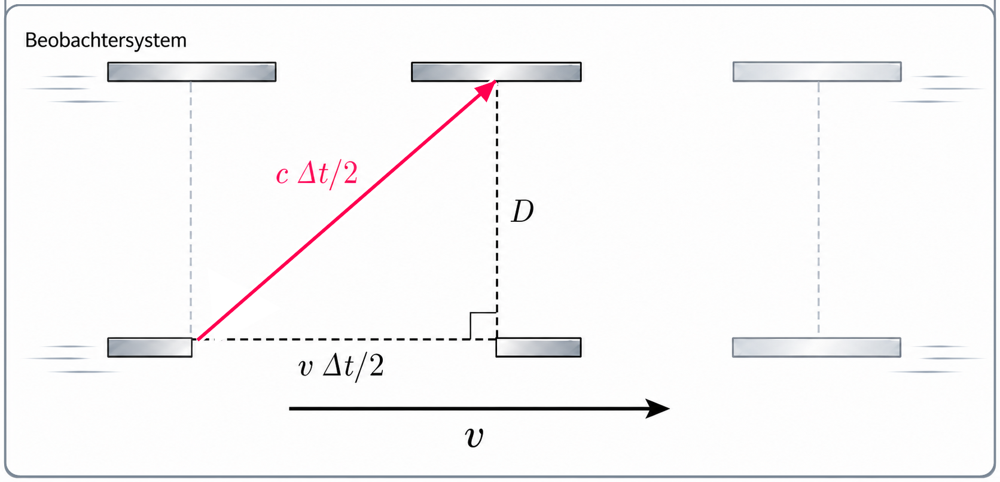

# Spezielle Relativitätstheorie I: Raum und Zeit

::: {.content-visible when-format="html"}
```{=html}
<link rel="stylesheet" href="assets/animations/shared/srt-workbook.css">
<link rel="stylesheet" href="assets/animations/srt/used/einsteinsche-postulate/konstanz-lichtgeschwindigkeit.css">
<script src="assets/animations/shared/core.js"></script>
<script src="assets/animations/srt/used/bezugssysteme/inertialsystem.js"></script>
<script src="assets/animations/srt/used/michelson-morley/interferometer-aufbau.js"></script>
<script src="assets/animations/srt/used/michelson-morley/aether-vs-nullresultat.js"></script>
<script src="assets/animations/srt/used/michelson-morley/interferenz-messprinzip.js"></script>
<script src="assets/animations/srt/used/michelson-morley/ringgeometrie.js"></script>
<script src="assets/animations/srt/used/gleichzeitigkeit/relativitaet-gleichzeitigkeit.js"></script>
<script src="assets/animations/srt/used/zeitdilatation/lichtuhr.js"></script>
<script src="assets/animations/srt/used/zeitdilatation/lorentzfaktor.js"></script>
<script src="assets/animations/srt/used/zeitdilatation/myon-erdsystem.js"></script>
<script src="assets/animations/srt/used/laengenkontraktion/ausgangsproblem.js"></script>
<script src="assets/animations/srt/used/doppler/doppler-allgemein.js"></script>
<script src="assets/animations/srt/used/doppler/doppler-herleitung.js"></script>
<script src="assets/animations/srt/used/doppler/doppler.js"></script>
<script src="assets/animations/srt/used/paradoxien/garagenparadoxon.js"></script>
<script src="assets/animations/shared/srt-workbook.js"></script>
```
:::

::: {.callout-note title="Relevanz"}
Wenn du in einer fremden Stadt ankommst und eine Navigations-App öffnest, zeigt dein Smartphone nach kurzer Zeit ziemlich genau an, wo du bist. Aber woher weiß es eigentlich, wo du dich befindest?

Dazu empfängt dein Smartphone Signale von mehreren Satelliten. Weil sich diese Signale mit Lichtgeschwindigkeit ausbreiten, lässt sich aus ihrer Laufzeit der Abstand zu den Satelliten bestimmen. Dafür muss die Zeit extrem präzise gemessen werden: Schon kleinste Zeitabweichungen führen zu großen Fehlern bei der Positionsbestimmung.

An dieser Stelle zeigt sich die praktische Bedeutung der Relativitätstheorie: Je größer die Relativgeschwindigkeit ist, desto stärker unterscheiden sich die von den Uhren gemessenen Zeiten. Dieser Effekt wird als Zeitdilatation bezeichnet und im Laufe dieses Kapitels genauer behandelt. Ohne diese und weitere relativistische Korrekturen würde die berechnete Position nach einem Tag um etwa 11 Kilometer abweichen [@faraoni-2013, S. 54]. Dein Smartphone könnte dir dann nicht mehr zuverlässig anzeigen, in welchem Stadtteil du dich befindest. Für die Orientierung in einer fremden Stadt wäre das ziemlich ungünstig.
:::

## Bezugssysteme und Inertialsysteme

::: {.callout-note title="Relevanz"}
In der speziellen Relativitätstheorie werden nur Inertialsysteme betrachtet. Deshalb wird zunächst geklärt, was ein Bezugssystem ist und wodurch sich ein Inertialsystem auszeichnet.
:::

::: {.mp-goal-strip}
Du <u>beschreibst</u> Ruhe und Bewegung in verschiedenen Bezugssystemen.

Du <u>ordnest</u> Bezugssysteme als Inertialsysteme oder Nicht-Inertialsysteme ein und <u>begründest</u> deine Zuordnung unter anderem mit dem ersten Newtonschen Axiom.
:::

Im Alltag sagen wir schnell, etwas sei „wirklich in Ruhe“ oder „wirklich in Bewegung“. Physikalisch ist das ungenau: Ruhe und Bewegung werden immer in einem gewählten Bezugssystem beschrieben. Ob ein Körper ruht oder sich bewegt, ist also keine absolute Eigenschaft, sondern eine relative Aussage zu einem Bezugssystem. Warum Bewegungen ohne ein festgelegtes Bezugssystem nicht eindeutig beschrieben werden können, zeigt das folgende Video.

[]{#sec-bezugssystem-beispiel}

::: {.content-visible when-format="html"}
```{=html}
<div class="srt-video-frame">
  <iframe src="https://www.youtube-nocookie.com/embed/0YFiEVNFHaI" title="Videoimpuls zu Bezugssystemen im Zug" allow="accelerometer; autoplay; clipboard-write; encrypted-media; gyroscope; picture-in-picture; web-share" allowfullscreen></iframe>
</div>
```
:::

::: {.content-visible unless-format="html"}
::: {.srt-workbook-fallback}
Videoimpuls für die HTML-Version: https://www.youtube.com/watch?v=0YFiEVNFHaI
:::
:::

Zu Beginn des Videos sind nur zwei Züge nebeneinander zu sehen. Man erkennt eine Relativbewegung zwischen ihnen, aber noch nicht, welcher Zug sich relativ zum Bahnsteig bewegt. Erst als der Bahnsteig sichtbar wird, lässt sich die Bewegung gegenüber dem Bahnsteig eindeutig beschreiben. Um Bewegung sinnvoll anzugeben, muss also festgelegt werden, *welches* Bezugssystem verwendet wird.

::: {.mp-box .mp-task}
<span class="mp-task-kind mp-task-kind-think" aria-label="Denkcheck">
  
  Denkcheck
</span>

Du sitzt in einem gleichförmig fahrenden Zug. Dein Rucksack liegt auf dem Sitz neben dir.

<u>Beschreibe</u> den Rucksack einmal aus dem Bezugssystem „Zug“ und einmal aus dem Bezugssystem „Bahnsteig“. <u>Erkläre</u>, warum beide Beschreibungen richtig sein können.
:::

<details class="mp-details">
<summary>Mögliche Lösung anzeigen</summary>
<p>Im Bezugssystem „Zug“ ruht der Rucksack. Im Bezugssystem „Bahnsteig“ bewegt er sich zusammen mit dem Zug. Beide Beschreibungen sind richtig, weil Ruhe und Bewegung relativ zum gewählten Bezugssystem angegeben werden.</p>
</details>

Ein Bezugssystem brauchst du, um Bewegungen zu beschreiben. Es legt fest, von wo aus Ort und Zeit gemessen werden. Bezugssysteme lassen sich jedoch noch weiter unterteilen. Das zeigt ein weiteres Beispiel aus dem Zug.

Stell dir vor, du sitzt wieder in einem gleichförmig fahrenden Zug. Deine Trinkflasche steht ruhig auf dem Tisch. Solange der Zug geradlinig und mit konstanter Geschwindigkeit fährt, gilt das erste Newtonsche Gesetz: Ohne eine resultierende Kraft ändert die Flasche ihren Bewegungszustand nicht.

Am nächsten Bahnhof bremst der Zug. Die Trinkflasche kippt nach vorn. Aus dem Bezugssystem des Zuges scheint sie sich nach vorn zu bewegen, ohne dass eine entsprechende Kraft auf sie wirkt. Um diese Bewegung im bremsenden Zug zu erklären, wird eine Scheinkraft eingeführt.

Im Bezugssystem des Bahnsteigs lässt sich die Bewegung dagegen mit dem ersten Newtonschen Axiom erklären: Auf die Flasche wirkt keine resultierende Kraft, weshalb sie ihren Bewegungszustand beibehält. Während der Zug abbremst, bewegt sich die Flasche weiter und kippt um.

Bezugssysteme lassen sich danach unterscheiden, ob in ihnen das erste Newtonsche Axiom gilt oder nicht. Bezugssysteme, in denen es gilt, heißen Inertialsysteme. Beschleunigte Bezugssysteme heißen Nicht-Inertialsysteme. Der Bahnsteig ist in diesem Beispiel ein Inertialsystem, der bremsende Zug dagegen ein Nicht-Inertialsystem.

::: {.mp-box .mp-definition}
<div class="mp-title">Definition</div>

Ein **Inertialsystem** ist ein Bezugssystem, in dem das erste Newtonsche Axiom gilt. Beschleunigte Bezugssysteme sind **Nicht-Inertialsysteme**. In ihnen werden Scheinkräfte benötigt, um Bewegungen zu beschreiben.
:::

::: {.mp-box .mp-task}
<span class="mp-task-kind mp-task-kind-transfer" aria-label="Transfer">
  
  Transfer
</span>

Der rote Punkt kennzeichnet den Ursprung des betrachteten Bezugssystems. Entscheide anhand der dargestellten Bewegung, ob es sich um ein Inertialsystem handelt.

::: {.content-visible when-format="html"}
```{=html}
<figure class="srt-workbook-figure srt-workbook-figure--caption-inside">
  <div class="srt-workbook-stage" data-srt-animation="inertial" data-srt-motion-control data-srt-label="Vergleich von Inertialsystem und beschleunigten Systemen"></div>
</figure>
```
:::

::: {.content-visible unless-format="html"}
::: {.srt-workbook-fallback}
In der HTML-Version erscheint hier eine Visualisierung zu gleichförmig geradliniger Bewegung, Kreisbewegung und Schwingung.
:::
:::

1. <u>Ordne</u> die zu den Bewegungen A, B und C mitbewegten Bezugssysteme als Inertialsystem oder Nicht-Inertialsystem ein und <u>begründe</u> deine Zuordnung.
2. Bei Bewegung B bewegt sich der Körper mit konstantem Tempo auf einer Kreisbahn. Ein Schüler sagt: „Die Geschwindigkeit bleibt gleich, also wird der Körper nicht beschleunigt.“ <u>Beurteile</u> diese Aussage.

<details class="mp-details">
<summary>Mögliche Lösung anzeigen</summary>
<ol>
  <li>Das zu Bewegung A mitbewegte Bezugssystem ist ein Inertialsystem, weil sich der Körper geradlinig mit konstanter Geschwindigkeit bewegt. Die zu den Bewegungen B und C mitbewegten Bezugssysteme sind Nicht-Inertialsysteme, weil die Körper beschleunigt sind.</li>
  <li>Die Aussage ist falsch. Bei Bewegung B bleibt zwar das Tempo konstant, aber die Bewegungsrichtung ändert sich fortlaufend. Damit ändert sich der Geschwindigkeitsvektor und es liegt eine Beschleunigung vor.</li>
</ol>

::: {.mp-box .mp-misconception}
<div class="mp-title">Präkonzept: Geschwindigkeit ist Schnelligkeit</div>

Die Schüleraussage beruht auf der verbreiteten Vorstellung, Geschwindigkeit beschreibe nur, wie schnell sich ein Körper bewegt. Dabei wird übersehen, dass die Geschwindigkeit ein Vektor ist und auch eine Richtung besitzt. Bei der Kreisbewegung bleibt zwar das **Tempo**, also der Betrag der Geschwindigkeit, konstant. Die Richtung der Geschwindigkeit ändert sich jedoch fortlaufend. Deshalb ist der Körper beschleunigt [@schecker2018, S. 66].
:::
</details>
:::

<details class="mp-details">
<summary>Optionaler Denkcheck: Drohne im Auto</summary>

::: {.mp-box .mp-task}
<span class="mp-task-kind mp-task-kind-think" aria-label="Denkcheck">
  
  Denkcheck
</span>

Ein Auto fährt auf gerader Strecke gleichförmig mit einer Geschwindigkeit von 100 km/h. Im geschlossenen Innenraum schwebt eine Drohne scheinbar ruhig über dem Sitz.

::: {.content-visible when-format="html"}
```{=html}
<div class="srt-video-frame">
  <video controls preload="metadata" playsinline>
    <source src="Videos%20einbinden/Drohne%20Auto.mp4" type="video/mp4">
  </video>
</div>
```
:::

::: {.content-visible unless-format="html"}
::: {.srt-workbook-fallback}
Videoimpuls für die HTML-Version: Videos einbinden/Drohne Auto.mp4
:::
:::

1. <u>Bestimme</u> die Geschwindigkeit der Drohne im Bezugssystem des Autos.
2. <u>Bestimme</u> die Geschwindigkeit der Drohne im Bezugssystem der Straße.
3. <u>Erkläre</u>, warum die Drohne aus Sicht der Insassen ungefähr an derselben Stelle bleibt.
4. <u>Begründe</u>, was sich ändert, wenn das Auto stark bremst oder in eine enge Kurve fährt.
:::

<details class="mp-details">
<summary>Mögliche Lösung anzeigen</summary>
<ol>
  <li>Im Bezugssystem des Autos hat die Drohne näherungsweise die Geschwindigkeit 0 km/h, weil sie relativ zum Innenraum ruht.</li>
  <li>Im Bezugssystem der Straße bewegt sie sich mit ungefähr 100 km/h zusammen mit dem Auto.</li>
  <li>Drohne, Luft und Insassen bewegen sich gemeinsam mit dem Auto. Bei gleichförmiger geradliniger Bewegung ist das Auto näherungsweise ein Inertialsystem.</li>
  <li>Beim starken Bremsen oder in einer engen Kurve ist das Auto kein Inertialsystem mehr. Dann müssen aus Sicht der Insassen Scheinkräfte eingeführt werden, und die Drohne bleibt nicht mehr ohne Weiteres an derselben Stelle.</li>
</ol>
</details>
</details>

::: {.mp-box .mp-core}
<div class="mp-title">Kernaussage</div>

Bewegung wird immer relativ zu einem Bezugssystem beschrieben. Ein Inertialsystem ist ein Bezugssystem, in dem das erste Newtonsche Axiom gilt. Beschleunigte Bezugssysteme sind Nicht-Inertialsysteme; in ihnen können Scheinkräfte auftreten.
:::

---

## Michelson-Morley-Experiment

::: {.callout-note title="Relevanz"}
Die spezielle Relativitätstheorie wurde nicht unmittelbar aus dem Michelson-Morley-Experiment abgeleitet; Einstein erwähnte das Experiment in seiner Veröffentlichung von 1905 nicht [@einstein1905elektrodynamik]. Historisch ist das Experiment dennoch wichtig, weil sein Ergebnis die Ätherhypothese problematisch machte. Auch die dabei verwendete Interferometrie ist bis heute relevant: Weiterentwickelte Michelson-Interferometer werden beispielsweise zum Nachweis von Gravitationswellen eingesetzt.
:::

::: {.mp-goal-strip}
Du <u>beschreibst</u> den Aufbau eines Michelson-Interferometers und <u>erläuterst</u>, wie damit ein Ätherwind nachgewiesen werden sollte.

Du <u>interpretierst</u> das Nullresultat als Problem für die einfache Ätherhypothese.
:::

[]{#sec-mm-problem}

Schall braucht Luft, Wasserwellen brauchen Wasser. Im 19. Jahrhundert wurde Licht als elektromagnetische Welle verstanden. Damit lag die Frage nahe, ob auch Licht ein Trägermedium braucht: den Lichtäther. Der Äther sollte ein absolutes Bezugssystem festlegen, das als ruhend angesehen werden konnte.

Die Erwartung von Michelson und Morley war: Die Bewegung der Erde relativ zum Äther müsste optisch messbar sein. Stell dir dazu einen Schwimmer vor: Je nachdem, ob er mit oder gegen die Strömung schwimmt, braucht er unterschiedlich lange. Genauso sollte auch Licht je nach Richtung unterschiedlich lange unterwegs sein. Diese unterschiedlichen Lichtlaufzeiten sollten den Äther nachweisbar machen.

[]{#sec-mm-messidee}

Die Messidee des Michelson-Morley-Experiments besteht darin, in einem Interferometer einen Lichtstrahl aufzuteilen, die beiden Teilstrahlen auf senkrechten Wegen laufen zu lassen und sie anschließend wieder zu überlagern. Ein Laufzeitunterschied sollte sich als Änderung des Interferenzsignals zeigen. Beim Drehen der Apparatur änderte sich die Ausrichtung der Lichtwege zum angenommenen Ätherwind.

In der Schwimmeranalogie entspricht das einem Wechsel der Schwimmrichtung: Wer zuerst quer zur Strömung und anschließend mit oder gegen die Strömung schwimmt, benötigt für die Strecke eine andere Zeit. Beim Licht sollte sich eine solche Änderung der Laufzeit als Verschiebung des Interferenzmusters zeigen.

Die folgende Animation zeigt dir den Aufbau eines Michelson-Interferometers. Klicke nacheinander auf die fünf Bauteile, um sie einzublenden.

::: {.content-visible when-format="html"}
```{=html}
<figure class="srt-workbook-figure">
  <div class="srt-workbook-stage" data-srt-animation="aufbau" data-srt-label="Aufbau des Michelson-Interferometers"></div>
</figure>
```
:::

Die zweite Animation zeigt dir, welche Veränderung beim Drehen erwartet wurde und was tatsächlich beobachtet wurde. Verändere dazu die Ausrichtung der Apparatur mit dem Rotationsregler.

::: {.content-visible when-format="html"}
```{=html}
<figure class="srt-workbook-figure">
  <div class="srt-workbook-stage" data-srt-animation="mm" data-srt-label="Michelson-Morley-Vergleich zwischen Äthererwartung und Nullresultat auf dem Schirm"></div>
</figure>
<details class="mp-details">
  <summary>Optional: Das Michelson-Interferometer genauer betrachtet</summary>
  <p>Diese beiden Animationen sind Zusatzmaterial. Sie können dir helfen, das Messprinzip eines Michelson-Interferometers besser zu verstehen.</p>
  <p>Ergänzend zeigt ein <a href="https://www.youtube.com/watch?v=8YgVQHbHR0I">Realvideo zum Michelson-Interferometer</a>, wie Laser, Strahlteiler, Spiegel und aufgeweiteter Strahl zu sichtbaren Interferenzringen führen.</p>
  <figure class="srt-workbook-figure">
    <div class="srt-workbook-stage" data-srt-animation="interference" data-srt-label="Interferenz als Messprinzip des Michelson-Interferometers"></div>
  </figure>
  <figure class="srt-workbook-figure">
    <div class="srt-workbook-stage" data-srt-animation="rings" data-srt-label="Ringgeometrie des Interferenzbildes"></div>
  </figure>
</details>
```
:::

::: {.content-visible unless-format="html"}
::: {.srt-workbook-fallback}
In der HTML-Version erscheinen hier Animationen zu Aufbau, Äther-Erwartung, Nullresultat und optionalem Interferenzsignal.

Ergänzendes Realvideo zum Michelson-Interferometer: https://www.youtube.com/watch?v=8YgVQHbHR0I
:::
:::

[]{#sec-mm-deutung}

Bei unterschiedlichen Ausrichtungen der Apparatur blieb das Interferenzmuster unverändert. Dieses sogenannte Nullresultat lieferte keinen Nachweis für den angenommenen Ätherwind und machte die einfache Vorstellung eines mechanischen Lichtäthers problematisch.

<details class="mp-details">
<summary>Optional: Das Experiment mit einer eigenen Skizze erklären</summary>

::: {.mp-box .mp-task}
<span class="mp-task-kind mp-task-kind-write" aria-label="Skizzieren und erläutern">
  <svg viewBox="0 0 24 24" aria-hidden="true">
    <path d="M4 20h4l11-11-4-4L4 16v4Z"></path>
    <path d="m13.5 6.5 4 4"></path>
  </svg>
  Skizzieren und erläutern
</span>

<u>Skizziere</u> den Aufbau eines Michelson-Interferometers und <u>erläutere</u>, wie damit ein Ätherwind nachgewiesen werden sollte.
:::

<p><strong>Hinweis:</strong> Deine Skizze sollte die Aufteilung des Lichtstrahls auf zwei senkrechte Wege und die anschließende Überlagerung auf dem Schirm zeigen.</p>
</details>

::: {.mp-box .mp-core}
<div class="mp-title">Kernaussage</div>

Das Michelson-Morley-Experiment sollte den Äther durch richtungsabhängige Lichtlaufzeiten nachweisen. Die erwartete Verschiebung des Interferenzmusters blieb jedoch aus. Das Experiment lieferte damit keinen Nachweis für den angenommenen Ätherwind.
:::

---

## Einsteinsche Postulate

::: {.callout-note title="Relevanz"}
Die Einsteinschen Postulate bilden den Ausgangspunkt der speziellen Relativitätstheorie. Mit ihnen lässt sich die Lichtausbreitung ohne die Annahme eines absolut ruhenden Äthersystems beschreiben. Zugleich führen sie zu einer neuen Beschreibung von Raum und Zeit.
:::

::: {.mp-goal-strip}
Du <u>nennst</u> die beiden Einsteinschen Postulate und <u>begründest</u> mit dem zweiten Postulat, warum auf der Erde für einen aus einem mit halber Lichtgeschwindigkeit fliegenden Raumschiff ausgesandten Lichtpuls nicht die anderthalbfache Lichtgeschwindigkeit gemessen wird.
:::

Du sitzt in einem Zug, der geradlinig und gleichförmig mit $100\,\mathrm{km/h}$ fährt.

1. Du lässt einen Ball fallen. Erwartest du im Zug einen anderen physikalischen Vorgang als am Bahnsteig?
2. Eine Person geht im Zug mit $5\,\mathrm{km/h}$ in Fahrtrichtung. Welche Geschwindigkeit hat sie aus Sicht einer Person am Bahnsteig?

Vermutlich erwartest du: Der Ball fällt im Zug nach unten. Für eine Person am Bahnsteig sieht seine Bahn zwar anders aus, aber der Vorgang wird mit denselben physikalischen Gesetzen beschrieben. Außerdem bewegt sich die gehende Person aus Sicht des Bahnsteigs mit $105\,\mathrm{km/h}$.

Diese Antworten entsprechen zwei Erwartungen aus der klassischen Physik: In gleichförmig bewegten Systemen gelten dieselben physikalischen Gesetze. Geschwindigkeiten werden in Alltagssituationen einfach addiert.

Die Lichtgeschwindigkeit im Vakuum wird mit $c$ bezeichnet:

$$
c \approx 3{,}0 \cdot 10^8\,\mathrm{m/s}
$$

Aus der Alltagserfahrung könnte man erwarten: Bewegt sich eine Lichtquelle, dann wird ihre Geschwindigkeit zur Lichtgeschwindigkeit addiert. Für Licht gilt das jedoch nicht. Licht breitet sich im Vakuum unabhängig von der Bewegung der Lichtquelle aus. Diese Idee wird im zweiten Einsteinschen Postulat präzisiert.

::: {.mp-box .mp-definition}
<div class="mp-title">Einsteinsche Postulate</div>

1. **Relativitätsprinzip:** Die Naturgesetze haben in allen Inertialsystemen dieselbe Form.
2. **Konstanz der Lichtgeschwindigkeit:** Licht breitet sich im Vakuum in allen Inertialsystemen mit derselben Geschwindigkeit $c$ aus, unabhängig von der Bewegung der Lichtquelle oder der beobachtenden Person.
:::

Um dieses zweite Postulat ein bisschen greifbarer zu machen, dient die folgende Animation. Hierbei werden zwei Lichtquellen verglichen: jeweils eine ruhende und eine bewegte. Mit dem Schieberegler veränderst du die Relativgeschwindigkeit. Über die Buttons „Erdsystem“ und „Raumschiffsystem“ wechselst du das Bezugssystem. Das Häkchen „klassische Erwartung“ blendet zum Vergleich ein, welche Geschwindigkeit man nach der klassischen Geschwindigkeitsaddition erwarten würde.

::: {.content-visible when-format="html"}
```{=html}
<figure class="zp2" data-zp2-animation>
  <div class="zp2-stage">
    <button class="zp2-play" type="button" aria-pressed="true">Pause</button>

    <canvas aria-label="Animation: Lichtpulse aus bewegter und ruhender Quelle">
      Dein Browser unterstützt die Canvas-Darstellung nicht.
    </canvas>

    <div class="zp2-controls">
      <div class="zp2-group">
        <label class="zp2-label" for="zp2-speed">Relativgeschwindigkeit</label>
        <input class="zp2-speed" id="zp2-speed" type="range" min="0" max="0.8" step="0.05" value="0.4">
        <span class="zp2-speed-value" aria-live="polite">v = +0,40 c</span>
      </div>

      <div class="zp2-group">
        <span class="zp2-label">Bezugssystem</span>
        <div class="zp2-segmented" role="group" aria-label="Bezugssystem wählen">
          <button type="button" data-zp2-frame="earth" aria-pressed="true">Erdsystem</button>
          <button type="button" data-zp2-frame="ship" aria-pressed="false">Raumschiffsystem</button>
        </div>
      </div>

      <label class="zp2-check">
        <input class="zp2-classical" type="checkbox">
        klassische Erwartung
      </label>
    </div>
  </div>
</figure>
<script src="assets/animations/srt/used/einsteinsche-postulate/konstanz-lichtgeschwindigkeit.js"></script>
```
:::

::: {.content-visible unless-format="html"}
::: {.srt-workbook-fallback}
In der HTML-Version erscheint hier eine Visualisierung zur konstanten Lichtgeschwindigkeit.
:::
:::

::: {.mp-box .mp-task}
<span class="mp-task-kind mp-task-kind-think" aria-label="Denkcheck">
  
  Denkcheck
</span>

Ein Raumschiff fliegt mit $0{,}5c$ auf die Erde zu und sendet einen Lichtpuls in Flugrichtung aus.

1. <u>Nenne</u> die Geschwindigkeit, die eine Person im Raumschiff für den Lichtpuls misst.
2. <u>Nenne</u> die Geschwindigkeit, die eine Person auf der Erde für den Lichtpuls misst.
3. <u>Begründe</u> deine Antworten mit dem zweiten Einsteinschen Postulat.
:::
<details class="mp-details">
<summary>Mögliche Lösung anzeigen</summary>
<ol>
  <li>Die Person im Raumschiff misst für den Lichtpuls die Geschwindigkeit $c$ und nicht den klassischen Differenzwert $0{,}5c$.</li>
  <li>Auch die Person auf der Erde misst für den Lichtpuls die Geschwindigkeit $c$ und nicht die intuitive Summe $1{,}5c$.</li>
  <li>Raumschiff und Erde werden als Inertialsysteme betrachtet. Nach dem zweiten Postulat hat Licht im Vakuum in beiden Systemen dieselbe Geschwindigkeit $c$, völlig unabhängig von der Bewegung der Lichtquelle oder des Beobachters.</li>
</ol>
</details>
::: {.mp-box .mp-core}
<div class="mp-title">Kernaussage</div>

Die Naturgesetze haben in allen Inertialsystemen dieselbe Form. Licht breitet sich im Vakuum in jedem Inertialsystem mit der Geschwindigkeit $c$ aus. Die Geschwindigkeit der Lichtquelle wird nicht zu $c$ addiert und auch nicht subtrahiert.
:::

---

## Gleichzeitigkeit

::: {.callout-note title="Relevanz"}
Im Alltag setzen wir meist voraus, dass es eine gemeinsame Gegenwart gibt: Zwei Ereignisse passieren gleichzeitig oder eben nicht. Das Zug-Gedankenexperiment stellt diese Vorstellung infrage.
:::

::: {.mp-goal-strip}
Du <u>begründest</u> am Zug-Gedankenexperiment, warum Gleichzeitigkeit vom Inertialsystem abhängt.
:::

Stell dir einen langen Zug vor, der geradlinig und gleichförmig an einem Bahnsteig vorbeifährt. Genau in der Mitte des Zuges wird ein Lichtsignal ausgesendet. Es läuft nach vorne zum vorderen Zugende und nach hinten zum hinteren Zugende.

Eine Person sitzt genau in der Mitte des Zuges. Eine zweite Person steht am Bahnsteig und beschreibt denselben Vorgang aus dem Bahnsteigsystem.

Die entscheidende Frage lautet: Erreichen die beiden Lichtsignale das vordere und das hintere Zugende gleichzeitig?

Im Zugsystem ruht die Lichtquelle in der Mitte des Zuges. Die Wege zum vorderen und zum hinteren Zugende sind gleich lang. Da Licht sich in beide Richtungen mit derselben Geschwindigkeit $c$ ausbreitet, erreichen die Signale im Zugsystem beide Zugenden gleichzeitig.

Im Bahnsteigsystem bewegt sich der Zug während der Lichtlaufzeit weiter. Das hintere Zugende kommt dem Lichtsignal entgegen, das vordere Zugende entfernt sich. Deshalb erreicht das Lichtsignal im Bahnsteigsystem das hintere Zugende zuerst.

Verglichen werden dabei zwei Ereignisse: Das Licht erreicht das vordere Zugende und das Licht erreicht das hintere Zugende. Gleichzeitigkeit ist also keine absolute Eigenschaft dieser beiden Ereignisse, sondern hängt vom Inertialsystem ab.

Die folgende Simulation zeigt das Gedankenexperiment im Zug- und im Bahnsteigsystem.

::: {.content-visible when-format="html"}
```{=html}
<figure class="srt-workbook-figure srt-workbook-figure--caption-inside">
  <div class="srt-workbook-stage" data-srt-animation="sim" data-srt-motion-control data-srt-label="Relativität der Gleichzeitigkeit im Zug- und Bahnsteigsystem"></div>
</figure>
```
:::

::: {.content-visible unless-format="html"}
::: {.srt-workbook-fallback}
In der HTML-Version erscheint hier eine Visualisierung zur Relativität der Gleichzeitigkeit im Zug- und Bahnsteigsystem.
:::
:::

Eine zweite Variante des Zug-Gedankenexperiments beginnt anders: Zwei Blitze schlagen am hinteren und vorderen Zugende ein. Jetzt geht es nicht darum, wann Lichtsignale ein Zugende erreichen, sondern wann ihr Licht bei einer Person ankommt.

::: {.mp-box .mp-task}
<span class="mp-task-kind mp-task-kind-transfer" aria-label="Transfer">
  
  Transfer
</span>

Der Zug bewegt sich im Bahnsteigsystem gleichförmig nach rechts. Am hinteren und am vorderen Zugende schlagen gleichzeitig zwei Blitze ein. Zu diesem Zeitpunkt sitzt der Passagier genau in der Mitte zwischen den beiden Zugenden.

::: {.content-visible when-format="html"}
```{=html}
<figure class="srt-workbook-figure">
  <div class="srt-workbook-stage" data-srt-animation="lightning-setup" data-srt-label="Ausgangslage mit zwei gleichzeitigen Blitzeinschlägen an den Zugenden, einem Passagier in der Zugmitte und Fahrtrichtung nach rechts"></div>
</figure>
```
:::

::: {.content-visible unless-format="html"}
::: {.srt-workbook-fallback}
Ausgangslage: Der Passagier sitzt genau in der Zugmitte. Gleichzeitig schlagen am hinteren und vorderen Zugende zwei Blitze ein. Der Zug bewegt sich im Bahnsteigsystem nach rechts.
:::
:::

1. <u>Bestimme</u>, welches Lichtsignal den Passagier zuerst erreicht.
2. <u>Erkläre</u>, warum daraus nicht folgt, dass die Blitze im Bahnsteigsystem nacheinander eingeschlagen sind.
3. <u>Begründe</u>, was im Zugsystem über die Reihenfolge der beiden Blitzereignisse gilt.

<details class="mp-details">
<summary>Mögliche Lösung anzeigen</summary>

<ol>
  <li>Das Lichtsignal vom vorderen Blitz erreicht den Passagier zuerst, weil er sich diesem Signal entgegenbewegt.</li>
  <li>Daraus folgt nicht, dass die Blitze im Bahnsteigsystem nacheinander eingeschlagen sind. Im Bahnsteigsystem sind die beiden Blitzereignisse gleichzeitig; der unterschiedliche Empfang entsteht durch die Bewegung des Passagiers relativ zu den Lichtsignalen.</li>
  <li>Im Zugsystem ruht der Passagier in der Mitte des Zuges. Da Licht sich in beide Richtungen mit derselben Geschwindigkeit $c$ ausbreitet, muss der vordere Blitz im Zugsystem früher eingeschlagen sein als der hintere.</li>
</ol>

Die folgende Simulation visualisiert das Gedankenexperiment.

::: {.content-visible when-format="html"}
```{=html}
<figure class="srt-workbook-figure srt-workbook-figure--caption-inside">
  <div class="srt-workbook-stage" data-srt-animation="lightning" data-srt-motion-control data-srt-label="Zwei Blitzereignisse und bewegter Beobachter im Zug"></div>
</figure>
```
:::

::: {.content-visible unless-format="html"}
::: {.srt-workbook-fallback}
In der HTML-Version erscheint hier eine Transfer-Visualisierung mit zwei gleichzeitigen Blitzereignissen am hinteren und vorderen Zugende im Bahnsteigsystem und einem bewegten Passagier im Zug.
:::
:::

</details>
:::

::: {.mp-box .mp-core}
<div class="mp-title">Kernaussage</div>

Gleichzeitigkeit ist keine absolute Eigenschaft zweier räumlich getrennter Ereignisse. Zwei Ereignisse, die in einem Inertialsystem gleichzeitig sind, müssen in einem anderen Inertialsystem nicht gleichzeitig sein.
:::

## Zeitdilatation

::: {.callout-note title="Relevanz"}
Am Anfang des Kapitels wurde deutlich, dass für die GPS-Ortung äußerst genaue Zeitmessungen notwendig sind. Die Zeitdilatation erklärt einen Teil der Zeitabweichungen, die bei GPS berücksichtigt werden müssen. Wie dieser Effekt bei relativ zueinander bewegten Inertialsystemen entsteht, zeigt der folgende Abschnitt.
:::

::: {.mp-goal-strip}
Du <u>erklärst</u> Zeitdilatation mithilfe der Lichtuhr, <u>leitest</u> die Beziehung $\Delta t = \gamma \Delta t_0$ her und <u>wendest</u> sie auf die Myonen in der Atmosphäre <u>an</u>.
:::

[]{#sec-zeitdilatation-beispiel}

Uhren kennst du aus dem Alltag. Sie messen Zeit, indem sie einen regelmäßig wiederkehrenden Vorgang zählen, zum Beispiel die Schwingungen eines Pendels oder eines Quarzkristalls. Doch wie funktioniert eine Lichtuhr?

Eine Lichtuhr ist keine gewöhnliche Uhr, sondern ein idealisiertes Modell für ein Gedankenexperiment. Sie besteht aus zwei parallelen Spiegeln, zwischen denen sich ein Lichtpuls hin- und herbewegt. Ein vollständiger Weg vom unteren zum oberen Spiegel und wieder zurück bildet den regelmäßig wiederkehrenden Tick der Lichtuhr.

[]{#sec-zeitdilatation-idee}

Für dieses Gedankenexperiment betrachten wir eine Lichtuhr in einem gleichförmig fahrenden Zug. Eine Person fährt zusammen mit der Lichtuhr im Zug. Eine zweite Person steht am Bahnsteig und beobachtet denselben Vorgang. Diese Rollen bleiben während des gesamten Gedankenexperiment unverändert.

Für die mitfahrende Person bewegt sich der Lichtpuls senkrecht vom unteren Spiegel zum oberen Spiegel und wieder zurück. Der Spiegelabstand beträgt $D$, der gesamte Lichtweg also $2D$. Die Lichtuhr misst für diesen Tick die Zeit

$$
\Delta t_0 = \frac{2D}{c}.
$$

Diese von der mitbewegten Lichtuhr gemessene Zeit heißt Eigenzeit $\Delta t_0$.

Für die Person am Bahnsteig bewegt sich der Zug während der Laufzeit des Lichtpulses nach rechts. Deshalb verläuft der Lichtweg diagonal und ist länger als $2D$. Die Zeitdauer, die dem Tick im Bahnsteigsystem zugeordnet wird, bezeichnen wir mit $\Delta t$.

Die Animation zeigt nicht zwei verschiedene Lichtuhren. Links und rechts ist derselbe Tick derselben Lichtuhr dargestellt: links aus Sicht der mitfahrenden Person und rechts aus Sicht der Person am Bahnsteig. Nach dem [zweiten Einsteinschen Postulat](#einsteinsche-postulate) breitet sich Licht in beiden Inertialsystemen mit derselben Geschwindigkeit $c$ aus.

::: {.content-visible when-format="html"}
```{=html}
<figure class="srt-workbook-figure">
  <div class="srt-workbook-stage" data-srt-animation="lightclock" data-srt-motion-control data-srt-label="Zeitdilatation mit einer Lichtuhr"></div>
</figure>
```
:::

::: {.content-visible unless-format="html"}
::: {.srt-workbook-fallback}
In der HTML-Version erscheint hier die Lichtuhr-Visualisierung zur Zeitdilatation.
:::
:::

Der Lichtweg ist länger, die Lichtgeschwindigkeit aber in beiden Inertialsystemen gleich groß. Deshalb benötigt der Lichtpuls aus Sicht der Person am Bahnsteig mehr Zeit für einen vollständigen Tick. Es gilt also $\Delta t > \Delta t_0$.

::: {.mp-box .mp-secure .mp-compact}
**Bewegte Uhren gehen langsamer.**
:::

Damit ist kein technischer Fehler der Uhr gemeint. Aus Sicht des Bahnsteigs ist jeder Vorgang im Zug betroffen, auch der Herzschlag einer Person im Zug. Nicht die Uhr versagt, sondern die Zeit selbst vergeht im bewegten System langsamer.

Bisher kennen wir nur die Ungleichung $\Delta t > \Delta t_0$. Jetzt bestimmen wir, in welchem Verhältnis $\Delta t$ und $\Delta t_0$ zueinander stehen. Dafür genügen der Satz des Pythagoras und einige Umformungen. Bei der Umformung tritt ein Faktor auf, der uns in der speziellen Relativitätstheorie noch öfter begegnet: der Lorentzfaktor.

:::: {.mp-box .mp-math}
<div class="mp-title">Herleitung</div>

<span class="mp-task-kind mp-task-kind-derive" aria-label="Stift und Papier">
  
  Stift und Papier
</span>

Im Bahnsteigsystem betrachten wir für den Satz des Pythagoras zunächst einen halben Tick. Der Lichtweg ist die Hypotenuse, $D$ ist die senkrechte Kathete und die seitliche Verschiebung der Lichtuhr ist die waagerechte Kathete:



$$
\left(c\,\frac{\Delta t}{2}\right)^2
=
D^2 + \left(v\,\frac{\Delta t}{2}\right)^2
$$

**Deine Aufgabe:** Forme die Gleichung so um, dass $\Delta t$ allein steht. Ersetze $D$ mit $\Delta t_0 = \frac{2D}{c}$. Ziel ist eine Beziehung zwischen $\Delta t$ und $\Delta t_0$.

Wähle deinen Einstieg:

::: {.panel-tabset}

### Ganz allein

Hier bekommst du keine Hilfe, und das ist Absicht. Selbst zu knobeln festigt das Verständnis am stärksten. Sei dabei ruhig kreativ: Solche Gleichungen lassen sich auf vielen Wegen umformen, und der Weg in „Schritt für Schritt" muss nicht der sein, der für dich am besten passt. Geh erst zu „Mit Hinweisen", wenn du wirklich feststeckst.

### Mit Hinweisen

Drei Stellen sind erfahrungsgemäß knifflig:

- **Quadrieren:** In $\left(\frac{c\,\Delta t_0}{2}\right)^2$ wird alles in der Klammer quadriert, auch die $2$ im Nenner. Es entsteht $\frac{c^2\,\Delta t_0^2}{4}$.
- **Ausklammern vorbereiten:** Nach dem Wegmultiplizieren der Nenner stehen auf beiden Seiten $\Delta t^2$-Terme. Bring sie auf eine Seite, erst dann lässt sich $\Delta t^2$ ausklammern.
- **Durch $c^2$ teilen:** Teile nicht durch $(c^2 - v^2)$, sondern durch $c^2$. Dann wird $\frac{c^2 - v^2}{c^2}$ termweise zu $1 - \frac{v^2}{c^2}$, und rechts bleibt nur $\Delta t_0^2$.

### Schritt für Schritt

1. <u>Stelle</u> $\Delta t_0 = \frac{2D}{c}$ nach $D$ um (mal $c$, geteilt durch $2$).
2. <u>Setze</u> das erhaltene $D$ in die Pythagoras-Gleichung ein.
3. <u>Quadriere</u> jede Klammer aus; in jedem Term steht danach ein Nenner $4$.
4. <u>Multipliziere</u> die ganze Gleichung mit $4$, damit die Nenner verschwinden.
5. <u>Subtrahiere</u> $v^2\,\Delta t^2$, sodass beide $\Delta t^2$-Terme links stehen.
6. <u>Klammere</u> $\Delta t^2$ aus.
7. <u>Teile</u> durch $c^2$; aus $\frac{c^2 - v^2}{c^2}$ wird $1 - \frac{v^2}{c^2}$.
8. <u>Teile</u> durch $\left(1 - \frac{v^2}{c^2}\right)$ und <u>ziehe</u> die Wurzel.

:::

<details class="mp-details">
<summary>Kontrollrechnung anzeigen</summary>

$$
\begin{aligned}
\Delta t_0 &= \frac{2D}{c}
  && \Big|\ \cdot c \ \ \Big|\ : 2 \\[6pt]
D &= \frac{c\,\Delta t_0}{2} \\[10pt]
\left(c\,\frac{\Delta t}{2}\right)^2 &= \left(\frac{c\,\Delta t_0}{2}\right)^2 + \left(v\,\frac{\Delta t}{2}\right)^2 \\[10pt]
\frac{c^2\,\Delta t^2}{4} &= \frac{c^2\,\Delta t_0^2}{4} + \frac{v^2\,\Delta t^2}{4}
  && \Big|\ \cdot 4 \\[10pt]
c^2\,\Delta t^2 &= c^2\,\Delta t_0^2 + v^2\,\Delta t^2
  && \Big|\ -\,v^2\,\Delta t^2 \\[8pt]
c^2\,\Delta t^2 - v^2\,\Delta t^2 &= c^2\,\Delta t_0^2 \\[8pt]
\Delta t^2\,(c^2 - v^2) &= c^2\,\Delta t_0^2
  && \Big|\ : c^2 \\[10pt]
\Delta t^2\left(1 - \frac{v^2}{c^2}\right) &= \Delta t_0^2
  && \Big|\ : \left(1 - \frac{v^2}{c^2}\right) \\[10pt]
\Delta t^2 &= \frac{\Delta t_0^2}{1 - \frac{v^2}{c^2}}
  && \Big|\ \sqrt{\phantom{x}} \\[10pt]
\Delta t &= \frac{\Delta t_0}{\sqrt{1 - \frac{v^2}{c^2}}}
  = \frac{1}{\sqrt{1-\frac{v^2}{c^2}}}\,\Delta t_0
\end{aligned}
$$

</details>

Der Faktor

$$
\gamma = \frac{1}{\sqrt{1-\frac{v^2}{c^2}}}
$$

heißt **Lorentzfaktor**. Damit lässt sich das Ergebnis kurz schreiben als

$$
\Delta t = \gamma\,\Delta t_0.
$$

Dabei ist $\Delta t_0$ die Eigenzeit, welche die mitfahrende Lichtuhr für ihren Tick misst. $\Delta t$ ist die Zeitdauer, die demselben Tick im Bahnsteigsystem zugeordnet wird.
::::

Wie stark sich die Zeit dehnt, hängt nach dieser Formel allein vom Verhältnis der Geschwindigkeit $v$ zur Lichtgeschwindigkeit $c$ ab.

Im folgenden Diagramm kannst du das selbst ausprobieren: Ziehe den Regler von kleinen Geschwindigkeiten bis dicht an $c$ und beobachte, wie sich $\gamma$ und die daraus folgende Zeitdehnung verändern.

::: {.content-visible when-format="html"}
```{=html}
<figure class="srt-workbook-figure srt-workbook-figure--caption-inside">
  <div class="srt-workbook-stage" data-srt-animation="gamma-plot" data-srt-label="Lorentzfaktor γ in Abhängigkeit von der Geschwindigkeit"></div>
</figure>
```
:::

::: {.content-visible unless-format="html"}
::: {.srt-workbook-fallback}
In der HTML-Version erscheint hier ein interaktiver Graph zum Lorentzfaktor $\gamma$.
:::
:::

Für Alltagsgeschwindigkeiten bleibt $\gamma$ ungefähr $1$. Als Beispiel: Selbst bei einer Relativgeschwindigkeit von $4\,317\,011{,}4\,\mathrm{km/h}$ (das sind $0{,}4\,\%$ der Lichtgeschwindigkeit) ist $\gamma \approx 1{,}000008$. Ob Auto, Bahn oder Verkehrsflugzeug: Die Abweichung von $1$ ist so winzig, dass die Zeitdilatation zwar berechenbar, aber häufig vernachlässigbar ist. Die klassische Physik bleibt eine gute Näherung. Man könnte bei solchen Geschwindigkeiten zwar relativistisch rechnen, in der Praxis wird aber meist klassisch gerechnet (**Korrespondenzprinzip**).

::: {.mp-box .mp-task}
<span class="mp-task-kind mp-task-kind-transfer" aria-label="Transfer">
  
  Transfer
</span>

Kosmische Strahlung trifft in der oberen Atmosphäre auf Atomkerne der Luft. In den entstehenden Teilchenschauern entstehen unter anderem Myonen. Ein Myon hat in seinem eigenen Ruhesystem eine mittlere Eigenlebensdauer von nur ungefähr $\Delta t_{0,\mathrm{M}} = 2{,}2\,\mathrm{\mu s}$ und zerfällt danach in andere Teilchen.

Wir betrachten den Vorgang konsequent aus Sicht des ruhenden Erdsystems. Ein hochenergetisches Myon entsteht etwa $10\,\mathrm{km}$ über dem Boden und fliegt nahezu geradlinig mit ungefähr $v = 0{,}998\,c$ nach unten. Streuung und schräge Flugbahnen lassen wir dabei weg.

**Das Rätsel:** Zwischen Entstehungsort und Detektor liegen rund $10\,\mathrm{km}$, und das bei einer mittleren Eigenlebensdauer von nur $2{,}2\,\mathrm{\mu s}$. Trotzdem werden solche Myonen am Erdboden tatsächlich nachgewiesen. Wie passt das zusammen?

Rechne durchgehend aus der Erdperspektive. Gegeben sind die mittlere Eigenlebensdauer des Myons $\Delta t_{0,\mathrm{M}} = 2{,}2\,\mathrm{\mu s} = 2{,}2 \cdot 10^{-6}\,\mathrm{s}$, die Geschwindigkeit $v = 0{,}998\,c$ mit $c \approx 3{,}0 \cdot 10^8\,\mathrm{\frac{m}{s}}$ und die Entstehungshöhe $h \approx 10\,\mathrm{km}$.

Für diese Aufgabe nennen wir berechnete Flugstrecken $d$. So bleibt später klar: $d$ beschreibt, wie weit sich etwas während einer bestimmten Zeit bewegt; die Eigenlänge der Atmosphäre bekommt im nächsten Abschnitt ein eigenes Symbol.

1. <u>Berechne</u> zunächst ohne Zeitdilatation, wie weit das Myon in seiner mittleren Eigenlebensdauer käme ($d_\mathrm{kl} = v\,\Delta t_{0,\mathrm{M}}$), und <u>vergleiche</u> das Ergebnis mit der Entstehungshöhe.

<details class="mp-details">
<summary>Mögliche Lösung anzeigen</summary>
<p>Ohne Zeitdilatation käme das Myon in seiner mittleren Eigenlebensdauer nur die Vergleichsstrecke</p>

$$
d_\mathrm{kl} = v\,\Delta t_{0,\mathrm{M}} \approx 0{,}998 \cdot 3{,}0 \cdot 10^8\,\mathrm{\frac{m}{s}} \cdot 2{,}2 \cdot 10^{-6}\,\mathrm{s} \approx 660\,\mathrm{m}
$$

<p>weit. Das sind nur wenige hundert Meter: Das Myon wäre weit oberhalb des Bodens zerfallen und dürfte den Detektor klassisch gar nicht erreichen.</p>

::: {.content-visible when-format="html"}
```{=html}
<figure class="srt-workbook-figure srt-workbook-figure--caption-inside">
  <div class="srt-workbook-stage" data-srt-animation="myon-klassisch" data-srt-motion-control data-srt-label="Myon in der Atmosphäre aus Sicht des Erdsystems ohne Zeitdilatation: das Myon zerfällt weit oberhalb des Bodens"></div>
</figure>
```
:::

::: {.content-visible unless-format="html"}
::: {.srt-workbook-fallback}
In der HTML-Version erscheint hier eine Animation: Ein Myon fällt durch die Atmosphäre und zerfällt (ohne Zeitdilatation) weit oberhalb des Bodens, lange bevor es den Detektor an der Erdoberfläche erreicht.
:::
:::
</details>

Berücksichtige nun die Zeitdilatation und löse damit das Rätsel.

2. <u>Berechne</u> den Lorentzfaktor $\gamma$ und damit die im Erdsystem gemessene mittlere Lebensdauer $\Delta t_\mathrm{E} = \gamma\,\Delta t_{0,\mathrm{M}}$.
3. <u>Berechne</u> die nun im Erdsystem zurückgelegte Flugstrecke $d_\mathrm{E} = v\,\Delta t_\mathrm{E}$.
4. <u>Erkläre</u> durch Vergleich von $d_\mathrm{E}$ mit der Entstehungshöhe, warum die Myonen trotzdem am Erdboden detektiert werden.

<details class="mp-details">
<summary>Mögliche Lösung anzeigen</summary>
<p>Der entscheidende Punkt: $\Delta t_{0,\mathrm{M}}$ ist die mittlere Eigenlebensdauer des Myons, also das Eigenzeitintervall zwischen Entstehung und Zerfall. Aus Sicht der Erde bewegt sich das Myon mit $v = 0{,}998\,c$, deshalb erscheint seine mittlere Lebensdauer im Erdsystem zeitgedehnt. In dieser Aufgabe nennen wir die im Erdsystem gemessene mittlere Lebensdauer $\Delta t_\mathrm{E}$:</p>

$$
\gamma = \frac{1}{\sqrt{1 - 0{,}998^2}} \approx 15{,}8
$$

$$
\Delta t_\mathrm{E} = \gamma\,\Delta t_{0,\mathrm{M}} \approx 15{,}8 \cdot 2{,}2\,\mathrm{\mu s} \approx 35\,\mathrm{\mu s}
$$

<p>In dieser im Erdsystem gemessenen Zeit legt das Myon näherungsweise folgende Flugstrecke zurück:</p>

$$
d_\mathrm{E} = v\,\Delta t_\mathrm{E} \approx 0{,}998 \cdot 3{,}0 \cdot 10^8\,\mathrm{\frac{m}{s}} \cdot 35 \cdot 10^{-6}\,\mathrm{s} \approx 10{,}5\,\mathrm{km}
$$

<p>Diese Flugstrecke ist größer als die Entstehungshöhe von etwa $10\,\mathrm{km}$. Aus der Erdperspektive reicht die zeitgedehnte mittlere Lebensdauer also gerade aus, damit das Myon den Detektor am Boden erreicht. Die folgende Animation <strong>mit Zeitdilatation</strong> veranschaulicht das:</p>

::: {.content-visible when-format="html"}
```{=html}
<figure class="srt-workbook-figure srt-workbook-figure--caption-inside">
  <div class="srt-workbook-stage" data-srt-animation="myon-relativistisch" data-srt-motion-control data-srt-label="Myon in der Atmosphäre aus Sicht des Erdsystems mit Zeitdilatation: die gedehnte mittlere Lebensdauer reicht, sodass das Myon den Detektor am Boden erreicht"></div>
</figure>
```
:::

::: {.content-visible unless-format="html"}
::: {.srt-workbook-fallback}
In der HTML-Version erscheint hier eine Animation: Durch die im Erdsystem zeitgedehnte mittlere Lebensdauer erreicht dasselbe Myon nun den Detektor an der Erdoberfläche.
:::
:::

<p>Die Detektion solcher Myonen ist somit kein Widerspruch zur kurzen mittleren Eigenlebensdauer, sondern ein direkter Nachweis der Zeitdilatation.</p>
</details>
:::

::: {.mp-box .mp-core}
<div class="mp-title">Kernaussage</div>

Die Eigenzeit $\Delta t_0$ ist die Zeit, die eine mitbewegte Uhr für einen Vorgang in ihrem eigenen Ruhesystem misst. Aus einem relativ dazu bewegten Inertialsystem wird demselben Vorgang die längere Zeit $\Delta t = \gamma\,\Delta t_0$ mit $\gamma \geq 1$ zugeordnet: Bewegte Uhren gehen langsamer. Der Effekt hängt allein vom Verhältnis $v/c$ ab, ist im Alltag winzig, aber real und erklärt zum Beispiel den Nachweis atmosphärischer Myonen am Erdboden.
:::

---

## Längenkontraktion

::: {.callout-note title="Relevanz"}
Bisher haben wir das Myonen-Rätsel konsequent aus der Erdperspektive gelöst: Die Atmosphäre ruht und hat die Eigenlänge $L_0 \approx 10\,\mathrm{km}$, das Myon bewegt sich mit $v = 0{,}998\,c$ und seine mittlere Lebensdauer erscheint uns auf $\Delta t_\mathrm{E} \approx 35\,\mathrm{\mu s}$ gedehnt. Damit schafft es den Weg bis zum Boden. Das Rätsel scheint gelöst.

Nun wechseln wir die Perspektive und reiten gedanklich auf dem Myon mit. In diesem System ruht das Myon; für es vergeht nur seine mittlere Eigenlebensdauer $\Delta t_{0,\mathrm{M}} = 2{,}2\,\mathrm{\mu s}$. Damit das Myon auch aus dieser Sicht den Boden erreicht, muss die Strecke durch die Atmosphäre kürzer sein.
:::

::: {.mp-goal-strip}
Du <u>erklärst</u> die Längenkontraktion über den Wechsel des Bezugssystems und <u>wendest</u> die Beziehung $L = L_0 / \gamma$ auf die Myonen <u>an</u>.
:::

Ausgangspunkt ist diesmal ein Problem: Aus Sicht der Erde lässt sich das Myonen-Rätsel mit Zeitdilatation gut in den Griff bekommen. Wenn du aber gedanklich auf dem Myon mitreitest, ruhst du selbst. Nicht das Myon rast dann auf die Erde zu, sondern die Erde mitsamt Atmosphäre rast dir mit $v = 0{,}998\,c$ entgegen.

Im Erdsystem beträgt der Abstand zwischen Entstehungsort und Boden etwa $L_0 \approx 10\,\mathrm{km}$. Das ist die Eigenlänge der ruhenden Atmosphärenstrecke. Wenn man diese Strecke im Myon-System zunächst klassisch, also noch ohne Längenkontraktion, genauso lang lässt, entsteht sofort ein Widerspruch: Während der kurzen mittleren Eigenlebensdauer des Myons dürfte der Boden gar nicht rechtzeitig ankommen.

Die Simulation zeigt dieses Ausgangsproblem aus Sicht des Myons: Das Myon ruht, Erde und Atmosphäre bewegen sich auf es zu, aber die Atmosphärenstrecke ist noch nicht kontrahiert.

::: {.content-visible when-format="html"}
```{=html}
<figure class="srt-workbook-figure srt-workbook-figure--caption-inside">
  <div class="srt-workbook-stage" data-srt-animation="ausgangsproblem" data-srt-motion-control data-srt-label="Ausgangsproblem im Myon-System ohne Längenkontraktion: Das Myon ruht, die unverkürzte Atmosphäre bewegt sich auf das Myon zu, aber der Boden erreicht das Myon nicht rechtzeitig"></div>
</figure>
```
:::

::: {.content-visible unless-format="html"}
::: {.srt-workbook-fallback}
In der HTML-Version erscheint hier die Simulation „Ausgangsproblem“: Das Myon ruht, die unverkürzte Atmosphäre bewegt sich auf das Myon zu, aber der Boden erreicht das Myon während seiner mittleren Eigenlebensdauer nicht.
:::
:::

Rechnerisch sieht man das an der Strecke, die während der mittleren Eigenlebensdauer des Myons vorbeiziehen kann:

$$
d_\mathrm{M} = v\,\Delta t_{0,\mathrm{M}} \approx 0{,}998 \cdot 3{,}0 \cdot 10^8\,\mathrm{\frac{m}{s}} \cdot 2{,}2 \cdot 10^{-6}\,\mathrm{s} \approx 0{,}66\,\mathrm{km}.
$$

Das sind nur etwa $0{,}66\,\mathrm{km}$, viel weniger als $10\,\mathrm{km}$. Wie kann der Boden das Myon dann trotzdem erreichen? Die Lösung muss sein: Die bewegte Atmosphärenstrecke ist aus Sicht des Myons kürzer als ihre Eigenlänge $L_0$. Die Formel dafür gewinnen wir aus der Zeitdilatation.

:::: {.mp-box .mp-math}
<div class="mp-title">Herleitung</div>

<span class="mp-task-kind mp-task-kind-derive" aria-label="Stift und Papier">
  
  Stift und Papier
</span>

Für die Herleitung brauchst du nur drei Gleichungen.

**(I) Zeitdilatation.**

$$
\Delta t = \gamma\,\Delta t_0 \tag{I}
$$

**(II) Weg im Erdsystem.** Für die Länge im Erdsystem gilt:

$$
L_0 = v\,\Delta t. \tag{II}
$$

**(III) Weg im Myon-System.** Für die Länge im Myon-System gilt:

$$
L = v\,\Delta t_0. \tag{III}
$$

**Deine Aufgabe:** <u>Leite</u> daraus eine Beziehung zwischen $L_0$ und $L$ <u>her</u>.

Wähle deinen Einstieg:

::: {.panel-tabset}

### Ganz allein

Hier bekommst du keine Hilfe, und das ist Absicht. Selbst zu knobeln festigt das Verständnis am stärksten. Sei dabei ruhig kreativ: Solche Gleichungen lassen sich auf vielen Wegen umformen, und der Weg in „Schritt für Schritt" muss nicht der sein, der für dich am besten passt. Geh erst zu „Mit Hinweisen", wenn du wirklich feststeckst.

### Mit Hinweisen

- Setze Gleichung (I) in Gleichung (II) ein.
- Suche im Ergebnis den Term $v\,\Delta t_0$.
- Ersetze diesen Term mit Gleichung (III).
- Stelle anschließend nach $L$ um.

### Schritt für Schritt

1. <u>Starte</u> mit Gleichung (II): $L_0 = v\,\Delta t$.
2. <u>Setze</u> Gleichung (I) ein: $L_0 = v\,\gamma\,\Delta t_0$.
3. <u>Nutze</u> Gleichung (III), also $v\,\Delta t_0 = L$.
4. <u>Erhalte</u> $L_0 = \gamma\,L$.
5. <u>Stelle</u> diese Gleichung nach $L$ um.

:::

<details class="mp-details">
<summary>Kontrollrechnung anzeigen</summary>

$$
\begin{aligned}
L_0 &= v\,\Delta t
  && \Big|\ \Delta t = \gamma\,\Delta t_0 \\[6pt]
L_0 &= v\,\gamma\,\Delta t_0 \\[6pt]
L &= v\,\Delta t_0
  && \Big|\ v\,\Delta t_0 = L \\[6pt]
L_0 &= \gamma\,L
  && \Big|\ : \gamma \\[6pt]
\frac{L_0}{\gamma} &= L \\[6pt]
L &= \frac{L_0}{\gamma}
\end{aligned}
$$

</details>

Die bewegt gemessene Länge $L$ ist also um den Faktor $\gamma$ kleiner als die Eigenlänge $L_0$.
::::

::: {.mp-box .mp-secure .mp-compact}
**Bewegte Strecken sind in Bewegungsrichtung verkürzt.**
:::

Für das Myon heißt das konkret: Aus seiner Sicht ist die Atmosphäre verkürzt auf

$$
L = \frac{L_0}{\gamma} \approx \frac{10\,\mathrm{km}}{15{,}8} \approx 0{,}63\,\mathrm{km}.
$$

Die folgende Simulation zeigt dieselbe Situation nun mit kontrahierter Atmosphärenstrecke.

::: {.content-visible when-format="html"}
```{=html}
<figure class="srt-workbook-figure srt-workbook-figure--caption-inside">
  <div class="srt-workbook-stage" data-srt-animation="myon-system-kontrahiert" data-srt-motion-control data-srt-label="Lösung im Myon-System mit Längenkontraktion: Die verkürzte Atmosphäre bewegt sich auf das ruhende Myon zu, sodass der Erdboden das Myon erreicht"></div>
</figure>
```
:::

::: {.content-visible unless-format="html"}
::: {.srt-workbook-fallback}
In der HTML-Version erscheint hier eine Simulation zur Lösung im Myon-System: Die verkürzte Atmosphäre bewegt sich auf das ruhende Myon zu, sodass der Erdboden das Myon erreicht.
:::
:::

Diese verkürzte Atmosphäre ist kürzer als die rund $0{,}66\,\mathrm{km}$, die die Atmosphäre während der mittleren Eigenlebensdauer des Myons vorbeizieht ($d_\mathrm{M} = v\,\Delta t_{0,\mathrm{M}}$). Deshalb erreicht der Boden das Myon.

::: {.mp-box .mp-task}
<span class="mp-task-kind mp-task-kind-think" aria-label="Denkcheck">
  
  Denkcheck
</span>

Ein Raumschiff hat in seinem Ruhesystem die Länge $L_0 = 60\,\mathrm{m}$ und die Breite $b_0 = 20\,\mathrm{m}$. Es fliegt in Längsrichtung mit dem Lorentzfaktor $\gamma = 2$ an einer Raumstation vorbei.

1. <u>Berechne</u> die Länge $L$, die die Station misst.
2. <u>Begründe</u>, welche Breite die Station misst.
:::

<details class="mp-details">
<summary>Mögliche Lösung anzeigen</summary>
<p>Die Bewegung verläuft längs der Länge, also wird nur diese kontrahiert:</p>

$$
L = \frac{L_0}{\gamma} = \frac{60\,\mathrm{m}}{2} = 30\,\mathrm{m}.
$$

<p>Die Breite steht senkrecht zur Bewegungsrichtung und bleibt deshalb unverändert: $b = b_0 = 20\,\mathrm{m}$. Längenkontraktion wirkt nur in Bewegungsrichtung.</p>
</details>

::: {.mp-box .mp-core}
<div class="mp-title">Kernaussage</div>

Die Eigenlänge $L_0$ ist die Länge eines Objekts in seinem eigenen Ruhesystem. In einem System, in dem sich das Objekt bewegt, ist seine Länge in Bewegungsrichtung auf $L = L_0/\gamma$ verkürzt ($\gamma \geq 1$). Zeitdilatation und Längenkontraktion sind zwei Sichtweisen desselben Sachverhalts: Dass die Myonen den Erdboden erreichen, erklärt das Erdsystem über die gedehnte Zeit, das Myon-System über die verkürzte Strecke.
:::

---

## Dopplerverschiebung des Lichts

::: {.callout-note title="Relevanz"}
Das Licht ferner Galaxien kommt systematisch rotverschoben bei uns an, also mit größeren Wellenlängen, als die Atome es eigentlich aussenden. Daraus schloss man, dass sich die Galaxien von uns entfernen [@bennett2017cosmic, S. 615--616]. Warum eine Bewegung die Wellenlänge des Lichts überhaupt verschiebt und dieser Schluss möglich ist, darum geht es in diesem Abschnitt.
:::

::: {.mp-goal-strip}
Du <u>erklärst</u> die Dopplerverschiebung des Lichts, <u>leitest</u> die Formel für die beobachtete Wellenlänge <u>her</u> und <u>begründest</u>, warum eine Rotverschiebung auf eine Bewegung von uns weg hinweist.
:::

Den Doppler-Effekt von Schall hast du im Alltag sicher schon erlebt: Fährt ein Krankenwagen mit Sirene schnell auf dich zu, klingt der Ton höher; sobald er an dir vorbei ist und sich entfernt, klingt er tiefer. 

Woran liegt die Änderung der Tonhöhe? Der Ton, den du hörst, hängt von der Frequenz der Schallwelle ab, also davon, wie viele Wellenfronten pro Sekunde dein Ohr erreichen. Bewegt sich die Quelle auf dich zu, folgen die Wellenfronten dichter aufeinander, ihr Abstand (die Wellenlänge) wird kleiner: Pro Sekunde erreichen dich mehr davon, die Frequenz steigt, der Ton wird höher. Entfernt sich die Quelle, wächst der Abstand der Wellenfronten wieder, dich erreichen weniger pro Sekunde, die Frequenz sinkt, der Ton wird tiefer.

Folgende Simulation liefert ein Bild von diesem Vorgang. Dabei rücken die Wellenfronten vor der bewegten Quelle dichter zusammen (höhere Frequenz) und gehen hinter ihr weiter auseinander (niedrigere Frequenz).

::: {.content-visible when-format="html"}
```{=html}
<figure class="srt-workbook-figure srt-workbook-figure--caption-inside">
  <div class="srt-workbook-stage" data-srt-animation="doppler-allgemein" data-srt-motion-control data-srt-label="Doppler-Effekt: Die Wellenfronten werden in Bewegungsrichtung gestaucht und dahinter gedehnt"></div>
</figure>
```
:::

::: {.content-visible unless-format="html"}
::: {.srt-workbook-fallback}
In der HTML-Version erscheint hier eine Animation: Eine bewegte Quelle sendet Wellenfronten aus. Vor ihr liegen die Wellen dichter (höhere Frequenz, beim Licht blauverschoben), hinter ihr weiter auseinander (niedrigere Frequenz, beim Licht rotverschoben).
:::
:::

Dasselbe Bild gilt für Licht: Nähert sich eine Lichtquelle, wird ihr Licht zu kürzeren Wellenlängen verschoben, also ins Blaue; entfernt sie sich, zu längeren Wellenlängen, ins Rote. Damit ist auch die Rotverschiebung der Galaxien aus der Relevanz erklärt: Größere Wellenlängen bedeuten eine relative Bewegung von uns weg.

So ähnlich sich Schall und Licht hier beschreiben lassen, physikalisch sind sie verschieden. Die Analogie hat also Grenzen, gibt aber ein erstaunlich gutes Gefühl dafür, welche Auswirkung der Doppler-Effekt auch auf Licht hat.

Die Analogie erklärt die Richtung der Verschiebung: Annäherung führt zu kürzeren, Entfernung zu längeren Wellenlängen. Jetzt bestimmen wir, wie die Größe dieser Verschiebung von der Relativgeschwindigkeit abhängt.

:::: {.mp-box .mp-math}
<div class="mp-title">Herleitung</div>

<span class="mp-task-kind mp-task-kind-derive" aria-label="Stift und Papier">
  
  Stift und Papier
</span>

Eine Lichtquelle bewegt sich mit der Geschwindigkeit $v$ auf den Beobachter zu. Gesucht ist die Wellenlänge $\lambda$, die der Beobachter misst.

**Deine Aufgabe:** <u>Leite</u> mithilfe der drei Gleichungen (I), (II) und (III) eine Beziehung zwischen der beobachteten Wellenlänge $\lambda$ und der Eigenwellenlänge $\lambda_0$ <u>her</u>.

<details class="mp-details">
<summary>Die drei Gleichungen anzeigen</summary>

**(I) Eigenwellenlänge.** Im Ruhesystem der Quelle läuft eine Wellenfront während der Zeit $\Delta t_0$ um genau eine Eigenwellenlänge weiter:

$$
\lambda_0 = c\,\Delta t_0. \tag{I}
$$

::: {.content-visible when-format="html"}
```{=html}
<figure class="srt-workbook-figure srt-workbook-figure--caption-inside">
  <div class="srt-workbook-stage" data-srt-animation="doppler-bzg-quelle" data-srt-viewbox-h="200" data-srt-label="Skizze im Bezugssystem der Quelle: Die ruhende Quelle S sendet Wellenfronten aus, deren Abstand die Eigenwellenlänge lambda 0 gleich c mal Δt 0 ist."></div>
</figure>
```
:::

::: {.content-visible unless-format="html"}
::: {.srt-workbook-fallback}
In der HTML-Version erscheint hier eine Skizze: Die ruhende Quelle $S$ sendet Wellenfronten aus; ihr Abstand ist die Eigenwellenlänge $\lambda_0 = c\,\Delta t_0$.
:::
:::

**(II) Laufweg (aus der Skizze).** Zwischen zwei Wellenfronten vergeht im System des Beobachters die Zeit $\Delta t$. In dieser Zeit läuft die erste Wellenfront um $c\,\Delta t$ auf den Beobachter zu, während die Quelle ihr um $v\,\Delta t$ nachrückt. Die beiden Wellenfronten liegen dadurch enger beieinander; ihr Abstand, also die gemessene Wellenlänge, ist

$$
\lambda = c\,\Delta t - v\,\Delta t = (c - v)\,\Delta t. \tag{II}
$$

::: {.content-visible when-format="html"}
```{=html}
<figure class="srt-workbook-figure srt-workbook-figure--caption-inside">
  <div class="srt-workbook-stage" data-srt-animation="doppler-bzg-beobachter" data-srt-viewbox-h="250" data-srt-label="Skizze im Bezugssystem des Beobachters: Seit der Aussendung von Wellenfront 1 an Punkt 1 ist die Zeit Delta t vergangen. Die Quelle ist nach Punkt 2 gerückt und sendet dort Wellenfront 2 aus, während Wellenfront 1 um c mal Delta t vorausgelaufen ist und die Quelle nur um v mal Delta t nachgerückt ist. Der Abstand der beiden Wellenfronten ist die beobachtete Wellenlänge lambda gleich c mal Delta t minus v mal Delta t."></div>
</figure>
```
:::

::: {.content-visible unless-format="html"}
::: {.srt-workbook-fallback}
In der HTML-Version erscheint hier eine Skizze: Wellenfront 1 wird an Punkt 1 ausgesendet; eine Periode $\Delta t$ später hat sie sich um $c\,\Delta t$ zum Beobachter bewegt, während die Quelle ihr nur um $v\,\Delta t$ nachgerückt ist und an Punkt 2 Wellenfront 2 aussendet. Der Abstand der beiden Wellenfronten ist die beobachtete Wellenlänge $\lambda = c\,\Delta t - v\,\Delta t$.
:::
:::

**(III) Zeitdilatation.**

$$
\Delta t = \frac{\Delta t_0}{\sqrt{1 - \frac{v^2}{c^2}}}. \tag{III}
$$

</details>

Wähle deinen Einstieg:

::: {.panel-tabset}

### Ganz allein

Hier bekommst du keine Hilfe, und das ist Absicht. Selbst zu knobeln festigt das Verständnis am stärksten. Sei dabei ruhig kreativ: Solche Gleichungen lassen sich auf vielen Wegen umformen, und der Weg in „Schritt für Schritt" muss nicht der sein, der für dich am besten passt. Geh erst zu „Mit Hinweisen", wenn du wirklich feststeckst.

### Mit Hinweisen

- Setze zuerst Gleichung (III) in Gleichung (II) ein.
- Der wichtigste Umformungsschritt ist das Erweitern mit $c$. Dadurch entsteht unter der Wurzel der Ausdruck $c^2 - v^2$.
- Danach kannst du Gleichung (I) verwenden, um $c\,\Delta t_0$ zu ersetzen.
- Verwende anschließend die dritte binomische Formel: $c^2 - v^2 = (c-v)(c+v)$.

### Schritt für Schritt

1. <u>Starte</u> mit Gleichung (II): $\lambda = (c-v)\,\Delta t$.
2. <u>Setze</u> Gleichung (III) für $\Delta t$ ein.
3. Der gesamte Ausdruck ist nun ein Bruch: oben steht $(c-v)\,\Delta t_0$, unten die Wurzel $\sqrt{1-\frac{v^2}{c^2}}$. <u>Erweitere</u> diesen Bruch mit $c$, multipliziere also Zähler und Nenner mit $c$. Im Nenner steht dann $c\,\sqrt{1-\frac{v^2}{c^2}}$.
4. <u>Ziehe</u> das $c$ im Nenner unter die Wurzel. So wird aus $c\,\sqrt{1-\frac{v^2}{c^2}}$ der Ausdruck $\sqrt{c^2-v^2}$.
5. Im Zähler steht nun $c\,\Delta t_0$. <u>Ersetze</u> diesen Ausdruck mit Gleichung (I) durch $\lambda_0$.
6. <u>Zerlege</u> den Wurzelausdruck mit der dritten binomischen Formel: $\sqrt{c^2-v^2}=\sqrt{(c-v)(c+v)}$.
7. <u>Schreibe</u> den Faktor $(c-v)$ im Zähler als Wurzel und <u>kürze</u> unter der Wurzel.

:::

<details class="mp-details">
<summary>Kontrollrechnung anzeigen</summary>

$$
\begin{aligned}
\lambda &= (c-v)\,\Delta t
  && \Big|\ \Delta t = \frac{\Delta t_0}{\sqrt{1-\frac{v^2}{c^2}}} \\[10pt]
\lambda &= (c-v)\,\frac{\Delta t_0}{\sqrt{1-\frac{v^2}{c^2}}} \\[10pt]
\lambda &= \frac{(c-v)\,\Delta t_0}{\sqrt{1-\frac{v^2}{c^2}}}
  && \Big|\ \text{mit } c \text{ erweitern} \\[10pt]
\lambda &= \frac{c\,\Delta t_0\,(c-v)}{c\,\sqrt{1-\frac{v^2}{c^2}}}
  && \Big|\ c \text{ unter die Wurzel ziehen} \\[10pt]
\lambda &= \frac{c\,\Delta t_0\,(c-v)}{\sqrt{c^2\left(1-\frac{v^2}{c^2}\right)}} \\[10pt]
\lambda &= \frac{c\,\Delta t_0\,(c-v)}{\sqrt{c^2-v^2}}
  && \Big|\ c\,\Delta t_0 = \lambda_0 \\[10pt]
\lambda &= \frac{(c-v)\,\lambda_0}{\sqrt{c^2-v^2}}
  && \Big|\ c^2-v^2=(c-v)(c+v) \\[10pt]
\lambda &= \frac{(c-v)\,\lambda_0}{\sqrt{(c-v)(c+v)}} \\[10pt]
\lambda &= \frac{\sqrt{(c-v)^2}}{\sqrt{(c-v)(c+v)}}\,\lambda_0
  && \Big|\ \text{als eine Wurzel schreiben und kürzen} \\[10pt]
\lambda &= \sqrt{\frac{(c-v)^2}{(c-v)(c+v)}}\,\lambda_0 \\[10pt]
\lambda &= \sqrt{\frac{c-v}{c+v}}\,\lambda_0
\end{aligned}
$$

</details>

Weil sich die Quelle nähert, ist $\lambda < \lambda_0$: Das Licht ist zu kürzeren Wellenlängen verschoben, also ins Blaue. Entfernt sich die Quelle stattdessen, dreht sich das Vorzeichen in Gleichung (II) um: Aus $(c-v)\,\Delta t$ wird $(c+v)\,\Delta t$. Führt man die Rechnung damit noch einmal durch, erhält man $\lambda = \sqrt{\dfrac{c + v}{c - v}}\,\lambda_0 > \lambda_0$, eine Rotverschiebung.

::: {.content-visible when-format="html"}
```{=html}
<figure class="srt-workbook-figure srt-workbook-figure--caption-inside">
  <div class="srt-workbook-stage" data-srt-animation="doppler-bzg-beobachter-entfernt" data-srt-viewbox-h="250" data-srt-label="Skizze im Bezugssystem des Beobachters für eine sich entfernende Quelle: Seit der Aussendung von Wellenfront 1 an Punkt 1 ist die Zeit Delta t vergangen. Die Quelle ist um v mal Delta t vom Beobachter weg nach Punkt 2 gerückt und sendet dort Wellenfront 2 aus, während Wellenfront 1 um c mal Delta t zum Beobachter vorausgelaufen ist. Der Abstand der beiden Wellenfronten ist die beobachtete Wellenlänge lambda gleich c mal Delta t plus v mal Delta t und damit größer als die Eigenwellenlänge."></div>
</figure>
```
:::

::: {.content-visible unless-format="html"}
::: {.srt-workbook-fallback}
In der HTML-Version erscheint hier eine Skizze: Die Quelle entfernt sich vom Beobachter. Wellenfront 1 wird an Punkt 1 ausgesendet; eine Periode $\Delta t$ später ist sie um $c\,\Delta t$ zum Beobachter vorgelaufen, während die Quelle ihr um $v\,\Delta t$ entgegengesetzt nachrückt und an Punkt 2 Wellenfront 2 aussendet. Der Abstand der beiden Wellenfronten ist die beobachtete Wellenlänge $\lambda = c\,\Delta t + v\,\Delta t > \lambda_0$, also eine Rotverschiebung.
:::
:::
::::

In der folgenden Animation kannst du die Geschwindigkeit der Quelle einstellen und beobachten, wie sich eine Spektrallinie nach Rot (Entfernung) oder Blau (Annäherung) verschiebt. Die Animation ist dabei nicht quantitativ exakt; sie dient lediglich als repräsentatives Bild, das die Richtung der Verschiebung veranschaulicht.

::: {.content-visible when-format="html"}
```{=html}
<figure class="srt-workbook-figure srt-workbook-figure--caption-inside">
  <div class="srt-workbook-stage" data-srt-animation="doppler" data-srt-motion-control data-srt-label="Relativistische Dopplerverschiebung: über einen Geschwindigkeitsregler verschiebt sich eine Spektrallinie nach Blau bei Annäherung und nach Rot bei Entfernung"></div>
</figure>
```
:::

::: {.content-visible unless-format="html"}
::: {.srt-workbook-fallback}
In der HTML-Version erscheint hier ein interaktives Diagramm: Ein Geschwindigkeitsregler verschiebt eine Spektrallinie der Ruhewellenlänge $\lambda_0$ nach Blau (Quelle nähert sich) oder nach Rot (Quelle entfernt sich), passend zu $\lambda = \sqrt{\tfrac{c - v}{c + v}}\,\lambda_0$ beim Annähern und mit umgekehrtem Vorzeichen beim Entfernen.
:::
:::

::: {.mp-box .mp-task}
<span class="mp-task-kind mp-task-kind-think" aria-label="Denkcheck">
  
  Denkcheck
</span>

Eine Spektrallinie hat im Ruhesystem der Quelle die Wellenlänge $\lambda_0 = 500\,\mathrm{nm}$. Bei uns wird dieselbe Linie mit $\lambda = 530\,\mathrm{nm}$ gemessen.

1. <u>Entscheide</u>, ob eine Rot- oder Blauverschiebung vorliegt.
2. <u>Begründe</u>, ob sich die Quelle auf uns zu oder von uns weg bewegt.
:::

<details class="mp-details">
<summary>Mögliche Lösung anzeigen</summary>
<p>Es gilt $\lambda > \lambda_0$. Die Wellenlänge ist also größer geworden; das ist eine Rotverschiebung. Nach der Dopplerformel für Licht bedeutet das: Die Quelle entfernt sich von uns.</p>
</details>

::: {.mp-box .mp-core}
<div class="mp-title">Kernaussage</div>

Bei der Dopplerverschiebung des Lichts entscheidet die Relativgeschwindigkeit zwischen Quelle und Beobachter über die gemessene Wellenlänge. Nähert sich die Quelle, gilt:

$$
\lambda = \sqrt{\frac{c-v}{c+v}}\,\lambda_0 < \lambda_0
$$

Das Licht ist blauverschoben. Entfernt sich die Quelle, gilt:

$$
\lambda = \sqrt{\frac{c+v}{c-v}}\,\lambda_0 > \lambda_0
$$

Das Licht ist rotverschoben.
:::

---


## Sichern und anwenden

::: {.callout-note title="Relevanz"}
Lernen ist ein aktiver Prozess. Erst wenn du ein Thema selbst erklären und auf eine neue Situation übertragen kannst, merkst du, ob du es verinnerlicht hast. In diesem Abschnitt sicherst du deshalb die Grundideen dieses Kapitels in deiner eigenen Sprache. Anschließend löst du einen scheinbaren Widerspruch auf, indem du zwei Effekte miteinander verbindest.
:::

### In eigener Sprache erklären

::: {.mp-box .mp-task}
<span class="mp-task-kind mp-task-kind-write" aria-label="Schreibaufgabe">
  <svg viewBox="0 0 24 24" aria-hidden="true">
    <path d="M4 20h4l11-11-4-4L4 16v4Z"></path>
    <path d="m13.5 6.5 4 4"></path>
  </svg>
  Schreibaufgabe
</span>

<u>Formuliere</u> eine zusammenhängende Erklärung dieses Kapitels in deiner eigenen Sprache. Stell dir vor, du <u>erklärst</u> die spezielle Relativitätstheorie jemandem aus deinem Kurs. Benutze dafür gerne auch Skizzen, um deine Erklärungen zu veranschaulichen.

Nutze die **Lernziele** der einzelnen Abschnitte als Leitfaden. Hangle dich an ihnen entlang, formuliere aber selbst. Schreibe nicht ab, sondern erkläre es so, wie du es verstanden hast:

- **Bezugssysteme:** Du <u>beschreibst</u> Ruhe und Bewegung in verschiedenen Bezugssystemen. Du <u>ordnest</u> Bezugssysteme als Inertialsysteme oder Nicht-Inertialsysteme ein und <u>begründest</u> deine Zuordnung unter anderem mit dem ersten Newtonschen Axiom.
- **Michelson-Morley:** Du <u>beschreibst</u> den Aufbau eines Michelson-Interferometers und <u>erläuterst</u>, wie damit ein Ätherwind nachgewiesen werden sollte. Du <u>interpretierst</u> das Nullresultat als Problem für die einfache Ätherhypothese.
- **Postulate:** Du <u>nennst</u> die beiden Einsteinschen Postulate und <u>begründest</u> mit dem zweiten Postulat, warum auf der Erde für einen aus einem mit halber Lichtgeschwindigkeit fliegenden Raumschiff ausgesandten Lichtpuls nicht die anderthalbfache Lichtgeschwindigkeit gemessen wird.
- **Gleichzeitigkeit:** Du <u>begründest</u> am Zug-Gedankenexperiment, warum Gleichzeitigkeit vom Inertialsystem abhängt.
- **Zeitdilatation:** Du <u>erklärst</u> Zeitdilatation mithilfe der Lichtuhr und <u>wendest</u> die Beziehung $\Delta t = \gamma \Delta t_0$ auf die Myonen in der Atmosphäre <u>an</u>.
- **Längenkontraktion:** Du <u>erklärst</u> die Längenkontraktion über den Wechsel des Bezugssystems und <u>wendest</u> die Beziehung $L = L_0 / \gamma$ auf die Myonen <u>an</u>.
- **Dopplerverschiebung:** Du <u>erklärst</u> die Dopplerverschiebung des Lichts und <u>begründest</u>, warum eine Rotverschiebung auf eine Bewegung von uns weg hinweist.
:::

### Anwendung: Das Garagenparadoxon

**Problemstellung.** Ein Auto fährt mit hoher Geschwindigkeit durch eine Garage. In Ruhe ist das Auto länger als die Garage: Das Auto hat die Eigenlänge $5\,\mathrm{m}$, die Garage hat die Eigenlänge $4\,\mathrm{m}$. Das Auto fährt mit $v = 0{,}8\,c$ durch die Garage.

**Sicht der Garage:** Die Garage ruht. Das bewegte Auto ist längenkontrahiert und nur noch etwa $3\,\mathrm{m}$ lang. Damit könnte es für einen kurzen Moment vollständig in die $4\,\mathrm{m}$ lange Garage passen.

**Sicht des Autos:** Das Auto ruht. Die bewegte Garage ist längenkontrahiert und nur noch etwa $2{,}4\,\mathrm{m}$ lang. Dann scheint die Garage erst recht zu kurz zu sein.

Die folgende Simulation visualisiert diese Problemstellung.

::: {.content-visible when-format="html"}
```{=html}
<figure class="srt-workbook-figure srt-workbook-figure--caption-inside">
  <div class="srt-workbook-stage" data-srt-animation="garagenparadoxon" data-srt-motion-control data-srt-viewbox-h="340" data-srt-label="Animation des Garagenparadoxons mit Umschalter zwischen den Bezugssystemen. Im Ruhesystem der Garage ist das Auto auf 3 Meter kontrahiert und passt vollständig hinein, sodass beide Tore gleichzeitig schließen. Im Ruhesystem des Autos ist die Garage auf 2,4 Meter kontrahiert, die beiden Tore schließen nacheinander und das Auto ist nie gleichzeitig von beiden Toren eingeschlossen."></div>
</figure>
```
:::

::: {.content-visible unless-format="html"}
::: {.srt-workbook-fallback}
In der HTML-Version erscheint hier eine interaktive Animation mit Umschalter zwischen den Bezugssystemen. Im Ruhesystem der Garage ist das Auto auf $3\,\mathrm{m}$ kontrahiert und passt vollständig hinein, sodass beide Tore kurz gleichzeitig schließen. Im Ruhesystem des Autos ist die Garage auf $2{,}4\,\mathrm{m}$ kontrahiert; die beiden Tore schließen nacheinander, sodass das Auto nie gleichzeitig von beiden Toren eingeschlossen ist.
:::
:::

::: {.mp-box .mp-task}
<span class="mp-task-kind mp-task-kind-transfer" aria-label="Transfer">
  
  Transfer
</span>

Im Garagensystem passt das Auto kurz vollständig in die Garage. Im Autosystem ist die Garage aber kürzer als das Auto.

<u>Erkläre</u>, warum beide Beschreibungen trotzdem zusammenpassen.
:::

<details class="mp-details">
<summary>Mögliche Lösung anzeigen</summary>

<p>Der scheinbare Widerspruch entsteht, wenn man nur auf die Längen schaut: Im Garagensystem ist das Auto kontrahiert und passt kurz vollständig in die Garage. Im Autosystem ist dagegen die Garage kontrahiert und zu kurz für das Auto.</p>

<p>Es ändern sich aber nicht nur die Längen. Auch die Gleichzeitigkeit der Ereignisse hängt vom Bezugssystem ab. Wie in [Abschnitt 1.4](#gleichzeitigkeit) gilt: Gleichzeitigkeit ist nicht absolut, wenn zwei Ereignisse an verschiedenen Orten stattfinden.</p>

<p>Die beiden Torereignisse finden an verschiedenen Orten statt:</p>

- Ereignis A: Das vordere Tor der Garage schließt.
- Ereignis B: Das hintere Tor der Garage schließt.

<p>Im Garagensystem sind diese beiden Ereignisse gleichzeitig. Im Autosystem sind sie nicht gleichzeitig: Dort schließen die Tore nacheinander. Deshalb ist es kein Widerspruch, dass im Garagensystem beide Tore gleichzeitig geschlossen sein können, während im Autosystem nie beide Tore gleichzeitig geschlossen sind.</p>

</details>

::: {.mp-box .mp-core}
<div class="mp-title">Kernaussage</div>

Relativistische Effekte treten nicht einzeln auf. Wenn sich zwei Inertialsysteme relativ zueinander bewegen, treten Längenkontraktion, Zeitdilatation und Relativität der Gleichzeitigkeit gemeinsam auf. Viele scheinbare Paradoxien lösen sich auf, wenn man diese Effekte nicht getrennt voneinander betrachtet.
:::

#### Ausblick: Weitere Paradoxa

Es gibt viele weitere scheinbare Paradoxa der speziellen Relativitätstheorie. Recherchiere gerne nach ihnen. Beispiele sind das Zwillingsparadoxon, das Eisenbahnparadoxon oder das Raumschiffparadoxon.

Mit diesem Kapitel hast du eine Art Grundwerkzeug bekommen, um einige dieser Paradoxa zu analysieren und möglicherweise sogar selbst aufzulösen.

## Literatur {.unnumbered}

::: {#refs}
:::
