# Spezielle Relativitätstheorie I: Raum und Zeit (Umbau)

::: {.content-visible when-format="html"}
```{=html}
<link rel="stylesheet" href="assets/srt-raum-und-zeit.css?v=20260910b">
<link rel="stylesheet" href="assets/formelwiederholungen.css?v=20260915">
<link rel="stylesheet" href="assets/animations/shared/srt-workbook.css?v=20260908-reglerfarben">
<link rel="stylesheet" href="assets/animations/srt/used/michelson-morley/michelson-workbook.css?v=20260907-bedienung">
<link rel="stylesheet" href="assets/animations/srt/used/einsteinsche-postulate/konstanz-lichtgeschwindigkeit.css?v=20260908-bedienzeile">
<script src="assets/animations/shared/core.js"></script>
<script src="assets/train-video.js" defer></script>
<script src="assets/animations/srt/used/bezugssysteme/inertialsystem.js?v=20260907-aussenansicht"></script>
<script src="assets/animations/srt/used/michelson-morley/bootsanalogie.js?v=20260907-integriert"></script>
<script src="assets/animations/srt/used/michelson-morley/interferometer-aufbau.js?v=20260907-textrunde"></script>
<script src="assets/animations/srt/used/michelson-morley/aether-vs-nullresultat.js?v=20260907-bedienung"></script>
<script src="assets/animations/srt/used/michelson-morley/interferenz-messprinzip.js?v=20260908-reglerfarben"></script>
<script src="assets/animations/srt/used/michelson-morley/ringgeometrie.js?v=20260908-reglerfarben"></script>
<link rel="stylesheet" href="assets/animations/srt/used/gleichzeitigkeit/relativitaet-gleichzeitigkeit.css?v=20260908-bedienzeile">
<script src="assets/animations/srt/used/gleichzeitigkeit/relativitaet-gleichzeitigkeit.js?v=20260908-beschriftungen"></script>
<link rel="stylesheet" href="assets/animations/srt/used/zeitdilatation/lichtuhr.css?v=20260908-schritthilfen">
<script src="assets/animations/srt/used/zeitdilatation/lichtuhr.js?v=20260908-zugumriss"></script>
<script src="assets/animations/shared/formelsatz.js?v=20260908"></script>
<script src="assets/animations/srt/used/zeitdilatation/lorentzfaktor.js?v=20260908-asymptote"></script>
<link rel="stylesheet" href="assets/animations/srt/used/invarianz/drehung-abstand.css?v=20260908">
<script src="assets/animations/srt/used/invarianz/drehung-abstand.js?v=20260908-abstand"></script>
<link rel="stylesheet" href="assets/animations/srt/used/zeitdilatation/myon-erdsystem.css?v=20260909-myonsystem">
<script src="assets/animations/srt/used/zeitdilatation/myon-erdsystem.js?v=20260909-abstand"></script>
<script src="assets/animations/srt/used/laengenkontraktion/ausgangsproblem.js?v=20260909-reduziert"></script>
<link rel="stylesheet" href="assets/animations/srt/used/doppler/doppler.css?v=20260910b">
<script src="assets/animations/srt/used/doppler/doppler-allgemein.js?v=20260910b"></script>
<script src="assets/animations/srt/used/doppler/doppler-herleitung.js?v=20260910b"></script>
<script src="assets/animations/srt/used/doppler/doppler.js?v=20260910b"></script>
<link rel="stylesheet" href="assets/animations/srt/used/paradoxien/garagenparadoxon.css?v=20260911-stabile-ansicht">
<script src="assets/animations/srt/used/paradoxien/garagenparadoxon.js?v=20260911-abschlusstext"></script>
<link rel="stylesheet" href="assets/animations/srt/used/raumfahrt/raumfahrt-aufgabe.css?20260911-uhrsymbole">
<script src="assets/animations/srt/used/raumfahrt/raumfahrt-aufgabe.js?20260911-uhrsymbole"></script>
<script src="assets/animations/shared/srt-workbook.js"></script>
```
:::

[]{#kapiteleinstieg}

Wenn du in einer fremden Stadt ankommst und eine Navigations-App öffnest, zeigt dein Smartphone nach kurzer Zeit ziemlich genau an, wo du bist. Aber woher weiß es eigentlich, wo du dich befindest?

Dazu empfängt dein Smartphone Signale von mehreren Satelliten. Weil sich diese Signale mit Lichtgeschwindigkeit ausbreiten, lässt sich aus ihrer Laufzeit der Abstand zu den Satelliten bestimmen. Dafür muss die Zeit extrem präzise gemessen werden. Schon kleinste Zeitabweichungen führen zu großen Fehlern bei der Positionsbestimmung.

Die Bewegung der Satelliten und ihre Höhe im Gravitationsfeld der Erde führen zu Unterschieden zwischen den Satellitenuhren und den Uhren am Boden. Damit die Navigation funktioniert, werden die Zeitangaben mithilfe der Relativitätstheorie korrigiert. Ohne diese Korrekturen könnten nach einem Tag Positionsfehler in der Größenordnung von elf Kilometern entstehen [@faraoni-2013, S. 54]. Den Einfluss der Bewegung beschreibt die spezielle Relativitätstheorie. Für den Einfluss der Gravitation braucht es die allgemeine Relativitätstheorie, die über dieses Kapitel hinausgeht.

Um den Einfluss der Bewegung auf Zeitmessungen zu verstehen, beginnt dieses Kapitel mit der Frage, wie Bewegung überhaupt beschrieben wird. Dafür brauchst du den Begriff des Bezugssystems. Das Michelson-Morley-Experiment führt anschließend zur historischen Suche nach einem bevorzugten Bezugssystem für die Lichtausbreitung. Einsteins Postulate bilden den Ausgangspunkt der speziellen Relativitätstheorie. An Gedankenexperimenten untersuchst du, was aus ihnen für Gleichzeitigkeit, Zeitdilatation und Längenkontraktion folgt. Daran schließt die Dopplerverschiebung des Lichts an, mit der sich beispielsweise die Bewegung von Sternen untersuchen lässt.

## Bezugssysteme und Inertialsysteme

::: {.mp-goal-strip}
Du <u>beschreibst</u> Ruhe und Bewegung in verschiedenen Bezugssystemen.

Du <u>ordnest</u> Bezugssysteme als Inertialsysteme oder Nicht-Inertialsysteme ein und <u>begründest</u> deine Zuordnung unter anderem mit dem ersten Newtonschen Axiom.
:::

::: {.column-margin .mp-kastennotiz}
In den mit einer Zielscheibe gekennzeichneten Kästen stehen die Lernziele des jeweiligen Unterkapitels. Sie beschreiben, was du nach dem Durcharbeiten können sollst.
:::

Im Alltag sagen wir schnell, etwas sei „wirklich in Ruhe“ oder „wirklich in Bewegung“. Meist setzen wir dabei einen Bezug stillschweigend voraus, etwa den Boden. Ist dieser Bezug nicht klar, reicht die Beschreibung allein nicht aus. Ruhe und Bewegung werden immer in einem gewählten Bezugssystem beschrieben. Ob ein Körper ruht oder sich bewegt, ist also keine absolute Eigenschaft, sondern eine relative Aussage zu einem Bezugssystem. Mit den beiden Videos in @fig-umbau-relativbewegung-zuege kannst du dir verdeutlichen, weshalb eine Bewegungsbeschreibung ein festgelegtes Bezugssystem braucht.

[]{#sec-umbau-bezugssystem-beispiel}

:::: {#fig-umbau-relativbewegung-zuege}
::: {.content-visible when-format="html"}
```{=html}
<div class="mp-train-video" data-train-video>
  <div class="srt-video-frame">
    <video controls preload="metadata" playsinline poster="assets/zug-relativbewegung-poster.jpg" aria-label="Videos zur Relativbewegung zweier Züge" src="Videos%20einbinden/Zugf%C3%A4hrt%20aus.mp4">
      Dein Browser kann das Video nicht abspielen. Die beiden Dateien sind unter den folgenden Links verfügbar.
    </video>
  </div>
  <div class="mp-train-controls" role="group" aria-label="Zugszene starten" hidden>
    <button type="button" data-train-choice="random" class="mp-train-random">Zufällig starten</button>
    <button type="button" data-train-choice="moving">Zug fährt aus</button>
    <button type="button" data-train-choice="stationary">Zug steht</button>
  </div>
  <p class="mp-train-error" role="status" hidden></p>
  <noscript><p>Ohne JavaScript kannst du die Szenen einzeln öffnen: <a href="Videos%20einbinden/Zugf%C3%A4hrt%20aus.mp4">Zug fährt aus</a> oder <a href="Videos%20einbinden/Zug%20steht.mp4">Zug steht</a>.</p></noscript>
</div>
```
:::

::: {.content-visible unless-format="html"}
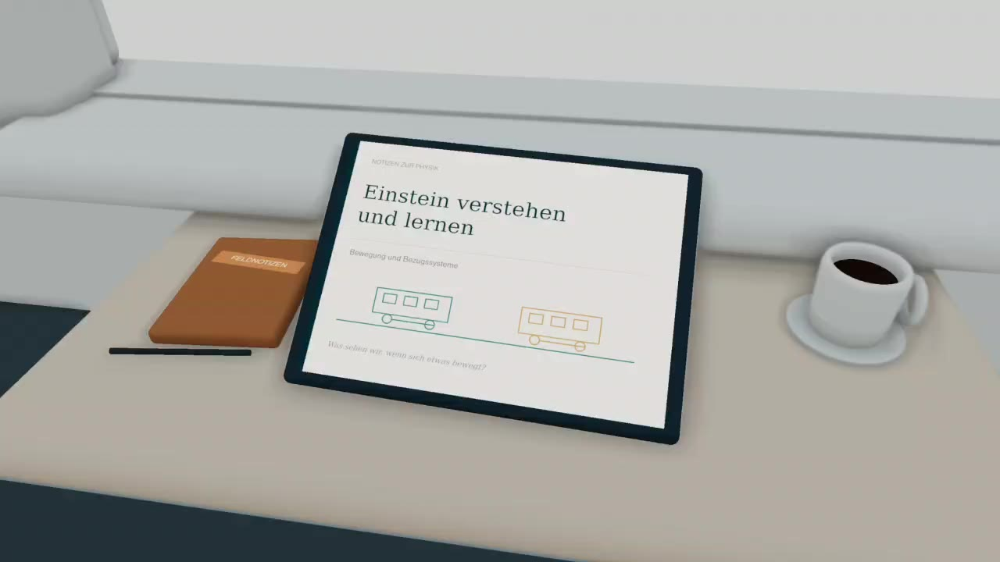{fig-alt="Blick auf einen Tisch im Zug am Anfang des digital erstellten Videos."}

In der HTML-Version lassen sich zwei Szenen abspielen. In einer fährt der eigene Zug aus dem Bahnhof, in der anderen steht er am Bahnsteig.
:::

Videos zur Relativbewegung zweier Züge. Beim Blick aus einem Zugfenster bleibt zunächst offen, ob der eigene Zug oder der Zug auf dem Nachbargleis relativ zum Bahnsteig fährt. Erst später wird der Bahnsteig sichtbar. Die Szenen wurden digital erstellt.
::::

Sobald der Bahnsteig sichtbar wird, lässt sich erkennen, welcher Zug sich gegenüber ihm bewegt. Um Bewegung sinnvoll anzugeben, muss also festgelegt werden, welches Bezugssystem verwendet wird.

::: {#denkcheck-rucksack .mp-box .mp-task}
<span class="mp-task-kind mp-task-kind-think" aria-label="Denkcheck">
  
  Denkcheck
</span>

Du sitzt in einem fahrenden Zug. Dein Rucksack liegt auf dem Sitz neben dir.

<u>Beschreibe</u> den Bewegungszustand des Rucksacks einmal aus dem Bezugssystem „Zug“ und einmal aus dem Bezugssystem „Bahnsteig“. <u>Erkläre</u>, warum beide Beschreibungen richtig sind.
:::

::: {.column-margin .mp-kastennotiz}
Denkchecks sind Kurzaufgaben zum gerade gelesenen Inhalt. Sie lassen sich häufig im Kopf lösen. Mit ihnen prüfst du, ob du das Gelesene verarbeitet hast und es auf kleinere Aufgaben anwenden kannst.
:::

<details class="mp-details">
<summary>Mögliche Lösung anzeigen</summary>
<p>Im Bezugssystem „Zug“ ruht der Rucksack. Im Bezugssystem „Bahnsteig“ bewegt er sich zusammen mit dem Zug. Beide Beschreibungen sind richtig, weil Ruhe und Bewegung relativ zum gewählten Bezugssystem angegeben werden.</p>
</details>

Ein Bezugssystem brauchst du, um Bewegungen zu beschreiben. Es legt fest, von wo aus Ort und Zeit gemessen werden. Bezugssysteme lassen sich weiter unterteilen. Das zeigt ein weiteres Beispiel aus dem Zug.

Stell dir vor, du sitzt wieder in einem geradlinig und gleichförmig fahrenden Zug. Deine Trinkflasche steht ruhig auf dem Tisch. Wir stellen uns die Tischoberfläche waagrecht und reibungsfrei vor. Solange der Zug geradlinig und mit konstanter Geschwindigkeit fährt, gilt in seinem Bezugssystem das erste Newtonsche Axiom. Ohne eine resultierende Kraft ändert die Flasche ihren Bewegungszustand nicht.

Am nächsten Bahnhof bremst der Zug. Die Trinkflasche rutscht nach vorn. Aus dem Bezugssystem des Zuges setzt sich die Flasche in Bewegung, obwohl keine Wechselwirkung sie nach vorn beschleunigt. Um diese Bewegung im bremsenden Zug mit einer Kraftgleichung zu beschreiben, wird eine Scheinkraft eingeführt. Sie berücksichtigt die Beschleunigung des Bezugssystems und geht nicht auf eine Wechselwirkung mit einem anderen Körper zurück.[Scheinkraft]{.column-margin .mp-randbegriff} In diesem Beispiel ist sie nach vorn gerichtet.

Im Bezugssystem des Bahnsteigs lässt sich die Bewegung dagegen mit dem ersten Newtonschen Axiom erklären. Auf die Flasche wirkt keine resultierende Kraft, weshalb sie ihren Bewegungszustand beibehält. Während der Zug abbremst, bewegt sich die Flasche gleichförmig weiter und rutscht dadurch im Zug nach vorn.

Bezugssysteme, in denen das erste Newtonsche Axiom gilt, heißen Inertialsysteme.[Inertialsystem]{.column-margin .mp-randbegriff} Das Bezugssystem des Bahnsteigs behandeln wir in diesem Beispiel als Inertialsystem. Das Bezugssystem des bremsenden Zuges ist dagegen ein Nicht-Inertialsystem. Der Zug wird gegenüber dem Bahnsteig beschleunigt, denn auch Bremsen ist eine Beschleunigung.

[]{#sec-umbau-kreisbahn-aufgabe}

::::: {.mp-box .mp-task}
<span class="mp-task-kind mp-task-kind-think" aria-label="Denkcheck">
  
  Denkcheck
</span>

Die Bewegungen in @fig-umbau-bewegungen-abc werden von einem Inertialsystem aus beschrieben. Die betrachteten Bezugssysteme bewegen sich mit den markierten Körpern mit.

:::: {#fig-umbau-bewegungen-abc}
::: {.content-visible when-format="html"}
```{=html}
<div class="srt-workbook-figure srt-workbook-figure--caption-inside">
  <div class="srt-workbook-stage" data-srt-animation="inertial" data-srt-motion-control data-srt-label="Vergleich von Inertialsystem und beschleunigten Systemen"></div>
</div>
```
:::

::: {.content-visible unless-format="html"}
::: {.srt-workbook-fallback}
In der HTML-Version erscheint hier eine Visualisierung zu gleichförmig geradliniger Bewegung, Kreisbewegung und Schwingung.
:::
:::

Animation zu geradliniger Bewegung, Kreisbewegung und Schwingung. A zeigt eine geradlinige Bewegung mit konstanter Geschwindigkeit, B eine Kreisbewegung mit konstantem Tempo und C eine Schwingung. Der rote Punkt kennzeichnet jeweils den Ursprung des mitbewegten Bezugssystems.
::::

1. <u>Ordne</u> die zu den Bewegungen A, B und C mitbewegten Bezugssysteme als Inertialsystem oder Nicht-Inertialsystem ein und <u>begründe</u> deine Zuordnung.

2. <span class="mp-task-kind mp-task-kind-transfer" aria-label="Transfer">Transfer</span> Bei Bewegung B bewegt sich der Körper mit konstantem Tempo auf einer Kreisbahn. Ein Schüler sagt: „Die Geschwindigkeit bleibt gleich, also wird der Körper nicht beschleunigt.“ <u>Beurteile</u> diese Aussage.

<details class="mp-details">
<summary>Mögliche Lösung anzeigen</summary>

1. Das zu Bewegung A mitbewegte Bezugssystem ist ein Inertialsystem, weil es sich geradlinig mit konstanter Geschwindigkeit bewegt. Seine Beschleunigung ist null. Das erste Newtonsche Axiom gilt dort ohne die Einführung von Scheinkräften.

   Die zu den Bewegungen B und C mitbewegten Bezugssysteme sind Nicht-Inertialsysteme, weil sie beschleunigt werden. Um Bewegungen in diesen Systemen mit der Newtonschen Kraftgleichung zu beschreiben, müssen Scheinkräfte berücksichtigt werden.

2. ::: {.mp-box .mp-misconception}
   <div class="mp-title">Gleiches Tempo bedeutet keine Beschleunigung?</div>

   Die Aussage ist falsch. Sie setzt gleichbleibendes Tempo mit gleichbleibender Geschwindigkeit gleich. Bei der Kreisbewegung bleibt zwar das Tempo, also der Betrag der Geschwindigkeit, konstant. Die Bewegungsrichtung ändert sich jedoch fortlaufend. Damit ändert sich der Geschwindigkeitsvektor. Der Körper ist deshalb beschleunigt.

   Die Schüleraussage entspricht der beschriebenen Lernendenvorstellung, Geschwindigkeit erfasse nur, wie schnell sich ein Körper bewegt, nicht aber dessen Bewegungsrichtung [@schecker2018, S. 66].
   :::

</details>
:::::


---

## Michelson-Morley-Experiment

::: {.mp-goal-strip}
Du <u>beschreibst</u> den Aufbau eines Michelson-Interferometers und <u>erläuterst</u>, wie damit ein Ätherwind nachgewiesen werden sollte.

Du <u>interpretierst</u> das Nullresultat als Problem für die einfache Ätherhypothese.
:::

[]{#sec-umbau-mm-problem}

Schallwellen brauchen ein Medium, etwa Luft oder Wasser. Auch Licht lässt sich als Welle beschreiben. Im 19. Jahrhundert nahm man deshalb an, dass es ebenfalls ein Trägermedium gebe.

Lichtäther nannte man dieses angenommene Medium, das den Raum durchdringen sollte.[Lichtäther]{.column-margin .mp-randbegriff} Es sollte ein ausgezeichnetes Bezugssystem festlegen, in dem Licht sich in alle Richtungen gleich schnell ausbreitet. Ruhe gegenüber diesem Medium hätte als absolute Ruhe gegolten.

Ätherwind bezeichnet die angenommene Bewegung des Äthers gegenüber einem Körper, etwa der Erde.[Ätherwind]{.column-margin .mp-randbegriff} Bewegte sich die Erde durch den Äther, müsste dieser aus Sicht der Erde an ihr vorbeiströmen, ähnlich dem Fahrtwind beim Radfahren. Michelson und Morley wollten diese Bewegung durch ihren Einfluss auf die Lichtausbreitung nachweisen.

Die erwarteten Laufzeitunterschiede lassen sich mit zwei Booten auf einem Fluss vergleichen. Beide fahren mit demselben konstanten Tempo relativ zum Wasser. Ein Boot fährt flussabwärts zu einem Wendepunkt, das andere überquert den Fluss. Beide starten am selben Punkt und kehren dorthin zurück. Die Wendepunkte liegen gegenüber dem Ufer fest und sind gleich weit vom gemeinsamen Startpunkt entfernt.

Auf der Längsstrecke erhöht die Strömung das Tempo gegenüber dem Ufer auf dem Hinweg und verringert es auf dem Rückweg. Bei der Querfahrt muss das Boot auf beiden Wegen schräg gegen die Strömung steuern, damit es nicht abgetrieben wird. Auch hier kommt es gegenüber dem Ufer langsamer voran als in ruhendem Wasser.

In @fig-umbau-bootsanalogie fahren beide Boote mit $5\,\mathrm{m/s}$ relativ zum Wasser. Die Strömung hat gegenüber dem Ufer eine Geschwindigkeit von $3\,\mathrm{m/s}$. Bis zum jeweiligen Wendepunkt sind es $60\,\mathrm{m}$.

:::: {#fig-umbau-bootsanalogie .mp-mm-figure}
::: {.content-visible when-format="html"}
```{=html}
<div class="mp-boats-interactive">
  <div class="srt-workbook-stage" data-srt-animation="boote" data-srt-motion-control data-srt-viewbox-w="580" data-srt-viewbox-h="385" data-srt-label="Draufsicht im Bezugssystem des Ufers. Zwei Boote fahren vom selben Startpunkt längs und quer zur Strömung hin und zurück. Das quer fahrende Boot kehrt zuerst zurück."></div>
</div>
```
:::
::: {.content-visible unless-format="html"}
In der HTML-Version zeigt eine Animation beide Fahrten. Die Querfahrt endet nach 30 Sekunden, die Längsfahrt nach 37,5 Sekunden.
:::

Animation zur Bootsanalogie des Michelson-Morley-Experiments. In der Draufsicht sind eine Längsfahrt und eine Querfahrt bei gleich langen Wegen zu sehen. Die Ufer bleiben im Bild fest. Der Bug des quer fahrenden Bootes zeigt auf beiden Wegen schräg gegen die Strömung. Die Zeitangaben zeigen die Fahrtdauer, die Wiedergabe läuft im dreifachen Zeitraffer. Die Wenden sind ohne Zeitverlust idealisiert. Die Analogie folgt Giancoli [@giancoli2010physik, S. 1227–1228].
::::

Das quer fahrende Boot kehrt zuerst zurück. Es braucht für Hin- und Rückweg zusammen $30\,\mathrm{s}$, das längs fahrende Boot $37{,}5\,\mathrm{s}$. Obwohl beide gegenüber dem Wasser gleich schnell fahren, dauert die Längsfahrt länger. Der Zeitgewinn flussabwärts gleicht den Zeitverlust flussaufwärts nicht aus.

::: {.column-margin}
Die Berechnung der Fahrzeiten und das Geschwindigkeitsdreieck findest du in „Physik: Lehr- und Übungsbuch“ von Giancoli [@giancoli2010physik, S. 1227–1228].
:::

Nach der einfachen Ätherhypothese sollte sich Licht ähnlich verhalten. Für gleich lange Hin- und Rückwege längs und quer zum Ätherwind wurden unterschiedliche Laufzeiten erwartet.

[]{#sec-umbau-mm-messidee}

Ein Michelson-Interferometer teilt einen Lichtstrahl auf zwei zueinander senkrechte Wege auf.[Michelson-Interferometer]{.column-margin .mp-randbegriff} Zwei Spiegel werfen die Teilstrahlen zurück, sodass sie anschließend wieder überlagert werden.

Ein Interferenzmuster entsteht, weil sich die Lichtwellen an manchen Stellen verstärken und an anderen abschwächen oder auslöschen.[Interferenzmuster]{.column-margin .mp-randbegriff} Dadurch werden auf einem Schirm helle und dunkle Bereiche sichtbar.

Beim Drehen der Apparatur um 90 Grad tauschen die beiden Arme ihre Ausrichtung zum angenommenen Ätherwind. In der Bootsanalogie würden die bisherigen Querstrecken zu Längsstrecken und umgekehrt. Damit sollte sich der Laufzeitunterschied zwischen den Teilstrahlen ändern. Erwartet wurde deshalb eine Verschiebung des Interferenzmusters.

@fig-umbau-interferometer-aufbau zeigt einen vereinfachten modernen Aufbau eines Michelson-Interferometers. Über die fünf Schaltflächen blendest du nacheinander den Laser, die Linse, den Strahlteiler, die beiden Spiegel und den Schirm ein.

::: {.column-margin}
In der Physiksammlung gibt es einen solchen Aufbau aus den Modulwürfeln des O3Q-Experimentiersystems.

Einen realen Aufbau zeigt auch dieses [Video zum Michelson-Interferometer auf YouTube](https://www.youtube.com/watch?v=8YgVQHbHR0I).
:::

:::: {#fig-umbau-interferometer-aufbau .mp-mm-figure}
::: {.content-visible when-format="html"}
```{=html}
<div class="srt-workbook-stage" data-srt-animation="aufbau" data-srt-viewbox-h="350" data-srt-label="Moderner schematischer Aufbau eines Michelson-Interferometers"></div>
```
:::
::: {.content-visible unless-format="html"}
In der HTML-Version lässt sich der Aufbau mit Laser, Linse, Strahlteiler, zwei Spiegeln und Schirm schrittweise einblenden.
:::

Interaktive Darstellung eines Michelson-Interferometers. Der moderne schematische Aufbau wird in fünf Schritten eingeblendet und ist keine originalgetreue Rekonstruktion des historischen Experiments. Rechts ist ein mögliches Interferenzmuster auf dem Schirm dargestellt. Rot und Grün unterscheiden die beiden Lichtwege, nicht unterschiedliche Lichtfarben.
::::

In @fig-umbau-mm-drehung vergleichst du die erwartete Veränderung des Interferenzmusters mit dem Nullresultat. Wähle eine der beiden Ansichten und verändere die Ausrichtung der Apparatur mit dem Regler. Der Pfeil kennzeichnet die Richtung des angenommenen Ätherwinds.

:::: {#fig-umbau-mm-drehung}
::: {.content-visible when-format="html"}
```{=html}
<div class="srt-workbook-figure mp-mm-figure">
  <div class="srt-workbook-stage" data-srt-animation="mm" data-srt-viewbox-h="420" data-srt-label="Michelson-Morley-Vergleich zwischen Äthererwartung und Nullresultat auf dem Schirm, mit Schieberegler für die Rotation der Apparatur"></div>
</div>
```
:::

::: {.content-visible unless-format="html"}
::: {.srt-workbook-fallback}
In der HTML-Version erscheinen hier interaktive Darstellungen zu Aufbau, Äther-Erwartung und Nullresultat.

:::
:::

Simulation zum Michelson-Morley-Experiment. Die Apparatur lässt sich gegenüber einem angenommenen Ätherwind um 0 bis 90 Grad drehen. Die beiden Ansichten zeigen schematisch die erwartete Verschiebung des Interferenzmusters und die ausbleibende Verschiebung beim Nullresultat.
::::

[]{#sec-umbau-mm-deutung}

Die beim Drehen der Apparatur erwartete Verschiebung des Interferenzmusters ließ sich nicht nachweisen. Es handelt sich dabei um ein Nullresultat.[Nullresultat]{.column-margin .mp-randbegriff} Von einem Nullresultat spricht man, wenn der untersuchte Effekt innerhalb der Messgenauigkeit nicht nachgewiesen wird. Das Ergebnis lieferte keinen Nachweis für den angenommenen Ätherwind und machte die einfache Ätherhypothese problematisch.

Der Aufbau selbst wird bis heute weiterentwickelt. Die Detektoren, mit denen 2015 der erste direkte Nachweis von Gravitationswellen gelang, sind abgewandelte Michelson-Interferometer mit vier Kilometer langen Armen [@ligo2016observation].

Einstein nennt das Michelson-Morley-Experiment in seiner Arbeit von 1905 nicht beim Namen. Er verweist auf eine Unstimmigkeit in der Elektrodynamik und auf die gescheiterten Ätherversuche:

> Beispiele ähnlicher Art, sowie die mißlungenen Versuche, eine Bewegung der Erde relativ zum „Lichtmedium“ zu konstatieren, führen zu der Vermutung, daß dem Begriffe der absoluten Ruhe nicht nur in der Mechanik, sondern auch in der Elektrodynamik keine Eigenschaften der Erscheinungen entsprechen. [@einstein1905elektrodynamik, S. 891]

Einen Lichtäther braucht seine Theorie dann nicht mehr, denn sie kommt ohne einen absolut ruhenden Raum aus. Das Michelson-Morley-Experiment ist einer von mehreren Anstößen zur speziellen Relativitätstheorie, aus dem Nullresultat folgt sie aber nicht unmittelbar [@vandongen2009michelson].

::: {.mp-box .mp-task}
<span class="mp-task-kind mp-task-kind-think" aria-label="Denkcheck">
  
  Denkcheck
</span>

<u>Skizziere</u> den Aufbau eines Michelson-Interferometers und <u>erläutere</u>, wie damit ein Ätherwind nachgewiesen werden sollte.

:::

<details class="mp-details">
<summary>Mögliche Lösung anzeigen</summary>

Den Aufbau zum Abgleichen deiner Skizze zeigt @fig-umbau-interferometer-aufbau.

Die Erde sollte sich durch den Äther bewegen. An der Apparatur sollte deshalb ein Ätherwind vorbeistreichen. Licht längs zum Ätherwind sollte für seinen Weg eine andere Zeit benötigen als Licht quer dazu. Beim Drehen der Apparatur sollte sich dieser Laufzeitunterschied ändern und dadurch das Interferenzmuster verschieben.
</details>

---

## Einsteinsche Postulate

::: {.mp-goal-strip}
Du <u>nennst</u> die beiden Einsteinschen Postulate.

Du <u>begründest</u> mit dem zweiten Postulat, weshalb sich die Geschwindigkeit einer Lichtquelle nicht zur Lichtgeschwindigkeit addiert.
:::

Die Einsteinschen Postulate bilden den Ausgangspunkt der speziellen Relativitätstheorie. Du sitzt in einem Zug, der geradlinig und gleichförmig mit $100\,\mathrm{km/h}$ fährt.

1. Du lässt einen Ball fallen. Erwartest du, dass er innerhalb des Zuges anders fällt als bei demselben Versuch im stehenden Zug?
2. Eine Person geht im Zug mit $5\,\mathrm{km/h}$ in Fahrtrichtung. Welche Geschwindigkeit hat sie aus Sicht einer Person am Bahnsteig?

Der Ball fällt in beiden Fällen senkrecht nach unten, jeweils aus Sicht einer Person im Zug. An diesem Versuch im Zug lässt sich die gleichförmige Fahrt nicht erkennen. Die gehende Person bewegt sich aus Sicht des Bahnsteigs näherungsweise mit $105\,\mathrm{km/h}$.

Das Zugbeispiel verbindet zwei vertraute Vorstellungen aus der klassischen Mechanik. Die mechanischen Gesetze gelten in allen Inertialsystemen in derselben Form. Das ist das Relativitätsprinzip der klassischen Mechanik. Geschwindigkeiten lassen sich beim Wechsel zwischen diesen Systemen durch Addition oder Subtraktion umrechnen.

::: {.mp-box .mp-misconception}
<div class="mp-title">Addiert sich die Geschwindigkeit der Quelle zur Lichtgeschwindigkeit?</div>
Bei der gehenden Person im Zug liefert die Addition der beiden Geschwindigkeiten eine sehr gute Näherung. Es liegt nahe, dieselbe Rechnung auf Licht aus einer bewegten Quelle zu übertragen. Für Licht im Vakuum gilt diese Addition jedoch nicht. In jedem Inertialsystem wird dieselbe Lichtgeschwindigkeit gemessen, unabhängig von der Bewegung der Quelle. Die vertraute Addition ist eine Näherung für Geschwindigkeiten, die klein gegenüber der Lichtgeschwindigkeit sind.
:::

::: {.column-margin .mp-kastennotiz}
Die roten Kästen greifen verbreitete Lernendenvorstellungen auf und erläutern die zugehörige physikalische Erklärung.
:::

Die Lichtgeschwindigkeit im Vakuum wird mit $c$ bezeichnet. Ihr Wert beträgt exakt[Lichtgeschwindigkeit]{.column-margin .mp-randbegriff}

$$
c = 299\,792\,458\,\mathrm{m/s}.
$$

Für die Rechnungen in diesem Kapitel verwenden wir den gerundeten Wert $c\approx3{,}0\cdot10^8\,\mathrm{m/s}$.

Einstein erweitert das aus der Mechanik bekannte Relativitätsprinzip auf alle physikalischen Gesetze. Es soll also auch für die Gesetze der Optik und Elektrodynamik gelten. Hinzu kommt die konstante Lichtgeschwindigkeit im Vakuum. Diese beiden Annahmen bilden die Grundlage seiner Theorie.

::: {#kasten-einsteinsche-postulate .mp-box .mp-core}
<div class="mp-title">Einsteinsche Postulate</div>

1. **Relativitätsprinzip.** Die Naturgesetze haben in allen Inertialsystemen dieselbe Form.
2. **Konstanz der Lichtgeschwindigkeit.** Licht breitet sich im Vakuum in allen Inertialsystemen mit derselben Geschwindigkeit $c$ aus, unabhängig von der Bewegung der Lichtquelle oder der beobachtenden Person.
:::

::: {.column-margin .mp-kastennotiz}
Die goldenen Kästen enthalten grundlegende Aussagen, die für das jeweilige Thema zentral sind.
:::

In @fig-umbau-konstanz-lichtgeschwindigkeit vergleichst du Lichtpulse aus zwei Quellen. Eine Lichtquelle befindet sich auf der Erde, die andere in einem Raumschiff. Im Erdsystem ruht die Quelle auf der Erde, während sich die Quelle im Raumschiff bewegt. Im Raumschiffsystem ist es umgekehrt. Beide Bezugssysteme sind nach dem [Relativitätsprinzip](#kasten-einsteinsche-postulate) gleichwertig. Mit dem Schieberegler veränderst du die Relativgeschwindigkeit. Über die Buttons „Erdsystem“ und „Raumschiffsystem“ wechselst du das Bezugssystem. Das Häkchen „klassische Erwartung“ blendet zum Vergleich ein, welche Geschwindigkeit die klassische Geschwindigkeitsaddition liefern würde.

:::: {#fig-umbau-konstanz-lichtgeschwindigkeit}
::: {.content-visible when-format="html"}
```{=html}
<div class="zp2" data-zp2-animation>
  <div class="zp2-stage">
    <canvas aria-label="Simulation: Lichtpulse aus bewegter und ruhender Quelle">
      Dein Browser unterstützt die Canvas-Darstellung nicht.
    </canvas>

    <button class="zp2-play" type="button" aria-pressed="false">Abspielen</button>

    <div class="zp2-controls">
      <div class="zp2-group">
        <label class="zp2-label" for="zp2-speed">Relativgeschwindigkeit</label>
        <input class="zp2-speed" id="zp2-speed" type="range" min="0" max="0.8" step="0.05" value="0.4">
        <span class="zp2-speed-value" aria-live="polite"><i>v</i> = +0,40 <i>c</i></span>
      </div>

      <div class="zp2-group">
        <span class="zp2-label">Bezugssystem</span>
        <div class="zp2-segmented" role="group" aria-label="Bezugssystem wählen">
          <button type="button" data-zp2-frame="earth" aria-pressed="true">Erdsystem</button>
          <button type="button" data-zp2-frame="ship" aria-pressed="false">Raumschiffsystem</button>
        </div>
      </div>

      <label class="zp2-check">
        <input class="zp2-classical" type="checkbox">
        klassische Erwartung
      </label>
    </div>
  </div>
</div>
<script src="assets/animations/srt/used/einsteinsche-postulate/konstanz-lichtgeschwindigkeit.js?v=20260908-tempo"></script>
```
:::

::: {.content-visible unless-format="html"}
::: {.srt-workbook-fallback}
In der HTML-Version erscheint hier eine Visualisierung zur konstanten Lichtgeschwindigkeit.
:::
:::

Simulation zur Konstanz der Lichtgeschwindigkeit. Zwei Lichtquellen senden Lichtpulse aus. Die Darstellung lässt sich zwischen Erd- und Raumschiffsystem umschalten. Die Relativgeschwindigkeit der Quellen ist einstellbar. Zusätzlich lässt sich die nach der klassischen Geschwindigkeitsaddition erwartete Position eines Lichtpulses einblenden.
::::

::: {.mp-box .mp-task}
<span class="mp-task-kind mp-task-kind-think" aria-label="Denkcheck">
  
  Denkcheck
</span>

Ein Raumschiff fliegt mit $0{,}5\,c$ auf die Erde zu und sendet einen Lichtpuls in Flugrichtung aus.

1. <u>Nenne</u> die Geschwindigkeit, die eine Person im Raumschiff für den Lichtpuls misst.
2. <u>Nenne</u> die Geschwindigkeit, die eine Person auf der Erde für den Lichtpuls misst.
3. <u>Begründe</u> deine Antworten mit dem zweiten Einsteinschen Postulat.
:::
<details class="mp-details">
<summary>Mögliche Lösung anzeigen</summary>
<ol>
  <li>Die Person im Raumschiff misst für den Lichtpuls die Geschwindigkeit $c$.</li>
  <li>Auch die Person auf der Erde misst für den Lichtpuls die Geschwindigkeit $c$ und nicht die intuitive Summe $1{,}5\,c$.</li>
  <li>Raumschiff und Erde werden als Inertialsysteme betrachtet. Nach dem zweiten Postulat verändert der Wechsel zwischen diesen Systemen die gemessene Lichtgeschwindigkeit nicht. Die Geschwindigkeit des Raumschiffs wird deshalb nicht zu $c$ hinzuaddiert.</li>
</ol>
</details>

---

## Gleichzeitigkeit

::: {.mp-goal-strip}
Du <u>beschreibst</u> das Zug-Gedankenexperiment zur Gleichzeitigkeit im Zug- und im Bahnsteigsystem.

Du <u>begründest</u> mithilfe des Zug-Gedankenexperiments, dass die Gleichzeitigkeit räumlich getrennter Ereignisse vom Inertialsystem abhängt.
:::

An einem Bahnhof schließen sich die vordere und die hintere Tür eines Zuges. Im Alltag gehen wir davon aus, dass alle darin übereinstimmen können, ob beide Türen gleichzeitig vollständig schließen. Das Zug-Gedankenexperiment stellt diese Vorstellung infrage.

Ein Ereignis ist ein Geschehen an einem bestimmten Ort zu einem bestimmten Zeitpunkt.[Ereignis]{.column-margin .mp-randbegriff} Eine Taschenlampe sendet beispielsweise ein kurzes Lichtsignal aus. Die Aussendung an der Lichtquelle ist ein Ereignis. Das spätere Auftreffen dieses Lichts auf deiner Netzhaut ist ein zweites Ereignis. Beide finden an unterschiedlichen Orten und zu unterschiedlichen Zeitpunkten statt, weil das Licht für den Weg von der Lampe zu deinem Auge Zeit benötigt. Auch der Empfang eines Signals ist also ein Ereignis. Er ist ein anderes Ereignis als die Aussendung des Signals.

Stell dir vor, zwei unterschiedlich weit entfernte Vulkane beginnen im Erdsystem gleichzeitig auszubrechen. Du stehst an einem festen Aussichtspunkt und empfängst das Licht vom näheren Vulkan früher, weil es einen kürzeren Weg zurücklegt. Um die Zeitpunkte der Ausbrüche zu vergleichen, musst du die jeweiligen Lichtlaufzeiten berücksichtigen. Der unterschiedliche Empfang bedeutet hier also nicht, dass die Ausbrüche im Erdsystem nacheinander begonnen haben. Diese unterschiedlichen Empfangszeiten treten bereits innerhalb eines einzigen Bezugssystems auf. Sie sind noch kein Beispiel für die Relativität der Gleichzeitigkeit.

Beim Zug-Gedankenexperiment geht es nun darum, ob zwei räumlich getrennte Ereignisse, die in einem Inertialsystem gleichzeitig stattfinden, auch in einem relativ dazu bewegten Inertialsystem gleichzeitig sind.[Zug-Gedankenexperiment]{.column-margin .mp-randbegriff}

Stell dir dafür einen langen Zug vor, der geradlinig und gleichförmig an einem Bahnsteig vorbeifährt. Genau in der Mitte des Zuges wird ein Lichtsignal ausgesendet. Es läuft nach vorne zum vorderen Zugende und nach hinten zum hinteren Zugende. Eine Person sitzt genau in der Mitte des Zuges. Eine zweite Person steht am Bahnsteig und beschreibt denselben Vorgang aus dem Bahnsteigsystem. Wir vergleichen das Eintreffen des Lichts am vorderen Zugende mit dem Eintreffen am hinteren Zugende. Das sind zwei räumlich getrennte Ereignisse.

Im Zugsystem ruht die Lichtquelle in der Mitte des Zuges. Die Wege zum vorderen und zum hinteren Zugende sind gleich lang. Da Licht sich in beide Richtungen mit derselben Geschwindigkeit $c$ ausbreitet, erreichen die Signale im Zugsystem beide Zugenden gleichzeitig.

Im Bahnsteigsystem bewegt sich der Zug während der Lichtlaufzeit weiter. Das hintere Zugende kommt dem Lichtsignal entgegen, das vordere Zugende entfernt sich. Auch in diesem System breiten sich beide Lichtsignale nach dem [zweiten Einsteinschen Postulat](#kasten-einsteinsche-postulate) mit derselben Geschwindigkeit $c$ aus. Zum hinteren Zugende legt das Licht deshalb einen kürzeren Weg zurück als zum vorderen. Damit erreicht das Lichtsignal im Bahnsteigsystem das hintere Zugende zuerst.

Dieselben beiden Ereignisse finden im Zugsystem gleichzeitig und im Bahnsteigsystem nacheinander statt. Gleichzeitigkeit räumlich getrennter Ereignisse ist also keine absolute Eigenschaft, sondern hängt vom Inertialsystem ab. @fig-umbau-gleichzeitigkeit zeigt das Gedankenexperiment im Zug- und im Bahnsteigsystem.

:::: {#fig-umbau-gleichzeitigkeit}
::: {.content-visible when-format="html"}
```{=html}
<div class="srt-workbook-figure">
  <div class="srt-workbook-stage" data-srt-animation="sim" data-srt-viewbox-w="640" data-srt-viewbox-h="388" data-srt-motion-control data-srt-label="Relativität der Gleichzeitigkeit im Zug- und Bahnsteigsystem"></div>
</div>
```
:::

::: {.content-visible unless-format="html"}
::: {.srt-workbook-fallback}
In der HTML-Version erscheint hier eine Visualisierung zur Relativität der Gleichzeitigkeit im Zug- und Bahnsteigsystem.
:::
:::

Animation zur Gleichzeitigkeit. Ein Lichtsignal breitet sich von der Zugmitte zu beiden Zugenden aus. Oben ist der Vorgang im Zugsystem dargestellt, unten im Bahnsteigsystem. Der Zug bewegt sich gegenüber dem Bahnsteig nach rechts.
::::

Eine zweite Variante des Zug-Gedankenexperiments beginnt anders. Zwei Blitze schlagen am hinteren und am vorderen Zugende ein. Die Einschläge sind zwei räumlich getrennte Ereignisse. In der folgenden [Transferaufgabe](#aufgabe-gleichzeitigkeit-blitze) geht es darum, wann ihr Licht bei einer Person in der Zugmitte ankommt und was sich daraus über die Reihenfolge der Einschläge in den beiden Inertialsystemen schließen lässt.

::: {#aufgabe-gleichzeitigkeit-blitze .mp-box .mp-task}
<span class="mp-task-kind mp-task-kind-transfer" aria-label="Transfer">
  
  Transfer
</span>

Der Zug bewegt sich im Bahnsteigsystem gleichförmig nach rechts. Am hinteren und am vorderen Zugende schlagen zwei Blitze ein, im Bahnsteigsystem gleichzeitig. Zu diesem Zeitpunkt sitzt eine Person genau in der Mitte zwischen den beiden Zugenden. @fig-umbau-blitze-ausgangslage zeigt die Ausgangslage im Bahnsteigsystem.

:::: {#fig-umbau-blitze-ausgangslage}
::: {.content-visible when-format="html"}
```{=html}
<div class="srt-workbook-figure">
  <div class="srt-workbook-stage" data-srt-animation="lightning-setup" data-srt-viewbox-w="640" data-srt-viewbox-h="256" data-srt-label="Ausgangslage mit zwei im Bahnsteigsystem gleichzeitigen Blitzeinschlägen an den Zugenden, einer Person in der Zugmitte und Fahrtrichtung nach rechts"></div>
</div>
```
:::

::: {.content-visible unless-format="html"}
::: {.srt-workbook-fallback}
Ausgangslage: Eine Person sitzt genau in der Zugmitte. Am hinteren und vorderen Zugende schlagen zwei Blitze ein, im Bahnsteigsystem gleichzeitig. Der Zug bewegt sich im Bahnsteigsystem nach rechts.
:::
:::

Skizze zu zwei Blitzeinschlägen an den Zugenden. Die Blitze schlagen im Bahnsteigsystem gleichzeitig ein. Eine Person sitzt in der Zugmitte. Der Zug fährt nach rechts.
::::

<u>Erkläre</u> im Bahnsteigsystem, welches Lichtsignal die Person in der Zugmitte zuerst erreicht, und <u>begründe</u> daraus die Reihenfolge der Blitzeinschläge im Zugsystem mithilfe der Lichtwege und des zweiten Einsteinschen Postulats.

<details class="mp-details">
<summary>Mögliche Lösung anzeigen</summary>

Das Lichtsignal vom vorderen Blitz erreicht die Person in der Zugmitte zuerst, weil sie sich diesem Signal entgegenbewegt. Vom Lichtsignal des hinteren Blitzes bewegt sie sich dagegen weg. Beide Lichtsignale breiten sich im Bahnsteigsystem mit derselben Geschwindigkeit $c$ aus, legen aufgrund der Bewegung der mitfahrenden Person bis zum Empfang aber unterschiedlich lange Wege zurück. Deshalb empfängt die Person sie nacheinander, obwohl die Blitze im Bahnsteigsystem gleichzeitig einschlagen.

Im Zugsystem empfängt die Person zuerst das Licht vom vorderen Blitz. Dort ruht sie in der Zugmitte. Die beiden Einschlagstellen an den Zugenden sind gleich weit von ihr entfernt. Nach dem zweiten Einsteinschen Postulat breitet sich Licht in beiden Richtungen mit derselben Geschwindigkeit $c$ aus. Die Lichtlaufzeiten von den Einschlagstellen zur Person sind deshalb gleich lang. Das früher empfangene Licht muss somit auch früher ausgesendet worden sein. Der vordere Blitz schlägt im Zugsystem also früher ein als der hintere.

Die Aussagen zur Gleichzeitigkeit beziehen sich auf unterschiedliche Inertialsysteme. Nach dem [Relativitätsprinzip](#kasten-einsteinsche-postulate) ist keines der beiden Inertialsysteme bevorzugt. Beide Beschreibungen sind physikalisch gleichberechtigt. @fig-umbau-blitze-empfang zeigt die Lichtsignale und die mitfahrende Person im Bahnsteigsystem.

:::: {#fig-umbau-blitze-empfang}
::: {.content-visible when-format="html"}
```{=html}
<div class="srt-workbook-figure">
  <div class="srt-workbook-stage" data-srt-animation="lightning" data-srt-viewbox-w="640" data-srt-viewbox-h="276" data-srt-motion-control data-srt-label="Lichtsignale zweier gleichzeitiger Blitzeinschläge und ihr Empfang bei der mitfahrenden Person im Bahnsteigsystem"></div>
</div>
```
:::

::: {.content-visible unless-format="html"}
::: {.srt-workbook-fallback}
In der HTML-Version erscheint hier eine Transfer-Visualisierung mit zwei gleichzeitigen Blitzereignissen am hinteren und vorderen Zugende im Bahnsteigsystem und einer bewegten Person im Zug.
:::
:::

Animation zum Empfang der Lichtsignale im Bahnsteigsystem. Zwei Blitze schlagen im Bahnsteigsystem gleichzeitig an den Zugenden ein. Ihr Licht breitet sich zur Person in der Zugmitte aus, während der Zug nach rechts fährt.
::::

</details>
:::

::: {.column-margin .mp-kastennotiz}
Bei Transferaufgaben wendest du ein Konzept auf eine neue Situation an oder verbindest es mit anderem Wissen.
:::

---

## Zeitdilatation

::: {.mp-goal-strip}
Du <u>erklärst</u> die Zeitdilatation mithilfe der Lichtuhr.

Du <u>leitest</u> die Beziehung $\Delta t = \gamma \Delta t_0$ <u>her</u>.

Du <u>berechnest</u> die mittlere Lebensdauer bewegter Myonen im Erdsystem und <u>erklärst</u> damit, dass sie den Erdboden erreichen können.
:::

In der [Einleitung](#kapiteleinstieg) ging es bereits darum, dass dein Smartphone für die GPS-Ortung genaue Zeitangaben von Satelliten benötigt. Dabei müssen Unterschiede zwischen dem Gang der Satellitenuhren und dem der Uhren auf der Erde berücksichtigt werden. Ein Teil dieser Unterschiede entsteht durch die Zeitdilatation aufgrund der Relativbewegung.

[]{#sec-umbau-zeitdilatation-beispiel}

Wenn du wissen möchtest, wie viel Zeit dir bis zur Abfahrt eines Zuges bleibt, schaust du auf die Uhr. Für eine gleichmäßige Zeitmessung nutzen Uhren einen regelmäßig wiederkehrenden Vorgang. Bei einer Pendeluhr sind das die Schwingungen des Pendels, bei einer Quarzuhr die eines Quarzkristalls.

Für unser Gedankenexperiment verwenden wir eine Lichtuhr.[Lichtuhr]{.column-margin .mp-randbegriff} Sie besteht aus zwei parallelen Spiegeln, zwischen denen sich ein Lichtpuls hin- und herbewegt. Wir betrachten ideale Spiegel und einen Lichtpuls, der sich zwischen ihnen im Vakuum mit der Lichtgeschwindigkeit $c$ ausbreitet. Ein Zähler am unteren Spiegel erfasst jede Rückkehr des Pulses. Ein vollständiger Hin- und Rückweg bildet den regelmäßig wiederkehrenden Vorgang dieser Uhr und wird im Folgenden als ein Tick bezeichnet. @fig-umbau-lichtuhr-aufbau zeigt ihren Aufbau und das Zählen der vollständigen Hin- und Rückwege.

:::: {#fig-umbau-lichtuhr-aufbau}
::: {.content-visible when-format="html"}
```{=html}
<div class="srt-workbook-figure">
  <div class="srt-workbook-stage" data-srt-animation="lightclock-build" data-srt-viewbox-w="640" data-srt-viewbox-h="324" data-srt-motion-control data-srt-label="Aufbau einer Lichtuhr mit zwei Spiegeln, Lichtquelle am unteren Spiegel und Zähler für vollständige Hin- und Rückwege"></div>
</div>
```
:::

::: {.content-visible unless-format="html"}
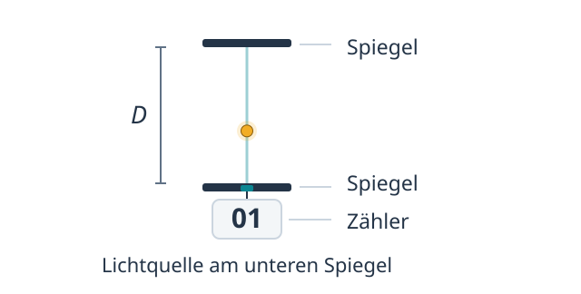{fig-alt="Zwei parallele Spiegel im Abstand D. Lichtquelle und Zähler befinden sich am unteren Spiegel."}
:::

Animation zum Aufbau einer Lichtuhr. Ein Lichtpuls bewegt sich zwischen zwei parallelen Spiegeln. Am unteren Spiegel befinden sich die Lichtquelle und ein Zähler, der bei jeder Rückkehr um eins weiterzählt.
::::

[]{#sec-umbau-zeitdilatation-idee}

Wir betrachten wieder einen Zug, der geradlinig und gleichförmig an einem Bahnsteig vorbeifährt. Die Lichtuhr fährt im Zug mit. Ihre Spiegel liegen übereinander, sodass ihre Verbindung senkrecht zur Fahrtrichtung steht. Eine Person fährt zusammen mit der Lichtuhr im Zug. Eine zweite Person steht am Bahnsteig und beschreibt denselben Vorgang im Bahnsteigsystem. Ein Tick wird durch zwei Ereignisse begrenzt. Das erste ist die Aussendung des Lichtpulses am unteren Spiegel. Das zweite ist seine Rückkehr an diesen Spiegel nach der Reflexion am oberen Spiegel.

Für die mitfahrende Person bewegt sich der Lichtpuls senkrecht vom unteren Spiegel zum oberen Spiegel und wieder zurück. Der Spiegelabstand beträgt $D$, der gesamte Lichtweg also $2D$. Die Lichtuhr misst für diesen Tick die Zeit $\Delta t_0 = \frac{2D}{c}$. Aussendung und Rückkehr finden im Zugsystem am selben Ort statt. Die Zeitdauer zwischen diesen beiden Ereignissen, die eine dort ruhende Uhr misst, heißt Eigenzeit $\Delta t_0$.[Eigenzeit]{.column-margin .mp-randbegriff}

Für die Person am Bahnsteig bewegt sich der Zug während der Laufzeit des Lichtpulses nach rechts. Deshalb verläuft der Lichtweg diagonal und ist länger als $2D$. Wenn der Lichtpuls zum unteren Spiegel zurückkehrt, befindet sich dieser weiter rechts als bei der Aussendung. Dieselben beiden Ereignisse finden im Bahnsteigsystem daher an unterschiedlichen Orten statt. Die Zeitdauer, die dem Tick im Bahnsteigsystem zugeordnet wird, bezeichnen wir mit $\Delta t$.

@fig-umbau-lichtuhr-vergleich zeigt einen vollständigen Tick derselben Lichtuhr im Zug- und im Bahnsteigsystem. Mit dem Schieberegler veränderst du die Relativgeschwindigkeit. Nach dem [zweiten Einsteinschen Postulat](#kasten-einsteinsche-postulate) breitet sich Licht in beiden Inertialsystemen mit derselben Geschwindigkeit $c$ aus.

:::: {#fig-umbau-lichtuhr-vergleich}
::: {.content-visible when-format="html"}
```{=html}
<div class="srt-workbook-figure">
  <div class="srt-workbook-stage" data-srt-animation="lightclock" data-srt-viewbox-w="640" data-srt-viewbox-h="550" data-srt-motion-control data-srt-label="Ein Tick derselben Lichtuhr im Zugsystem oben und im Bahnsteigsystem unten. Die Zähler erfassen die Rückkehr."></div>
</div>
```
:::

::: {.content-visible unless-format="html"}
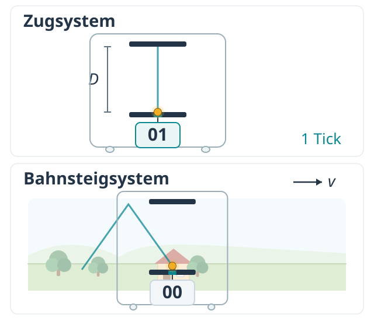{fig-alt="Lichtuhr im Zugsystem mit senkrechtem Lichtweg und im Bahnsteigsystem mit diagonalem Lichtweg."}
:::

Simulation zur Zeitdilatation mit einer Lichtuhr. Oben ist ein vollständiger Hin- und Rückweg im Zugsystem dargestellt, unten derselbe Vorgang im Bahnsteigsystem. Die Zähler erfassen jeweils eine Rückkehr. Jede Ansicht hält nach ihrem vollständigen Tick bis zum gemeinsamen Neustart an.
::::

Der Lichtweg ist länger, die Lichtgeschwindigkeit aber in beiden Inertialsystemen gleich groß. Deshalb benötigt der Lichtpuls aus Sicht der Person am Bahnsteig mehr Zeit für einen vollständigen Tick. Es gilt also $\Delta t > \Delta t_0$. Aus Sicht des Bahnsteigs geht die bewegte Uhr langsamer.

::: {.mp-box .mp-misconception}
<div class="mp-title">Geht die bewegte Uhr einfach falsch?</div>
Nein, mit der Uhr ist technisch alles in Ordnung. Aus Sicht des Bahnsteigs ist jeder Vorgang im Zug betroffen, auch der Herzschlag einer Person im Zug. Nicht die Uhr versagt, sondern die Zeit selbst vergeht im Zugsystem langsamer, gemessen vom Bahnsteig aus.
:::

::: {.column-margin}
Das Zwillingsparadoxon knüpft an die wechselseitige Zeitdilatation an. Dabei stellt sich die Frage, wie diese Beschreibungen mit dem Altersvergleich nach einer Hin- und Rückreise zusammenpassen. Eine Einführung findest du in „Physik. Lehr- und Übungsbuch“ von Giancoli [@giancoli2010physik, S. 1236–1237].
:::

Die Zeitdilatation ist dabei wechselseitig. Im Zugsystem ruht die mitfahrende Person, während sich der Bahnsteig an ihr vorbeibewegt. Eine am Bahnsteig ruhende Uhr geht deshalb aus Sicht des Zuges langsamer. Bei diesem umgekehrten Vergleich betrachten wir die Ticks der Bahnsteiguhr. Zuvor haben wir die Ticks der Zuguhr betrachtet. Beide Beschreibungen sind gleichberechtigt.

Bisher kennen wir nur die Ungleichung $\Delta t > \Delta t_0$. Jetzt leitest du eine Beziehung zwischen den beiden Zeitdauern her. Dafür genügen der Satz des Pythagoras und einige Umformungen. Dabei ergibt sich der Lorentzfaktor. Er gibt das Verhältnis $\Delta t/\Delta t_0$ an und wird uns in der speziellen Relativitätstheorie noch häufiger begegnen.

:::::: {#aufgabe-lichtuhr-herleitung .mp-box .mp-task}
<span class="mp-task-kind mp-task-kind-derive" aria-label="Herleitung">
  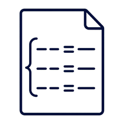
  Herleitung
</span>

Im Bahnsteigsystem betrachtest du zunächst den Hinweg vom unteren zum oberen Spiegel. Der Lichtweg dieses halben Ticks bildet zusammen mit dem Spiegelabstand und der seitlichen Verschiebung der Lichtuhr ein rechtwinkliges Dreieck. @fig-umbau-lichtuhr-halbtick zeigt die drei Seiten. Der Lichtweg $c\,\Delta t/2$ ist die Hypotenuse. Der Spiegelabstand $D$ und die seitliche Verschiebung $v\,\Delta t/2$ sind die Katheten.

:::: {#fig-umbau-lichtuhr-halbtick}
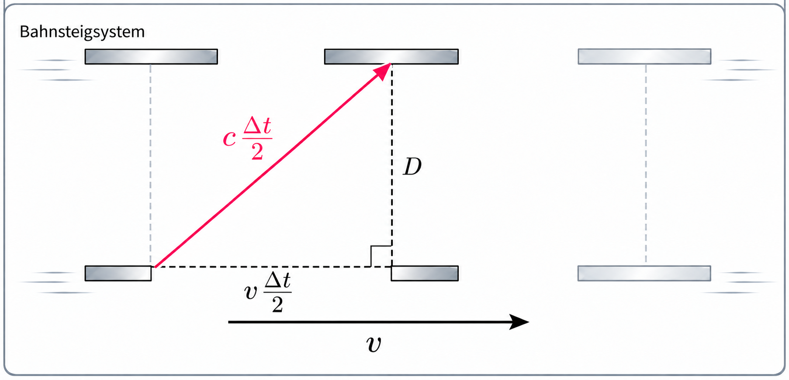{.srt-workbook-image fig-alt="Rechtwinkliges Dreieck im Bahnsteigsystem mit dem Lichtweg c Delta t/2 als Hypotenuse und den Katheten D und v Delta t/2."}

Skizze zum halben Tick einer Lichtuhr im Bahnsteigsystem. Der diagonale Lichtweg, der senkrechte Spiegelabstand und die waagrechte Verschiebung bilden ein rechtwinkliges Dreieck.
::::

Aus diesem Dreieck folgt mit dem Satz des Pythagoras Gleichung (I). Für den vollständigen Tick im Zugsystem gilt die bereits bekannte Gleichung (II).

$$
\left(c\,\frac{\Delta t}{2}\right)^2
=D^2+\left(v\,\frac{\Delta t}{2}\right)^2
\tag{I}
$$

$$
\Delta t_0=\frac{2D}{c}
\tag{II}
$$

<u>Leite</u> mithilfe der Gleichungen (I) und (II) eine Beziehung zwischen $\Delta t$ und $\Delta t_0$ <u>her</u>. Forme dazu so um, dass $\Delta t$ allein steht.

Wähle deinen Einstieg.

::: {.panel-tabset}

### Ganz allein

Bearbeite die Herleitung ohne weitere Hinweise. Du kannst während der Rechnung jederzeit eine der beiden Hilfestufen öffnen.

### Mit Hinweisen

- Löse Gleichung (II) nach $D$ auf und ersetze damit $D$ in Gleichung (I).
- Beim Quadrieren eines Bruchs werden Zähler und Nenner quadriert. Danach kannst du alle Nenner mit derselben Multiplikation entfernen.
- Sammle die Terme mit $\Delta t^2$ auf einer Seite. Klammere $\Delta t^2$ aus, um anschließend danach aufzulösen.
- Du kannst den Ausdruck vereinfachen, indem du durch $c^2$ teilst. Berücksichtige beim abschließenden Wurzelziehen, dass die Zeitdauern positiv sind.

### Schritt für Schritt

1. Stelle Gleichung (II) nach $D$ um. Multipliziere beide Seiten mit $c$ und teile durch $2$.

   <details class="mp-details mp-step-check">
   <summary>Zwischenergebnis 1 anzeigen</summary>

   $$
   D=\frac{c\,\Delta t_0}{2}
   $$

   </details>

2. Setze diesen Ausdruck für $D$ in Gleichung (I) ein. Der gesamte eingesetzte Bruch wird quadriert.

   <details class="mp-details mp-step-check">
   <summary>Zwischenergebnis 2 anzeigen</summary>

   $$
   \begin{aligned}\left(c\,\frac{\Delta t}{2}\right)^2 &= \left(\frac{c\,\Delta t_0}{2}\right)^2 \\ &\quad+\left(v\,\frac{\Delta t}{2}\right)^2\end{aligned}
   $$

   </details>

3. Führe die Quadrate aus. Dabei gilt $(a/b)^2=a^2/b^2$, insbesondere $2^2=4$.

   <details class="mp-details mp-step-check">
   <summary>Zwischenergebnis 3 anzeigen</summary>

   $$
   \begin{aligned}\frac{c^2\,\Delta t^2}{4}&=\frac{c^2\,\Delta t_0^2}{4}\\&\quad+\frac{v^2\,\Delta t^2}{4}\end{aligned}
   $$

   </details>

4. Multipliziere die gesamte Gleichung mit $4$. Auf der rechten Seite betrifft das beide Summanden.

   <details class="mp-details mp-step-check">
   <summary>Zwischenergebnis 4 anzeigen</summary>

   $$
   \begin{aligned}c^2\,\Delta t^2&=c^2\,\Delta t_0^2\\&\quad+v^2\,\Delta t^2\end{aligned}
   $$

   </details>

5. Subtrahiere auf beiden Seiten $v^2\,\Delta t^2$. So stehen die beiden Terme mit der gesuchten Zeitdauer auf derselben Seite.

   <details class="mp-details mp-step-check">
   <summary>Zwischenergebnis 5 anzeigen</summary>

   $$
   c^2\,\Delta t^2-v^2\,\Delta t^2=c^2\,\Delta t_0^2
   $$

   </details>

6. Klammere den gemeinsamen Faktor $\Delta t^2$ aus. Vergleiche dazu $ax-bx=x(a-b)$.

   <details class="mp-details mp-step-check">
   <summary>Zwischenergebnis 6 anzeigen</summary>

   $$
   \Delta t^2(c^2-v^2)=c^2\,\Delta t_0^2
   $$

   </details>

7. Teile beide Seiten durch $c^2$. Im Bruch $(c^2-v^2)/c^2$ wird jeder Summand durch $c^2$ geteilt.

   <details class="mp-details mp-step-check">
   <summary>Zwischenergebnis 7 anzeigen</summary>

   $$
   \Delta t^2\left(1-\frac{v^2}{c^2}\right)=\Delta t_0^2
   $$

   </details>

8. Teile durch den Klammerausdruck. Für $0\leq v<c$ ist er positiv.

   <details class="mp-details mp-step-check">
   <summary>Zwischenergebnis 8 anzeigen</summary>

   $$
   \Delta t^2=\frac{\Delta t_0^2}{1-\frac{v^2}{c^2}}
   $$

   </details>

9. Ziehe die positive Wurzel, da $\Delta t$ und $\Delta t_0$ positive Zeitdauern sind.

   <details class="mp-details mp-step-check">
   <summary>Zwischenergebnis 9 anzeigen</summary>

   $$
   \Delta t=\frac{\Delta t_0}{\sqrt{1-\frac{v^2}{c^2}}}
   $$

   </details>

:::

<details class="mp-details mp-lichtuhr-rechnung">
<summary>Kontrollrechnung anzeigen</summary>

$$
\begin{aligned}
\Delta t_0 &= \frac{2D}{c}
  && \Big|\ \cdot c \ \ \Big|\ : 2 \\[6pt]
D &= \frac{c\,\Delta t_0}{2} \\[10pt]
\left(c\,\frac{\Delta t}{2}\right)^2 &= \left(\frac{c\,\Delta t_0}{2}\right)^2 + \left(v\,\frac{\Delta t}{2}\right)^2 \\[10pt]
\frac{c^2\,\Delta t^2}{4} &= \frac{c^2\,\Delta t_0^2}{4} + \frac{v^2\,\Delta t^2}{4}
  && \Big|\ \cdot 4 \\[10pt]
c^2\,\Delta t^2 &= c^2\,\Delta t_0^2 + v^2\,\Delta t^2
  && \Big|\ -\,v^2\,\Delta t^2 \\[8pt]
c^2\,\Delta t^2 - v^2\,\Delta t^2 &= c^2\,\Delta t_0^2 \\[8pt]
\Delta t^2\,(c^2 - v^2) &= c^2\,\Delta t_0^2
  && \Big|\ : c^2 \\[10pt]
\Delta t^2\left(1 - \frac{v^2}{c^2}\right) &= \Delta t_0^2
  && \Big|\ : \left(1 - \frac{v^2}{c^2}\right) \\[10pt]
\Delta t^2 &= \frac{\Delta t_0^2}{1 - \frac{v^2}{c^2}}
  && \Big|\ \sqrt{\phantom{x}} \\[10pt]
\Delta t &= \frac{\Delta t_0}{\sqrt{1 - \frac{v^2}{c^2}}}
  = \frac{1}{\sqrt{1-\frac{v^2}{c^2}}}\,\Delta t_0
\end{aligned}
$$

</details>
::::::

::: {.column-margin .mp-kastennotiz}
Herleitungen brauchen mehr Zeit als die kurzen Denkchecks. Bearbeite sie schriftlich und nutze bei Bedarf die gestuften Hilfen. Dabei arbeitest du heraus, aus welchen Annahmen eine Formel folgt und wie du den Weg zu ihr später rekonstruieren kannst.
:::

Der Faktor

$$
\gamma = \frac{1}{\sqrt{1-\frac{v^2}{c^2}}}
$$ {#eq-umbau-lorentzfaktor}

heißt Lorentzfaktor.[Lorentzfaktor]{.column-margin .mp-randbegriff} Damit lässt sich das Ergebnis kompakter schreiben als

$$
\Delta t = \gamma\,\Delta t_0.
$$ {#eq-umbau-zeitdilatation}

Dabei ist $\Delta t_0$ die Eigenzeit, welche die mitfahrende Lichtuhr für ihren Tick misst. $\Delta t$ ist die Zeitdauer, die demselben Tick im Bahnsteigsystem zugeordnet wird.

Das Verhältnis der beiden Zeitdauern hängt allein von $v/c$ ab. @fig-umbau-lorentzfaktor zeigt, wie sich der Lorentzfaktor mit diesem Verhältnis verändert. Mit dem Regler veränderst du die Relativgeschwindigkeit. Die Anzeige in km/h und die auswählbaren Geschwindigkeiten helfen dir, die Größenordnung bei Alltagsgeschwindigkeiten einzuordnen.

:::: {#fig-umbau-lorentzfaktor}
::: {.content-visible when-format="html"}
```{=html}
<div class="srt-workbook-stage" data-srt-animation="gamma-plot" data-srt-viewbox-w="640" data-srt-viewbox-h="430" data-srt-label="Interaktives Diagramm des Lorentzfaktors in Abhängigkeit von v/c. Beide Achsen sind linear. Der gelbe Punkt markiert die eingestellte Geschwindigkeit."></div>
```
:::

::: {.content-visible unless-format="html"}
::: {.srt-workbook-fallback}
In der HTML-Version erscheint hier ein interaktives Diagramm zum Lorentzfaktor $\gamma$.
:::
:::

Interaktives Diagramm zum Lorentzfaktor in Abhängigkeit von $v/c$. Der gelb markierte Punkt folgt der eingestellten Relativgeschwindigkeit. Angezeigt werden die Geschwindigkeit in km/h und als Anteil von $c$ sowie der Lorentzfaktor.
::::

Für Alltagsgeschwindigkeiten bleibt $\gamma$ ungefähr $1$. Selbst bei einer Relativgeschwindigkeit von rund $4{,}3$ Millionen $\mathrm{km/h}$ (das sind $0{,}4\,\%$ der Lichtgeschwindigkeit) ist $\gamma \approx 1{,}000008$. Bei den Geschwindigkeiten von Autos, Bahnen und Verkehrsflugzeugen ist die Abweichung noch kleiner. Für solche Geschwindigkeiten liefert die klassische Physik meist eine ausreichend genaue Näherung. Dass die spezielle Relativitätstheorie für kleine Geschwindigkeiten die Ergebnisse der klassischen Physik näherungsweise wiedergibt, ist ein Beispiel für das Korrespondenzprinzip.[Korrespondenzprinzip]{.column-margin .mp-randbegriff}

Die kleine $0$ kennzeichnet bei unserer Lichtuhr die Eigenzeit $\Delta t_0$. Sie begegnet dir später auch bei der Eigenlänge $L_0$, der Ruhemasse $m_0$ und der Ruheenergie $E_0$. Diese Größen werden jeweils im zugehörigen Ruhesystem bestimmt.

Für einen bestimmten Tick misst die mitfahrende Lichtuhr beispielsweise die Eigenzeit $\Delta t_0=1\,\mathrm{\mu s}$. Bei einer Relativgeschwindigkeit von $v=0{,}6\,c$ ordnet das Bahnsteigsystem demselben Tick die Zeitdauer $\Delta t=1{,}25\,\mathrm{\mu s}$ zu. Auch in dieser Beschreibung hat die mitfahrende Lichtuhr selbst eine Mikrosekunde gemessen. Ihre Eigenzeit ist unabhängig davon, welches Inertialsystem wir zur Beschreibung verwenden. In diesem Sinn ist die Eigenzeit invariant.[invariant]{.column-margin .mp-randbegriff} Die beiden Zeitangaben beziehen sich weiterhin auf dieselben zwei Ereignisse, die Aussendung und die Rückkehr am unteren Spiegel. Die Reflexion am oberen Spiegel liegt dazwischen.

@fig-umbau-invarianz zeigt an einem geometrischen Beispiel, was „invariant“ bedeutet. Bewegen sich die Punkte A und B gemeinsam auf ihren Kreisbahnen um den Ursprung, ändern sich ihre Koordinaten. Ihr Abstand bleibt gleich. Er ist unter diesen Drehungen invariant.

:::: {#fig-umbau-invarianz}
::: {.content-visible when-format="html"}
```{=html}
<div class="srt-workbook-stage" data-srt-animation="drehung-invarianz" data-srt-viewbox-w="640" data-srt-viewbox-h="460" data-srt-motion-control data-srt-label="Die Punkte A und B drehen sich gemeinsam um den Ursprung des Koordinatensystems. Ihre Koordinaten ändern sich, ihr Abstand bleibt konstant."></div>
```
:::

Animation zur Invarianz des Abstands unter Drehungen. Zwei Punkte drehen sich gemeinsam um den Ursprung. Die Anzeigen zeigen ihre veränderlichen Koordinaten und den konstanten Abstand von vier Längeneinheiten.
::::


Ein Testfall für die Zeitdilatation kommt aus der Natur. Kosmische Strahlung trifft in der oberen Atmosphäre auf Atomkerne der Luft. In den entstehenden Teilchenschauern werden unter anderem Myonen erzeugt. Diese Teilchen sind instabil und zerfallen sehr schnell. Dennoch werden Myonen aus der Atmosphäre am Erdboden nachgewiesen.

:::::: {#aufgabe-myonen-zeitdilatation .mp-box .mp-task}
<span class="mp-task-kind mp-task-kind-calculate" aria-label="Berechnung">
  
  Berechnung
</span>

Rechne durchgehend im Erdsystem. Ein Myon entsteht in einer Höhe von $h\approx10\,\mathrm{km}$ und bewegt sich mit konstanter Geschwindigkeit $v=0{,}998\,c$ senkrecht zum Boden. Verwende $c\approx3{,}0\cdot10^8\,\mathrm{m/s}$.

Für dieses Beispiel nehmen wir an, dass das Myon in seinem Ruhesystem nach $\Delta t_{0,\mathrm{M}}=2{,}2\,\mathrm{\mu s}=2{,}2\cdot10^{-6}\,\mathrm{s}$ zerfällt. Dieser gewählte Wert entspricht der mittleren Lebensdauer ruhender Myonen. Einzelne Myonen können früher oder später zerfallen.

1. <u>Berechne</u> zunächst ohne Zeitdilatation die Flugstrecke $d_\mathrm{kl}=v\,\Delta t_{0,\mathrm{M}}$ bis zum angenommenen Zerfall und <u>vergleiche</u> sie mit der Entstehungshöhe.

<details class="mp-details">
<summary>Mögliche Lösung anzeigen</summary>

1. Ohne Zeitdilatation ergibt sich für das Beispielmyon die Flugstrecke

   $$
   \begin{aligned}
   d_\mathrm{kl}&=v\,\Delta t_{0,\mathrm{M}}\\
   &\approx660\,\mathrm{m}.
   \end{aligned}
   $$

   Diese Strecke ist viel kürzer als die Entstehungshöhe von ungefähr $10\,\mathrm{km}$. Das Beispielmyon würde ohne Zeitdilatation daher weit oberhalb des Bodens zerfallen. @fig-umbau-myon-klassisch zeigt diesen Ablauf. Für ein länger lebendes Myon wäre die Flugstrecke größer.

:::: {#fig-umbau-myon-klassisch}
::: {.content-visible when-format="html"}
```{=html}
<div class="srt-workbook-stage" data-srt-animation="myon-klassisch" data-srt-viewbox-w="560" data-srt-viewbox-h="470" data-srt-motion-control data-srt-label="Beispielmyon im Erdsystem ohne Zeitdilatation. Bei einer angenommenen Lebensdauer von 2,2 Mikrosekunden zerfällt es nach etwa 660 Metern Flugstrecke. Dies ist keine feste Zerfallsfrist für alle Myonen."></div>
```
:::

::: {.content-visible unless-format="html"}
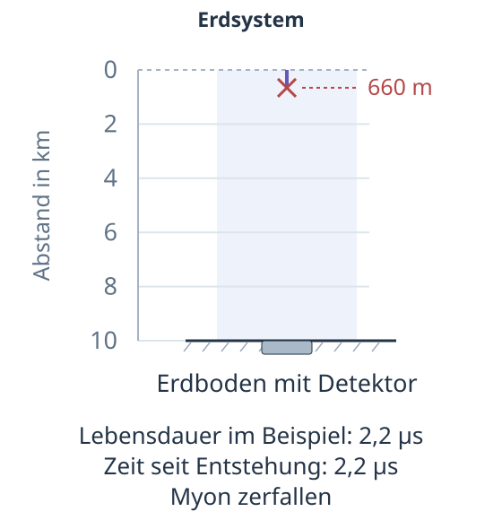{fig-alt="Beispielmyon ohne Zeitdilatation. Seine Flugstrecke von 660 Metern bis zum angenommenen Zerfall ist viel kürzer als die Entstehungshöhe von 10 Kilometern."}
:::

Animation eines Myons ohne Zeitdilatation im Erdsystem. Das Myon bewegt sich nach unten und zerfällt bei der für dieses Beispiel angenommenen Lebensdauer nach etwa $660\,\mathrm{m}$. Die Anzeigen geben die angenommene Lebensdauer und die Zeit seit der Entstehung an.
::::

</details>

Berücksichtige nun die Zeitdilatation. Für diesen Teil der Aufgabe benötigst du folgende aus dem Kapitel bekannte Formel.

::: {.mp-formula-repeat}
$$
\gamma = \frac{1}{\sqrt{1-\frac{v^2}{c^2}}}
$$

([-@eq-umbau-lorentzfaktor])
:::

2. <u>Berechne</u> den [Lorentzfaktor](#eq-umbau-lorentzfaktor) $\gamma$ und damit die Lebensdauer des Beispielmyons im Erdsystem, $\Delta t_\mathrm{E}=\gamma\,\Delta t_{0,\mathrm{M}}$.
3. <u>Berechne</u> die Strecke $d_\mathrm{E}=v\,\Delta t_\mathrm{E}$, die das Myon während dieser Lebensdauer bei gleichbleibender Geschwindigkeit zurücklegen könnte.
4. <u>Erkläre</u> durch Vergleich von $d_\mathrm{E}$ mit der Entstehungshöhe, warum das Beispielmyon den Erdboden erreicht.

<details class="mp-details">
<summary>Mögliche Lösung anzeigen</summary>

2. Für das bewegte Myon ist die Lebensdauer im Erdsystem um den Lorentzfaktor vergrößert. Es gilt

   $$
   \gamma=\frac{1}{\sqrt{1-0{,}998^2}}\approx15{,}8
   $$

   und damit

   $$
   \begin{aligned}
   \Delta t_\mathrm{E}&=\gamma\,\Delta t_{0,\mathrm{M}}\\
   &\approx35\,\mathrm{\mu s}.
   \end{aligned}
   $$

   Bei dieser Geschwindigkeit hat die mittlere Lebensdauer vieler Myonen im Erdsystem ebenfalls diesen Wert.

3. Während dieser Lebensdauer könnte das Beispielmyon bei gleichbleibender Geschwindigkeit die Strecke

   $$
   \begin{aligned}
   d_\mathrm{E}&=v\,\Delta t_\mathrm{E}\\
   &\approx10{,}4\,\mathrm{km}
   \end{aligned}
   $$

   zurücklegen. Für diese Rechnung wurde der ungerundete Zwischenwert der Lebensdauer verwendet.

4. Die berechnete Strecke ist größer als die Entstehungshöhe von ungefähr $10\,\mathrm{km}$. Das Beispielmyon erreicht deshalb den Erdboden vor seinem angenommenen Zerfall. @fig-umbau-myon-relativistisch zeigt seine Ankunft. Das Beispiel veranschaulicht, wie die Zeitdilatation den Nachweis von Myonen am Erdboden verständlich macht. Es bedeutet nicht, dass jedes Myon den Boden erreicht.


:::: {#fig-umbau-myon-relativistisch}
::: {.content-visible when-format="html"}
```{=html}
<div class="srt-workbook-stage" data-srt-animation="myon-relativistisch" data-srt-viewbox-w="560" data-srt-viewbox-h="470" data-srt-motion-control data-srt-label="Beispielmyon im Erdsystem mit Zeitdilatation. Es erreicht den 10 Kilometer tiefer liegenden Erdboden nach etwa 33,4 Mikrosekunden, vor seiner angenommenen Zerfallszeit von 34,8 Mikrosekunden im Erdsystem."></div>
```
:::

::: {.content-visible unless-format="html"}
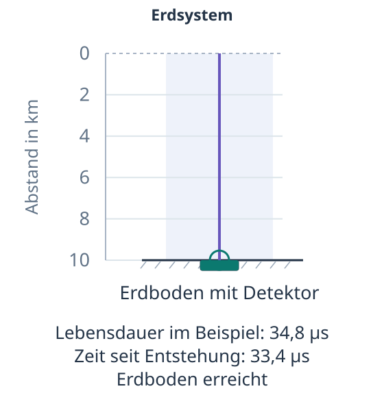{fig-alt="Das Beispielmyon erreicht mit Zeitdilatation den Erdboden nach 10 Kilometern Flugstrecke, bevor seine angenommene Lebensdauer im Erdsystem verstrichen ist."}
:::

Animation eines Myons mit Zeitdilatation im Erdsystem. Das Beispielmyon erreicht den Detektor vor seinem angenommenen Zerfall. Die Anzeigen geben die angenommene Lebensdauer und die Zeit seit der Entstehung an. Beide Myonenanimationen verwenden denselben Maßstab für Strecke und Wiedergabezeit.
::::

</details>
::::::

::: {.column-margin .mp-kastennotiz}
Berechnungsaufgaben geben dir ein Gefühl für Größenverhältnisse und üben den Umgang mit physikalischen Formeln. Bearbeite sie schriftlich. Zur Rechnung gehört auch oft, das Ergebnis physikalisch zu deuten.
:::

---

## Längenkontraktion

::: {.mp-goal-strip}
Du <u>erklärst</u> die Längenkontraktion durch den Vergleich von Erd- und Myonsystem.

Du <u>erläuterst</u>, wie die Beziehung $L = L_0 / \gamma$ aus der Zeitdilatation folgt.
:::

Im Erdsystem erklärt die Zeitdilatation, dass unser Beispielmyon den Boden vor seinem Zerfall erreicht. Nun wechseln wir das Bezugssystem. Wenn du gedanklich auf dem Myon mitreitest, ruhst du selbst. Nicht das Myon rast dann auf die Erde zu, sondern die Erde mitsamt Atmosphäre rast dir mit $v=0{,}998\,c$ entgegen.

Im Erdsystem beträgt der Abstand zwischen Entstehungsort und Boden etwa $L_0\approx10\,\mathrm{km}$. Der Entstehungsort in der Atmosphäre und der darunterliegende Punkt am Boden ruhen in diesem Bezugssystem. Ihr hier gemessener Abstand ist die Eigenlänge $L_0$ der betrachteten Strecke.[Eigenlänge]{.column-margin .mp-randbegriff}

Nehmen wir zunächst an, dass dieser Abstand auch im Myonsystem zehn Kilometer beträgt. Für unser Beispielmyon gilt weiterhin die angenommene Eigenlebensdauer von $2{,}2\,\mathrm{\mu s}$. In dieser Zeit müsste der Boden die gesamte Strecke bis zum ruhenden Myon zurücklegen. Bei $v=0{,}998\,c$ reicht die Zeit dafür jedoch nicht aus. Das Myon würde zerfallen, bevor der Boden es erreicht. Das widerspricht dem Ergebnis im Erdsystem, denn das Zusammentreffen von Myon und Boden muss in beiden Bezugssystemen stattfinden.

@fig-umbau-myon-system-unkontrahiert zeigt dieses Ausgangsproblem im Myonsystem. Das Myon ruht, Erde und Atmosphäre bewegen sich auf es zu, aber für den anfänglichen Abstand zwischen Myon und Boden nehmen wir weiterhin zehn Kilometer an.

:::: {#fig-umbau-myon-system-unkontrahiert}
::: {.content-visible when-format="html"}
```{=html}
<div class="srt-workbook-stage" data-srt-animation="ausgangsproblem" data-srt-viewbox-w="560" data-srt-viewbox-h="470" data-srt-motion-control data-srt-label="Ruhendes Beispielmyon ohne Längenkontraktion. Der zunächst 10 Kilometer entfernte Boden bewegt sich während 2,2 Mikrosekunden um 659 Meter auf das Myon zu und erreicht es vor dem angenommenen Zerfall nicht."></div>
```
:::

::: {.content-visible unless-format="html"}
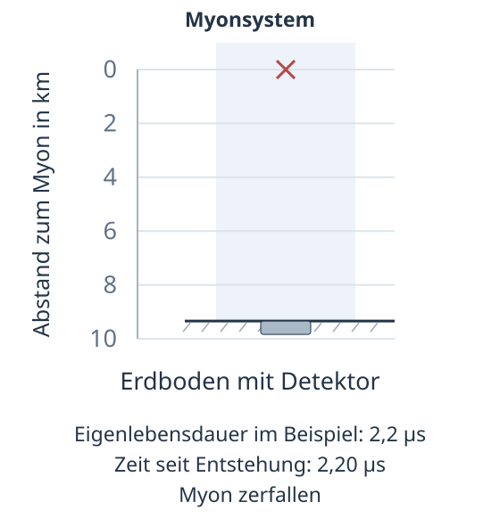{fig-alt="Ruhendes Beispielmyon ohne Längenkontraktion. Der zunächst 10 Kilometer entfernte Boden bewegt sich während 2,2 Mikrosekunden um 659 Meter auf das Myon zu und erreicht es vor dem angenommenen Zerfall nicht."}
:::

Animation im Myonsystem unter der Annahme einer unverkürzten Strecke von zehn Kilometern. Der Boden bewegt sich auf das ruhende Beispielmyon zu.
::::

Während der angenommenen Eigenlebensdauer kann der Boden nur die Strecke

$$
d_\mathrm{M} = v\,\Delta t_{0,\mathrm{M}} \approx 0{,}998 \cdot 3{,}0 \cdot 10^8\,\mathrm{\frac{m}{s}} \cdot 2{,}2 \cdot 10^{-6}\,\mathrm{s} \approx 0{,}66\,\mathrm{km}
$$

zurücklegen. Das sind nur etwa $0{,}66\,\mathrm{km}$, viel weniger als $10\,\mathrm{km}$. Mit dem angenommenen Abstand von zehn Kilometern könnte der Boden das Myon also nicht rechtzeitig erreichen. Die im Erdsystem gemessenen zehn Kilometer entsprechen im Myonsystem einem kürzeren Abstand. Diese Verkürzung einer bewegten Strecke heißt Längenkontraktion. Der Boden hat damit einen kürzeren Weg bis zum ruhenden Myon zurückzulegen und erreicht es vor seinem Zerfall.

Wie lang die Strecke im Myonsystem ist, lässt sich aus der Zeitdilatation und der Beziehung zwischen Weg, Geschwindigkeit und Zeit ableiten.

Die Flugzeit von der Entstehung des Myons bis zu seiner Ankunft am Boden bezeichnen wir im Erdsystem mit $\Delta t_\mathrm{F}$, im Myonsystem mit $\Delta t_{0,\mathrm{F}}$. Der Index $\mathrm{F}$ steht für Flugzeit, die $0$ kennzeichnet die Eigenzeit. Die zuvor angenommene Eigenlebensdauer $\Delta t_{0,\mathrm{M}}$ reicht dagegen von der Entstehung bis zum Zerfall.

Für die beiden Flugzeiten gilt die bereits hergeleitete Zeitdilatation aus @eq-umbau-zeitdilatation.

$$
\Delta t_\mathrm{F} = \gamma\,\Delta t_{0,\mathrm{F}} \tag{I}
$$

Im Erdsystem legt das Myon während der Zeit $\Delta t_\mathrm{F}$ die Strecke vom Entstehungsort bis zum Boden zurück. Deren Länge ist die Eigenlänge $L_0$, weil beide Endpunkte im Erdsystem ruhen.

$$
L_0 = v\,\Delta t_\mathrm{F}. \tag{II}
$$

Im Myonsystem ruht das Myon. Der Boden bewegt sich mit der Geschwindigkeit $v$ auf es zu und erreicht es nach der Eigenzeit $\Delta t_{0,\mathrm{F}}$. Sein anfänglicher Abstand zum Myon beträgt daher

$$
L = v\,\Delta t_{0,\mathrm{F}}. \tag{III}
$$

Setzen wir (I) in (II) ein, erhalten wir $L_0 = v\,\gamma\,\Delta t_{0,\mathrm{F}}$.

Nach (III) ist $v\,\Delta t_{0,\mathrm{F}} = L$. Damit folgt $L_0 = \gamma\,L$. Durch Division durch $\gamma$ erhalten wir die Beziehung zwischen der im Myonsystem gemessenen Länge $L$ und der Eigenlänge $L_0$.

$$
L = \frac{L_0}{\gamma}.
$$ {#eq-umbau-laengenkontraktion}

Bei der Längenmessung einer bewegten Strecke werden die Positionen ihrer beiden Endpunkte im messenden Bezugssystem gleichzeitig bestimmt.

Bewegte Strecken sind in Bewegungsrichtung verkürzt. Längen senkrecht zur Bewegungsrichtung bleiben unverändert.

Für unser Beispiel beträgt der im Myonsystem gemessene Abstand zwischen Entstehungsort und Boden

$$
L = \frac{L_0}{\gamma} \approx \frac{10\,\mathrm{km}}{15{,}8} \approx 0{,}63\,\mathrm{km}.
$$

@fig-umbau-myon-system-kontrahiert zeigt dieselbe Situation nun mit kontrahierter Atmosphärenstrecke.

:::: {#fig-umbau-myon-system-kontrahiert}
::: {.content-visible when-format="html"}
```{=html}
<div class="srt-workbook-stage" data-srt-animation="myon-system-kontrahiert" data-srt-viewbox-w="560" data-srt-viewbox-h="470" data-srt-motion-control data-srt-label="Ruhendes Beispielmyon mit Längenkontraktion. Der zunächst 632 Meter entfernte Boden erreicht es nach etwa 2,11 Mikrosekunden, vor seiner angenommenen Eigenlebensdauer von 2,2 Mikrosekunden."></div>
```
:::

::: {.content-visible unless-format="html"}
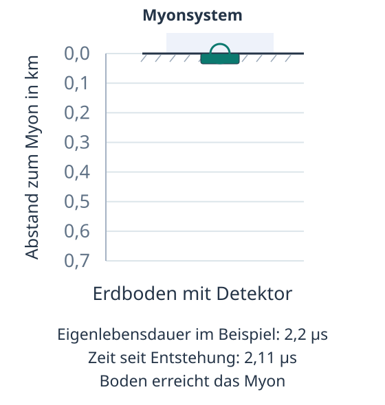{fig-alt="Ruhendes Beispielmyon mit Längenkontraktion. Der zunächst 632 Meter entfernte Boden erreicht es nach etwa 2,11 Mikrosekunden, vor seiner angenommenen Eigenlebensdauer von 2,2 Mikrosekunden."}
:::

Animation im Myonsystem mit Längenkontraktion. Der Boden erreicht das ruhende Beispielmyon vor dessen Zerfall. Vergrößerter Ausschnitt mit einer Abstandsskala von $0$ bis $0{,}7\,\mathrm{km}$. Beide Animationen im Myonsystem zeigen eine Mikrosekunde in $1{,}7$ Sekunden Wiedergabezeit, zehnmal stärker verlangsamt als die Animationen im Erdsystem.
::::

Der Abstand von rund $0{,}63\,\mathrm{km}$ ist kleiner als die Strecke $d_\mathrm{M}\approx0{,}66\,\mathrm{km}$, die der Boden während der angenommenen Eigenlebensdauer des Beispielmyons zurücklegen könnte. Deshalb erreicht der Boden das Myon vor dessen Zerfall.

Zeitdilatation und Längenkontraktion führen zu übereinstimmenden Beschreibungen derselben Ereignisse, der Entstehung des Myons und seiner Ankunft am Boden. Dass unser Beispielmyon den Erdboden erreicht, erklären wir im Erdsystem mit seiner verlängerten Lebensdauer und im Myonsystem mit der verkürzten Länge der Strecke.

::: {.mp-box .mp-task}
<span class="mp-task-kind mp-task-kind-think" aria-label="Denkcheck">
  
  Denkcheck
</span>

Ein Raumschiff hat in seinem Ruhesystem die Länge $L_0 = 60\,\mathrm{m}$ und die Breite $b_0 = 20\,\mathrm{m}$. Es fliegt in Längsrichtung mit einer konstanten Geschwindigkeit an einer Raumstation vorbei. Dieser Relativgeschwindigkeit entspricht der Lorentzfaktor $\gamma = 2$.

1. <u>Berechne</u> die Länge $L$, die die Station misst.
2. <u>Begründe</u>, welche Breite die Station misst.
:::

<details class="mp-details">
<summary>Mögliche Lösung anzeigen</summary>

1. Die Länge des Raumschiffs liegt parallel zur Bewegungsrichtung. Die Station misst daher

   $$
   L = \frac{L_0}{\gamma} = \frac{60\,\mathrm{m}}{2} = 30\,\mathrm{m}.
   $$

2. Längenkontraktion betrifft nur Abmessungen parallel zur Bewegungsrichtung. Die Breite des Raumschiffs liegt senkrecht dazu. Deshalb bleibt sie unverändert, und die Station misst $b = b_0 = 20\,\mathrm{m}$.

</details>

---

## Dopplerverschiebung des Lichts

::: {.mp-goal-strip}
Du <u>erklärst</u>, wie bei Annäherung und Entfernung einer Lichtquelle Blau- und Rotverschiebung entstehen.

Du <u>leitest</u> die Beziehung zwischen der Eigenwellenlänge $\lambda_0$, der empfangenen Wellenlänge $\lambda$ und der Relativgeschwindigkeit $v$ <u>her</u>.

Du <u>deutest</u> die Verschiebung einer Spektrallinie und <u>berechnest</u> daraus die Relativgeschwindigkeit bei direkter Annäherung oder Entfernung.
:::

Die Spektrallinien ferner Galaxien erreichen uns meist mit größeren Wellenlängen, als wir für dieselben atomaren Übergänge im Labor messen. Diese Rotverschiebung ist ein Hinweis auf die Expansion des Universums. Während das Licht unterwegs ist, vergrößern sich die Abstände zwischen weit entfernten Galaxien und seine Wellenlänge wird gedehnt [@bennett2017cosmic, S. 615 und 620--621]. Auch eine Relativbewegung zwischen einer Lichtquelle und einer Person, die ihr Licht empfängt, kann die gemessene Wellenlänge verändern. Diese Dopplerverschiebung untersuchst du hier.

Bei einem vorbeifahrenden Krankenwagen kannst du eine Änderung der Tonhöhe hören. Die beiden Töne der Sirene klingen bei der Annäherung höher als nach der Vorbeifahrt.

Die Tonhöhe hängt von der Frequenz der Schallwelle ab. Je mehr Wellenberge pro Sekunde dein Ohr erreichen, desto höher klingt der Ton. Der Abstand zweier aufeinanderfolgender Wellenberge ist die Wellenlänge.[Frequenz und Wellenlänge]{.column-margin .mp-randbegriff} In @fig-umbau-doppler-schall markieren Kreislinien die Ausbreitung ausgewählter Wellenberge. Diese Linien stellen Wellenfronten dar.

Betrachten wir einen der beiden Sirenentöne. Bewegt sich die Schallquelle auf dich zu, entsteht jede neue Wellenfront ein Stück näher an der vorherigen. Vor der Quelle sind die Abstände deshalb kleiner. Pro Sekunde erreichen dich mehr Wellenberge, die Frequenz steigt und der Ton klingt höher. Hinter der sich entfernenden Quelle sind die Abstände größer. Dich erreichen weniger Wellenberge pro Sekunde, die Frequenz sinkt und der Ton klingt tiefer.

@fig-umbau-doppler-schall zeigt diesen Vorgang bei einem vorbeifahrenden Krankenwagen. Über das Lautsprechersymbol kannst du den Ton am Standort der Person einschalten.

::::: {#fig-umbau-doppler-schall}
::: {.content-visible when-format="html"}
```{=html}
<div class="srt-workbook-stage" data-srt-animation="doppler-allgemein" data-srt-viewbox-w="640" data-srt-viewbox-h="330" data-srt-motion-control data-srt-label="Ein Krankenwagen fährt an einer am Straßenrand stehenden Person vorbei. Kreislinien zeigen ausgewählte Schallwellenfronten in ruhender Luft."></div>
```
:::

::: {.content-visible unless-format="html"}
::: {.srt-workbook-fallback}
Ein Krankenwagen fährt an einer am Straßenrand stehenden Person vorbei. Kreislinien zeigen ausgewählte Schallwellenfronten in ruhender Luft.
:::
:::

Animation zum Schall-Dopplereffekt. Ein Krankenwagen fährt an einer Person vorbei. Kreislinien zeigen ausgewählte Wellenfronten.
:::::

Auch bei Licht hängt die empfangene Wellenlänge von der Relativbewegung ab. Nähert sich eine Lichtquelle direkt, messen wir kürzere Wellenlängen. Diese Verschiebung heißt Blauverschiebung. Entfernt sich die Quelle, messen wir längere Wellenlängen und sprechen von Rotverschiebung.[Rot- und Blauverschiebung]{.column-margin .mp-randbegriff} Die Namen bezeichnen die Richtung der Verschiebung im Spektrum.

Die Schallanalogie macht anschaulich, wie durch Bewegung kleinere oder größere Wellenabstände entstehen. Schall breitet sich in einem Medium wie Luft aus. Licht breitet sich auch im Vakuum aus. Für die Dopplerverschiebung von Licht müssen wir zusätzlich die Zeitdilatation berücksichtigen.

Jetzt leitest du her, wie die empfangene Wellenlänge von der Relativgeschwindigkeit abhängt. Im Folgenden bewegt sich die Lichtquelle mit gleichbleibender Geschwindigkeit direkt auf die empfangende Person zu oder von ihr weg.

:::: {#aufgabe-doppler-blau .mp-box .mp-task}
<span class="mp-task-kind mp-task-kind-derive" aria-label="Herleitung">
  
  Herleitung
</span>

Eine Lichtquelle bewegt sich mit der Geschwindigkeit $v$ auf eine Person zu, die ihr Licht empfängt. Wir nennen das Ruhesystem dieser Person Empfangssystem. Gesucht ist die dort gemessene Wellenlänge $\lambda$.

**(I) Eigenwellenlänge.**

Die Lichtquelle sendet fortlaufend eine Welle aus. Wir betrachten zwei aufeinanderfolgende Wellenberge. Im Ruhesystem der Lichtquelle verlässt der zweite Wellenberg die Quelle um $\Delta t_0$ später als der erste. Beide Vorgänge finden dort am selben Ort statt. $\Delta t_0$ ist deshalb die Eigenzeit zwischen diesen Ereignissen.

Wenn der zweite Wellenberg die Quelle verlässt, hat der erste die Strecke $c\,\Delta t_0$ zurückgelegt. Ihr Abstand ist die im Ruhesystem der Lichtquelle gemessene Wellenlänge. Wir bezeichnen sie als Eigenwellenlänge $\lambda_0$.

$$
\lambda_0 = c\,\Delta t_0. \tag{I}
$$

@fig-umbau-doppler-quelle zeigt diesen Moment im Ruhesystem der Lichtquelle. Die beiden Wellenberge sind als Wellenfront 1 und 2 markiert.

::::: {#fig-umbau-doppler-quelle}
::: {.content-visible when-format="html"}
```{=html}
<div class="srt-workbook-stage" data-srt-animation="doppler-bzg-quelle" data-srt-viewbox-w="640" data-srt-viewbox-h="250" data-srt-label="Ruhesystem der Lichtquelle. Wellenfront 2 entsteht gerade an der Lichtquelle. Wellenfront 1 ist um c Delta t null vorausgelaufen. Ihr Abstand ist Lambda null."></div>
```
:::

::: {.content-visible unless-format="html"}
::: {.srt-workbook-fallback}
Ruhesystem der Lichtquelle. Wellenfront 2 wird gerade ausgesendet. Wellenfront 1 ist um c Delta t null vorausgelaufen. Ihr Abstand ist Lambda null.
:::
:::

Skizze im Ruhesystem der Lichtquelle. Wellenfront 2 entsteht gerade an der Quelle. Der Kreisbogen zeigt einen Ausschnitt von Wellenfront 1. Ihr Abstand zur Quelle beträgt $\lambda_0=c\,\Delta t_0$.
:::::

**(II) Wellenabstand im Empfangssystem.**

Im Empfangssystem bewegt sich die Lichtquelle. Die Zeitdauer zwischen denselben beiden Vorgängen an der Quelle bezeichnen wir in diesem System mit $\Delta t$. Licht breitet sich auch hier mit der Geschwindigkeit $c$ aus. Während dieser Zeit läuft die erste Wellenfront um $c\,\Delta t$ weiter. Die Lichtquelle rückt um $v\,\Delta t$ nach.

Wenn die zweite Wellenfront an der Quelle entsteht, beträgt ihr Abstand zur ersten Wellenfront die im Empfangssystem gemessene Wellenlänge:

$$
\lambda = c\,\Delta t - v\,\Delta t = (c - v)\,\Delta t. \tag{II}
$$

@fig-umbau-doppler-annaeherung zeigt die beiden zurückgelegten Strecken und den daraus entstehenden Wellenabstand. Beide Wellenfronten sind zum selben Zeitpunkt im Empfangssystem dargestellt.

::::: {#fig-umbau-doppler-annaeherung}
::: {.content-visible when-format="html"}
```{=html}
<div class="srt-workbook-stage" data-srt-animation="doppler-bzg-beobachter" data-srt-viewbox-w="640" data-srt-viewbox-h="290" data-srt-label="Ruhesystem der empfangenden Person. Die Lichtquelle ist seit der ersten Aussendung um v Delta t nach rechts gerückt. Wellenfront 1 ist um c Delta t nach rechts gelaufen. Wellenfront 2 wird gerade ausgesendet."></div>
```
:::

::: {.content-visible unless-format="html"}
::: {.srt-workbook-fallback}
Ruhesystem der empfangenden Person. Die Lichtquelle ist seit der ersten Aussendung um v Delta t nach rechts gerückt. Wellenfront 1 ist um c Delta t nach rechts gelaufen. Wellenfront 2 wird gerade ausgesendet.
:::
:::

Skizze im Empfangssystem bei Annäherung. Der offene Punkt markiert den Entstehungsort von Wellenfront 1. Sie ist um $c\,\Delta t$ weitergelaufen, die Quelle um $v\,\Delta t$. Wellenfront 2 entsteht gerade an der Quelle.
:::::

**(III) Zeitdilatation.**

Für die beiden Zeitdauern gilt die bereits hergeleitete Zeitdilatation aus @eq-umbau-zeitdilatation.

$$
\Delta t = \frac{\Delta t_0}{\sqrt{1 - \frac{v^2}{c^2}}}. \tag{III}
$$

<u>Leite</u> mithilfe der drei Gleichungen (I), (II) und (III) eine Beziehung zwischen der empfangenen Wellenlänge $\lambda$ und der Eigenwellenlänge $\lambda_0$ in Abhängigkeit von $v$ <u>her</u>.

Wähle deinen Einstieg.

::: {.panel-tabset}

### Ganz allein

Bearbeite die Herleitung ohne weitere Hinweise. Du kannst während der Rechnung jederzeit eine der beiden Hilfestufen öffnen.

### Mit Hinweisen

- Setze zuerst Gleichung (III) in Gleichung (II) ein.
- Erweitere den entstehenden Bruch mit $c$. Ziehe anschließend das $c$ im Nenner unter die Wurzel.
- Danach kannst du Gleichung (I) verwenden, um $c\,\Delta t_0$ zu ersetzen.
- Zerlege $c^2-v^2$ mit der dritten binomischen Formel in $(c-v)(c+v)$.
- Schreibe auch den Faktor $c-v$ im Zähler als Wurzel. Anschließend kannst du die Wurzeln zusammenfassen und kürzen.

### Schritt für Schritt

1. Setze die Zeitdilatation aus Gleichung (III) in Gleichung (II) ein.

   <details class="mp-details mp-step-check">
   <summary>Zwischenergebnis anzeigen</summary>

   $$
   \lambda=\frac{(c-v)\,\Delta t_0}{\sqrt{1-\frac{v^2}{c^2}}}.
   $$

   </details>

2. Erweitere den Bruch mit $c$. Multipliziere dazu Zähler und Nenner mit $c$.

   <details class="mp-details mp-step-check">
   <summary>Zwischenergebnis anzeigen</summary>

   $$
   \lambda=\frac{c\,\Delta t_0\,(c-v)}{c\sqrt{1-\frac{v^2}{c^2}}}.
   $$

   </details>

3. Ziehe das $c$ im Nenner unter die Wurzel. Als Faktor unter der Wurzel wird daraus $c^2$. Vereinfache den Ausdruck.

   <details class="mp-details mp-step-check">
   <summary>Zwischenergebnis anzeigen</summary>

   $$
   \begin{aligned}
   \lambda&=\frac{c\,\Delta t_0\,(c-v)}{\sqrt{c^2\left(1-\frac{v^2}{c^2}\right)}}\\[6pt]
   &=\frac{c\,\Delta t_0\,(c-v)}{\sqrt{c^2-v^2}}.
   \end{aligned}
   $$

   </details>

4. Ersetze $c\,\Delta t_0$ mithilfe von Gleichung (I) durch $\lambda_0$.

   <details class="mp-details mp-step-check">
   <summary>Zwischenergebnis anzeigen</summary>

   $$
   \lambda=\frac{(c-v)\,\lambda_0}{\sqrt{c^2-v^2}}.
   $$

   </details>

5. Zerlege den Ausdruck unter der Wurzel mit der dritten binomischen Formel.

   <details class="mp-details mp-step-check">
   <summary>Zwischenergebnis anzeigen</summary>

   $$
   \lambda=\frac{(c-v)\,\lambda_0}{\sqrt{(c-v)(c+v)}}.
   $$

   </details>

6. Schreibe $c-v$ im Zähler als $\sqrt{(c-v)^2}$. Das ist möglich, weil $v<c$ und damit $c-v>0$ gilt. Fasse die beiden Wurzeln zusammen und kürze den gemeinsamen Faktor $c-v$.

   <details class="mp-details mp-step-check">
   <summary>Zwischenergebnis anzeigen</summary>

   $$
   \begin{aligned}
   \lambda&=\sqrt{\frac{(c-v)^2}{(c-v)(c+v)}}\,\lambda_0\\[6pt]
   &=\sqrt{\frac{c-v}{c+v}}\,\lambda_0.
   \end{aligned}
   $$

   </details>

:::

<details class="mp-details">
<summary>Kontrollrechnung anzeigen</summary>

$$
\begin{aligned}
\lambda &= (c-v)\,\Delta t
  && \Big|\ \Delta t = \frac{\Delta t_0}{\sqrt{1-\frac{v^2}{c^2}}} \\[10pt]
\lambda &= (c-v)\,\frac{\Delta t_0}{\sqrt{1-\frac{v^2}{c^2}}} \\[10pt]
\lambda &= \frac{(c-v)\,\Delta t_0}{\sqrt{1-\frac{v^2}{c^2}}}
  && \Big|\ \text{mit } c \text{ erweitern} \\[10pt]
\lambda &= \frac{c\,\Delta t_0\,(c-v)}{c\,\sqrt{1-\frac{v^2}{c^2}}}
  && \Big|\ c \text{ unter die Wurzel ziehen} \\[10pt]
\lambda &= \frac{c\,\Delta t_0\,(c-v)}{\sqrt{c^2\left(1-\frac{v^2}{c^2}\right)}} \\[10pt]
\lambda &= \frac{c\,\Delta t_0\,(c-v)}{\sqrt{c^2-v^2}}
  && \Big|\ c\,\Delta t_0 = \lambda_0 \\[10pt]
\lambda &= \frac{(c-v)\,\lambda_0}{\sqrt{c^2-v^2}}
  && \Big|\ c^2-v^2=(c-v)(c+v) \\[10pt]
\lambda &= \frac{(c-v)\,\lambda_0}{\sqrt{(c-v)(c+v)}} \\[10pt]
\lambda &= \frac{\sqrt{(c-v)^2}}{\sqrt{(c-v)(c+v)}}\,\lambda_0
  && \Big|\ \text{als eine Wurzel schreiben und kürzen} \\[10pt]
\lambda &= \sqrt{\frac{(c-v)^2}{(c-v)(c+v)}}\,\lambda_0 \\[10pt]
\lambda &= \sqrt{\frac{c-v}{c+v}}\,\lambda_0
\end{aligned}
$$

</details>

Als Ergebnis erhältst du

$$
\lambda = \sqrt{\frac{c-v}{c+v}}\,\lambda_0
$$ {#eq-umbau-doppler}

Für eine sich nähernde Quelle ist der Wurzelfaktor kleiner als 1. Es gilt daher $\lambda<\lambda_0$. Das Licht ist zu kürzeren Wellenlängen verschoben, also ins Blaue.
::::

Entfernt sich die Lichtquelle stattdessen, gilt für die empfangene Wellenlänge:

$$
\lambda = \sqrt{\frac{c+v}{c-v}}\,\lambda_0
$$ {#eq-umbau-doppler-rot}

Die Wellenlänge ist größer als $\lambda_0$, das Licht ist rotverschoben. Diese Formel kannst du in der [Übung zur Rotverschiebung](#aufgabe-doppler-rot) unter „Sichern und anwenden“ selbst herleiten.

Eine Spektrallinie markiert eine bestimmte Wellenlänge im Spektrum einer Lichtquelle. In @fig-umbau-doppler-spektrum vergleichst du die Lage derselben Linie im Ruhesystem der Quelle und beim Empfang. Verändere die Relativgeschwindigkeit und wechsle zwischen Annäherung und Entfernung. Darunter siehst du die bewegte Lichtquelle und ihre Wellenfronten im Empfangssystem.

::::: {#fig-umbau-doppler-spektrum}
::: {.content-visible when-format="html"}
```{=html}
<div class="srt-workbook-stage" data-srt-animation="doppler" data-srt-viewbox-w="640" data-srt-viewbox-h="350" data-srt-motion-control data-srt-label="Vergleich einer Spektrallinie von 500 Nanometern im Ruhesystem der Quelle mit der beim Empfang gemessenen Wellenlänge. Bewegungsrichtung und Relativgeschwindigkeit sind einstellbar. Darunter bewegt sich die Lichtquelle, Kreislinien zeigen ausgewählte Wellenfronten im Empfangssystem."></div>
```
:::

::: {.content-visible unless-format="html"}
::: {.srt-workbook-fallback}
Vergleich einer Spektrallinie von 500 Nanometern im Ruhesystem der Quelle mit der beim Empfang gemessenen Wellenlänge. Bewegungsrichtung und Relativgeschwindigkeit sind einstellbar. Darunter bewegt sich die Lichtquelle, Kreislinien zeigen ausgewählte Wellenfronten im Empfangssystem.
:::
:::

Simulation zur Dopplerverschiebung mit $\lambda_0=500\,\mathrm{nm}$ nach @eq-umbau-doppler und @eq-umbau-doppler-rot. Der sichtbare Bereich ist näherungsweise von $380$ bis $780\,\mathrm{nm}$ farbig markiert. Die Kreislinien zeigen ausgewählte Wellenfronten im Empfangssystem. Ihre Abstände berücksichtigen die Zeitdilatation.
:::::

::: {#aufgabe-doppler-denkcheck .mp-box .mp-task}
<span class="mp-task-kind mp-task-kind-think" aria-label="Denkcheck">
  
  Denkcheck
</span>

Eine Spektrallinie hat im Ruhesystem der Quelle die Wellenlänge $\lambda_0 = 500\,\mathrm{nm}$. Durch den Dopplereffekt ist diese Linie beim Empfang auf $\lambda = 530\,\mathrm{nm}$ verschoben.

Für diese Aufgabe benötigst du folgende aus dem Kapitel bekannte Formeln.

::: {.mp-formula-repeat}
$$
\lambda = \sqrt{\frac{c-v}{c+v}}\,\lambda_0
$$

([-@eq-umbau-doppler])
:::

::: {.mp-formula-repeat}
$$
\lambda = \sqrt{\frac{c+v}{c-v}}\,\lambda_0
$$

([-@eq-umbau-doppler-rot])
:::

1. <u>Bestimme</u>, ob eine Rot- oder Blauverschiebung vorliegt, und <u>begründe</u> deine Zuordnung.
2. <u>Begründe</u>, ob sich die Quelle auf uns zu oder von uns weg bewegt.

3. <span class="mp-task-kind mp-task-kind-calculate" aria-label="Berechnung">Berechnung</span> <u>Berechne</u> die Relativgeschwindigkeit $v$ bei direkter Annäherung oder Entfernung. Wähle dafür die passende der beiden obenstehenden Formeln. Gib $v$ als Anteil von $c$ und in $\mathrm{m/s}$ an. Verwende $c \approx 3{,}0\cdot10^8\,\mathrm{m/s}$.
:::

<details class="mp-details">
<summary>Mögliche Lösung anzeigen</summary>

1. Es gilt $\lambda>\lambda_0$. Die empfangene Wellenlänge ist größer als die Eigenwellenlänge. Es handelt sich um eine Rotverschiebung.
2. Bei einer sich entfernenden Lichtquelle sind die Abstände aufeinanderfolgender Wellenfronten im Empfangssystem größer als im Ruhesystem der Quelle. Die gemessene Rotverschiebung deutet daher auf eine Bewegung von uns weg.

3. Wir verwenden die Formel für die Rotverschiebung aus @eq-umbau-doppler-rot und quadrieren zunächst:

   $$
   \left(\frac{\lambda}{\lambda_0}\right)^2=\frac{c+v}{c-v}.
   $$

   Nach Multiplikation mit $\lambda_0^2(c-v)$ erhalten wir

   $$
   \lambda^2(c-v)=\lambda_0^2(c+v).
   $$

   Wir fassen die Terme mit $v$ zusammen und lösen nach $v$ auf:

   $$
   c(\lambda^2-\lambda_0^2)=v(\lambda^2+\lambda_0^2).
   $$

   $$
   v=c\,\frac{\lambda^2-\lambda_0^2}{\lambda^2+\lambda_0^2}.
   $$

   Mit den gegebenen Wellenlängen folgt

   $$
   v=c\,\frac{530^2-500^2}{530^2+500^2}
   \approx 0{,}0582\,c.
   $$

   Die gleichen Einheiten der quadrierten Wellenlängen kürzen sich im Bruch. Die Geschwindigkeit beträgt etwa $5{,}82\,\%$ der Lichtgeschwindigkeit. In Metern pro Sekunde ergibt sich

   $$
   \begin{aligned}
   v&\approx 0{,}0582\cdot 3{,}0\cdot10^8\,\mathrm{m/s}\\[4pt]
   &\approx 1{,}75\cdot10^7\,\mathrm{m/s}.
   \end{aligned}
   $$

</details>

---


## Sichern und anwenden

Zum Abschluss sicherst du die Grundideen des Kapitels mithilfe des Selbstchecks. Anschließend kannst du dein Wissen in den Übungsaufgaben anwenden.

::: {.mp-box .mp-task}
<span class="mp-task-kind mp-task-kind-selfcheck" aria-label="Selbstcheck">
  
  Selbstcheck
</span>

<u>Erkläre</u> das Kapitel zusammenhängend in deiner eigenen Sprache, so wie du es jemandem aus deinem Kurs beibringen würdest. Nutze dafür die Lernziele unten: Wer deine Erklärung liest oder hört, soll daran erkennen, dass du jedes dieser Ziele erreicht hast. Schreibe deine Erklärung auf und sammle sie an einem Ort. So entsteht Kapitel für Kapitel deine eigene Zusammenfassung, auf die du zurückgreifen kannst. Wo ein Lernziel eine Herleitung oder eine Rechnung nennt, führe sie aus.

Ist jemand aus deinem Kurs da, nutze die Gelegenheit und erkläre im Gespräch. Skizziere dabei, was sich zeichnen lässt. Achte auf Rückfragen. Sie zeigen dir, wo deine Erklärung noch hakt.

- **Bezugssysteme:** Du <u>beschreibst</u> Ruhe und Bewegung in verschiedenen Bezugssystemen. Du <u>ordnest</u> Bezugssysteme als Inertialsysteme oder Nicht-Inertialsysteme ein und <u>begründest</u> deine Zuordnung unter anderem mit dem ersten Newtonschen Axiom.
- **Michelson-Morley:** Du <u>beschreibst</u> den Aufbau eines Michelson-Interferometers und <u>erläuterst</u>, wie damit ein Ätherwind nachgewiesen werden sollte. Du <u>interpretierst</u> das Nullresultat als Problem für die einfache Ätherhypothese.
- **Postulate:** Du <u>nennst</u> die beiden Einsteinschen Postulate. Du <u>begründest</u> mit dem zweiten Postulat, weshalb sich die Geschwindigkeit einer Lichtquelle nicht zur Lichtgeschwindigkeit addiert.
- **Gleichzeitigkeit:** Du <u>beschreibst</u> das Zug-Gedankenexperiment zur Gleichzeitigkeit im Zug- und im Bahnsteigsystem. Du <u>begründest</u> mithilfe des Zug-Gedankenexperiments, dass die Gleichzeitigkeit räumlich getrennter Ereignisse vom Inertialsystem abhängt.
- **Zeitdilatation:** Du <u>erklärst</u> die Zeitdilatation mithilfe der Lichtuhr. Du <u>leitest</u> die Beziehung $\Delta t = \gamma \Delta t_0$ <u>her</u>. Du <u>berechnest</u> die mittlere Lebensdauer bewegter Myonen im Erdsystem und <u>erklärst</u> damit, dass sie den Erdboden erreichen können.
- **Längenkontraktion:** Du <u>erklärst</u> die Längenkontraktion durch den Vergleich von Erd- und Myonsystem. Du <u>erläuterst</u>, wie die Beziehung $L = L_0 / \gamma$ aus der Zeitdilatation folgt.
- **Dopplerverschiebung:** Du <u>erklärst</u>, wie bei Annäherung und Entfernung einer Lichtquelle Blau- und Rotverschiebung entstehen. Du <u>leitest</u> die Beziehung zwischen der Eigenwellenlänge $\lambda_0$, der empfangenen Wellenlänge $\lambda$ und der Relativgeschwindigkeit $v$ <u>her</u>. Du <u>deutest</u> die Verschiebung einer Spektrallinie und <u>berechnest</u> daraus die Relativgeschwindigkeit bei direkter Annäherung oder Entfernung.

:::

::: {.column-margin .mp-kastennotiz}
Der Selbstcheck steht am Ende jedes Kapitels. Du erklärst das Kapitel entlang der gebündelten Lernziele in eigener Sprache. Dabei stellst du die Zusammenhänge zwischen den physikalischen Konzepten selbst her und kannst erkennen, welche Stellen du noch nicht sicher erklären kannst.
:::

### Übungsaufgaben

Bei der Zeitdilatation hast du gesehen, dass $\gamma$ für kleine Geschwindigkeiten ungefähr $1$ ist. Nun berechnest du, welcher Gangunterschied bei einem GPS-Satelliten nach einem Tag allein durch den Einfluss seiner Bewegung entsteht.

:::: {#aufgabe-zeitdilatation-gps .mp-box .mp-task}
<span class="mp-task-kind mp-task-kind-calculate" aria-label="Berechnung: Gangunterschied bei GPS">
  
  Berechnung: Gangunterschied bei GPS
</span>

Ein GPS-Satellit bewegt sich mit $v=3{,}9\,\mathrm{km/s}$ relativ zum Erdsystem. Wir behandeln dieses System als Inertialsystem mit ruhendem Erdmittelpunkt. Eine darin ruhende Referenzuhr misst die Zeitspanne $\Delta t=24\,\mathrm{h}$. Gesucht ist die Zeitspanne $\Delta t_0$, die währenddessen auf der mitgeführten Satellitenuhr verstreicht. Diese Uhr misst ihre Eigenzeit.

Berücksichtige ausschließlich die Zeitdilatation aufgrund der Bewegung bei gleichbleibendem Betrag der Geschwindigkeit. Einflüsse der Erdrotation und der Gravitation bleiben in dieser Rechnung ausgeblendet.

Für diese Aufgabe benötigst du folgende aus dem Kapitel bekannte Formeln.

::: {.mp-formula-repeat}
$$
\gamma = \frac{1}{\sqrt{1-\frac{v^2}{c^2}}}
$$

([-@eq-umbau-lorentzfaktor])
:::

::: {.mp-formula-repeat}
$$
\Delta t = \gamma\,\Delta t_0
$$

([-@eq-umbau-zeitdilatation])
:::

1. <u>Berechne</u> den Lorentzfaktor und die Zeitspanne $\Delta t_0$ auf der Satellitenuhr. <u>Bestimme</u> anschließend den Gangunterschied $\delta t=\Delta t-\Delta t_0$ in Mikrosekunden. Eine Mikrosekunde entspricht $10^{-6}\,\mathrm{s}=1\,\mathrm{\mu s}$.

2. <u>Berechne</u> die Strecke, die Licht während dieses Gangunterschieds zurücklegt, und <u>gib</u> sie in Metern an.

Für diese Rechnung brauchst du eine hohe Rechengenauigkeit. Falls dein Taschenrechner $\gamma$ auf $1$ rundet oder beide Zeiten gleich anzeigt, kannst du [WolframAlpha](https://www.wolframalpha.com/) verwenden. Verwende Zwischenergebnisse ungerundet weiter. WolframAlpha nutzt bei Dezimalzahlen die englischsprachige Schreibweise mit einem Punkt statt eines Kommas, zum Beispiel `0.6`.
::::

<details class="mp-details">
<summary>Mögliche Lösung anzeigen</summary>

1. Die Referenzuhr misst $\Delta t=24\cdot3600\,\mathrm{s}=86400\,\mathrm{s}$. Mit $v=3900\,\mathrm{m/s}$ und $c=3{,}0\cdot10^8\,\mathrm{m/s}$ ergibt sich

   $$
   \begin{aligned}
   \gamma&=\frac{1}{\sqrt{1-\left(\frac{3900}{3{,}0\cdot10^8}\right)^2}}\\[4pt]
   &\approx1+8{,}45\cdot10^{-11}.
   \end{aligned}
   $$

   Der Lorentzfaktor ist also nur wenig größer als $1$. Aus $\Delta t=\gamma\,\Delta t_0$ folgt durch Division durch $\gamma$:

   $$
   \begin{aligned}
   \Delta t_0&=\frac{\Delta t}{\gamma}\\[4pt]
   &=\Delta t\sqrt{1-\frac{v^2}{c^2}}\\[4pt]
   &\approx86399{,}9999926992\,\mathrm{s}.
   \end{aligned}
   $$

   Da $\gamma>1$ ist, verstreicht auf der Satellitenuhr weniger Zeit als auf der Referenzuhr. Der Gangunterschied beträgt

   $$
   \begin{aligned}
   \delta t&=\Delta t-\Delta t_0\\[4pt]
   &\approx0{,}0000073008\,\mathrm{s}\\[4pt]
   &\approx7{,}30\,\mathrm{\mu s}.
   \end{aligned}
   $$

   Die Satellitenuhr bleibt durch den berücksichtigten Bewegungseffekt nach einem Tag also um etwa $7{,}30\,\mathrm{\mu s}$ zurück.

2. Mit Strecke = Geschwindigkeit · Zeit erhalten wir

   $$
   \begin{aligned}
   c\,\delta t&\approx3{,}0\cdot10^8\,\mathrm{m/s}\\
   &\quad\cdot7{,}30\cdot10^{-6}\,\mathrm{s}\\[4pt]
   &\approx2190\,\mathrm{m}=2{,}19\,\mathrm{km}
   \end{aligned}
   $$

   Das ist der Betrag einer Abstandsabweichung, die dieser Zeitfehler bei einer Lichtlaufzeitmessung verursachen würde. Eine zu groß angesetzte Lichtlaufzeit ergibt einen zu großen Abstand. Eine zu klein angesetzte ergibt einen zu kleinen Abstand. Die Rechnung beschreibt die Abweichung eines einzelnen Abstandes, nicht den gesamten GPS-Positionsfehler.

</details>

Zwei Raumstationen A und B ruhen relativ zueinander. Ihr Abstand beträgt im Stationssystem neun Lichtminuten. Eine Lichtminute ist eine Längeneinheit und bezeichnet die Strecke, die Licht in einer Minute zurücklegt.[Lichtminute]{.column-margin .mp-randbegriff} Ein Raumschiff fliegt in diesem System geradlinig mit $v=0{,}6\,c$ von A nach B. Es passiert beide Stationen mit unveränderter Geschwindigkeit.

Für diese Aufgabe betrachten wir zwei Ereignisse: Die Raumschiffspitze passiert Station A und später Station B. Eine an der Spitze befestigte Borduhr ist bei beiden Ereignissen am jeweiligen Ereignisort. Im Stationssystem werden die beiden Ereigniszeiten mit synchronisierten Uhren an A und B bestimmt.

@fig-umbau-raumfahrt-aufgabe zeigt die beiden Ereignisse. Du kannst zwischen Stationssystem und Raumschiffsystem wechseln.

::::: {#fig-umbau-raumfahrt-aufgabe}
::: {.content-visible when-format="html"}
```{=html}
<div class="srt-workbook-stage" data-srt-animation="raumfahrt-aufgabe" data-srt-viewbox-w="640" data-srt-viewbox-h="396" data-srt-label="Zwei Ereignisse einer Raumfahrt zwischen Station A und B. Die Borduhr sitzt an der Raumschiffspitze. Umschaltbar zwischen Stationssystem und Raumschiffsystem, Zeitangaben bleiben offen."></div>
```
:::

::: {.content-visible unless-format="html"}
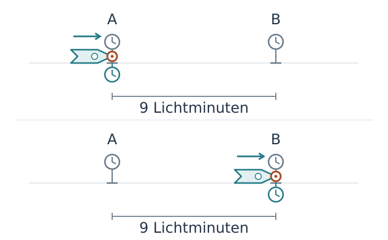{fig-alt="Die Raumschiffspitze passiert zuerst Station A und später Station B. Im Stationssystem ruhen A und B im Abstand von neun Lichtminuten, das Raumschiff bewegt sich mit 0,6 c."}
:::

Skizze der beiden Ereignisse bei einer Raumfahrt mit $v=0{,}6\,c$. Oben passiert die Raumschiffspitze Station A, unten Station B. Die Uhrsymbole markieren die Orte der Zeitmessung und geben keine Uhrzeiten an.
:::::

:::: {#aufgabe-raumfahrt-zeit-laenge .mp-box .mp-task}
<span class="mp-task-kind mp-task-kind-calculate" aria-label="Berechnung: Zeit und Länge bei einer Raumfahrt">
  
  Berechnung: Zeit und Länge bei einer Raumfahrt
</span>

Für diese Aufgabe benötigst du folgende aus dem Kapitel bekannte Formeln. Gib die Zeiten in Minuten und den Stationsabstand in Lichtminuten an.

::: {.mp-formula-repeat}
$$
\gamma = \frac{1}{\sqrt{1-\frac{v^2}{c^2}}}
$$

([-@eq-umbau-lorentzfaktor])
:::

::: {.mp-formula-repeat}
$$
\Delta t = \gamma\,\Delta t_0
$$

([-@eq-umbau-zeitdilatation])
:::

::: {.mp-formula-repeat}
$$
L = \frac{L_0}{\gamma}
$$

([-@eq-umbau-laengenkontraktion])
:::

1. <u>Berechne</u> den Lorentzfaktor $\gamma$ und die Reisezeit $\Delta t$ zwischen den beiden Ereignissen im Stationssystem.

2. <u>Berechne</u> die zwischen den beiden Ereignissen auf der Borduhr verstrichene Zeit. <u>Begründe</u> mithilfe der Orte der beiden Ereignisse im Raumschiffsystem, weshalb diese Uhr die Eigenzeit $\Delta t_0$ misst.

3. <u>Berechne</u> den Stationsabstand $L$ im Raumschiffsystem. <u>Bestimme</u> daraus erneut die Zeit zwischen den beiden Ereignissen und <u>vergleiche</u> sie mit deinem Ergebnis aus Teilaufgabe 2.

::::

<details class="mp-details">
<summary>Mögliche Lösung anzeigen</summary>

1. Mit $v=0{,}6\,c$ ergibt sich

   $$
   \gamma=\frac{1}{\sqrt{1-0{,}6^2}}=1{,}25.
   $$

   Im Stationssystem ruhen A und B. Ihr Abstand ist dort die Eigenlänge $L_0=9\,c\cdot\mathrm{min}$. Aus $L_0=v\,\Delta t$ folgt

   $$
   \begin{aligned}
   \Delta t&=\frac{9\,c\cdot\mathrm{min}}{0{,}6\,c}\\[4pt]
   &=15\,\mathrm{min}=900\,\mathrm{s}.
   \end{aligned}
   $$

   Die neun Minuten in der Abstandsangabe sind die Laufzeit von Licht über diesen Abstand. Das langsamere Raumschiff benötigt dafür fünfzehn Minuten.

2. Aus $\Delta t=\gamma\,\Delta t_0$ folgt

   $$
   \begin{aligned}
   \Delta t_0&=\frac{15\,\mathrm{min}}{1{,}25}\\[4pt]
   &=12\,\mathrm{min}=720\,\mathrm{s}.
   \end{aligned}
   $$

   Die Eigenzeit zwischen zwei Ereignissen wird von einer Uhr gemessen, die bei beiden Ereignissen am jeweiligen Ereignisort ist. Im Raumschiffsystem finden beide Ereignisse am selben Ort statt, an der ruhenden Raumschiffspitze. Die dort befestigte Borduhr misst beide Ereignisse und damit unmittelbar die Eigenzeit dazwischen.

   Im Stationssystem finden dieselben Ereignisse an verschiedenen Orten statt, zuerst an A und später an B. Hier werden die Anzeige der Uhr an A beim ersten Ereignis und die Anzeige der synchronisierten Uhr an B beim zweiten Ereignis verglichen. Ihre Differenz ist $\Delta t=15\,\mathrm{min}$. Auf der mitbewegten Borduhr verstreichen zwischen diesen Ereignissen zwölf Minuten.

3. Im Raumschiffsystem bewegen sich die Stationen. Ihr gleichzeitig gemessener Abstand ist

   $$
   \begin{aligned}
   L&=\frac{L_0}{\gamma}\\[4pt]
   &=\frac{9\,c\cdot\mathrm{min}}{1{,}25}\\[4pt]
   &=7{,}2\,c\cdot\mathrm{min}.
   \end{aligned}
   $$

   Der Abstand beträgt also $7{,}2$ Lichtminuten. Wenn A die Raumschiffspitze passiert, ist B noch um diesen Abstand von der Spitze entfernt. B bewegt sich mit $0{,}6\,c$ auf sie zu. Daraus folgt

   $$
   \begin{aligned}
   \frac{L}{v}&=\frac{7{,}2\,c\cdot\mathrm{min}}{0{,}6\,c}\\[4pt]
   &=12\,\mathrm{min}=720\,\mathrm{s}.
   \end{aligned}
   $$

   Beide Rechenwege ergeben dieselbe Bordzeit. Der erste verwendet die Zeitdilatation, der zweite den im Raumschiffsystem verkürzten Stationsabstand.

</details>

Beim Garagenparadoxon fährt ein Auto mit $v=0{,}8\,c$ gleichförmig durch eine Garage. Das Auto hat die Eigenlänge $L_{0,\mathrm{A}}=5\,\mathrm{m}$, die Garage die Eigenlänge $L_{0,\mathrm{G}}=4\,\mathrm{m}$. Die Indizes A und G stehen für Auto und Garage. Die Garage hat ein Einfahrts- und ein Ausfahrtstor. Im Garagensystem schließen beide Tore gleichzeitig, wenn die Mitte des Autos die Mitte der Garage passiert. Sie öffnen kurz darauf wieder gleichzeitig, bevor die Autospitze das Ausfahrtstor erreicht. Das Auto fährt während des gesamten Vorgangs weiter.

:::: {#aufgabe-garagenparadoxon .mp-box .mp-task}
<span class="mp-task-kind mp-task-kind-transfer" aria-label="Transfer: Das Garagenparadoxon">
  
  Transfer: Das Garagenparadoxon
</span>

Für diese Aufgabe benötigst du folgende aus dem Kapitel bekannte Formeln.

::: {.mp-formula-repeat}
$$
\gamma = \frac{1}{\sqrt{1-\frac{v^2}{c^2}}}
$$

([-@eq-umbau-lorentzfaktor])
:::

::: {.mp-formula-repeat}
$$
L = \frac{L_0}{\gamma}
$$

([-@eq-umbau-laengenkontraktion])
:::

1. <span class="mp-task-kind mp-task-kind-calculate" aria-label="Berechnung">Berechnung</span> <u>Berechne</u> die Autolänge $L_\mathrm{A}$ im Garagensystem und die Garagenlänge $L_\mathrm{G}$ im Autosystem in Metern. <u>Vergleiche</u> für jedes der beiden Bezugssysteme die dort gemessenen Längen von Auto und Garage.

2. <u>Beschreibe</u> den Ablauf im Autosystem. Welches Tor schließt zuerst? Wo befinden sich Autospitze und Autoheck, wenn das jeweilige Tor schließt? Du kannst dafür die Animation nutzen.

3. <u>Erkläre</u>, wie das Auto durch die Garage gelangen kann, obwohl die Garage im Autosystem kürzer als das Auto ist. Gehe dabei auf die Relativität der Gleichzeitigkeit ein.

@fig-umbau-garagenparadoxon zeigt die Durchfahrt im Garagen- und im Autosystem. Mit dem Ablaufregler kannst du die Bewegung vor- und zurückbewegen und die Torstellungen vergleichen. Über „Lichtwege einblenden“ kannst du eine Hilfe zum Vergleich der Torereignisse zuschalten.

::::: {#fig-umbau-garagenparadoxon}
::: {.content-visible when-format="html"}
```{=html}
<div class="srt-workbook-stage" data-srt-animation="garagenparadoxon" data-srt-viewbox-w="640" data-srt-viewbox-h="340" data-srt-label="Gleichförmige Durchfahrt eines Autos durch eine Garage mit Einfahrts- und Ausfahrtstor. Umschaltbar zwischen Garagensystem und Autosystem, mit Abspielknopf und Ablaufregler. Zwei Lichtpulse und ihre Wege können als Hilfe eingeblendet werden."></div>
```
:::

::: {.content-visible unless-format="html"}
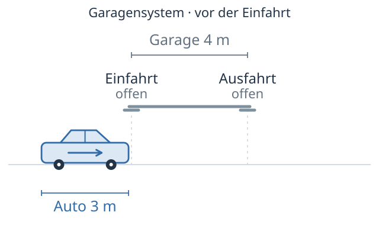{fig-alt="Ausgangszustand im Garagensystem vor der Einfahrt: Das bewegte Auto ist 3 Meter lang, die Garage 4 Meter. Beide Tore sind offen."}
:::

Animation zur Durchfahrt eines Autos mit Eigenlänge $5\,\mathrm{m}$ durch eine Garage mit Eigenlänge $4\,\mathrm{m}$ bei $v=0{,}8\,c$. Im Garagensystem schließen und öffnen die Tore jeweils gleichzeitig. Das Bezugssystem kann gewechselt werden.
:::::


::::

<details class="mp-details">
<summary>Mögliche Lösung anzeigen</summary>

1. Mit $v=0{,}8\,c$ ergibt sich

   $$
   \gamma=\frac{1}{\sqrt{1-0{,}8^2}}
   =\frac{1}{0{,}6}=\frac{5}{3}.
   $$

   Im Garagensystem ruht die Garage mit $L_{0,\mathrm{G}}=4\,\mathrm{m}$. Das bewegte Auto hat dort die Länge

   $$
   \begin{aligned}
   L_\mathrm{A}&=\frac{L_{0,\mathrm{A}}}{\gamma}\\[4pt]
   &=\frac{5\,\mathrm{m}}{5/3}=3\,\mathrm{m}.
   \end{aligned}
   $$

   Das Auto ist kürzer als die Garage und kann vollständig zwischen den Toren liegen.

   Im Autosystem ruht das Auto mit $L_{0,\mathrm{A}}=5\,\mathrm{m}$. Die bewegte Garage hat dort die Länge

   $$
   \begin{aligned}
   L_\mathrm{G}&=\frac{L_{0,\mathrm{G}}}{\gamma}\\[4pt]
   &=\frac{4\,\mathrm{m}}{5/3}=2{,}4\,\mathrm{m}.
   \end{aligned}
   $$

   Die Garage ist kürzer als das Auto. Beide Autoenden können in diesem System zu keinem Zeitpunkt gleichzeitig zwischen den Toren liegen.

2. Im Autosystem bewegt sich die Garage nach links über das ruhende Auto hinweg. Zuerst schließt das Ausfahrtstor. Es befindet sich noch vor der Autospitze und öffnet wieder, bevor es die Spitze erreicht. Das Autoheck liegt zu diesem Zeitpunkt noch außerhalb der Garage auf der Einfahrtsseite. Später schließt das Einfahrtstor. Es hat das Autoheck dann bereits passiert, und die Autospitze liegt schon außerhalb der Garage auf der Ausfahrtsseite. Auch dieses Tor öffnet wieder.

3. Im Autosystem ist das Ausfahrtstor schon wieder offen, wenn das Einfahrtstor schließt. Beide Tore schließen das Auto daher zu keinem Zeitpunkt gemeinsam ein. Das Auto und die Tore stoßen auch in dieser Beschreibung nicht zusammen.

   Die Schließvorgänge an den beiden Toren sind zwei räumlich getrennte Ereignisse. Sie finden im Garagensystem gleichzeitig statt, im Autosystem nacheinander. Das ist die Relativität der Gleichzeitigkeit. Die Aussage „Beide Tore sind gleichzeitig geschlossen und das Auto ist dazwischen“ gilt daher hier nur im Garagensystem. Dass das Auto ohne Zusammenstoß durch die Garage gelangt, gilt in beiden Systemen.

</details>

Bei dieser Übung greifst du die Herleitung der Blauverschiebung auf und überträgst den Rechenweg auf eine sich entfernende Quelle.

:::: {#aufgabe-doppler-rot .mp-box .mp-task}
<span class="mp-task-kind mp-task-kind-derive" aria-label="Herleitung: Rotverschiebung">
  
  Herleitung: Rotverschiebung
</span>

Eine Lichtquelle bewegt sich mit der Geschwindigkeit $v$ von einer Person weg, die ihr Licht empfängt. Das Ruhesystem dieser Person nennen wir Empfangssystem. Gesucht ist die dort gemessene Wellenlänge $\lambda$.

**(I) Eigenwellenlänge.**

Die Lichtquelle sendet fortlaufend eine Welle aus. Wir betrachten zwei aufeinanderfolgende Wellenberge. Im Ruhesystem der Lichtquelle verlässt der zweite Wellenberg die Quelle um $\Delta t_0$ später als der erste. Beide Vorgänge finden dort am selben Ort statt. $\Delta t_0$ ist deshalb die Eigenzeit zwischen diesen Ereignissen.

Wenn der zweite Wellenberg die Quelle verlässt, hat der erste die Strecke $c\,\Delta t_0$ zurückgelegt. Ihr Abstand ist die im Ruhesystem der Lichtquelle gemessene Eigenwellenlänge $\lambda_0$.

$$
\lambda_0=c\,\Delta t_0. \tag{I}
$$

@fig-umbau-doppler-rot-quelle zeigt diesen Moment im Ruhesystem der Lichtquelle. Die beiden Wellenberge sind als Wellenfront 1 und 2 markiert.

::::: {#fig-umbau-doppler-rot-quelle}
::: {.content-visible when-format="html"}
```{=html}
<div class="srt-workbook-stage" data-srt-animation="doppler-bzg-quelle" data-srt-viewbox-w="640" data-srt-viewbox-h="250" data-srt-label="Ruhesystem der Lichtquelle. Wellenfront 2 entsteht gerade an der Lichtquelle. Wellenfront 1 ist um c Delta t null vorausgelaufen. Ihr Abstand ist Lambda null."></div>
```
:::

::: {.content-visible unless-format="html"}
::: {.srt-workbook-fallback}
Ruhesystem der Lichtquelle. Wellenfront 2 wird gerade ausgesendet. Wellenfront 1 ist um c Delta t null vorausgelaufen. Ihr Abstand ist Lambda null.
:::
:::

Skizze im Ruhesystem der Lichtquelle. Wellenfront 2 entsteht gerade an der Quelle. Der Kreisbogen zeigt einen Ausschnitt von Wellenfront 1. Ihr Abstand zur Quelle beträgt $\lambda_0=c\,\Delta t_0$.
:::::

**(II) Wellenabstand im Empfangssystem.**

Im Empfangssystem bewegt sich die Lichtquelle. Die Zeitdauer zwischen denselben beiden Vorgängen an der Quelle bezeichnen wir in diesem System mit $\Delta t$. Licht breitet sich auch hier mit der Geschwindigkeit $c$ aus. Während dieser Zeit läuft die erste Wellenfront um $c\,\Delta t$ auf den Empfänger zu. Die Lichtquelle bewegt sich um $v\,\Delta t$ in die entgegengesetzte Richtung.

Wenn die zweite Wellenfront an der Quelle entsteht, beträgt ihr Abstand zur ersten Wellenfront die im Empfangssystem gemessene Wellenlänge

$$
\lambda=c\,\Delta t+v\,\Delta t=(c+v)\,\Delta t. \tag{II}
$$

@fig-umbau-doppler-entfernung zeigt, weshalb sich die beiden Strecken addieren.

::::: {#fig-umbau-doppler-entfernung}
::: {.content-visible when-format="html"}
```{=html}
<div class="srt-workbook-stage" data-srt-animation="doppler-bzg-beobachter-entfernt" data-srt-viewbox-w="640" data-srt-viewbox-h="290" data-srt-label="Ruhesystem der empfangenden Person. Die Lichtquelle ist seit der ersten Aussendung um v Delta t nach links gerückt. Wellenfront 1 ist um c Delta t nach rechts gelaufen. Wellenfront 2 wird gerade ausgesendet."></div>
```
:::

::: {.content-visible unless-format="html"}
::: {.srt-workbook-fallback}
Ruhesystem der empfangenden Person. Die Lichtquelle ist seit der ersten Aussendung um v Delta t nach links gerückt. Wellenfront 1 ist um c Delta t nach rechts gelaufen. Wellenfront 2 wird gerade ausgesendet.
:::
:::

Skizze im Empfangssystem bei Entfernung. Lichtquelle und Wellenfront 1 bewegen sich in entgegengesetzte Richtungen. Wellenfront 2 entsteht gerade an der Quelle. Der Wellenabstand beträgt $\lambda=(c+v)\,\Delta t$.
:::::

**(III) Zeitdilatation.**

Für die beiden Zeitdauern gilt die bereits hergeleitete Zeitdilatation:

$$
\Delta t=\frac{\Delta t_0}{\sqrt{1-\frac{v^2}{c^2}}}. \tag{III}
$$

<u>Leite</u> mithilfe der drei Gleichungen (I), (II) und (III) eine Beziehung zwischen der empfangenen Wellenlänge $\lambda$ und der Eigenwellenlänge $\lambda_0$ in Abhängigkeit von $v$ <u>her</u>.

Wähle deinen Einstieg.

::: {.panel-tabset}

### Ganz allein

Bearbeite die Herleitung ohne weitere Hinweise. Du kannst während der Rechnung jederzeit eine der beiden Hilfestufen öffnen.

### Mit Hinweisen

- Setze zuerst Gleichung (III) in Gleichung (II) ein.
- Erweitere den entstehenden Bruch mit $c$. Ziehe anschließend das $c$ im Nenner unter die Wurzel.
- Danach kannst du Gleichung (I) verwenden, um $c\,\Delta t_0$ zu ersetzen.
- Zerlege $c^2-v^2$ mit der dritten binomischen Formel in $(c-v)(c+v)$.
- Schreibe auch den Faktor $c+v$ im Zähler als Wurzel. Anschließend kannst du die Wurzeln zusammenfassen und kürzen.

### Schritt für Schritt

1. Setze die Zeitdilatation aus Gleichung (III) in Gleichung (II) ein.

   <details class="mp-details mp-step-check">
   <summary>Zwischenergebnis anzeigen</summary>

   $$
   \lambda=\frac{(c+v)\,\Delta t_0}{\sqrt{1-\frac{v^2}{c^2}}}.
   $$

   </details>

2. Erweitere den Bruch mit $c$. Multipliziere dazu Zähler und Nenner mit $c$.

   <details class="mp-details mp-step-check">
   <summary>Zwischenergebnis anzeigen</summary>

   $$
   \lambda=\frac{c\,\Delta t_0\,(c+v)}{c\sqrt{1-\frac{v^2}{c^2}}}.
   $$

   </details>

3. Ziehe das $c$ im Nenner unter die Wurzel. Als Faktor unter der Wurzel wird daraus $c^2$. Vereinfache den Ausdruck.

   <details class="mp-details mp-step-check">
   <summary>Zwischenergebnis anzeigen</summary>

   $$
   \begin{aligned}
   \lambda&=\frac{c\,\Delta t_0\,(c+v)}{\sqrt{c^2\left(1-\frac{v^2}{c^2}\right)}}\\[6pt]
   &=\frac{c\,\Delta t_0\,(c+v)}{\sqrt{c^2-v^2}}.
   \end{aligned}
   $$

   </details>

4. Ersetze $c\,\Delta t_0$ mithilfe von Gleichung (I) durch $\lambda_0$.

   <details class="mp-details mp-step-check">
   <summary>Zwischenergebnis anzeigen</summary>

   $$
   \lambda=\frac{(c+v)\,\lambda_0}{\sqrt{c^2-v^2}}.
   $$

   </details>

5. Zerlege den Ausdruck unter der Wurzel mit der dritten binomischen Formel.

   <details class="mp-details mp-step-check">
   <summary>Zwischenergebnis anzeigen</summary>

   $$
   \lambda=\frac{(c+v)\,\lambda_0}{\sqrt{(c-v)(c+v)}}.
   $$

   </details>

6. Schreibe $c+v$ im Zähler als $\sqrt{(c+v)^2}$. Das ist möglich, weil $c>0$ und $v\ge0$ gilt. Fasse die beiden Wurzeln zusammen und kürze den gemeinsamen Faktor $c+v$.

   <details class="mp-details mp-step-check">
   <summary>Zwischenergebnis anzeigen</summary>

   $$
   \begin{aligned}
   \lambda&=\sqrt{\frac{(c+v)^2}{(c-v)(c+v)}}\,\lambda_0\\[6pt]
   &=\sqrt{\frac{c+v}{c-v}}\,\lambda_0.
   \end{aligned}
   $$

   </details>

:::

<details class="mp-details">
<summary>Kontrollrechnung anzeigen</summary>

$$
\begin{aligned}
\lambda &= (c+v)\,\Delta t
  && \Big|\ \Delta t = \frac{\Delta t_0}{\sqrt{1-\frac{v^2}{c^2}}} \\[10pt]
\lambda &= (c+v)\,\frac{\Delta t_0}{\sqrt{1-\frac{v^2}{c^2}}} \\[10pt]
\lambda &= \frac{(c+v)\,\Delta t_0}{\sqrt{1-\frac{v^2}{c^2}}}
  && \Big|\ \text{mit } c \text{ erweitern} \\[10pt]
\lambda &= \frac{c\,\Delta t_0\,(c+v)}{c\,\sqrt{1-\frac{v^2}{c^2}}}
  && \Big|\ c \text{ unter die Wurzel ziehen} \\[10pt]
\lambda &= \frac{c\,\Delta t_0\,(c+v)}{\sqrt{c^2\left(1-\frac{v^2}{c^2}\right)}} \\[10pt]
\lambda &= \frac{c\,\Delta t_0\,(c+v)}{\sqrt{c^2-v^2}}
  && \Big|\ c\,\Delta t_0 = \lambda_0 \\[10pt]
\lambda &= \frac{(c+v)\,\lambda_0}{\sqrt{c^2-v^2}}
  && \Big|\ c^2-v^2=(c-v)(c+v) \\[10pt]
\lambda &= \frac{(c+v)\,\lambda_0}{\sqrt{(c-v)(c+v)}} \\[10pt]
\lambda &= \frac{\sqrt{(c+v)^2}}{\sqrt{(c-v)(c+v)}}\,\lambda_0
  && \Big|\ \text{als eine Wurzel schreiben und kürzen} \\[10pt]
\lambda &= \sqrt{\frac{(c+v)^2}{(c-v)(c+v)}}\,\lambda_0 \\[10pt]
\lambda &= \sqrt{\frac{c+v}{c-v}}\,\lambda_0
\end{aligned}
$$

</details>
::::
