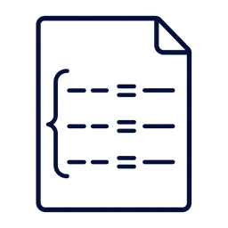

# Ausflug: Wie funktioniert ein Laser? {#sec-laser-ausflug}

::: {.content-visible when-format="html"}
```{=html}
<link rel="stylesheet" href="assets/animations/shared/srt-workbook.css">
<script src="assets/animations/shared/core.js"></script>
<script src="assets/animations/laser/used/atom-licht-wechselwirkungen.js"></script>
<script src="assets/animations/laser/used/besetzungsinversion.js"></script>
<script src="assets/animations/laser/used/metastabil.js"></script>
<script src="assets/animations/laser/used/resonator.js"></script>
<script src="assets/animations/laser/used/spektren-zoom.js"></script>
<script src="assets/animations/laser/used/zeitliche-koharenz.js"></script>
<script src="assets/animations/laser/used/koharenz-arten.js"></script>
<script src="assets/animations/laser/used/rubinlaser.js"></script>
<script src="assets/animations/laser/used/he-ne.js"></script>
<script src="assets/animations/laser/used/hene-spektroskop.js"></script>
<script src="assets/animations/shared/srt-workbook.js"></script>
```
:::

::: {.callout-warning title="Im Aufbau"}
Diese Seite befindet sich noch im Aufbau. Das Gerüst steht, die Abschnitte werden nach und nach gefüllt.
:::

::: {.callout-note title="Relevanz"}
Laser begegnen dir ständig im Alltag. An der Supermarktkasse lesen sie den Barcode. Bei Veranstaltungen erzeugen sie Lichtshows. In Präsentationen dienen sie als Pointer. In der Medizin schneiden und veröden sie Gewebe.

So unterschiedlich diese Anwendungen sind: Ihnen allen liegt dieselbe Erkenntnis aus der Quantenphysik zugrunde. Was dieses Licht so besonders macht und wie es entsteht, erfährst du in diesem Kapitel.
:::

<!-- ====================================================================== -->
<!-- Muster je Abschnitt (wie Kapitel 1):                                   -->
<!--   1. Relevanz  ::: {.callout-note title="Relevanz"}                    -->
<!--   2. Lernziele ::: {.mp-goal-strip}  (KMK-Operatoren in <u>...</u>)    -->
<!--   3. Inhalt + Boxen (mp-task, mp-definition, mp-math, mp-misconception)-->
<!--   4. Kernaussage ::: {.mp-box .mp-core} am Abschnittsende               -->
<!-- ====================================================================== -->

## Stimulierte Emission

::: {.callout-note title="Relevanz"}
Einen Laser kennst du aus dem Alltag, etwa den roten Punkt eines Pointers. Sein Licht ist meist einfarbig (monochromatisch) und bleibt über große Entfernungen ein schmaler Strahl, es divergiert kaum.

Aber was ist ein Laser überhaupt? Das Wort ist ein Akronym. **LASER** steht für „Light Amplification by Stimulated Emission of Radiation", auf Deutsch: Lichtverstärkung durch stimulierte Emission von Strahlung. Der Kern steckt schon im Namen, die stimulierte Emission. Was das ist, klärt dieser Abschnitt.
:::

::: {.mp-goal-strip}
Du <u>beschreibst</u> die drei Prozesse Absorption, spontane Emission und stimulierte Emission.

Du <u>prüfst</u> mit der Bedingung $E_\text{Photon} = \Delta E$, ob ein Atom ein Photon absorbieren kann.

Du <u>vergleichst</u> spontane und stimulierte Emission und <u>gibst an</u>, wann zwei Wellen kohärent heißen.
:::

Vielleicht kennst du nachleuchtende Sterne an Zimmerdecken oder Leuchtstreifen auf Uhren. Zuerst liegen sie im Licht. Später schaltest du das Licht aus, und sie leuchten noch eine Weile weiter.

Daran siehst du eine wichtige Grundidee: Materie kann Energie aus Licht aufnehmen und später wieder als Licht abgeben.

Bei Atomen läuft dieser Energieaustausch in festen Schritten. Ein Atom besitzt bestimmte **Energieniveaus**. Wir betrachten hier zwei davon: Das niedrigere Niveau nennen wir $E_1$. Es steht hier für den Grundzustand. Das höhere Niveau nennen wir $E_2$. Befindet sich das Atom dort, ist es angeregt. Der Energieabstand zwischen beiden Niveaus ist

$$
\Delta E = E_2 - E_1.
$$

Ein Photon trägt die Energie $E_\text{Photon} = h f$. Dabei ist $h$ das Plancksche Wirkungsquantum und $f$ die Frequenz des Lichts. Ein Atom im Grundzustand kann ein Photon aufnehmen, wenn dessen Energie genau zum Abstand der beiden Energieniveaus passt:

$$
E_\text{Photon} = h f = \Delta E = E_2 - E_1
$$

Das Photon wird absorbiert. Seine Energie geht auf das Atom über. Das Atom wechselt vom Grundzustand $E_1$ in den angeregten Zustand $E_2$. Diesen Vorgang nennt man **Absorption**. Die Animation zeigt diesen Übergang. Der große Kreis deutet das Atom an. Der blaue Punkt steht für den Energiezustand des Atoms: Er sitzt auf dem Niveau, in dem sich das Atom gerade befindet.

::: {.content-visible when-format="html"}
```{=html}
<figure class="srt-workbook-figure srt-workbook-figure--caption-inside">
  <div class="srt-workbook-stage" data-srt-animation="laser-absorption" data-srt-motion-control data-srt-label="Absorption: Ein Photon mit passender Energie trifft auf ein Atom im Grundzustand. Das Photon wird absorbiert, und das Atom wechselt in den angeregten Zustand."></div>
</figure>
```
:::

::: {.content-visible unless-format="html"}
::: {.srt-workbook-fallback}
In der HTML-Version erscheint hier eine Animation: Ein Photon trifft auf ein Atom im Grundzustand. Das Photon wird absorbiert, und das Atom wechselt in den angeregten Zustand.
:::
:::

Ein angeregtes Atom kann später wieder in ein niedrigeres Energieniveau wechseln. Die frei werdende Energie verlässt das Atom als neues Photon. Dieser Vorgang heißt **spontane Emission**.

Der Vorgang startet im angeregten Atom selbst. Der genaue Zeitpunkt ist zufällig. Auch die Richtung des ausgesandten Photons ist zufällig. Viele Atome senden bei spontaner Emission in viele Richtungen. Das Licht ist ungeordnet. Die Animation zeigt eine solche zufällige Emission.

::: {.content-visible when-format="html"}
```{=html}
<figure class="srt-workbook-figure srt-workbook-figure--caption-inside">
  <div class="srt-workbook-stage" data-srt-animation="laser-spontane-emission" data-srt-motion-control data-srt-label="Spontane Emission: Ein angeregtes Atom wechselt in ein niedrigeres Energieniveau und sendet dabei ein Photon aus. Zeitpunkt und Richtung sind zufällig."></div>
</figure>
```
:::

::: {.content-visible unless-format="html"}
::: {.srt-workbook-fallback}
In der HTML-Version erscheint hier eine Animation: Ein angeregtes Atom wechselt in ein niedrigeres Energieniveau und sendet dabei ein Photon in zufälliger Richtung aus.
:::
:::

::: {.mp-box .mp-task}
<span class="mp-task-kind mp-task-kind-think" aria-label="Denkcheck">
  
  Denkcheck
</span>

Ein Atom absorbiert Photonen der Frequenz $5{,}5 \cdot 10^{14}\,\mathrm{Hz}$. Nun trifft ein intensiver Lichtpuls auf das Atom. Er enthält sehr viele Photonen der Frequenz $5{,}3 \cdot 10^{14}\,\mathrm{Hz}$.

<u>Prüfe</u>, ob Photonen aus diesem Lichtpuls absorbiert werden können.
:::

<details class="mp-details">
<summary>Mögliche Lösung anzeigen</summary>

Nein. Für einen einzelnen Absorptionsvorgang zählt die Energie eines einzelnen Photons. Zu diesem Abstand der Energieniveaus gehört die Frequenz $5{,}5 \cdot 10^{14}\,\mathrm{Hz}$. Ein Photon mit $5{,}3 \cdot 10^{14}\,\mathrm{Hz}$ hat eine niedrigere Frequenz und damit eine geringere Energie. Sehr viele solche Photonen bedeuten hohe Intensität. Die Energie pro Photon bleibt aber zu klein. Photonen aus diesem Lichtpuls werden für diesen Übergang nicht absorbiert.

</details>

Für den Laser ist ein dritter Fall entscheidend: Ein passendes Photon trifft auf ein Atom, das bereits angeregt ist. Das ankommende Photon bleibt erhalten und läuft weiter. Zugleich wechselt das Atom in das niedrigere Energieniveau und sendet ein zweites Photon aus.

Dieses zweite Photon passt zum auslösenden Photon. Beide Photonen haben dieselbe Energie und dieselbe Frequenz. Sie laufen in dieselbe Richtung und schwingen im gleichen Takt. Dieser Vorgang heißt **stimulierte Emission**. Die Animation zeigt, wie aus einem Photon zwei werden.

::: {.content-visible when-format="html"}
```{=html}
<figure class="srt-workbook-figure srt-workbook-figure--caption-inside">
  <div class="srt-workbook-stage" data-srt-animation="laser-stimulierte-emission" data-srt-motion-control data-srt-label="Stimulierte Emission: Ein passendes Photon trifft auf ein angeregtes Atom. Das ankommende Photon läuft weiter und löst ein zweites gleiches Photon aus."></div>
</figure>
```
:::

::: {.content-visible unless-format="html"}
::: {.srt-workbook-fallback}
In der HTML-Version erscheint hier eine Animation: Ein passendes Photon trifft auf ein angeregtes Atom. Danach laufen zwei gleiche Photonen weiter.
:::
:::

Die stimulierte Emission beschreibt zunächst einen einzelnen atomaren Vorgang: Ein passendes Photon löst eine exakte Kopie seiner selbst aus. Jede Kopie kann weitere Kopien auslösen. Was heißt dabei „im gleichen Takt"? Licht lässt sich in zwei Bildern beschreiben: als Strom von Photonen und als Welle. Beide Bilder gehören zum selben Licht; je nach Phänomen ist das eine oder das andere das passende Werkzeug. Im Wellenbild laufen die Wellen aus derselben Kette im Gleichschritt: Wellenberg liegt auf Wellenberg, Wellental auf Wellental.

Der Begriff Kohärenz verlangt weniger: Zwei Wellen heißen **kohärent**, wenn ihre Phasenverschiebung zueinander konstant bleibt. Die Wellen dürfen gegeneinander versetzt sein, solange der Versatz gleich bleibt. Die Photonen aus derselben Kette erfüllen diese Bedingung in der strengsten Form: Ihr Versatz ist null. Die Kohärenz ist eine der besonderen Eigenschaften des Laserlichts. Die stimulierte Emission legt dafür den Grund. Im Medium starten solche Ketten allerdings an vielen Stellen und in viele Richtungen. Wie daraus ein einziger geordneter Strahl wird, klärt der Abschnitt zum Resonator. Dort schauen wir uns auch die Kohärenz genauer an.

Gebraucht wird diese Ordnung überall dort, wo Licht mit Licht überlagert wird: Interferenzversuche gelingen nur mit kohärentem Licht. Moderne Michelson-Interferometer, etwa bei der Messung von Gravitationswellen in [Abschnitt 1.2](01_srt_raum_und_zeit.qmd#michelson-morley-experiment), arbeiten darum mit Laserlicht.

Wir unterscheiden drei Wechselwirkungen von Atomen und Licht:

1. Bei der **Absorption** nimmt ein Atom ein Photon auf.
2. Bei der **spontanen Emission** sendet ein angeregtes Atom von selbst ein Photon aus.
3. Bei der **stimulierten Emission** löst ein passendes Photon die Aussendung eines zweiten, gleichen Photons aus.

::: {.mp-box .mp-task}
<span class="mp-task-kind mp-task-kind-think" aria-label="Denkcheck">
  
  Denkcheck
</span>

Bei der spontanen und bei der stimulierten Emission sendet ein angeregtes Atom ein Photon aus.

<u>Vergleiche</u> die beiden Vorgänge nach Auslöser, Zeitpunkt und Richtung des ausgesandten Photons.
:::

<details class="mp-details">
<summary>Mögliche Lösung anzeigen</summary>
<p>Die spontane Emission startet im Atom selbst. Zeitpunkt und Richtung des Photons sind zufällig. Die stimulierte Emission wird von einem passenden Photon ausgelöst. Sie geschieht beim Eintreffen dieses Photons, und das neue Photon läuft in dieselbe Richtung wie das auslösende. Es schwingt zudem im gleichen Takt: Die beiden Photonen sind kohärent.</p>
</details>

::: {.mp-box .mp-core}
<div class="mp-title">Kernaussage</div>

Ein Atom kann ein Photon absorbieren und dadurch in einen angeregten Zustand wechseln. Ein angeregtes Atom kann spontan ein Photon aussenden. Bei der stimulierten Emission löst ein passendes Photon die Aussendung eines zweiten, gleichartigen Photons aus. 
:::

## Besetzungsinversion und Lasermedium

::: {.callout-note title="Relevanz"}
Im letzten Abschnitt hast du die stimulierte Emission kennengelernt, den Kern des Lasers. Bekannt ist sie seit 1917 [@einstein1972quantum]. Der erste Laser gelang trotzdem erst 1960, über vierzig Jahre später.

Ein wesentlicher Grund für diese Lücke steckt in diesem Abschnitt. Ein Laser verstärkt Licht nur, wenn mehr Atome im höheren der beiden beteiligten Energieniveaus sitzen als im tieferen. In gewöhnlicher Materie stellt sich das nie von selbst ein. Man braucht ein besonderes Medium und muss ihm von außen Energie zuführen, um diesen Zustand herzustellen.

Nicht jedes Material taugt als Lasermedium. Welche Eigenschaften ein solches Medium mitbringen muss, klärt dieser Abschnitt.
:::

::: {.mp-goal-strip}
Du <u>erklärst</u>, was eine Besetzungsinversion ist.

Du <u>berechnest</u> Besetzungsverhältnisse im thermischen Gleichgewicht und <u>begründest</u> damit, dass ein Lasermedium gepumpt werden muss.

Du <u>erklärst</u>, wozu ein metastabiles Niveau dient.
:::

Stell dir eine La-Ola-Welle im Stadion vor. Sie läuft durch die Ränge, weil immer neue Zuschauer aufspringen. Damit sie weiterläuft, müssen entlang ihres Wegs genug Leute bereit sein aufzuspringen. Sind zu wenige bereit, bricht die Welle ab.

Ein Photon, dessen Energie zum Abstand zweier Niveaus passt, kann zweierlei bewirken. Trifft es ein Atom im Grundzustand $E_1$, kann es absorbiert werden. Trifft es ein angeregtes Atom im Niveau $E_2$, kann es stimulierte Emission auslösen: Ein zweites, gleiches Photon kommt hinzu. Im Bild der La-Ola-Welle entspricht ein angeregtes Atom einem Zuschauer, der bereit ist aufzuspringen.

Was mit einem passenden Photon geschieht, hängt von der Besetzung der Energieniveaus ab. Für Verstärkung müssen mehr Atome im höheren Niveau $E_2$ sitzen als im tieferen $E_1$. Dann trifft ein Photon öfter auf ein angeregtes Atom als auf ein Atom im Grundzustand, und aus einem Photon werden viele gleiche. Dieser Zustand heißt **Besetzungsinversion**: Die Besetzung ist gegenüber dem Normalfall umgekehrt. Im Stadionbild sind genug Zuschauer bereit aufzuspringen, die Welle läuft. Wie ein Medium in diesen Zustand kommt, klären wir in zwei Schritten.

::: {.mp-box .mp-definition}
<div class="mp-title">Besetzungsinversion</div>

Von einer Besetzungsinversion spricht man, wenn ein höheres Energieniveau von mehr Atomen besetzt ist als ein tieferes. Dann kann ein passendes Photon im Lasermedium weitere gleiche Photonen auslösen.
:::

In der Simulation schaltest du zwischen normaler Besetzung und Besetzungsinversion um. Jedes Atom zeigt seine beiden Niveaus $E_1$ und $E_2$. Der Punkt zeigt wieder den Energiezustand des Atoms: sitzt er oben auf $E_2$, ist das Atom angeregt, unten auf $E_1$ ist es im Grundzustand. Bei normaler Besetzung wird ein durchlaufendes Photon absorbiert, und angeregte Atome emittieren spontan in zufällige Richtungen. Bei Besetzungsinversion löst ein Photon an angeregten Atomen stimulierte Emission aus. Dabei entsteht eine Art Lawine aus identischen Photonen.

::: {.content-visible when-format="html"}
```{=html}
<figure class="srt-workbook-figure srt-workbook-figure--caption-inside">
  <div class="srt-workbook-stage" data-srt-animation="laser-besetzungsinversion" data-srt-motion-control data-srt-label="Interaktive Darstellung mit Umschalter zwischen normaler Besetzung und Besetzungsinversion. Ein Photon läuft durch das Medium. Jedes Atom hat zwei Niveaus, ein Punkt zeigt den Energiezustand des Atoms. Bei normaler Besetzung wird das Photon absorbiert und angeregte Atome emittieren spontan. Bei Besetzungsinversion löst ein Photon an angeregten Atomen stimulierte Emission aus. Dabei entsteht eine Art Lawine aus identischen Photonen."></div>
</figure>
```
:::

::: {.content-visible unless-format="html"}
::: {.srt-workbook-fallback}
In der HTML-Version erscheint hier eine Simulation mit einem Umschalter zwischen normaler Besetzung und Besetzungsinversion.
:::
:::

Den Normalfall beschreibt das thermische Gleichgewicht, der gewöhnliche Zustand der Materie: Fast alle Atome sitzen im Grundzustand. Ein passendes Photon trifft dann meist auf ein Atom im Grundzustand und wird absorbiert.

Diese normale Besetzung wird durch die Boltzmann-Verteilung beschrieben. Für unser Zwei-Niveau-Modell gilt im thermischen Gleichgewicht näherungsweise:

$$
\frac{N_2}{N_1} = e^{-\frac{E_2-E_1}{k_\mathrm{B}T}}.
$$

$N_2$ ist die Zahl der Atome im höheren Niveau. $N_1$ ist die Zahl der Atome im tieferen Niveau. $k_\mathrm{B}$ ist die Boltzmann-Konstante. $T$ ist die absolute Temperatur. Je größer der Energieabstand im Vergleich zu $k_\mathrm{B}T$ ist, desto kleiner ist der Anteil der Atome in $E_2$.

In der Formel steckt folgende Aussage. Der Exponent ist bei jeder Temperatur negativ, das Verhältnis $N_2/N_1$ bleibt immer kleiner als 1. Heizt man das Medium, steigt $N_2$ zwar an. Selbst wenn die Temperatur unendlich groß sein könnte, erreicht die Besetzung höchstens die Gleichbesetzung $N_2 = N_1$. Eine Besetzungsinversion ist im thermischen Gleichgewicht unerreichbar, egal bei welcher Temperatur.

::: {.mp-box .mp-task}
<span class="mp-task-kind mp-task-kind-think" aria-label="Denkcheck">
  
  Denkcheck
</span>

Ein Medium enthält $10^{20}$ Atome. Der Übergang hat den Energieabstand $E_2 - E_1 = 2{,}0\,\mathrm{eV} = 3{,}2 \cdot 10^{-19}\,\mathrm{J}$, das entspricht rotem Licht. Das Medium liegt bei Raumtemperatur vor: $T = 300\,\mathrm{K}$, $k_\mathrm{B} = 1{,}38 \cdot 10^{-23}\,\tfrac{\mathrm{J}}{\mathrm{K}}$.

<u>Berechne</u> das Besetzungsverhältnis $N_2/N_1$ und <u>gib an</u>, wie viele der $10^{20}$ Atome demnach angeregt sind.
:::

<details class="mp-details">
<summary>Mögliche Lösung anzeigen</summary>

Der Exponent der Boltzmann-Verteilung ist

$$
\frac{E_2 - E_1}{k_\mathrm{B}\,T}
= \frac{3{,}2 \cdot 10^{-19}\,\mathrm{J}}{1{,}38 \cdot 10^{-23}\,\tfrac{\mathrm{J}}{\mathrm{K}} \cdot 300\,\mathrm{K}}
\approx 77.
$$

Damit gilt $N_2/N_1 = e^{-77} \approx 10^{-34}$. Von den $10^{20}$ Atomen sind im Mittel $10^{20} \cdot 10^{-34} = 10^{-14}$ angeregt: kein einziges Atom. Ein passendes Photon trifft in diesem Medium praktisch immer auf ein Atom im Grundzustand und wird absorbiert. Für stimulierte Emission fehlen die Partner. Ohne Energiezufuhr von außen gibt es keine Verstärkung.

</details>

Der erste Schritt zur Inversion ist eine Energiezufuhr von außen. Sie hebt Atome in höhere Energieniveaus und bringt das Medium aus dem thermischen Gleichgewicht. Diese Energiezufuhr heißt **Pumpen**. Je nach Lasertyp geschieht das durch eine Blitzlampe, eine andere Lichtquelle oder einen elektrischen Strom.

Pumpen allein reicht aber noch nicht. Man könnte versuchen, die Atome mit Licht direkt vom Grundzustand $E_1$ in das obere Laserniveau $E_2$ zu pumpen. Das scheitert an einem Wettlauf: Dasselbe Pumplicht passt auch zum Übergang nach unten. Es löst an bereits angeregten Atomen stimulierte Emission aus, und beide Vorgänge sind pro Atom gleich wahrscheinlich.

Solange mehr Atome unten sitzen, überwiegt die Absorption. Je näher die Besetzung an die Hälfte rückt, desto öfter trifft das Pumplicht ein angeregtes Atom und schickt es wieder nach unten. Mit zwei Niveaus ist höchstens Gleichbesetzung erreichbar, eine Inversion nie. 

Der zweite Schritt ist darum ein Material, dessen Atome ein metastabiles Niveau besitzen. **Metastabil** bedeutet hier: Die Atome bleiben in einem solchen Niveau deutlich länger als in einem gewöhnlichen angeregten Zustand, oft tausend- bis millionenfach solang. Spontane Emission ist in diesem Zustand weiterhin möglich, tritt aber verzögert auf. So kann die Zahl der Atome in diesem Niveau steigen.

Das metastabile Niveau umgeht den Wettlauf. Gepumpt wird auf ein höheres Niveau, von dort gelangen die Atome in das metastabile Niveau. Der Laserübergang startet dort und hat eine andere Energie als das Pumplicht. Das Pumplicht kann die Atome aus diesem Niveau nicht wieder nach unten bringen.

Das metastabile Niveau kannst du dir mit einer Kugel am Berg vorstellen. Oben hat die Kugel potenzielle Energie. Auf einem glatten Hang rollt sie schnell bis nach unten. Befindet sich auf halbem Weg eine Mulde, bleibt die Kugel dort kurz liegen, bevor sie weiterrollt. Die Mulde entspricht dem metastabilen Niveau.

Die folgende Animation zeigt diese Analogie und ein Drei-Niveau-System mit metastabilem Niveau.

::: {.content-visible when-format="html"}
```{=html}
<figure class="srt-workbook-figure srt-workbook-figure--caption-inside">
  <div class="srt-workbook-stage" data-srt-animation="laser-metastabil" data-srt-motion-control data-srt-label="Eine Kugel rollt einen Berg hinab und bleibt in einer Mulde auf halbem Weg liegen, bevor sie weiter zum Grundzustand rollt. Die Mulde steht für das metastabile Niveau. Rechts zeigt ein Drei-Niveau-System mit Pumpniveau, metastabilem Niveau und Grundzustand."></div>
</figure>
```
:::

::: {.content-visible unless-format="html"}
::: {.srt-workbook-fallback}
In der HTML-Version erscheint hier eine Darstellung: Eine Kugel rollt einen Berg hinab und bleibt in einer Mulde auf halbem Weg liegen, bevor sie weiter nach unten zum Grundzustand rollt. Die Mulde steht für das metastabile Niveau. Daneben steht ein Drei-Niveau-System mit Pumpniveau, metastabilem Niveau und Grundzustand.
:::
:::

::: {.mp-box .mp-task}
<span class="mp-task-kind mp-task-kind-transfer" aria-label="Transfer">
  
  Transfer
</span>

Am Kapitelanfang standen die nachleuchtenden Sterne an der Zimmerdecke: Sie liegen zuerst im Licht und leuchten nach dem Ausschalten noch minutenlang weiter.

<u>Erkläre</u> das Nachleuchten mithilfe des metastabilen Niveaus.
:::

<details class="mp-details">
<summary>Mögliche Lösung anzeigen</summary>
<p>Das Licht regt die Teilchen des Leuchtstoffs an, sie nehmen Energie auf. Ein Teil der Teilchen gelangt in metastabile Zustände und bleibt dort deutlich länger als in gewöhnlichen angeregten Zuständen. Die spontane Emission tritt stark verzögert auf: Die gespeicherte Energie wird über Minuten nach und nach als Licht abgegeben. Die Sterne leuchten weiter, obwohl die Lichtquelle aus ist.</p>
<p>Bei modernen nachleuchtenden Leuchtstoffen, zum Beispiel Strontiumaluminat, ist die Erklärung im Detail feiner. Vereinfacht gesagt werden Elektronen in Störstellen der Kristallstruktur eingefangen. Sie sitzen dort auf einem höheren Energieniveau. Kleine Energiemengen aus der Umgebung, oft Wärme, können sie wieder befreien. Danach wird die gespeicherte Energie als Licht abgegeben.</p>
<p>Dieses lange Nachleuchten heißt <strong>Phosphoreszenz</strong>. Der Kern bleibt: Es gibt Zustände, aus denen die Emission stark verzögert erfolgt.</p>
</details>

Beide Schritte zusammen erzeugen die Besetzungsinversion. Das Pumpen hebt Atome auf ein höheres Niveau, von dort sammeln sie sich im metastabilen Niveau an, bis dort mehr Atome sitzen als im tieferen Grundzustand. Bei der stimulierten Emission wechseln Atome vom metastabilen Niveau nach unten und senden Photonen aus, die Besetzung sinkt wieder. Sich selbst überlassen, kippt das Medium in den Normalzustand zurück. Damit die Inversion bestehen bleibt, muss ständig weitergepumpt werden.

::: {.mp-box .mp-core}
<div class="mp-title">Kernaussage</div>

Damit ein Lasermedium Licht verstärken kann, braucht es eine Besetzungsinversion: Mehr Atome befinden sich im höheren Energieniveau als im tieferen. Dann kann ein passendes Photon auf dem Laserübergang weitere gleiche Photonen auslösen. Im thermischen Gleichgewicht ist dieser Zustand unerreichbar. Durch Pumpen wird dem Medium darum von außen Energie zugeführt. Ein metastabiles Niveau sorgt dafür, dass sich die angeregten Atome dort ansammeln und die Inversion bestehen bleibt.
:::

## Der Resonator

::: {.callout-note title="Relevanz"}
Eine Taschenlampe kann sehr hell sein. Ihr Licht breitet sich trotzdem kegelförmig aus. Ein Laserpointer bleibt über mehrere Meter ein enger Lichtfleck.

Das Lasermedium allein erklärt diese Bündelung noch nicht. Es kann Licht verstärken, aber es legt die Richtung des Strahls nicht fest. Diese Aufgabe übernimmt der Resonator.
:::

::: {.mp-goal-strip}
Du <u>beschreibst</u> den Aufbau eines optischen Resonators.

Du <u>erklärst</u>, wie der Resonator die Richtung des Laserstrahls festlegt und wie der Strahl ausgekoppelt wird.

Du <u>erläuterst</u> die Resonanzbedingung und <u>wendest</u> sie <u>an</u>.

Du <u>nennst</u> die besonderen Eigenschaften des Laserlichts.
:::

Bis hierhin kann das Lasermedium Licht verstärken. Für einen Laser bleiben aber zwei Probleme offen:

- Die entstehenden Photonen laufen zufällig in alle Richtungen.
- Bei einem einzigen Durchgang durch das Medium bleibt die Intensität des Lichts gering.

Im gepumpten Medium löst schon ein einzelnes Photon eine Lawine gleicher Photonen durch stimulierte Emission aus. Dieses erste Photon entsteht durch spontane Emission, seine Richtung ist zufällig. Die ganze Lawine läuft dann in diese zufällige Richtung. Die meisten dieser Photonen verlassen das Medium seitlich oder schräg. Der enge Laserstrahl, den du kennst, entsteht so noch nicht.

Der Resonator löst dieses Problem durch zwei Spiegel. Zwischen ihnen liegt das Lasermedium. Ein Spiegel reflektiert möglichst vollständig. Der zweite Spiegel ist teildurchlässig. Er reflektiert den größten Teil des Lichts zurück und lässt einen kleineren Teil austreten. Auf dieser Seite tritt der Laserstrahl aus.

::: {.mp-box .mp-definition}
<div class="mp-title">Optischer Resonator</div>

Ein optischer Resonator ist eine Anordnung aus zwei gegenüberliegenden Spiegeln. Licht kann zwischen ihnen hin- und herlaufen. Im Laser liegt das Lasermedium zwischen den Spiegeln.
:::

Nur Licht, das ungefähr entlang der Resonatorachse läuft, trifft die Spiegel immer wieder. Dieses Licht durchquert das Lasermedium mehrfach. Bei jedem Durchgang kann es an angeregten Atomen stimulierte Emission auslösen. Die neu entstehenden Photonen haben dieselbe Frequenz und laufen in dieselbe Richtung.

Schräg ausgesandtes Licht verlässt den Resonator nach kurzer Zeit. Es wird kaum weiter verstärkt. Der Resonator wählt damit eine Richtung aus: Entlang der Spiegelachse wächst die Zahl der Photonen. Die Lichtintensität nimmt zu.

Die folgende Simulation zeigt diesen Unterschied. Schalte zwischen beiden Aufbauten um. Ohne Resonator laufen die Photonen in alle Richtungen aus dem Medium. Mit Resonator läuft das Licht zwischen den Spiegeln hin und her. Es durchquert das gepumpte Medium mehrfach, wird verstärkt und tritt durch den teildurchlässigen Spiegel als Laserstrahl aus.

In der Simulation stehen rote Punkte für einzelne Photonen. Diese Punktdarstellung ersetzt die längeren Wellenzüge, damit viele Photonen gleichzeitig sichtbar bleiben.

::: {.content-visible when-format="html"}
```{=html}
<figure class="srt-workbook-figure srt-workbook-figure--caption-inside">
  <div class="srt-workbook-stage" data-srt-animation="laser-resonator" data-srt-motion-control data-srt-label="Interaktive Darstellung eines Lasermediums mit angeregten Atomen. Pumplicht regt Atome an. Ein Umschalter wechselt zwischen zwei Aufbauten. Ohne Resonator laufen Photonen in viele Richtungen aus dem Medium. Mit Resonator schließen ein voll reflektierender und ein teildurchlässiger Spiegel das Medium ein. Achsnahes Licht läuft zwischen den Spiegeln hin und her, wird verstärkt und tritt rechts als Laserstrahl aus."></div>
</figure>
```
:::

::: {.content-visible unless-format="html"}
::: {.srt-workbook-fallback}
In der HTML-Version erscheint hier eine Simulation mit Umschalter: Ohne Resonator senden die angeregten Atome Photonen in alle Richtungen aus, die das Medium verlassen. Mit Resonator schließen zwei Spiegel das Medium ein. Das Licht läuft zwischen ihnen hin und her, wird bei jedem Durchgang verstärkt und tritt durch den teildurchlässigen Spiegel als Laserstrahl aus.
:::
:::

::: {.mp-box .mp-task}
<span class="mp-task-kind mp-task-kind-think" aria-label="Denkcheck">
  
  Denkcheck
</span>

Ein Photon entsteht im Lasermedium durch spontane Emission und läuft schräg zur Resonatorachse.

<u>Begründe</u>, dass es den Laserstrahl nicht aufbaut.
:::

<details class="mp-details">
<summary>Mögliche Lösung anzeigen</summary>

Das Photon trifft die Spiegel nicht immer wieder. Es verlässt das Lasermedium nach kurzer Zeit. Damit durchquert es das Medium nur selten und löst kaum stimulierte Emission in Strahlrichtung aus. Für den Laserstrahl werden vor allem Photonen verstärkt, die entlang der Resonatorachse laufen.

</details>

Bisher hast du das Licht in diesem Kapitel meist als Strom von Photonen betrachtet, auch die Simulation zeigt einzelne Lichtteilchen. Nur beim gleichen Takt der Photonen kam das Wellenbild kurz ins Spiel. Das Teilchenbild eignet sich gut für die stimulierte Emission: Ein Photon löst ein zweites aus. Es zeigt aber nur eine Seite des Lichts. Aus der Optik kennst du Phänomene wie die Interferenz: Um sie zu erklären, brauchst du das Wellenbild. Erst in diesem Bild wird eine zweite Eigenschaft des Resonators sichtbar, auf die schon sein Name hinweist.

Im Wellenbild läuft eine Lichtwelle zwischen den Spiegeln hin und her. Nach einem Hin- und Rückweg trifft sie wieder auf sich selbst. Passt sie phasenrichtig, verstärkt sie sich bei jedem Umlauf durch konstruktive Interferenz. Passt sie nicht, löscht sie sich über viele Umläufe aus. Das kennst du von einer stehenden Schallwelle zwischen zwei Enden, etwa im Kundtschen Rohr aus der Akustik.

Im einfachen Modell passt die Resonatorlänge $L$, wenn ein ganzzahliges Vielfaches der halben Wellenlänge zwischen die Spiegel passt:

$$
L = m \cdot \frac{\lambda}{2}
\qquad \text{mit} \qquad m = 1, 2, 3, \dots
$$

Dann bildet sich eine stehende Welle aus. Solche passenden Wellen nennt man **Resonatormoden**. Sie bauen sich mit jedem Umlauf stärker auf. Andere Wellenlängen passen schlechter zur Spiegelanordnung und werden unterdrückt. Der Resonator wählt so wenige, genau festgelegte Wellenlängen aus. Das trägt dazu bei, dass Laserlicht sehr einfarbig ist.

::: {.mp-box .mp-task}
<span class="mp-task-kind mp-task-kind-think" aria-label="Denkcheck">
  
  Denkcheck
</span>

Ein Resonator ist $L = 35\,\mathrm{cm}$ lang. Das Lasermedium verstärkt rotes Licht mit $\lambda = 700\,\mathrm{nm}$.

<u>Berechne</u>, wie viele halbe Wellenlängen zwischen die Spiegel passen.
:::

<details class="mp-details">
<summary>Mögliche Lösung anzeigen</summary>

Die Resonanzbedingung $L = m \cdot \frac{\lambda}{2}$ wird nach $m$ aufgelöst:

$$
m = \frac{2L}{\lambda}
  = \frac{2 \cdot 0{,}35\,\mathrm{m}}{7{,}00 \cdot 10^{-7}\,\mathrm{m}}
  = 1\,000\,000.
$$

Eine Million halber Wellenlängen passt zwischen die Spiegel.

</details>

<details class="mp-details mp-misconception">
<summary>Muss der Spiegelabstand exakt stimmen?</summary>
<p>Die Bedingung $L = m \cdot \frac{\lambda}{2}$ kann den Eindruck erwecken, eine stehende Welle entstehe nur bei ganz bestimmten Spiegelabständen. Beim Kundtschen Rohr stimmt das: Dort liegen Wellenlänge und Rohrlänge in derselben Größenordnung, und zwischen zwei passenden Längen liegt ein deutlicher Abstand.</p>
<p>Beim Laser ist die Wellenlänge des Lichts um viele Größenordnungen kleiner als der Spiegelabstand. Die Zahl $m$ liegt bei Hunderttausenden. Springt $m$ um eins weiter, ändert sich die passende Wellenlänge nur winzig. Dicht neben jeder Wellenlänge liegt also schon die nächste Resonatormode.</p>
<p>Dazu kommt: Der Übergang zwischen den Energieniveaus liefert kein perfekt einfarbiges Licht, sondern Licht in einem schmalen Wellenlängenbereich. Die Bedingung $E_\text{Photon} = \Delta E$ aus dem ersten Abschnitt gilt mit einer entsprechend kleinen Toleranz. In diesem Bereich liegen immer passende Moden. Eine stehende Welle bildet sich damit bei praktisch jedem Spiegelabstand aus.</p>
<p>Das erklärt auch den Unterschied zur Spektrallampe, etwa einer Natriumdampflampe: Ihre Linie zeigt die volle Breite des Übergangs. Beim Laser schwingen aus diesem Bereich nur wenige, viel schmalere Resonatormoden an, oft eine einzige.</p>
</details>

Wie einfarbig Laserlicht wirklich ist, zeigt der Vergleich mit anderen Lichtquellen. $\Delta\lambda$ bezeichnet dabei die Breite des ausgesandten Wellenlängenbereichs. Von breit nach schmal:

- **Glühlampe:** das ganze sichtbare Spektrum, sehr großes $\Delta\lambda$.
- **Leuchtdiode:** ein Farbbereich von einigen zehn Nanometern.
- **Spektrallampe:** einzelne Linien, jede mit kleiner, aber messbarer Breite.
- **Laser:** die schmalste Linie, um viele Größenordnungen kleiner als bei der Spektrallampe.

Das folgende interaktive Diagramm zeigt die vier Spektren im selben Bildausschnitt um 589 nm, alle auf gleiche Höhe gebracht. Mit dem Regler zoomst du in die Wellenlängenachse hinein. Zuerst sehen Spektrallampe und Laser gleich aus: zwei schmale Striche. Erst bei starkem Zoom zeigt die Linie der Spektrallampe ihre Breite. Der Laser bleibt auch dann ein schmaler Strich.

::: {.content-visible when-format="html"}
```{=html}
<figure class="srt-workbook-figure srt-workbook-figure--caption-inside">
  <div class="srt-workbook-stage" data-srt-animation="laser-spektren-zoom" data-srt-viewbox-h="560" data-srt-label="Interaktives Diagramm mit vier Spektren übereinander: Glühlampe, Leuchtdiode, Spektrallampe und Laser, jeweils Intensität über der Wellenlänge. Ein Zoomregler verkleinert den dargestellten Wellenlängenbereich von 300 Nanometern bis auf unter ein Tausendstel Nanometer. Beim Hineinzoomen werden Glühlampe und Leuchtdiode praktisch konstant, die Linie der Spektrallampe zeigt ihre Breite, die Linie des Lasers bleibt ein schmaler Strich."></div>
</figure>
```
:::

::: {.content-visible unless-format="html"}
::: {.srt-workbook-fallback}
In der HTML-Version erscheint hier ein interaktives Diagramm: vier Spektren im selben Ausschnitt, von der Glühlampe bis zum Laser. Ein Zoomregler verkleinert den dargestellten Wellenlängenbereich Schritt für Schritt. Glühlampe und Leuchtdiode werden dabei praktisch konstant, die Linie der Spektrallampe zeigt ihre Breite, die Linie des Lasers bleibt ein schmaler Strich.
:::
:::

Damit kennst du die besonderen Eigenschaften des Laserlichts und ihre Ursachen im Resonator: Die Richtungsauswahl bündelt den Strahl, die Modenauswahl macht ihn sehr einfarbig. Die Physik beschreibt beide Ordnungen mit dem Begriff, der dir bei der stimulierten Emission begegnet ist: Kohärenz. Wie das zusammenhängt, zeigt die folgende Vertiefung.

<details class="mp-details">
<summary>Vertiefung: Eigenschaften des Laserlichts</summary>

Aus dem Abschnitt zur stimulierten Emission kennst du die Definition: Zwei Wellen heißen kohärent, wenn ihre Phasenverschiebung zueinander konstant bleibt. Diese Definition greift physikalisch etwas kurz; den Vorbehalt dazu findest du am Ende dieser Vertiefung. Für die Eigenschaften des Laserlichts reicht sie. Man unterscheidet zwei Arten von Kohärenz: eine längs des Strahls und eine quer dazu.

**Zeitliche Kohärenz** betrifft den zeitlichen Verlauf der Welle an einem festen Ort. Vergleiche die Welle dort mit der Welle, die kurze Zeit $\tau$ später ankommt. Bleibt die Phasenverschiebung dabei konstant, ist das Licht zeitlich kohärent. Die Zeitspanne, über die das gilt, heißt Kohärenzzeit $\tau_c$. Sie hängt direkt an der Breite $\Delta\lambda$ der Spektrallinie: Je schmaler die Linie, desto länger hält die Welle ihren Takt. „Sehr einfarbig" und „zeitlich kohärent" beschreiben dieselbe Eigenschaft, einmal im Spektrum und einmal im Wellenzug.

Oft wird die Kohärenzzeit als Strecke angegeben: die Kohärenzlänge $L_c = c \cdot \tau_c$, der Weg, den das Licht in der Kohärenzzeit zurücklegt. Lass dich vom Wort „Länge" nicht täuschen: $L_c$ liegt längs der Ausbreitungsrichtung und gehört zur zeitlichen Kohärenz. Mit der Ordnung quer zum Strahl hat sie nichts zu tun.

Die Simulation zeigt einen Wellenzug, der an dir vorbeiläuft. An den gestrichelten Linien springt die Phase: Dort vergisst die Welle ihren Takt. Das ungestörte Stück dazwischen ist die Kohärenzlänge, die Zeit, in der es vorbeiläuft, die Kohärenzzeit. Vergleiche die drei Lichtquellen.

::: {.content-visible when-format="html"}
```{=html}
<figure class="srt-workbook-figure srt-workbook-figure--caption-inside">
  <div class="srt-workbook-stage" data-srt-animation="laser-zeitliche-koharenz" data-srt-motion-control data-srt-label="Interaktive Darstellung zur zeitlichen Kohärenz. Ein Wellenzug läuft von links nach rechts durch das Bild. Gestrichelte Linien markieren Phasensprünge, dazwischen liegt das ungestörte Stück, die Kohärenzlänge. Bei der Glühlampe sind die Stücke sehr kurz, bei der Spektrallampe mittellang, beim Laser länger als der Bildausschnitt."></div>
</figure>
```
:::

::: {.content-visible unless-format="html"}
::: {.srt-workbook-fallback}
In der HTML-Version erscheint hier eine Simulation: ein vorbeilaufender Wellenzug mit Phasensprüngen. Das ungestörte Stück zwischen zwei Sprüngen ist die Kohärenzlänge; bei der Glühlampe ist es sehr kurz, beim Laser länger als der Bildausschnitt.
:::
:::

**Räumliche Kohärenz** betrifft die Richtung quer zum Strahl. Vergleiche zwei Punkte im Strahlquerschnitt: Schwingen sie in fester Phasenbeziehung zueinander, ist das Licht räumlich kohärent. Das gelingt, wenn alle Wellenzüge parallel laufen: Dann behalten sie ihren Versatz zueinander auf dem ganzen Weg. Laufen die Wellenzüge aufgefächert in verschiedene Richtungen, wächst der Versatz quer zum Strahl immer weiter an; eine feste Beziehung bleibt höchstens über winzige Ausschnitte. Beim Laser erzwingt der Resonator die Parallelität: Nur Licht entlang seiner Achse wird verstärkt. Diese Ordnung quer zum Strahl steckt hinter der starken Bündelung.

In der zweiten Simulation stellst du beides selbst ein: ob die Quelle eine Farbe oder mehrere Farben aussendet, und ob die Wellenzüge parallel oder aufgefächert laufen. Eine Farbe ergibt zeitliche Kohärenz. Parallele Wellenzüge ergeben räumliche Kohärenz, ihre Wellenberge liegen auf einer ebenen Front. Beides zusammen ist Licht wie aus dem Laser, keins von beiden Licht wie aus der Glühlampe.

::: {.content-visible when-format="html"}
```{=html}
<figure class="srt-workbook-figure srt-workbook-figure--caption-inside">
  <div class="srt-workbook-stage" data-srt-animation="laser-koharenz-arten" data-srt-motion-control data-srt-label="Interaktive Darstellung mit zwei Umschaltern. Fünf Wellenzüge verlassen eine Quelle. Der erste Umschalter wählt zwischen einer Farbe und mehreren Farben, der zweite zwischen parallelen und aufgefächerten Richtungen. Bei einer Farbe verbindet eine gestrichelte Linie die Wellenberge: bei parallelen Wellenzügen eine gerade, ebene Front, bei aufgefächerten eine gekrümmte. Eine Statuszeile zeigt an, ob das Licht zeitlich und räumlich kohärent ist. Eine Farbe plus parallel entspricht dem Laser, mehrere Farben plus aufgefächert der Glühlampe."></div>
</figure>
```
:::

::: {.content-visible unless-format="html"}
::: {.srt-workbook-fallback}
In der HTML-Version erscheint hier eine Simulation mit zwei Umschaltern: eine Farbe oder mehrere Farben, parallele oder aufgefächerte Wellenzüge. Eine Farbe ergibt zeitliche, parallele Wellenzüge räumliche Kohärenz. Beides zusammen entspricht dem Laser, keins von beiden der Glühlampe.
:::
:::

Die beiden Arten sind unabhängig voneinander. Eine Spektrallampe mit Farbfilter liefert zeitlich recht kohärentes Licht. Räumlich bleibt es ungeordnet: Jedes Atom der ausgedehnten Lampe sendet unabhängig von den anderen, die Punkte des Lichtflecks schwingen ohne feste Beziehung zueinander. Mit einer winzigen Lochblende lässt sich auch Lampenlicht räumlich ordnen: Der kleine Ausschnitt wirkt wie ein einzelner Sender. Dabei geht fast das gesamte Licht verloren. So arbeiteten Interferenzversuche vor dem Laser. Der Laser liefert die räumliche Ordnung ohne diesen Verlust.

::: {.mp-box .mp-misconception}
<div class="mp-title">Vorbehalt</div>

Diese Vertiefung und ihre Simulationen vereinfachen die Bedeutung von Kohärenz stark. Sie steht an dieser Stelle, weil jetzt alle Bausteine gelegt sind: Zeitliche und räumliche Kohärenz sind der physikalische Blick auf die besonderen Eigenschaften des Laserlichts:

- Es ist sehr einfarbig.
- Es divergiert kaum und bleibt gebündelt.
- Es eignet sich hervorragend für Interferenzversuche.

Die strenge Theorie dahinter arbeitet statistisch: Sie mittelt das Produkt zweier Feldstärken über die Zeit (Korrelationsfunktionen) und kennt alle Zwischenstufen zwischen kohärent und inkohärent. Diese Theorie ist mathematisch anspruchsvoll, und für das Verständnis, wie ein Laser funktioniert, brauchst du sie nicht. Sie beschreibt präzise, was sein Licht auszeichnet. Für dieses Workbook reicht das Bild der festen Phasenbeziehung: der Grenzfall vollständiger Kohärenz.
:::

Beim Laser haben beide Arten dieselbe Ursache: Die stimulierte Emission füllt eine einzige Mode des Resonators mit Photonen. Eine Mode hat eine feste Wellenlänge, und ihr Licht läuft parallel zur Resonatorachse. Das eine bedeutet zeitliche, das andere räumliche Kohärenz. Keine der besonderen Eigenschaften des Laserlichts erzeugt die anderen: Sie entstehen gemeinsam, weil praktisch das gesamte Licht in derselben Mode steckt.

</details>

::: {.mp-box .mp-core}
<div class="mp-title">Kernaussage</div>

Der Resonator besteht aus zwei Spiegeln mit dem Lasermedium dazwischen. Er schickt passendes Licht immer wieder durch das Medium. So wird Licht entlang einer bestimmten Richtung bevorzugt verstärkt. Die Resonanzbedingung wählt passende Wellen aus. Ein teildurchlässiger Spiegel koppelt einen Teil des Lichts als Laserstrahl aus. Am Ende steht Licht mit den besonderen Eigenschaften des Lasers: sehr einfarbig, stark gebündelt und kohärent.
:::

## Aufbau eines Lasers: der erste Laser

::: {.callout-note title="Relevanz"}
1960 baute der Physiker Theodore Maiman den ersten funktionierenden Laser. Sein Lasermedium war ein Rubinkristall. Dieser erste Laser ist bis heute im Einsatz: In Hautarztpraxen entfernen Rubinlaser zum Beispiel Tattoos.
:::

::: {.mp-goal-strip}
Du <u>beschreibst</u> den Aufbau eines Lasers aus Lasermedium, Pumpquelle und Resonator.

Du <u>erklärst</u> am Beispiel des Rubinlasers das Zusammenwirken dieser Bauteile.
:::

Bisher kennst du die Bausteine einzeln: ein Lasermedium mit Besetzungsinversion, das Pumpen und den Resonator. Jetzt setzt du sie am Beispiel des Rubinlasers zu einem echten Gerät zusammen.

Rubin ist ein Kristall: Korund (Aluminiumoxid) mit einer kleinen Beimischung von Chrom. Einige Aluminium-Ionen im Kristallgitter sind durch **Chrom-Ionen** ersetzt. Diese Chrom-Ionen geben dem Rubin seine rote Farbe, und sie liefern die Energieniveaus für den Laser. Der Kristall hält die Ionen nur an ihrem Platz: Das eigentliche Lasermedium sind die Chrom-Ionen.

Die Chrom-Ionen bilden das Drei-Niveau-System aus dem letzten Abschnitt: den Grundzustand, ein hohes Pumpniveau und dazwischen ein metastabiles Niveau. Um den Rubinstab liegt eine **Blitzlampe**. Ihr grünes und blaues Licht hebt die Chrom-Ionen vom Grundzustand in das Pumpniveau. Von dort wechseln sie schnell in das metastabile Niveau und sammeln sich.

::: {.mp-box .mp-task}
<span class="mp-task-kind mp-task-kind-think" aria-label="Denkcheck">
  
  Denkcheck
</span>

Die Blitzlampe pumpt mit grünem und blauem Licht.

<u>Begründe</u>, dass rotes Licht die Chrom-Ionen nicht in das Pumpniveau heben kann.
:::

<details class="mp-details">
<summary>Mögliche Lösung anzeigen</summary>

Der Abstand vom Grundzustand zum Pumpniveau ist größer als der Abstand des Laserübergangs. Ein Photon zum Pumpen braucht darum mehr Energie als ein rotes Photon. Wegen $E_\text{Photon} = h f$ gehört zu mehr Energie eine höhere Frequenz, und wegen $c = \lambda \cdot f$ eine kürzere Wellenlänge. Grünes und blaues Licht hat kürzere Wellenlängen als rotes und passt zum großen Abstand. Ein rotes Photon trägt zu wenig Energie: Es kann die Chrom-Ionen nicht in das Pumpniveau heben.

</details>

Die Animation zeigt den Weg eines einzelnen Chrom-Ions durch das Niveauschema: Pumpen in das Pumpniveau, schneller Übergang in das metastabile Niveau, dann der Laserübergang zurück in den Grundzustand.

::: {.content-visible when-format="html"}
```{=html}
<figure class="srt-workbook-figure srt-workbook-figure--caption-inside">
  <div class="srt-workbook-stage" data-srt-animation="laser-rubinlaser-niveaus" data-srt-viewbox-h="270" data-srt-motion-control data-srt-label="Drei-Niveau-System der Chrom-Ionen mit Grundzustand, metastabilem Niveau und Pumpniveau. Ein Punkt zeigt den Energiezustand eines Chrom-Ions: Es wird in das Pumpniveau gepumpt, wechselt schnell in das metastabile Niveau und fällt beim Laserübergang mit 694 Nanometern in den Grundzustand zurück."></div>
</figure>
```
:::

::: {.content-visible unless-format="html"}
::: {.srt-workbook-fallback}
In der HTML-Version erscheint hier eine Animation: das Drei-Niveau-System der Chrom-Ionen. Ein Punkt zeigt den Energiezustand eines Ions, das gepumpt wird, schnell in das metastabile Niveau wechselt und beim Laserübergang in den Grundzustand zurückfällt.
:::
:::

Das untere Niveau des Laserübergangs ist beim Rubin der Grundzustand. Für eine Besetzungsinversion muss die Blitzlampe also mehr als die Hälfte aller Chrom-Ionen anheben. Ein kurzer, sehr heller Blitz schafft das. Der Rubinlaser arbeitet in Pulsen: Auf jeden Blitz folgt ein Laserpuls.

An den Enden des Stabs sitzen die beiden Spiegel des Resonators. Nach dem Blitz startet ein spontan ausgesandtes Photon auf dem Laserübergang die Lawine: Es löst an angeregten Chrom-Ionen stimulierte Emission aus. Der Resonator wählt die Richtung entlang der Stabachse aus und schickt das Licht immer wieder durch den Stab. Durch den teildurchlässigen Spiegel verlässt ein roter Laserpuls den Kristall. Seine Wellenlänge: 694 nm.

Die Animation zeigt einen Puls des Rubinlasers im Aufbau-Schema: Die Blitzlampe blitzt, rotes Licht baut sich im Stab auf, und der Laserpuls verlässt den Stab durch den teildurchlässigen Spiegel.

::: {.content-visible when-format="html"}
```{=html}
<figure class="srt-workbook-figure srt-workbook-figure--caption-inside">
  <div class="srt-workbook-stage" data-srt-animation="laser-rubinlaser" data-srt-viewbox-h="280" data-srt-motion-control data-srt-label="Aufbau eines Rubinlasers: ein Rubinstab zwischen einem voll reflektierenden und einem teildurchlässigen Spiegel, umgeben von einer wendelförmigen Blitzlampe. Die Lampe blitzt, danach baut sich rotes Licht im Stab auf und ein roter Laserstrahl mit 694 Nanometern tritt rechts aus."></div>
</figure>
```
:::

::: {.content-visible unless-format="html"}
::: {.srt-workbook-fallback}
In der HTML-Version erscheint hier eine Animation: der Aufbau des Rubinlasers mit Rubinstab, Blitzlampe und den beiden Spiegeln. Die Lampe blitzt, und ein roter Laserpuls mit 694 nm verlässt den Stab durch den teildurchlässigen Spiegel.
:::
:::

::: {.mp-box .mp-context}
<div class="mp-title">Der Rubinlaser im Überblick</div>

- **Lasermedium:** Chrom-Ionen im Rubinstab. Sie bilden ein Drei-Niveau-System mit metastabilem Niveau.
- **Pumpquelle:** eine Blitzlampe um den Stab. Ihr Licht stellt die Besetzungsinversion her.
- **Resonator:** zwei Spiegel an den Stabenden, einer teildurchlässig. Dort tritt der Laserpuls aus.
:::

Wie groß die Energie eines einzelnen Photons im Laserpuls ist, rechnest du jetzt selbst nach.

:::: {.mp-box .mp-math}
<div class="mp-title">Rechnung</div>

<span class="mp-task-kind mp-task-kind-derive" aria-label="Stift und Papier">
  
  Stift und Papier
</span>

Beim Laserübergang gibt ein Chrom-Ion ein Photon mit der Wellenlänge $\lambda = 694\,\mathrm{nm}$ ab.

**Deine Aufgabe:** <u>Berechne</u> die Energie dieses Photons. Verwende $E_\text{Photon} = h f$ mit $h = 6{,}626 \cdot 10^{-34}\,\mathrm{Js}$ und die Lichtgeschwindigkeit $c = 3{,}00 \cdot 10^{8}\,\tfrac{\mathrm{m}}{\mathrm{s}}$.

Wähle deinen Einstieg:

::: {.panel-tabset}

### Ganz allein

Hier bekommst du keine Hilfe, und das ist Absicht. Du kennst beide nötigen Zusammenhänge schon. Geh erst zu „Mit Hinweisen", wenn du wirklich feststeckst.

### Mit Hinweisen

- In $E_\text{Photon} = h f$ steht die Frequenz, gegeben ist aber die Wellenlänge. Beide hängen über $c = \lambda \cdot f$ zusammen.
- Rechne die Wellenlänge in Meter um: $694\,\mathrm{nm} = 6{,}94 \cdot 10^{-7}\,\mathrm{m}$.
- Kontrolle über die Größenordnung: Photonen des sichtbaren Lichts tragen einige $10^{-19}\,\mathrm{J}$.

### Schritt für Schritt

1. <u>Stelle</u> $c = \lambda \cdot f$ nach $f$ um.
2. <u>Berechne</u> $f$ mit $\lambda = 6{,}94 \cdot 10^{-7}\,\mathrm{m}$.
3. <u>Setze</u> $f$ in $E_\text{Photon} = h f$ ein und <u>berechne</u> die Energie.

:::

<details class="mp-details">
<summary>Kontrollrechnung anzeigen</summary>

$$
\begin{aligned}
f &= \frac{c}{\lambda}
  = \frac{3{,}00 \cdot 10^{8}\,\tfrac{\mathrm{m}}{\mathrm{s}}}{6{,}94 \cdot 10^{-7}\,\mathrm{m}}
  \approx 4{,}32 \cdot 10^{14}\,\mathrm{Hz} \\[10pt]
E_\text{Photon} &= h f
  \approx 6{,}626 \cdot 10^{-34}\,\mathrm{Js} \cdot 4{,}32 \cdot 10^{14}\,\mathrm{Hz}
  \approx 2{,}86 \cdot 10^{-19}\,\mathrm{J}
\end{aligned}
$$

Diese Energie ist der Abstand zwischen dem metastabilen Niveau und dem Grundzustand der Chrom-Ionen.

</details>
::::

::: {.mp-box .mp-task}
<span class="mp-task-kind mp-task-kind-transfer" aria-label="Transfer">
  
  Transfer
</span>

Rubinlaser werden in der Medizin zum Entfernen von Tattoos eingesetzt. Der kurze Laserpuls zerlegt die Farbpigmente in der Haut. Das gelingt nur, wenn das Pigment das Laserlicht absorbiert. Zur Erinnerung: Ein Körper zeigt die Farbe des Lichts, das er zurückstreut; die übrigen Anteile absorbiert er. Ein Patient möchte ein rotes Tattoo entfernen lassen.

<u>Beurteile</u>, ob der Rubinlaser mit seiner Wellenlänge von 694 nm (rotes Licht) dafür geeignet ist.
:::

<details class="mp-details">
<summary>Mögliche Lösung anzeigen</summary>
<p>Das rote Pigment erscheint rot, weil es rotes Licht zurückstreut und die übrigen Anteile des sichtbaren Lichts absorbiert. Das Licht des Rubinlasers ist selbst rot. Das Pigment absorbiert es kaum, die Pulsenergie kommt im Pigment nicht an. Für ein rotes Tattoo ist der Rubinlaser ungeeignet.</p>
<p>Der Arzt braucht einen Laser, dessen Licht das rote Pigment absorbiert, zum Beispiel mit grünem Licht. Eine andere Wellenlänge gehört zu einem anderen Laserübergang: Der Arzt braucht einen Laser mit einem anderen Lasermedium.</p>
</details>

::: {.mp-box .mp-core}
<div class="mp-title">Kernaussage</div>

Der Rubinlaser vereint die drei Bausteine des Lasers. Das Lasermedium sind Chrom-Ionen in einem Korund-Kristall; sie bilden ein Drei-Niveau-System mit metastabilem Niveau. Eine Blitzlampe pumpt die Ionen und stellt die Besetzungsinversion her. Zwei Spiegel an den Stabenden bilden den Resonator. Durch den teildurchlässigen Spiegel verlässt ein roter Laserpuls mit der Wellenlänge 694 nm den Kristall.
:::

<!-- ====================================================================== -->
<!-- Eigenschaften des Laserlichts: abgedeckt durch die Vertiefung          -->
<!-- „Zwei Arten von Kohärenz" am Ende des Resonator-Abschnitts.            -->
<!-- SPÄTER optional: Bündelung quantitativ (beugungsbegrenzt θ ≈ λ/D).     -->
<!-- ====================================================================== -->

## Ein zweiter Lasertyp: der Helium-Neon-Laser

::: {.callout-note title="Relevanz"}
Der Rubinlaser liefert pro Lampenblitz einen einzelnen Lichtpuls. Danach ist Pause, bis die Blitzlampe die Besetzungsinversion neu aufgebaut hat: Er arbeitet wie ein Fotoblitz. Viele Anwendungen brauchen stattdessen einen Strahl, der ununterbrochen leuchtet: der stehende rote Punkt eines Laserpointers, der Abtaststrahl einer Scannerkasse, die dauerhaft projizierte Linie eines Baustellenlasers.

Ende 1960 gelang in den Bell Laboratories der erste Gaslaser: der Helium-Neon-Laser. Er war der erste Laser mit dauerhaftem Strahl und über Jahrzehnte der Standardlaser in Laboren; auch die ersten Scannerkassen arbeiteten mit ihm. Sein bekanntester Übergang liefert rotes Licht mit der Wellenlänge 632,8 nm.
:::

::: {.mp-goal-strip}
Du <u>beschreibst</u> den Aufbau des Helium-Neon-Lasers.

Du <u>erklärst</u>, wie die Besetzungsinversion im Neon durch Stöße entsteht.

Du <u>begründest</u>, dass dem Helium-Neon-Laser schwaches, ständiges Pumpen genügt.
:::

Das Lasermedium ist diesmal ein Gas: ein Gemisch aus etwa 85 Prozent Helium und 15 Prozent Neon bei geringem Druck in einem Glasrohr. Das Laserlicht stammt vom Neon; das Helium übernimmt eine Hilfsrolle beim Pumpen. An den Enden des Rohrs sitzen wieder die beiden Spiegel des Resonators.

Gepumpt wird elektrisch. Zwischen zwei Elektroden liegt eine Hochspannung, durch das Gas fließt eine **Gasentladung**: Freie Elektronen werden beschleunigt und stoßen mit den Atomen zusammen. Solche Stöße können Atome anregen, ganz ohne Licht.

Das Bild zeigt den Aufbau: das Glasrohr mit der Gasentladung zwischen Kathode und Anode und den dauerhaft leuchtenden Laserstrahl.

::: {.content-visible when-format="html"}
```{=html}
<figure class="srt-workbook-figure srt-workbook-figure--caption-inside">
  <div class="srt-workbook-stage" data-srt-animation="laser-hene" data-srt-viewbox-h="280" data-srt-label="Aufbau eines Helium-Neon-Lasers: ein Glasrohr mit Helium und Neon zwischen einem voll reflektierenden und einem teildurchlässigen Spiegel. Kathode und Anode sind an eine Hochspannung angeschlossen, im Rohr leuchtet eine Gasentladung. Rechts tritt dauerhaft ein roter Laserstrahl mit 632,8 Nanometern aus."></div>
</figure>
```
:::

::: {.content-visible unless-format="html"}
::: {.srt-workbook-fallback}
In der HTML-Version erscheint hier ein Bild: das Glasrohr des Helium-Neon-Lasers mit Kathode, Anode und Hochspannung, der Gasentladung und den beiden Spiegeln. Rechts tritt dauerhaft ein roter Laserstrahl mit 632,8 nm aus.
:::
:::

Die Elektronenstöße heben vor allem Heliumatome in einen angeregten Zustand an, der 20,61 eV über dem Grundzustand liegt. Dieser Zustand ist metastabil: Das Heliumatom speichert die Stoßenergie. Ein glücklicher Zufall macht daraus einen Laser: Ein Energieniveau des Neons liegt mit 20,66 eV fast genau auf derselben Höhe, nur eine Winzigkeit darüber. Stößt ein angeregtes Heliumatom mit einem Neonatom im Grundzustand zusammen, übergibt es seine Energie. Das Helium kehrt in den Grundzustand zurück, das Neon sitzt nun im oberen Laserniveau. Den winzigen Rest von 0,05 eV liefert die Bewegung der stoßenden Atome.

<details class="mp-details mp-misconception">
<summary>Übergibt das Helium seine Energie nicht per Photon?</summary>
<p>Auf den ersten Blick liegt das nahe: Das angeregte Helium sendet ein Photon aus, und das Neon absorbiert es. Die Energien passen dafür aber nicht. Für die Absorption müsste die Photonenenergie genau zum Niveauabstand des Neons passen. Ein Photon aus dem Helium-Übergang trüge 20,61 eV, für das Neon-Niveau bei 20,66 eV wäre es zu energiearm.</p>
<p>Beim Stoß ist das kein Hindernis, die fehlenden 0,05 eV liefert die Bewegungsenergie der Atome. Im Gas stoßen die Atome ständig zusammen, die Übergabe klappt darum zuverlässig.</p>
</details>

Der Laserübergang des Neons endet nicht im Grundzustand, sondern in einem tieferen angeregten Niveau. Dieses untere Laserniveau leert sich von selbst sehr schnell weiter. Es ist darum praktisch immer leer, und schon wenige Neonatome im oberen Niveau ergeben eine Besetzungsinversion. Man spricht von einem **Vier-Niveau-System**: Grundzustand, unteres und oberes Laserniveau und darüber der Pumpweg. Eine schwache, dauernd laufende Gasentladung hält die Inversion aufrecht, der Strahl leuchtet ununterbrochen: Man nennt das **Dauerstrichbetrieb**.

Das Bild zeigt das Niveauschema: Ein Elektronenstoß regt das Helium an, ein Stoß übergibt die Energie an das Neon, der Laserübergang liefert das rote Licht, und das untere Niveau leert sich schnell.

::: {.content-visible when-format="html"}
```{=html}
<figure class="srt-workbook-figure srt-workbook-figure--caption-inside">
  <div class="srt-workbook-stage" data-srt-animation="laser-hene-niveaus" data-srt-viewbox-h="320" data-srt-label="Niveauschema des Helium-Neon-Lasers mit zwei Spalten. Links Helium mit Grundzustand und metastabilem Niveau, rechts Neon mit Grundzustand, unterem und oberem Laserniveau. Pfeile zeigen den Elektronenstoß im Helium, die Energieübergabe durch Stoß an das Neon auf fast gleicher Höhe, den roten Laserübergang mit 632,8 Nanometern und die schnelle Entleerung des unteren Niveaus."></div>
</figure>
```
:::

::: {.content-visible unless-format="html"}
::: {.srt-workbook-fallback}
In der HTML-Version erscheint hier ein Bild: das Niveauschema des Helium-Neon-Lasers. Pfeile zeigen den Elektronenstoß im Helium, die Energieübergabe an das Neon, den Laserübergang und die schnelle Entleerung des unteren Niveaus.
:::
:::

::: {.mp-box .mp-task}
<span class="mp-task-kind mp-task-kind-think" aria-label="Denkcheck">
  
  Denkcheck
</span>

Das Laserlicht des Helium-Neon-Lasers stammt allein vom Neon.

<u>Erkläre</u>, welche Aufgabe das Helium übernimmt.
:::

<details class="mp-details">
<summary>Mögliche Lösung anzeigen</summary>

Das Helium wird von den Elektronen der Gasentladung angeregt und speichert die Energie in einem metastabilen Zustand. Ein Energieniveau des Neons liegt fast genau auf derselben Höhe. Beim Stoß übergibt das Helium seine Energie an ein Neonatom und hebt es direkt in das obere Laserniveau. Das Helium arbeitet als Zwischenspeicher und füllt das obere Laserniveau des Neons auf.

</details>

::: {.mp-box .mp-task}
<span class="mp-task-kind mp-task-kind-transfer" aria-label="Transfer">
  
  Transfer
</span>

Das Licht, das seitlich aus dem Rohr eines Helium-Neon-Lasers tritt, enthält mehrere Farben, also verschiedene Wellenlängen, ähnlich wie bei einer Leuchtreklame. Der Laserstrahl enthält nur eine einzige Wellenlänge: 632,8 nm.

<u>Begründe</u> diesen Unterschied.

:::: {.content-visible when-format="html"}
```{=html}
<figure class="srt-workbook-figure">
  <div class="srt-workbook-stage" data-srt-animation="laser-hene-spektroskop" data-srt-viewbox-h="450" data-srt-label="Schaltbare Grafik: der Aufbau des Helium-Neon-Lasers, davor ein Gitterspektroskop. Hält man es seitlich ans Rohr, zeigt das Spektrum darunter viele farbige Linien zwischen 450 und 700 Nanometern. Hält man es in den Laserstrahl, zeigt das Spektrum genau eine rote Linie bei 632,8 Nanometern."></div>
</figure>
```
::::

:::: {.content-visible unless-format="html"}
::: {.srt-workbook-fallback}
In der HTML-Version erscheint hier eine schaltbare Grafik: Ein Gitterspektroskop vor dem seitlichen Licht des Rohrs zeigt viele Spektrallinien, im Laserstrahl nur eine einzige rote Linie bei 632,8 nm.
:::
::::
:::

<details class="mp-details">
<summary>Mögliche Lösung anzeigen</summary>

Jede Wellenlänge gehört zu einem bestimmten Übergang zwischen zwei Energieniveaus: $E_\text{Photon} = \Delta E$. Die Gasentladung regt Helium- und Neonatome in viele verschiedene Niveaus an. Beim Zurückfallen senden die Atome spontan Photonen auf vielen verschiedenen Übergängen aus, und zu jedem Übergang gehört eine andere Wellenlänge. Das seitliche Licht enthält darum viele Farben, wie das Licht einer Leuchtreklame.

Verstärkt wird dagegen nur ein einziger Übergang: der Laserübergang des Neons mit 632,8 nm. Nur auf ihm besteht die Besetzungsinversion, nur sein Licht läuft im Resonator immer wieder durch das Medium und wächst zur Lawine an. Der Laserstrahl enthält darum nur diese eine Wellenlänge.

</details>

::: {.mp-box .mp-context}
<div class="mp-title">Der Helium-Neon-Laser im Überblick</div>

- **Lasermedium:** Neonatome in einem Helium-Neon-Gasgemisch. Sie bilden ein Vier-Niveau-System.
- **Pumpquelle:** eine Gasentladung. Elektronen regen das Helium an, Stöße übergeben die Energie an das Neon.
- **Resonator:** zwei Spiegel an den Rohrenden, einer teildurchlässig. Dort tritt der dauerhafte Laserstrahl aus.
:::

::: {.mp-box .mp-core}
<div class="mp-title">Kernaussage</div>

Der Helium-Neon-Laser ist ein Gaslaser mit dauerhaftem Strahl. Eine Gasentladung regt die Heliumatome an; durch Stöße übergeben sie ihre Energie an das Neon und füllen dessen oberes Laserniveau. Der Laserübergang liefert rotes Licht mit 632,8 nm und endet in einem Niveau, das sich schnell leert. Für die Besetzungsinversion genügt darum schwaches, ständiges Pumpen: Der Laser arbeitet im Dauerstrichbetrieb.
:::

## Sichern und anwenden

::: {.callout-note title="Relevanz"}
Lernen ist ein aktiver Prozess. Erst wenn du ein Thema selbst erklären und auf eine neue Situation übertragen kannst, merkst du, ob du es verinnerlicht hast. In diesem Abschnitt sicherst du die Grundideen dieses Kapitels in deiner eigenen Sprache. Anschließend wendest du den Bauplan des Lasers an und vergleichst die beiden Lasertypen dieses Kapitels.
:::

### In eigener Sprache erklären

::: {.mp-box .mp-task}
<span class="mp-task-kind mp-task-kind-write" aria-label="Schreibaufgabe">
  <svg viewBox="0 0 24 24" aria-hidden="true">
    <path d="M4 20h4l11-11-4-4L4 16v4Z"></path>
    <path d="m13.5 6.5 4 4"></path>
  </svg>
  Schreibaufgabe
</span>

<u>Formuliere</u> eine zusammenhängende Erklärung dieses Kapitels in deiner eigenen Sprache. Stell dir vor, du <u>erklärst</u> jemandem aus deinem Kurs, wie ein Laser funktioniert. Benutze dafür gerne auch Skizzen.

Nutze die **Lernziele** der einzelnen Abschnitte als Leitfaden. Hangle dich an ihnen entlang, formuliere aber selbst. Schreibe nicht ab, sondern erkläre es so, wie du es verstanden hast:

- **Stimulierte Emission:** Du <u>beschreibst</u> Absorption, spontane Emission und stimulierte Emission und <u>vergleichst</u> die beiden Emissionsarten.
- **Besetzungsinversion:** Du <u>erklärst</u>, was eine Besetzungsinversion ist, <u>begründest</u>, dass ein Lasermedium gepumpt werden muss, und <u>erklärst</u>, wozu ein metastabiles Niveau dient.
- **Resonator:** Du <u>erklärst</u>, wie der Resonator Richtung und Wellenlänge des Laserlichts auswählt, und <u>nennst</u> die besonderen Eigenschaften des Laserlichts.
- **Rubinlaser:** Du <u>beschreibst</u> den Aufbau aus Lasermedium, Pumpquelle und Resonator und <u>erklärst</u> das Zusammenwirken der drei Bauteile.
- **Helium-Neon-Laser:** Du <u>erklärst</u>, wie die Besetzungsinversion im Neon durch Stöße entsteht.
:::

### Anwendung: Zwei Lasertypen im Vergleich

Rubinlaser und Helium-Neon-Laser folgen demselben Bauplan: ein Lasermedium mit Besetzungsinversion, eine Pumpquelle und ein Resonator. An jeder dieser drei Stellen sind sie verschieden gebaut, und ein Unterschied prägt den Charakter der beiden Geräte: Der eine blitzt, der andere leuchtet.

::: {.mp-box .mp-task}
<span class="mp-task-kind mp-task-kind-transfer" aria-label="Transfer">
  
  Transfer
</span>

<u>Vergleiche</u> Rubinlaser und Helium-Neon-Laser nach Lasermedium, Pumpquelle und Niveausystem.

<u>Begründe</u> mit dem unteren Laserniveau, dass der Rubinlaser einzelne Pulse liefert, während der Helium-Neon-Laser mit schwachem, ständigem Pumpen dauerhaft leuchtet.
:::

<details class="mp-details">
<summary>Mögliche Lösung anzeigen</summary>

| | Rubinlaser | Helium-Neon-Laser |
|---|---|---|
| Lasermedium | Chrom-Ionen im Rubinstab | Neonatome im Helium-Neon-Gasgemisch |
| Pumpquelle | Blitzlampe um den Stab | Gasentladung, Energieübergabe über Helium-Stöße |
| Niveausystem | Drei-Niveau-System | Vier-Niveau-System |
| Betriebsart | Pulsbetrieb | Dauerstrichbetrieb |
| Wellenlänge | 694 nm | 632,8 nm |

Beim Rubinlaser ist das untere Laserniveau der Grundzustand. Dort sitzen zu Beginn alle Chrom-Ionen. Für eine Besetzungsinversion muss die Blitzlampe mehr als die Hälfte aller Ionen anheben. Das schafft nur ein kurzer, sehr heller Blitz, und nach dem Laserpuls ist die Inversion verbraucht: Der Rubinlaser blitzt.

Beim Helium-Neon-Laser liegt das untere Laserniveau über dem Grundzustand und leert sich von selbst sehr schnell. Es ist praktisch immer leer, und schon wenige Neonatome im oberen Laserniveau ergeben eine Besetzungsinversion. Eine schwache, ständig laufende Gasentladung hält diesen Zustand aufrecht: Der Helium-Neon-Laser leuchtet ununterbrochen.

</details>

#### Ausblick: Weitere Lasertypen

Nach demselben Bauplan arbeiten auch alle anderen Lasertypen. Wenn dir ein neuer Laser begegnet, kannst du ihn mit drei Fragen einordnen: Was ist das Lasermedium? Wie wird gepumpt? Wie ist der Resonator gebaut?
