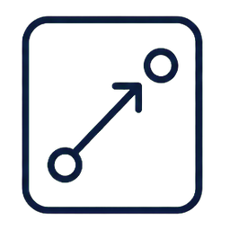
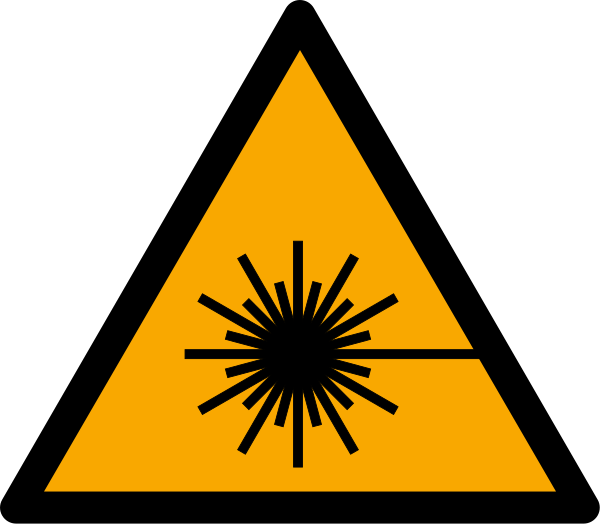

# Der Laser: Stimulierte Emission, Besetzungsinversion, Resonator (Umbau) {.unnumbered #sec-umbau-laser}

::: {.content-visible when-format="html"}
```{=html}
<link rel="stylesheet" href="assets/animations/shared/srt-workbook.css">
<script src="assets/animations/shared/core.js"></script>
<script src="assets/animations/laser/used/atom-licht-wechselwirkungen.js"></script>
<script src="assets/animations/laser/used/besetzungsinversion.js"></script>
<script src="assets/animations/laser/used/metastabil.js"></script>
<script src="assets/animations/laser/used/resonator.js"></script>
<script src="assets/animations/laser/used/spektren-zoom.js"></script>
<script src="assets/animations/laser/used/rubinlaser.js"></script>
<script src="assets/animations/laser/used/he-ne.js"></script>
<script src="assets/animations/laser/used/hene-spektroskop.js"></script>
<script src="assets/animations/shared/srt-workbook.js"></script>
```
:::

Laser begegnen dir ständig im Alltag. Im Glasfasernetz transportiert Laserlicht deine Daten durch das Internet. Bei Veranstaltungen erzeugen Laser Lichtshows. In Präsentationen dienen sie als Pointer. In Hautarztpraxen entfernen sie Tattoos und Pigmentflecken. Und mit Laserpulsen lassen sich Entfernungen extrem genau messen, sogar die Distanz von der Erde zum Mond.

So unterschiedlich diese Anwendungen sind: Ihnen allen liegt dieselbe Erkenntnis aus der Quantenphysik zugrunde. Drei Konzepte tragen dieses Kapitel, und sie bauen aufeinander auf: Bei der stimulierten Emission löst ein Photon ein zweites, gleiches Photon aus. Die Besetzungsinversion sorgt dafür, dass dieser Vorgang das Licht im Medium verstärkt. Der Resonator formt aus der Verstärkung den gebündelten Laserstrahl. Am Rubinlaser und am Helium-Neon-Laser setzt du diese Bausteine zu vollständigen Geräten zusammen, und zum Schluss klärst du, was Laserlicht gefährlich macht.

## Stimulierte Emission

::: {.mp-goal-strip}
Du <u>beschreibst</u> die drei Prozesse Absorption, spontane Emission und stimulierte Emission.

Du <u>beurteilst</u> mit der Bedingung $E_\text{Photon} = \Delta E = h f$, ob ein Atom ein Photon absorbieren kann.

Du <u>vergleichst</u> spontane und stimulierte Emission.
:::

Laser gibt es heute in großer Vielfalt: vom schwachen roten Pointer bis zum Schneidlaser in der Industrie, mit sichtbarem Licht oder unsichtbarem Infrarot, als Dauerstrahl oder als kurzer Puls. So verschieden ihr Licht ist, eines haben alle gemeinsam, und es steht schon im Namen: „Laser" ist ein Akronym für „Light Amplification by Stimulated Emission of Radiation", auf Deutsch: Lichtverstärkung durch stimulierte Emission von Strahlung. Was stimulierte Emission ist, klärt dieser Abschnitt.

Materie wechselwirkt ständig mit Licht. Ein schwarzes T-Shirt schluckt das Sonnenlicht und wird warm: Es nimmt Energie aus dem Licht auf. Der glühende Draht einer Glühlampe gibt Energie als Licht ab. Aufnehmen und Abgeben: Das sind die zwei Richtungen im Energieaustausch zwischen Licht und Materie.

Bei Atomen läuft dieser Austausch in drei Grundprozessen ab: Absorption, spontane Emission und stimulierte Emission. Die ersten beiden begegnen dir überall im Alltag. Der dritte ist dort unscheinbar. Auf ihm beruht der Laser.

Alle drei Prozesse laufen in festen Schritten ab: Ein Atom besitzt bestimmte Energieniveaus. Wir betrachten hier zwei davon: Das niedrigere Niveau nennen wir $E_1$. Es steht hier für den Grundzustand. Das höhere Niveau nennen wir $E_2$. Befindet sich das Atom dort, ist es angeregt. Der Energieabstand zwischen beiden Niveaus ist $\Delta E = E_2 - E_1$.

Ein Photon trägt die Energie $E_\text{Photon} = h f$. Dabei ist $h$ das Plancksche Wirkungsquantum und $f$ die Frequenz des Lichts. Ein Atom im Grundzustand kann ein Photon aufnehmen, wenn dessen Energie genau zum Abstand der beiden Energieniveaus passt:

$$
E_\text{Photon} = h f = \Delta E = E_2 - E_1
$$ {#eq-laser-photonenenergie}

Das Photon wird absorbiert. Seine Energie geht auf das Atom über. Das Atom wechselt vom Grundzustand $E_1$ in den angeregten Zustand $E_2$. Diesen Vorgang nennt man Absorption.[Absorption]{.column-margin .mp-randbegriff} Das schwarze T-Shirt zeigt ihn millionenfach: Seine Farbstoffe absorbieren das Sonnenlicht. Die aufgenommene Energie geht dort schnell in die Bewegung der Moleküle über, und der Stoff wird warm. Die Animation zeigt diesen Übergang. Der große Kreis deutet das Atom an. Der blaue Punkt steht für den Energiezustand des Atoms: Er sitzt auf dem Niveau, in dem sich das Atom gerade befindet.

::: {.content-visible when-format="html"}
```{=html}
<figure class="srt-workbook-figure srt-workbook-figure--caption-inside">
  <div class="srt-workbook-stage" data-srt-animation="laser-absorption" data-srt-motion-control data-srt-label="Absorption: Ein Photon mit passender Energie trifft auf ein Atom im Grundzustand. Das Photon wird absorbiert, und das Atom wechselt in den angeregten Zustand."></div>
  <figcaption>Animation zur Absorption: Ein Photon mit passender Energie trifft auf ein Atom im Grundzustand, wird absorbiert, und das Atom wechselt in den angeregten Zustand.</figcaption>
</figure>
```
:::

::: {.content-visible unless-format="html"}
::: {.srt-workbook-fallback}
In der HTML-Version erscheint hier eine Animation: Ein Photon trifft auf ein Atom im Grundzustand. Das Photon wird absorbiert, und das Atom wechselt in den angeregten Zustand.
:::
:::

Ein angeregtes Atom kann später wieder in ein niedrigeres Energieniveau wechseln. Die frei werdende Energie verlässt das Atom als neues Photon. Dieser Vorgang heißt spontane Emission.[spontane Emission]{.column-margin .mp-randbegriff}

Der Vorgang startet im angeregten Atom selbst. Der genaue Zeitpunkt ist zufällig. Auch die Richtung des ausgesandten Photons ist zufällig. Viele Atome senden bei spontaner Emission in viele Richtungen. Das Licht ist ungeordnet. Die Glühlampe zeigt die Folge: Ihr Licht verteilt sich in alle Richtungen. Die Animation zeigt eine solche zufällige Emission.

::: {.content-visible when-format="html"}
```{=html}
<figure class="srt-workbook-figure srt-workbook-figure--caption-inside">
  <div class="srt-workbook-stage" data-srt-animation="laser-spontane-emission" data-srt-motion-control data-srt-label="Spontane Emission: Ein angeregtes Atom wechselt in ein niedrigeres Energieniveau und sendet dabei ein Photon aus. Zeitpunkt und Richtung sind zufällig."></div>
  <figcaption>Animation zur spontanen Emission: Ein angeregtes Atom wechselt in ein niedrigeres Energieniveau und sendet ein Photon in zufälliger Richtung aus.</figcaption>
</figure>
```
:::

::: {.content-visible unless-format="html"}
::: {.srt-workbook-fallback}
In der HTML-Version erscheint hier eine Animation: Ein angeregtes Atom wechselt in ein niedrigeres Energieniveau und sendet dabei ein Photon in zufälliger Richtung aus.
:::
:::

::: {.mp-box .mp-misconception}
<div class="mp-title">Folgt auf die Absorption immer die Aussendung eines Photons?</div>
Das Niveauschema legt das nahe: Das Atom nimmt Energie auf, sitzt eine Weile im angeregten Zustand und gibt die Energie als Photon wieder ab. Für ein einzelnes, ungestörtes Atom stimmt das auch.

In dichter Materie ist ein Atom aber selten ungestört. Es kann seine Energie auch ohne Licht loswerden, zum Beispiel durch Stöße mit seinen Nachbarn: Die Anregungsenergie geht dann in Bewegung über. Das schwarze T-Shirt nimmt diesen Weg: Es wird warm statt zu leuchten.
:::

::: {.mp-box .mp-task}
<span class="mp-task-kind mp-task-kind-think" aria-label="Denkcheck">
  
  Denkcheck
</span>

Ein Atom absorbiert Photonen der Frequenz $5{,}5 \cdot 10^{14}\,\mathrm{Hz}$. Nun trifft ein intensiver Lichtpuls auf das Atom. Er enthält sehr viele Photonen der Frequenz $5{,}3 \cdot 10^{14}\,\mathrm{Hz}$.

<u>Beurteile</u>, ob Photonen aus diesem Lichtpuls absorbiert werden können.
:::

<details class="mp-details">
<summary>Mögliche Lösung anzeigen</summary>

Nein. Für einen einzelnen Absorptionsvorgang zählt die Energie eines einzelnen Photons. Zu diesem Abstand der Energieniveaus gehört die Frequenz $5{,}5 \cdot 10^{14}\,\mathrm{Hz}$. Ein Photon mit $5{,}3 \cdot 10^{14}\,\mathrm{Hz}$ hat eine niedrigere Frequenz und damit eine geringere Energie. Sehr viele solche Photonen bedeuten hohe Intensität. Die Energie pro Photon bleibt aber zu klein. Photonen aus diesem Lichtpuls werden für diesen Übergang nicht absorbiert.

</details>

Bleibt der dritte Grundprozess, der für den Laser ausschlaggebende: Ein passendes Photon trifft auf ein Atom, das bereits angeregt ist. Das ankommende Photon bleibt erhalten und läuft weiter. Zugleich wechselt das Atom in das niedrigere Energieniveau und sendet ein zweites Photon aus.

Dieses zweite Photon passt zum auslösenden Photon. Beide Photonen haben dieselbe Energie und wegen $E_\text{Photon} = h f$ auch dieselbe Frequenz. Vor allem aber laufen beide danach in dieselbe Richtung und schwingen im gleichen Takt: wie zwei Zwillingssoldaten, die nach dem Salutieren gemeinsam losmarschieren, in dieselbe Richtung und im Gleichschritt. Dieser Vorgang heißt stimulierte Emission. Die Animation zeigt, wie aus einem Photon zwei werden.

::: {.content-visible when-format="html"}
```{=html}
<figure class="srt-workbook-figure srt-workbook-figure--caption-inside">
  <div class="srt-workbook-stage" data-srt-animation="laser-stimulierte-emission" data-srt-motion-control data-srt-label="Stimulierte Emission: Ein passendes Photon trifft auf ein angeregtes Atom. Das ankommende Photon läuft weiter und löst ein zweites gleiches Photon aus."></div>
  <figcaption>Animation zur stimulierten Emission: Ein passendes Photon trifft auf ein angeregtes Atom, läuft weiter und löst ein zweites, gleiches Photon aus.</figcaption>
</figure>
```
:::

::: {.content-visible unless-format="html"}
::: {.srt-workbook-fallback}
In der HTML-Version erscheint hier eine Animation: Ein passendes Photon trifft auf ein angeregtes Atom. Danach laufen zwei gleiche Photonen weiter.
:::
:::

Die stimulierte Emission beschreibt zunächst einen einzelnen atomaren Vorgang: Ein passendes Photon löst eine exakte Kopie seiner selbst aus. Jede Kopie kann weitere Kopien auslösen. Was heißt dabei „im gleichen Takt"? Licht lässt sich in zwei Bildern beschreiben: als Strom von Photonen und als Welle. Beide Bilder gehören zum selben Licht; je nach Phänomen ist das eine oder das andere das passende Werkzeug. Im Wellenbild laufen die Wellen aus derselben Kette im Gleichschritt: Wellenberg liegt auf Wellenberg, Wellental auf Wellental.

Für diesen Gleichschritt hat die Physik ein Wort: Solche Wellen heißen kohärent.[kohärent]{.column-margin .mp-randbegriff} Der Begriff verlangt weniger: Kohärente Wellen dürfen gegeneinander versetzt sein, solange der Versatz fest bleibt, sie halten eine feste Phasenbeziehung zueinander. Im Bild der Soldaten: Einer tritt immer etwas später auf als der andere, der zeitliche Abstand zwischen ihren Schritten bleibt dabei gleich. Die Wellenzüge aus derselben Kette zeigen den strengsten Fall, ihr Versatz ist null. Im Medium starten solche Ketten allerdings an vielen Stellen und in viele Richtungen. Wie daraus ein einziger geordneter Strahl wird, klärt der Abschnitt zum Resonator.

Kohärentes Licht brauchst du überall dort, wo Licht mit Licht überlagert wird, bei der Interferenz. Moderne Michelson-Interferometer, etwa zur Messung von Gravitationswellen, arbeiten mit Laserlicht; das Michelson-Morley-Experiment hast du im [Kapitel zu Raum und Zeit](01_srt_raum_und_zeit.qmd#michelson-morley-experiment) kennengelernt.

Wir unterscheiden drei Wechselwirkungen von Atomen und Licht:

1. Bei der Absorption nimmt ein Atom ein Photon auf.
2. Bei der spontanen Emission sendet ein angeregtes Atom von selbst ein Photon aus.
3. Bei der stimulierten Emission löst ein passendes Photon die Aussendung eines zweiten, gleichen Photons aus.

::: {.mp-box .mp-task}
<span class="mp-task-kind mp-task-kind-think" aria-label="Denkcheck">
  
  Denkcheck
</span>

Bei der spontanen und bei der stimulierten Emission sendet ein angeregtes Atom ein Photon aus.

<u>Vergleiche</u> die beiden Vorgänge nach Auslöser, Zeitpunkt und Richtung des ausgesandten Photons.
:::

<details class="mp-details">
<summary>Mögliche Lösung anzeigen</summary>
<p>Die spontane Emission startet im Atom selbst. Zeitpunkt und Richtung des Photons sind zufällig. Die stimulierte Emission wird von einem passenden Photon ausgelöst. Sie geschieht beim Eintreffen dieses Photons, und das neue Photon läuft in dieselbe Richtung wie das auslösende. Es schwingt zudem im gleichen Takt.</p>
</details>

## Besetzungsinversion und Lasermedium

::: {.mp-goal-strip}
Du <u>erklärst</u>, was eine Besetzungsinversion ist.

Du <u>berechnest</u> Besetzungsverhältnisse im thermischen Gleichgewicht und <u>begründest</u> damit, dass ein Lasermedium gepumpt werden muss.

Du <u>erklärst</u>, wozu ein metastabiles Niveau dient.
:::

Die stimulierte Emission aus dem letzten Abschnitt ist seit 1917 bekannt [@einstein1972quantum]. Der erste Laser gelang trotzdem erst 1960, über vierzig Jahre später. Ein wesentlicher Grund für diese Lücke steckt in diesem Abschnitt: Damit ein Medium Licht verstärkt, muss es in einen Zustand gebracht werden, der sich in gewöhnlicher Materie nie von selbst einstellt.

Stell dir eine La-Ola-Welle im Stadion vor. Sie läuft durch die Ränge, weil immer neue Zuschauer aufspringen. Damit sie weiterläuft, müssen entlang ihres Wegs genug Leute bereit sein aufzuspringen. Sind zu wenige bereit, bricht die Welle ab.

Ein Photon, dessen Energie zum Abstand zweier Niveaus passt, kann zweierlei bewirken. Trifft es ein Atom im Grundzustand $E_1$, kann es absorbiert werden. Trifft es ein angeregtes Atom im Niveau $E_2$, kann es stimulierte Emission auslösen: Ein zweites, gleiches Photon kommt hinzu. Im Bild der La-Ola-Welle entspricht ein angeregtes Atom einem Zuschauer, der bereit ist aufzuspringen.

Was mit einem passenden Photon geschieht, hängt von der Besetzung der Energieniveaus ab. Verstärkung bedeutet: Die stimulierte Emission überwiegt die Absorption. Dafür müssen mehr Atome im höheren Niveau $E_2$ sitzen als im tieferen $E_1$. Dann trifft ein Photon öfter auf ein angeregtes Atom als auf ein Atom im Grundzustand, und aus einem Photon werden viele gleiche. Dieser Zustand heißt Besetzungsinversion: Die Besetzung ist gegenüber dem Normalfall umgekehrt. Verglichen werden dabei genau die beiden Niveaus des Übergangs, um den es geht; die Besetzung aller anderen Niveaus spielt für die Inversion keine Rolle. Im Stadionbild sind genug Zuschauer bereit aufzuspringen, die Welle läuft. Wie ein Medium in diesen Zustand kommt, klären wir in zwei Schritten.

In der Simulation schaltest du zwischen normaler Besetzung und Besetzungsinversion um. Jedes Atom zeigt seine beiden Niveaus $E_1$ und $E_2$. Der Punkt zeigt wieder den Energiezustand des Atoms: sitzt er oben auf $E_2$, ist das Atom angeregt, unten auf $E_1$ ist es im Grundzustand. Bei normaler Besetzung wird ein durchlaufendes Photon absorbiert, und angeregte Atome emittieren spontan in zufällige Richtungen. Bei Besetzungsinversion löst ein Photon an angeregten Atomen stimulierte Emission aus. Dabei entsteht eine Art Lawine aus identischen Photonen.

::: {.content-visible when-format="html"}
```{=html}
<figure class="srt-workbook-figure srt-workbook-figure--caption-inside">
  <div class="srt-workbook-stage" data-srt-animation="laser-besetzungsinversion" data-srt-motion-control data-srt-label="Interaktive Darstellung mit Umschalter zwischen normaler Besetzung und Besetzungsinversion. Ein Photon läuft durch das Medium. Jedes Atom hat zwei Niveaus, ein Punkt zeigt den Energiezustand des Atoms. Bei normaler Besetzung wird das Photon absorbiert und angeregte Atome emittieren spontan. Bei Besetzungsinversion löst ein Photon an angeregten Atomen stimulierte Emission aus. Dabei entsteht eine Art Lawine aus identischen Photonen."></div>
  <figcaption>Simulation zur Besetzungsinversion: Ein Photon durchläuft das Medium, umschaltbar zwischen normaler Besetzung und Besetzungsinversion.</figcaption>
</figure>
```
:::

::: {.content-visible unless-format="html"}
::: {.srt-workbook-fallback}
In der HTML-Version erscheint hier eine Simulation mit einem Umschalter zwischen normaler Besetzung und Besetzungsinversion.
:::
:::

Den Normalfall beschreibt das thermische Gleichgewicht, der gewöhnliche Zustand der Materie: Fast alle Atome sitzen im Grundzustand.[thermisches Gleichgewicht]{.column-margin .mp-randbegriff} Ein passendes Photon trifft dann meist auf ein Atom im Grundzustand und wird absorbiert.

Diese normale Besetzung wird durch die Boltzmann-Verteilung beschrieben. Für unser Zwei-Niveau-Modell gilt im thermischen Gleichgewicht näherungsweise:

$$
\frac{N_2}{N_1} = e^{-\frac{E_2-E_1}{k_\mathrm{B}T}}
$$ {#eq-laser-boltzmann}

$N_2$ ist die Zahl der Atome im höheren Niveau. $N_1$ ist die Zahl der Atome im tieferen Niveau. $k_\mathrm{B}$ ist die Boltzmann-Konstante. $T$ ist die absolute Temperatur. Je größer der Energieabstand im Vergleich zu $k_\mathrm{B}T$ ist, desto kleiner ist der Anteil der Atome in $E_2$.

In der Formel steckt folgende Aussage. Der Exponent ist bei jeder Temperatur negativ, das Verhältnis $N_2/N_1$ bleibt immer kleiner als 1. Heizt man das Medium, steigt $N_2$ zwar an. Selbst wenn die Temperatur unendlich groß sein könnte, erreicht die Besetzung höchstens die Gleichbesetzung $N_2 = N_1$. Eine Besetzungsinversion ist im thermischen Gleichgewicht unerreichbar, egal bei welcher Temperatur.

::: {.mp-box .mp-task}
<span class="mp-task-kind mp-task-kind-calculate" aria-label="Berechnung">
  
  Berechnung
</span>

Ein Medium enthält $10^{20}$ Atome. Der Übergang hat den Energieabstand $E_2 - E_1 = 2{,}0\,\mathrm{eV} = 3{,}2 \cdot 10^{-19}\,\mathrm{J}$, das entspricht rotem Licht. Das Medium liegt bei Raumtemperatur vor: $T = 300\,\mathrm{K}$, $k_\mathrm{B} = 1{,}38 \cdot 10^{-23}\,\tfrac{\mathrm{J}}{\mathrm{K}}$.

<u>Berechne</u> das Besetzungsverhältnis $N_2/N_1$ und daraus, wie viele der $10^{20}$ Atome angeregt sind.
:::

<details class="mp-details">
<summary>Mögliche Lösung anzeigen</summary>

Der Exponent der Boltzmann-Verteilung ist

$$
\frac{E_2 - E_1}{k_\mathrm{B}\,T}
= \frac{3{,}2 \cdot 10^{-19}\,\mathrm{J}}{1{,}38 \cdot 10^{-23}\,\tfrac{\mathrm{J}}{\mathrm{K}} \cdot 300\,\mathrm{K}}
\approx 77.
$$

Damit gilt $N_2/N_1 = e^{-77} \approx 10^{-34}$. Von den $10^{20}$ Atomen sind im Mittel $10^{20} \cdot 10^{-34} = 10^{-14}$ angeregt: kein einziges Atom. Ein passendes Photon trifft in diesem Medium praktisch immer auf ein Atom im Grundzustand und wird absorbiert. Für stimulierte Emission fehlen die Partner. Ohne Energiezufuhr von außen gibt es keine Verstärkung.

</details>

Der erste Schritt zur Inversion ist eine Energiezufuhr von außen. Sie hebt Atome in höhere Energieniveaus und bringt das Medium aus dem thermischen Gleichgewicht. Diese Energiezufuhr heißt Pumpen.[Pumpen]{.column-margin .mp-randbegriff} Je nach Lasertyp geschieht das mit Licht, etwa aus einer Blitzlampe, oder mit einem elektrischen Strom, der durch ein Gas oder einen Halbleiter fließt.

Pumpen allein reicht aber noch nicht. Man könnte versuchen, die Atome mit Licht direkt vom Grundzustand $E_1$ in das obere Laserniveau $E_2$ zu pumpen. Das scheitert an einem Wettlauf: Dasselbe Pumplicht passt auch zum Übergang nach unten. Es löst an bereits angeregten Atomen stimulierte Emission aus, und beide Vorgänge sind pro Atom gleich wahrscheinlich.

Solange mehr Atome unten sitzen, überwiegt die Absorption. Je näher die Besetzung an die Hälfte rückt, desto öfter trifft das Pumplicht ein angeregtes Atom und schickt es wieder nach unten. Mit zwei Niveaus ist höchstens Gleichbesetzung erreichbar, eine Inversion nie. 

Der zweite Schritt ist darum ein Material, dessen Atome ein metastabiles Niveau besitzen.[metastabiler Zustand]{.column-margin .mp-randbegriff} Metastabil bedeutet hier: Die Atome bleiben in einem solchen Niveau deutlich länger als in einem gewöhnlichen angeregten Zustand, oft tausend- bis millionenfach solang. Spontane Emission ist in diesem Zustand weiterhin möglich, tritt aber verzögert auf. So kann die Zahl der Atome in diesem Niveau steigen.

Das metastabile Niveau umgeht den Wettlauf. Gepumpt wird auf ein höheres Niveau, von dort gelangen die Atome in das metastabile Niveau. Der Laserübergang startet dort und hat eine andere Energie als das Pumplicht. Das Pumplicht kann die Atome aus diesem Niveau nicht wieder nach unten bringen.

Das metastabile Niveau kannst du dir mit einer Kugel am Berg vorstellen. Oben hat die Kugel potenzielle Energie. Auf einem glatten Hang rollt sie schnell bis nach unten. Befindet sich auf halbem Weg eine Mulde, bleibt die Kugel dort kurz liegen, bevor sie weiterrollt. Die Mulde entspricht dem metastabilen Niveau.

Die folgende Animation zeigt diese Analogie und ein Drei-Niveau-System mit metastabilem Niveau.

::: {.content-visible when-format="html"}
```{=html}
<figure class="srt-workbook-figure srt-workbook-figure--caption-inside">
  <div class="srt-workbook-stage" data-srt-animation="laser-metastabil" data-srt-motion-control data-srt-label="Eine Kugel rollt einen Berg hinab und bleibt in einer Mulde auf halbem Weg liegen, bevor sie weiter zum Grundzustand rollt. Die Mulde steht für das metastabile Niveau. Rechts zeigt ein Drei-Niveau-System mit Pumpniveau, metastabilem Niveau und Grundzustand."></div>
  <figcaption>Animation zum metastabilen Niveau: Eine Kugel bleibt in einer Mulde auf halbem Weg liegen; daneben ein Drei-Niveau-System mit Pumpniveau, metastabilem Niveau und Grundzustand.</figcaption>
</figure>
```
:::

::: {.content-visible unless-format="html"}
::: {.srt-workbook-fallback}
In der HTML-Version erscheint hier eine Darstellung: Eine Kugel rollt einen Berg hinab und bleibt in einer Mulde auf halbem Weg liegen, bevor sie weiter nach unten zum Grundzustand rollt. Die Mulde steht für das metastabile Niveau. Daneben steht ein Drei-Niveau-System mit Pumpniveau, metastabilem Niveau und Grundzustand.
:::
:::

::: {.mp-box .mp-task}
<span class="mp-task-kind mp-task-kind-transfer" aria-label="Transfer">
  
  Transfer
</span>

Vielleicht kennst du nachleuchtende Sterne an der Zimmerdecke oder Leuchtstreifen auf Uhren: Sie liegen zuerst im Licht und leuchten nach dem Ausschalten noch minutenlang weiter.

<u>Erkläre</u> das Nachleuchten mithilfe des metastabilen Niveaus.
:::

<details class="mp-details">
<summary>Mögliche Lösung anzeigen</summary>
<p>Das Licht regt die Teilchen des Leuchtstoffs an, sie nehmen Energie auf. Ein Teil der Teilchen gelangt in metastabile Zustände und bleibt dort deutlich länger als in gewöhnlichen angeregten Zuständen. Die spontane Emission tritt stark verzögert auf: Die gespeicherte Energie wird über Minuten nach und nach als Licht abgegeben. Die Sterne leuchten weiter, obwohl die Lichtquelle aus ist.</p>
<p>Bei modernen nachleuchtenden Leuchtstoffen, zum Beispiel Strontiumaluminat, ist die Erklärung im Detail feiner. Vereinfacht gesagt werden Elektronen in Störstellen der Kristallstruktur eingefangen. Sie sitzen dort auf einem höheren Energieniveau. Kleine Energiemengen aus der Umgebung, oft Wärme, können sie wieder befreien. Danach wird die gespeicherte Energie als Licht abgegeben.</p>
<p>Dieses lange Nachleuchten heißt Phosphoreszenz. Der Kern bleibt: Es gibt Zustände, aus denen die Emission stark verzögert erfolgt.</p>
</details>

Beide Schritte zusammen erzeugen die Besetzungsinversion. Das Pumpen hebt Atome auf ein höheres Niveau, von dort sammeln sie sich im metastabilen Niveau an, bis dort mehr Atome sitzen als im tieferen Grundzustand. Bei der stimulierten Emission wechseln Atome vom metastabilen Niveau nach unten und senden Photonen aus, die Besetzung sinkt wieder. Sich selbst überlassen, kippt das Medium in den Normalzustand zurück. Damit die Inversion bestehen bleibt, muss ständig weitergepumpt werden.

## Resonator

::: {.mp-goal-strip}
Du <u>beschreibst</u> den Aufbau eines optischen Resonators.

Du <u>erklärst</u>, wie der Resonator die Richtung des Laserstrahls festlegt und wie der Strahl ausgekoppelt wird.

Du <u>erläuterst</u> die Resonanzbedingung und <u>wendest</u> sie <u>an</u>.
:::

Eine Taschenlampe kann sehr hell sein. Ihr Licht breitet sich trotzdem kegelförmig aus. Ein Laserpointer bleibt über mehrere Meter ein enger Lichtfleck. Hinter diesem Unterschied steckt ein neues Bauteil: der Resonator.

Bis hierhin kann das Lasermedium Licht verstärken. Für einen Laser bleiben aber zwei Probleme offen:

- Die entstehenden Photonen laufen zufällig in alle Richtungen.
- Bei einem einzigen Durchgang durch das Medium bleibt die Intensität des Lichts gering.

Im gepumpten Medium löst schon ein einzelnes Photon eine Lawine gleicher Photonen durch stimulierte Emission aus. Dieses erste Photon entsteht durch spontane Emission, seine Richtung ist zufällig. Die ganze Lawine läuft dann in diese zufällige Richtung. Die meisten dieser Photonen verlassen das Medium seitlich oder schräg. Der enge Laserstrahl, den du kennst, entsteht so noch nicht.

Der Resonator löst dieses Problem: Er ist eine Anordnung aus zwei gegenüberliegenden Spiegeln, zwischen denen Licht hin- und herlaufen kann. Im Laser liegt das Lasermedium zwischen den Spiegeln. Ein Spiegel reflektiert möglichst vollständig. Der zweite Spiegel ist teildurchlässig. Er reflektiert den größten Teil des Lichts zurück und lässt einen kleineren Teil austreten. Auf dieser Seite tritt der Laserstrahl aus.

Nur Licht, das ungefähr entlang der Resonatorachse läuft, trifft die Spiegel immer wieder. Dieses Licht durchquert das Lasermedium mehrfach. Bei jedem Durchgang kann es an angeregten Atomen stimulierte Emission auslösen. Die neu entstehenden Photonen haben dieselbe Frequenz und laufen in dieselbe Richtung.

Schräg ausgesandtes Licht verlässt den Resonator nach kurzer Zeit. Es wird kaum weiter verstärkt. Der Resonator wählt damit eine Richtung aus: Entlang der Spiegelachse wächst die Zahl der Photonen. Die Lichtintensität nimmt zu.

Die folgende Simulation zeigt diesen Unterschied. Schalte zwischen beiden Aufbauten um. Ohne Resonator laufen die Photonen in alle Richtungen aus dem Medium. Mit Resonator läuft das Licht zwischen den Spiegeln hin und her. Es durchquert das gepumpte Medium mehrfach, wird verstärkt und tritt durch den teildurchlässigen Spiegel als Laserstrahl aus.

In der Simulation stehen rote Punkte für einzelne Photonen. Diese Punktdarstellung ersetzt die längeren Wellenzüge, damit viele Photonen gleichzeitig sichtbar bleiben.

::: {.content-visible when-format="html"}
```{=html}
<figure class="srt-workbook-figure srt-workbook-figure--caption-inside">
  <div class="srt-workbook-stage" data-srt-animation="laser-resonator" data-srt-motion-control data-srt-label="Interaktive Darstellung eines Lasermediums mit angeregten Atomen. Pumplicht regt Atome an. Ein Umschalter wechselt zwischen zwei Aufbauten. Ohne Resonator laufen Photonen in viele Richtungen aus dem Medium. Mit Resonator schließen ein voll reflektierender und ein teildurchlässiger Spiegel das Medium ein. Achsnahes Licht läuft zwischen den Spiegeln hin und her, wird verstärkt und tritt rechts als Laserstrahl aus."></div>
  <figcaption>Simulation eines Lasermediums mit und ohne Resonator (umschaltbar).</figcaption>
</figure>
```
:::

::: {.content-visible unless-format="html"}
::: {.srt-workbook-fallback}
In der HTML-Version erscheint hier eine Simulation mit Umschalter: Ohne Resonator senden die angeregten Atome Photonen in alle Richtungen aus, die das Medium verlassen. Mit Resonator schließen zwei Spiegel das Medium ein. Das Licht läuft zwischen ihnen hin und her, wird bei jedem Durchgang verstärkt und tritt durch den teildurchlässigen Spiegel als Laserstrahl aus.
:::
:::

::: {.mp-box .mp-task}
<span class="mp-task-kind mp-task-kind-think" aria-label="Denkcheck">
  
  Denkcheck
</span>

Ein Photon entsteht im Lasermedium durch spontane Emission und läuft schräg zur Resonatorachse.

<u>Begründe</u>, dass es den Laserstrahl nicht aufbaut.
:::

<details class="mp-details">
<summary>Mögliche Lösung anzeigen</summary>

Das Photon trifft die Spiegel nicht immer wieder. Es verlässt das Lasermedium nach kurzer Zeit. Damit durchquert es das Medium nur selten und löst kaum stimulierte Emission in Strahlrichtung aus. Für den Laserstrahl werden vor allem Photonen verstärkt, die entlang der Resonatorachse laufen.

</details>

Bisher hast du das Licht in diesem Kapitel meist als Strom von Photonen betrachtet, auch die Simulation zeigt einzelne Lichtteilchen. Nur beim gleichen Takt der Photonen kam das Wellenbild kurz ins Spiel. Das Teilchenbild eignet sich gut für die stimulierte Emission: Ein Photon löst ein zweites aus. Es zeigt aber nur eine Seite des Lichts. Aus der Optik kennst du Phänomene wie die Interferenz: Um sie zu erklären, brauchst du das Wellenbild. Erst in diesem Bild wird eine zweite Eigenschaft des Resonators sichtbar, auf die schon sein Name hinweist.

Im Wellenbild läuft eine Lichtwelle zwischen den Spiegeln hin und her. Nach einem Hin- und Rückweg trifft sie wieder auf sich selbst. Passt sie phasenrichtig, verstärkt sie sich bei jedem Umlauf durch konstruktive Interferenz. Passt sie nicht, löscht sie sich über viele Umläufe aus. Das kennst du von einer stehenden Schallwelle zwischen zwei Enden, etwa im Kundtschen Rohr aus der Akustik.

Im einfachen Modell passt die Resonatorlänge $L$, wenn ein ganzzahliges Vielfaches der halben Wellenlänge zwischen die Spiegel passt:

$$
L = m \cdot \frac{\lambda}{2}
\qquad \text{mit} \qquad m = 1, 2, 3, \dots
$$ {#eq-laser-resonanzbedingung}

Diese Bedingung heißt Resonanzbedingung.[Resonanzbedingung]{.column-margin .mp-randbegriff} Ist sie erfüllt, bildet sich eine stehende Welle aus. Solche passenden Wellen nennt man Resonatormoden.[Resonatormoden]{.column-margin .mp-randbegriff} Sie bauen sich mit jedem Umlauf stärker auf. Andere Wellenlängen passen schlechter zur Spiegelanordnung und werden unterdrückt. Der Resonator wählt so wenige, scharf festgelegte Wellenlängen aus. Das trägt dazu bei, dass Laserlicht sehr einfarbig ist.

::: {.mp-box .mp-task}
<span class="mp-task-kind mp-task-kind-calculate" aria-label="Berechnung">
  
  Berechnung
</span>

Ein Resonator ist $L = 35\,\mathrm{cm}$ lang. Das Lasermedium verstärkt rotes Licht mit $\lambda = 700\,\mathrm{nm}$.

<u>Berechne</u>, wie viele halbe Wellenlängen zwischen die Spiegel passen.
:::

<details class="mp-details">
<summary>Mögliche Lösung anzeigen</summary>

Die Resonanzbedingung (@eq-laser-resonanzbedingung) wird nach $m$ aufgelöst:

$$
m = \frac{2L}{\lambda}
  = \frac{2 \cdot 0{,}35\,\mathrm{m}}{7{,}00 \cdot 10^{-7}\,\mathrm{m}}
  = 1\,000\,000.
$$

Eine Million halber Wellenlängen passt zwischen die Spiegel.

</details>

::: {.mp-box .mp-misconception}
<div class="mp-title">Muss der Spiegelabstand exakt stimmen?</div>
Die Bedingung $L = m \cdot \frac{\lambda}{2}$ kann den Eindruck erwecken, eine stehende Welle entstehe nur bei ganz bestimmten Spiegelabständen. Beim Kundtschen Rohr stimmt das: Dort liegen Wellenlänge und Rohrlänge in derselben Größenordnung, und zwischen zwei passenden Längen liegt ein deutlicher Abstand.

Beim Laser ist die Wellenlänge des Lichts um viele Größenordnungen kleiner als der Spiegelabstand. Die Zahl $m$ liegt bei Hunderttausenden. Springt $m$ um eins weiter, ändert sich die passende Wellenlänge nur winzig. Dicht neben jeder Wellenlänge liegt also schon die nächste Resonatormode.

Dazu kommt: Der Übergang zwischen den Energieniveaus liefert kein perfekt einfarbiges Licht, sondern Licht in einem schmalen Wellenlängenbereich. Die Bedingung $E_\text{Photon} = \Delta E$ aus dem ersten Abschnitt gilt mit einer entsprechend kleinen Toleranz. In diesem Bereich liegen immer passende Moden. Eine stehende Welle bildet sich damit bei praktisch jedem Spiegelabstand aus.

Daraus erklärt sich auch der Unterschied zur Spektrallampe, etwa einer Natriumdampflampe. Ihr Licht stammt ebenfalls aus einem Übergang zwischen zwei Niveaus, und ihre Linie zeigt dessen volle Breite. Beim Laser bietet der Übergang denselben Bereich an. Doch verstärkt wird nur Licht, das zusätzlich in den Resonator passt: die Moden aus diesem Bereich. Jede Mode legt eine einzelne Wellenlänge scharf fest. Von diesen Moden setzt sich oft eine einzige durch. Der Laserstrahl enthält dann eine scharfe Wellenlänge statt der vollen Breite des Übergangs.
:::

Wie einfarbig Laserlicht wirklich ist, zeigt der Vergleich mit anderen Lichtquellen. $\Delta\lambda$ bezeichnet dabei die Breite des ausgesandten Wellenlängenbereichs. Von breit nach schmal:

- **Glühlampe:** das ganze sichtbare Spektrum, sehr großes $\Delta\lambda$.
- **Leuchtdiode:** ein Farbbereich von einigen zehn Nanometern.
- **Spektrallampe:** einzelne Linien, jede mit kleiner, aber messbarer Breite.
- **Laser:** die schmalste Linie, um viele Größenordnungen kleiner als bei der Spektrallampe.

Das folgende interaktive Diagramm zeigt die vier Spektren im selben Bildausschnitt um 589 nm, alle auf gleiche Höhe gebracht. Mit dem Regler zoomst du in die Wellenlängenachse hinein. Zuerst sehen Spektrallampe und Laser gleich aus: zwei schmale Striche. Erst bei starkem Zoom zeigt die Linie der Spektrallampe ihre Breite. Der Laser bleibt auch dann ein schmaler Strich.

::: {.content-visible when-format="html"}
```{=html}
<figure class="srt-workbook-figure srt-workbook-figure--caption-inside">
  <div class="srt-workbook-stage" data-srt-animation="laser-spektren-zoom" data-srt-viewbox-h="560" data-srt-label="Interaktives Diagramm mit vier Spektren übereinander: Glühlampe, Leuchtdiode, Spektrallampe und Laser, jeweils Intensität über der Wellenlänge. Ein Zoomregler verkleinert den dargestellten Wellenlängenbereich von 300 Nanometern bis auf unter ein Tausendstel Nanometer. Beim Hineinzoomen werden Glühlampe und Leuchtdiode praktisch konstant, die Linie der Spektrallampe zeigt ihre Breite, die Linie des Lasers bleibt ein schmaler Strich."></div>
  <figcaption>Interaktives Diagramm: die Spektren von Glühlampe, Leuchtdiode, Spektrallampe und Laser im selben Ausschnitt um 589 nm (Wellenlängenachse zoombar).</figcaption>
</figure>
```
:::

::: {.content-visible unless-format="html"}
::: {.srt-workbook-fallback}
In der HTML-Version erscheint hier ein interaktives Diagramm: vier Spektren im selben Ausschnitt, von der Glühlampe bis zum Laser. Ein Zoomregler verkleinert den dargestellten Wellenlängenbereich Schritt für Schritt. Glühlampe und Leuchtdiode werden dabei praktisch konstant, die Linie der Spektrallampe zeigt ihre Breite, die Linie des Lasers bleibt ein schmaler Strich.
:::
:::

Damit kennst du die besonderen Eigenschaften des Laserlichts und ihre gemeinsame Ursache. Die Richtungsauswahl des Resonators bündelt den Strahl, die Modenauswahl macht ihn sehr einfarbig, und die stimulierte Emission hält die Wellenzüge in fester Phasenbeziehung zueinander: Das Licht ist kohärent. Keine dieser drei Eigenschaften erzeugt die anderen. Sie entstehen gemeinsam, weil Resonator und stimulierte Emission praktisch das gesamte Licht in derselben Mode sammeln.

## Aufbau eines Lasers: der erste Laser

::: {.mp-goal-strip}
Du <u>beschreibst</u> den Aufbau eines Lasers aus Lasermedium, Pumpquelle und Resonator.

Du <u>erklärst</u> am Beispiel des Rubinlasers das Zusammenwirken dieser Bauteile.
:::

1960 baute der Physiker Theodore Maiman den ersten funktionierenden Laser. Sein Lasermedium war ein Rubinkristall. Schon neun Jahre später vermaßen die Pulse eines Rubinlasers die Entfernung zum Mond, und bis heute ist dieser Lasertyp im Einsatz: In Hautarztpraxen entfernen Rubinlaser zum Beispiel Tattoos.

Bisher kennst du die Bausteine einzeln: ein Lasermedium mit Besetzungsinversion, das Pumpen und den Resonator. Jetzt setzt du sie am Beispiel des Rubinlasers zu einem echten Gerät zusammen.

Rubin ist ein Kristall: Korund (Aluminiumoxid) mit einer kleinen Beimischung von Chrom. Einige Aluminium-Ionen im Kristallgitter sind durch Chrom-Ionen ersetzt. In der Gitterumgebung des Korunds besitzen diese Chrom-Ionen die passenden Energieniveaus für den Laser. Sie geben dem Rubin auch seine rote Farbe. Das Lasermedium ist der Rubinkristall als Ganzes. Die aktiven Zentren darin sind die Chrom-Ionen.

Die Chrom-Ionen bilden das Drei-Niveau-System aus dem letzten Abschnitt: den Grundzustand, ein hohes Pumpniveau und dazwischen ein metastabiles Niveau. Um den Rubinstab liegt eine Blitzlampe. Ihr grünes und blaues Licht hebt die Chrom-Ionen vom Grundzustand in das Pumpniveau. Von dort wechseln sie schnell in das metastabile Niveau und sammeln sich.

::: {.mp-box .mp-task}
<span class="mp-task-kind mp-task-kind-think" aria-label="Denkcheck">
  
  Denkcheck
</span>

Die Blitzlampe pumpt mit grünem und blauem Licht.

<u>Begründe</u>, dass rotes Licht die Chrom-Ionen nicht in das Pumpniveau heben kann.
:::

<details class="mp-details">
<summary>Mögliche Lösung anzeigen</summary>

Der Abstand vom Grundzustand zum Pumpniveau ist größer als der Abstand des Laserübergangs. Ein Photon zum Pumpen braucht darum mehr Energie als ein rotes Photon. Wegen $E_\text{Photon} = h f$ gehört zu mehr Energie eine höhere Frequenz, und wegen $c = \lambda \cdot f$ eine kürzere Wellenlänge. Grünes und blaues Licht hat kürzere Wellenlängen als rotes und passt zum großen Abstand. Ein rotes Photon trägt zu wenig Energie: Es kann die Chrom-Ionen nicht in das Pumpniveau heben.

</details>

Die Animation zeigt den Weg eines einzelnen Chrom-Ions durch das Niveauschema: Pumpen in das Pumpniveau, schneller Übergang in das metastabile Niveau, dann der Laserübergang zurück in den Grundzustand.

::: {.content-visible when-format="html"}
```{=html}
<figure class="srt-workbook-figure srt-workbook-figure--caption-inside">
  <div class="srt-workbook-stage" data-srt-animation="laser-rubinlaser-niveaus" data-srt-viewbox-h="270" data-srt-motion-control data-srt-label="Drei-Niveau-System der Chrom-Ionen mit Grundzustand, metastabilem Niveau und Pumpniveau. Ein Punkt zeigt den Energiezustand eines Chrom-Ions: Es wird in das Pumpniveau gepumpt, wechselt schnell in das metastabile Niveau und fällt beim Laserübergang mit 694 Nanometern in den Grundzustand zurück."></div>
  <figcaption>Animation zum Drei-Niveau-System der Chrom-Ionen: Pumpen in das Pumpniveau, schneller Übergang in das metastabile Niveau, Laserübergang in den Grundzustand.</figcaption>
</figure>
```
:::

::: {.content-visible unless-format="html"}
::: {.srt-workbook-fallback}
In der HTML-Version erscheint hier eine Animation: das Drei-Niveau-System der Chrom-Ionen. Ein Punkt zeigt den Energiezustand eines Ions, das gepumpt wird, schnell in das metastabile Niveau wechselt und beim Laserübergang in den Grundzustand zurückfällt.
:::
:::

Das untere Niveau des Laserübergangs ist beim Rubin der Grundzustand. Für eine Besetzungsinversion muss die Blitzlampe also mehr als die Hälfte aller Chrom-Ionen anheben. Ein kurzer, sehr heller Blitz schafft das. Der Rubinlaser arbeitet in Pulsen: Auf jeden Blitz folgt ein Laserpuls.

An den Enden des Stabs sitzen die beiden Spiegel des Resonators. Nach dem Blitz startet ein spontan ausgesandtes Photon auf dem Laserübergang die Lawine: Es löst an angeregten Chrom-Ionen stimulierte Emission aus. Der Resonator wählt die Richtung entlang der Stabachse aus und schickt das Licht immer wieder durch den Stab. Durch den teildurchlässigen Spiegel verlässt ein roter Laserpuls den Kristall. Seine Wellenlänge: 694 nm.

Die Animation zeigt einen Puls des Rubinlasers im Aufbau-Schema: Die Blitzlampe blitzt, rotes Licht baut sich im Stab auf, und der Laserpuls verlässt den Stab durch den teildurchlässigen Spiegel.

::: {.content-visible when-format="html"}
```{=html}
<figure class="srt-workbook-figure srt-workbook-figure--caption-inside">
  <div class="srt-workbook-stage" data-srt-animation="laser-rubinlaser" data-srt-viewbox-h="280" data-srt-motion-control data-srt-label="Aufbau eines Rubinlasers: ein Rubinstab zwischen einem voll reflektierenden und einem teildurchlässigen Spiegel, umgeben von einer wendelförmigen Blitzlampe. Die Lampe blitzt, danach baut sich rotes Licht im Stab auf und ein roter Laserstrahl mit 694 Nanometern tritt rechts aus."></div>
  <figcaption>Animation zum Aufbau des Rubinlasers: Rubinstab zwischen zwei Spiegeln, umgeben von der Blitzlampe; nach dem Blitz tritt rechts ein roter Laserpuls mit 694 nm aus.</figcaption>
</figure>
```
:::

::: {.content-visible unless-format="html"}
::: {.srt-workbook-fallback}
In der HTML-Version erscheint hier eine Animation: der Aufbau des Rubinlasers mit Rubinstab, Blitzlampe und den beiden Spiegeln. Die Lampe blitzt, und ein roter Laserpuls mit 694 nm verlässt den Stab durch den teildurchlässigen Spiegel.
:::
:::

Damit sind alle drei Bausteine beisammen: das Lasermedium (der Rubinstab mit seinen Chrom-Ionen), die Pumpquelle (die Blitzlampe) und der Resonator (die beiden Spiegel an den Stabenden).

::: {.mp-box .mp-task}
<span class="mp-task-kind mp-task-kind-transfer" aria-label="Transfer">
  
  Transfer
</span>

Rubinlaser werden in der Medizin zum Entfernen von Tattoos eingesetzt. Der kurze Laserpuls zerlegt die Farbpigmente in der Haut. Das gelingt nur, wenn das Pigment das Laserlicht absorbiert. Zur Erinnerung: Ein Körper zeigt die Farbe des Lichts, das er zurückstreut; die übrigen Anteile absorbiert er. Eine Person möchte ein rotes Tattoo entfernen lassen.

<u>Beurteile</u>, ob der Rubinlaser mit seiner Wellenlänge von 694 nm (rotes Licht) dafür geeignet ist.
:::

<details class="mp-details">
<summary>Mögliche Lösung anzeigen</summary>
<p>Das rote Pigment erscheint rot, weil es rotes Licht zurückstreut und die übrigen Anteile des sichtbaren Lichts absorbiert. Das Licht des Rubinlasers ist selbst rot. Das Pigment absorbiert es kaum, die Pulsenergie kommt im Pigment nicht an. Für ein rotes Tattoo ist der Rubinlaser ungeeignet.</p>
<p>Die Praxis braucht einen Laser, dessen Licht das rote Pigment absorbiert, zum Beispiel mit grünem Licht. Eine andere Wellenlänge gehört zu einem anderen Laserübergang: Es braucht einen Laser mit einem anderen Lasermedium.</p>
</details>

Die Pulse des Rubinlasers vermaßen auch die Entfernung zum Mond. Im Juli 1969 stellten die Astronauten von Apollo 11 einen Spiegelreflektor auf dem Mond auf. Am 1. August 1969 gelang am Lick-Observatorium in Kalifornien der erste Treffer: Die Blitze eines Rubinlasers liefen durch ein 3-Meter-Teleskop zum Reflektor und zurück, Laufzeit rund 2,5 Sekunden für etwa 770&#8239;000 km. Aus der Laufzeit folgt die Entfernung zum Mond, so genau wie mit keiner Methode zuvor. Unterwegs geht fast das gesamte Licht verloren: Trotz der starken Bündelung läuft der Strahl auf der langen Strecke auseinander, denn perfekt parallel ist kein Lichtstrahl, auch kein Laserstrahl. Am Mond war der Blitz mehrere Kilometer breit, der Reflektor misst nur etwa einen halben Meter. Von den etwa $3 \cdot 10^{17}$ Photonen eines Blitzes erreichten am Ende nur einzelne den Detektor. Gemessen wird so bis heute, inzwischen mit anderen Lasertypen.

## Ein zweiter Lasertyp: der Helium-Neon-Laser

::: {.mp-goal-strip}
Du <u>beschreibst</u> den Aufbau des Helium-Neon-Lasers.

Du <u>erklärst</u>, wie die Besetzungsinversion im Neon durch Stöße entsteht.

Du <u>begründest</u>, dass dem Helium-Neon-Laser schwaches, ständiges Pumpen genügt.
:::

Der Rubinlaser liefert pro Lampenblitz einen einzelnen Lichtpuls. Danach ist Pause, bis die Blitzlampe die Besetzungsinversion neu aufgebaut hat: Er arbeitet wie ein Fotoblitz. Viele Anwendungen brauchen stattdessen einen Strahl, der ununterbrochen leuchtet: der stehende rote Punkt eines Laserpointers, der Abtaststrahl einer Scannerkasse, die dauerhaft projizierte Linie eines Baustellenlasers.

Ende 1960 gelang in den Bell Laboratories der erste Gaslaser: der Helium-Neon-Laser. Er war der erste Laser mit dauerhaftem Strahl und über Jahrzehnte der Standardlaser in Laboren; auch die ersten Scannerkassen arbeiteten mit ihm. Sein bekanntester Übergang liefert rotes Licht mit der Wellenlänge 632,8 nm.

Das Lasermedium ist diesmal ein Gas: ein Gemisch aus etwa 85 Prozent Helium und 15 Prozent Neon bei geringem Druck in einem Glasrohr. Das Laserlicht stammt vom Neon; das Helium übernimmt eine Hilfsrolle beim Pumpen. An den Enden des Rohrs sitzen wieder die beiden Spiegel des Resonators.

Gepumpt wird elektrisch. Zwischen zwei Elektroden liegt eine Hochspannung, durch das Gas fließt eine Gasentladung:[Gasentladung]{.column-margin .mp-randbegriff} Freie Elektronen werden beschleunigt und stoßen mit den Atomen zusammen. Solche Stöße können Atome anregen, ganz ohne Licht.

Das Bild zeigt den Aufbau: das Glasrohr mit der Gasentladung zwischen Kathode und Anode und den dauerhaft leuchtenden Laserstrahl.

::: {.content-visible when-format="html"}
```{=html}
<figure class="srt-workbook-figure srt-workbook-figure--caption-inside">
  <div class="srt-workbook-stage" data-srt-animation="laser-hene" data-srt-viewbox-h="280" data-srt-label="Aufbau eines Helium-Neon-Lasers: ein Glasrohr mit Helium und Neon zwischen einem voll reflektierenden und einem teildurchlässigen Spiegel. Kathode und Anode sind an eine Hochspannung angeschlossen, im Rohr leuchtet eine Gasentladung. Rechts tritt dauerhaft ein roter Laserstrahl mit 632,8 Nanometern aus."></div>
  <figcaption>Abbildung des Helium-Neon-Lasers: Glasrohr mit Gasentladung zwischen Kathode und Anode, Spiegel an den Rohrenden; rechts tritt dauerhaft ein roter Laserstrahl mit 632,8 nm aus.</figcaption>
</figure>
```
:::

::: {.content-visible unless-format="html"}
::: {.srt-workbook-fallback}
In der HTML-Version erscheint hier ein Bild: das Glasrohr des Helium-Neon-Lasers mit Kathode, Anode und Hochspannung, der Gasentladung und den beiden Spiegeln. Rechts tritt dauerhaft ein roter Laserstrahl mit 632,8 nm aus.
:::
:::

Die Elektronenstöße heben vor allem Heliumatome in einen angeregten Zustand an, der 20,61 eV über dem Grundzustand liegt. Dieser Zustand ist metastabil: Das Heliumatom speichert die Stoßenergie. Ein glücklicher Zufall macht daraus einen Laser: Ein Energieniveau des Neons liegt mit 20,66 eV fast genau auf derselben Höhe, nur eine Winzigkeit darüber. Stößt ein angeregtes Heliumatom mit einem Neonatom im Grundzustand zusammen, übergibt es seine Energie. Das Helium kehrt in den Grundzustand zurück, das Neon sitzt nun im oberen Laserniveau. Den winzigen Rest von 0,05 eV liefert die Bewegung der stoßenden Atome.

::: {.mp-box .mp-misconception}
<div class="mp-title">Übergibt das Helium seine Energie nicht per Photon?</div>
Auf den ersten Blick liegt das nahe: Das angeregte Helium sendet ein Photon aus, und das Neon absorbiert es. Die Energien passen dafür aber nicht. Für die Absorption müsste die Photonenenergie genau zum Niveauabstand des Neons passen. Ein Photon aus dem Helium-Übergang trüge 20,61 eV, für das Neon-Niveau bei 20,66 eV wäre es zu energiearm.

Beim Stoß ist das kein Hindernis, die fehlenden 0,05 eV liefert die Bewegungsenergie der Atome. Im Gas stoßen die Atome ständig zusammen, die Übergabe klappt darum zuverlässig.
:::

Der Laserübergang des Neons endet nicht im Grundzustand, sondern in einem tieferen angeregten Niveau. Dieses untere Laserniveau leert sich von selbst sehr schnell weiter. Es ist darum praktisch immer leer, und schon wenige Neonatome im oberen Niveau sind mehr als im unteren: Zwischen diesen beiden Niveaus herrscht Besetzungsinversion, obwohl fast alle Neonatome im Grundzustand sitzen. Ein Zahlenbeispiel für 1000 Neonatome, angeordnet wie im Niveauschema:

| Niveau | Besetzung |
|---|---:|
| oberes Laserniveau | 10 Atome |
| unteres Laserniveau | 0 Atome |
| Grundzustand | 990 Atome |

Für die Inversion zählt nur der Vergleich der beiden Laserniveaus: 10 gegen 0. Die 990 Atome im Grundzustand stören den Laser nicht: Das rote Photon passt zu keinem Übergang aus dem Grundzustand und wird von ihnen nicht absorbiert. Man spricht von einem Vier-Niveau-System: Grundzustand, unteres und oberes Laserniveau und darüber der Pumpweg. Eine schwache, dauernd laufende Gasentladung hält die Inversion aufrecht, der Strahl leuchtet ununterbrochen: Man nennt das Dauerstrichbetrieb.[Dauerstrichbetrieb]{.column-margin .mp-randbegriff}

Das Bild zeigt das Niveauschema: Ein Elektronenstoß regt das Helium an, ein Stoß übergibt die Energie an das Neon, der Laserübergang liefert das rote Licht, und das untere Niveau leert sich schnell.

::: {.content-visible when-format="html"}
```{=html}
<figure class="srt-workbook-figure srt-workbook-figure--caption-inside">
  <div class="srt-workbook-stage" data-srt-animation="laser-hene-niveaus" data-srt-viewbox-h="320" data-srt-label="Niveauschema des Helium-Neon-Lasers mit zwei Spalten. Links Helium mit Grundzustand und metastabilem Niveau, rechts Neon mit Grundzustand, unterem und oberem Laserniveau. Pfeile zeigen den Elektronenstoß im Helium, die Energieübergabe durch Stoß an das Neon auf fast gleicher Höhe, den roten Laserübergang mit 632,8 Nanometern und die schnelle Entleerung des unteren Niveaus."></div>
  <figcaption>Abbildung des Niveauschemas des Helium-Neon-Lasers: Elektronenstoß im Helium, Energieübergabe durch Stoß an das Neon, Laserübergang mit 632,8 nm und schnelle Entleerung des unteren Niveaus.</figcaption>
</figure>
```
:::

::: {.content-visible unless-format="html"}
::: {.srt-workbook-fallback}
In der HTML-Version erscheint hier ein Bild: das Niveauschema des Helium-Neon-Lasers. Pfeile zeigen den Elektronenstoß im Helium, die Energieübergabe an das Neon, den Laserübergang und die schnelle Entleerung des unteren Niveaus.
:::
:::

::: {.mp-box .mp-task}
<span class="mp-task-kind mp-task-kind-think" aria-label="Denkcheck">
  
  Denkcheck
</span>

Das Laserlicht des Helium-Neon-Lasers stammt allein vom Neon.

<u>Erkläre</u>, welche Aufgabe das Helium übernimmt.
:::

<details class="mp-details">
<summary>Mögliche Lösung anzeigen</summary>

Das Helium wird von den Elektronen der Gasentladung angeregt und speichert die Energie in einem metastabilen Zustand. Ein Energieniveau des Neons liegt fast genau auf derselben Höhe. Beim Stoß übergibt das Helium seine Energie an ein Neonatom und hebt es direkt in das obere Laserniveau. Das Helium arbeitet als Zwischenspeicher und füllt das obere Laserniveau des Neons auf.

</details>

::: {.mp-box .mp-task}
<span class="mp-task-kind mp-task-kind-transfer" aria-label="Transfer">
  
  Transfer
</span>

Das Licht, das seitlich aus dem Rohr eines Helium-Neon-Lasers tritt, enthält mehrere Farben, also verschiedene Wellenlängen. Der Laserstrahl enthält nur eine einzige Wellenlänge: 632,8 nm.

<u>Begründe</u> diesen Unterschied.

:::: {.content-visible when-format="html"}
```{=html}
<figure class="srt-workbook-figure">
  <div class="srt-workbook-stage" data-srt-animation="laser-hene-spektroskop" data-srt-viewbox-h="450" data-srt-label="Schaltbare Grafik: der Aufbau des Helium-Neon-Lasers, davor ein Gitterspektroskop. Hält man es seitlich ans Rohr, zeigt das Spektrum darunter viele farbige Linien zwischen 450 und 700 Nanometern. Hält man es in den Laserstrahl, zeigt das Spektrum genau eine rote Linie."></div>
  <figcaption>Interaktive Abbildung: Gitterspektroskop am seitlichen Licht des Rohrs und im Laserstrahl (umschaltbar), darunter das jeweilige Spektrum.</figcaption>
</figure>
```
::::

:::: {.content-visible unless-format="html"}
::: {.srt-workbook-fallback}
In der HTML-Version erscheint hier eine schaltbare Grafik: Ein Gitterspektroskop vor dem seitlichen Licht des Rohrs zeigt viele Spektrallinien, im Laserstrahl nur eine einzige rote Linie.
:::
::::
:::

<details class="mp-details">
<summary>Mögliche Lösung anzeigen</summary>

Jede Wellenlänge gehört zu einem bestimmten Übergang zwischen zwei Energieniveaus: $E_\text{Photon} = \Delta E$. Die Gasentladung regt Helium- und Neonatome in viele verschiedene Niveaus an. Beim Zurückfallen senden die Atome spontan Photonen auf vielen verschiedenen Übergängen aus, und zu jedem Übergang gehört eine andere Wellenlänge. Das seitliche Licht enthält deshalb viele Farben.

Verstärkt wird dagegen nur ein einziger Übergang: der Laserübergang des Neons mit 632,8 nm. Nur auf ihm besteht die Besetzungsinversion, nur sein Licht läuft im Resonator immer wieder durch das Medium und wächst zur Lawine an. Der Laserstrahl enthält darum nur diese eine Wellenlänge.

</details>

## Gefahren des Laserlichts

::: {.mp-goal-strip}
Du <u>erklärst</u> mit der Bündelung des Laserlichts, dass schon ein schwacher Laser das Auge schädigen kann.

Du <u>beschreibst</u>, was die Laserklassen 1 bis 4 über die Gefährlichkeit eines Lasergeräts aussagen.
:::

Ein gelbes Dreieck mit einem Strahlensymbol: Dieses Warnzeichen findest du am Laserpointer, an Lasergeräten im Labor und manchmal sogar im eigenen Keller, am Kasten des Glasfaser-Anschlusses. Dort überträgt unsichtbares infrarotes Laserlicht die Internetdaten. Dieser Abschnitt klärt, was Laserlicht gefährlich macht und wie du dich schützt.

{width="180" fig-alt="Gelbes Warndreieck mit schwarzem Rand, darin ein schwarzes Symbol aus einem Punkt, von dem ein Strahlenbündel ausgeht."}

Ein gewöhnlicher Laserpointer hat eine Leistung von etwa einem Milliwatt: weniger als ein Zehntausendstel einer 60-Watt-Glühlampe. Die Glühlampe kannst du anschauen, sie blendet höchstens. Der Blick in den Laserstrahl kann das Auge dagegen dauerhaft schädigen. Der Unterschied liegt in der Bündelung.

Die Glühlampe verteilt ihre Leistung in alle Richtungen. Durch die Pupille fällt nur ein winziger Bruchteil, und weil die Lampe ausgedehnt ist, verteilt sich dieser Bruchteil auf der Netzhaut über einen größeren Fleck. Der Laserstrahl passt dagegen vollständig durch die Pupille: Seine gesamte Leistung kommt im Auge an. Die Augenlinse bündelt das parallele Laserlicht weiter auf einen winzigen Fleck der Netzhaut, wenige hundertstel Millimeter klein. Dort übertrifft die Bestrahlungsstärke die der Glühlampe um viele Größenordnungen. Die Netzhaut kann verbrennen; solche Schäden sind teils irreparabel und werden oft erst spät bemerkt. Das gilt auch für unsichtbares Laserlicht im nahen Infrarot: Das Auge ist bis etwa 1200 nm durchlässig und fokussiert einen solchen Strahl genauso, nur siehst du ihn dabei nicht.

Daraus folgen die zwei wichtigsten Verhaltensregeln: Blicke nie in einen Laserstrahl, auch nicht in einen reflektierten, und richte einen Laser nie auf Menschen, Tiere oder Fahrzeuge.

Lasergeräte tragen darum eine Kennzeichnung mit einer Laserklasse.[Laserklasse]{.column-margin .mp-randbegriff} Sie reicht von Klasse 1 (ungefährlich oder Strahlung vollständig eingeschlossen) über Klasse 2 (nur sichtbares Licht; bei kurzem Blick unter 0,25 Sekunden fürs Auge ungefährlich; hierzu gehören zugelassene Laserpointer) und Klasse 3 (gefährlich für das Auge) bis Klasse 4 (gefährlich für Auge und Haut, selbst gestreutes Licht; dazu Brandgefahr). Ab Klasse 3 gehören Schutzbrille und geschultes Personal dazu. Laser zur Materialbearbeitung und viele Forschungslaser sind Klasse 4.

## Sichern und anwenden

Lernen ist ein aktiver Prozess. Erst wenn du ein Thema selbst erklären und auf eine neue Situation übertragen kannst, merkst du, ob du es verinnerlicht hast. In diesem Abschnitt prüfst du zuerst an den Lernzielen, was du erreicht hast. Danach sicherst du die Grundideen des Kapitels in deiner eigenen Sprache, prüfst dein Verständnis an typischen Stolperfallen und vergleichst zum Schluss die beiden Lasertypen dieses Kapitels.

### Lernziele prüfen

Hier stehen die Lernziele aller Unterkapitel gebündelt. Prüfe für jedes einzelne, ob du es erfüllst. Für alles, was dir fehlt, führt dich das Inhaltsverzeichnis zur passenden Stelle.

- **Stimulierte Emission:** Du <u>beschreibst</u> die drei Prozesse Absorption, spontane Emission und stimulierte Emission. Du <u>beurteilst</u> mit der Bedingung $E_\text{Photon} = \Delta E = h f$, ob ein Atom ein Photon absorbieren kann. Du <u>vergleichst</u> spontane und stimulierte Emission.
- **Besetzungsinversion:** Du <u>erklärst</u>, was eine Besetzungsinversion ist. Du <u>berechnest</u> Besetzungsverhältnisse im thermischen Gleichgewicht und <u>begründest</u> damit, dass ein Lasermedium gepumpt werden muss. Du <u>erklärst</u>, wozu ein metastabiles Niveau dient.
- **Resonator:** Du <u>beschreibst</u> den Aufbau eines optischen Resonators. Du <u>erklärst</u>, wie der Resonator die Richtung des Laserstrahls festlegt und wie der Strahl ausgekoppelt wird. Du <u>erläuterst</u> die Resonanzbedingung und <u>wendest</u> sie <u>an</u>.
- **Rubinlaser:** Du <u>beschreibst</u> den Aufbau eines Lasers aus Lasermedium, Pumpquelle und Resonator. Du <u>erklärst</u> am Beispiel des Rubinlasers das Zusammenwirken dieser Bauteile.
- **Helium-Neon-Laser:** Du <u>beschreibst</u> den Aufbau des Helium-Neon-Lasers. Du <u>erklärst</u>, wie die Besetzungsinversion im Neon durch Stöße entsteht. Du <u>begründest</u>, dass dem Helium-Neon-Laser schwaches, ständiges Pumpen genügt.
- **Gefahren des Laserlichts:** Du <u>erklärst</u> mit der Bündelung des Laserlichts, dass schon ein schwacher Laser das Auge schädigen kann. Du <u>beschreibst</u>, was die Laserklassen 1 bis 4 über die Gefährlichkeit eines Lasergeräts aussagen.

### In eigener Sprache erklären

::: {.mp-box .mp-task}
<span class="mp-task-kind mp-task-kind-write" aria-label="Schreibaufgabe">
  <svg viewBox="0 0 24 24" aria-hidden="true">
    <path d="M4 20h4l11-11-4-4L4 16v4Z"></path>
    <path d="m13.5 6.5 4 4"></path>
  </svg>
  Schreibaufgabe
</span>

<u>Erkläre</u> die Grundideen dieses Kapitels zusammenhängend in deiner eigenen Sprache. Stell dir vor, dein Publikum ist jemand aus deinem Kurs. Benutze dafür gerne auch Skizzen, um deine Erklärungen zu veranschaulichen.

Nutze die Lernziele aus der Prüfliste oben als Leitfaden. Hangle dich an ihnen entlang, formuliere aber selbst: Erkläre es so, wie du es verstanden hast.
:::

Danach prüfst du dein Verständnis an sechs Aussagen. In ihnen stecken die typischen Stolperfallen dieses Kapitels.

::: {.mp-box .mp-task}
<span class="mp-task-kind mp-task-kind-think" aria-label="Denkcheck">
  
  Denkcheck
</span>

<u>Beurteile</u>, welche der folgenden Aussagen zutreffen. Korrigiere die falschen.

1. Sehr intensives Licht wird von einem Atom immer absorbiert.
2. Wenn man ein Lasermedium stark genug erhitzt, entsteht eine Besetzungsinversion.
3. Beim Rubinlaser muss die Blitzlampe mehr als die Hälfte aller Chrom-Ionen anheben, damit eine Besetzungsinversion entsteht.
4. Bei jeder Besetzungsinversion ist mehr als die Hälfte aller Atome angeregt.
5. In einem metastabilen Niveau gibt es keine spontane Emission.
6. Erst der Resonator macht die Photonen untereinander gleich.
:::

<details class="mp-details">
<summary>Mögliche Lösung anzeigen</summary>

<p><strong>1. Falsch.</strong> Für die Absorption zählt die Energie des einzelnen Photons: Sie muss zum Niveauabstand passen. Hohe Intensität bedeutet viele Photonen, sie ändert die Energie pro Photon aber nicht.</p>

<p><strong>2. Falsch.</strong> Im thermischen Gleichgewicht ist das höhere Niveau immer schwächer besetzt. Selbst bei beliebig hoher Temperatur nähert sich die Besetzung höchstens der Gleichbesetzung.</p>

<p><strong>3. Richtig.</strong> Das untere Laserniveau des Rubins ist der Grundzustand. Für eine Inversion müssen im oberen Laserniveau mehr Ionen sitzen als im Grundzustand, also mehr als die Hälfte aller Ionen. Erst dann trifft ein passendes Photon öfter auf ein angeregtes Ion als auf eines im Grundzustand, und aus einem Photon werden viele.</p>

<p><strong>4. Falsch.</strong> Verglichen werden nur die beiden Niveaus des Laserübergangs. Beim Vier-Niveau-System des Neons ist das untere Laserniveau praktisch leer: Schon wenige angeregte Atome ergeben eine Inversion, während fast alle Atome im Grundzustand sitzen.</p>

<p><strong>5. Falsch.</strong> Auch aus einem metastabilen Niveau tritt spontane Emission auf, nur deutlich verzögert. Diese Verzögerung erlaubt es, dort viele Atome anzusammeln.</p>

<p><strong>6. Falsch.</strong> Die gleichartigen Photonen erzeugt die stimulierte Emission: Jedes neue Photon ist eine Kopie des auslösenden. Der Resonator wählt Richtung und Wellenlänge aus und schickt das Licht immer wieder durch das Medium.</p>

</details>

### Zwei Lasertypen im Vergleich

Rubinlaser und Helium-Neon-Laser folgen demselben Bauplan: ein Lasermedium mit Besetzungsinversion, eine Pumpquelle und ein Resonator. An jeder dieser drei Stellen sind sie verschieden gebaut, und ein Unterschied prägt den Charakter der beiden Geräte: Der eine blitzt, der andere leuchtet.

::: {.mp-box .mp-task}
<span class="mp-task-kind mp-task-kind-transfer" aria-label="Transfer">
  
  Transfer
</span>

<u>Vergleiche</u> Rubinlaser und Helium-Neon-Laser nach Lasermedium, Pumpquelle, Niveausystem und Betriebsart.

<u>Begründe</u> mit dem unteren Laserniveau, dass der Rubinlaser einzelne Pulse liefert, während der Helium-Neon-Laser dauerhaft leuchtet.
:::

<details class="mp-details">
<summary>Mögliche Lösung anzeigen</summary>

| | Rubinlaser | Helium-Neon-Laser |
|---|---|---|
| Lasermedium | Rubinstab mit Chrom-Ionen | Neonatome im Helium-Neon-Gasgemisch |
| Pumpquelle | Blitzlampe um den Stab | Gasentladung, Energieübergabe über Helium-Stöße |
| Niveausystem | Drei-Niveau-System | Vier-Niveau-System |
| Betriebsart | Pulsbetrieb | Dauerstrichbetrieb |
| Wellenlänge | 694 nm | 632,8 nm |

Beim Rubinlaser ist das untere Laserniveau der Grundzustand. Dort sitzen zu Beginn alle Chrom-Ionen. Für eine Besetzungsinversion muss die Blitzlampe mehr als die Hälfte aller Ionen anheben. Das schafft nur ein kurzer, sehr heller Blitz, und nach dem Laserpuls ist die Inversion verbraucht: Der Rubinlaser blitzt.

Beim Helium-Neon-Laser liegt das untere Laserniveau über dem Grundzustand und leert sich von selbst sehr schnell. Es ist praktisch immer leer, und schon wenige Neonatome im oberen Laserniveau ergeben eine Besetzungsinversion. Eine schwache, ständig laufende Gasentladung hält diesen Zustand aufrecht: Der Helium-Neon-Laser leuchtet ununterbrochen.

</details>

**Ausblick: Weitere Lasertypen.** Nach demselben Bauplan arbeiten auch alle anderen Lasertypen. Wenn dir ein neuer Laser begegnet, kannst du ihn mit drei Fragen einordnen: Was ist das Lasermedium? Wie wird gepumpt? Wie ist der Resonator gebaut?
