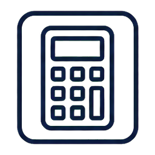
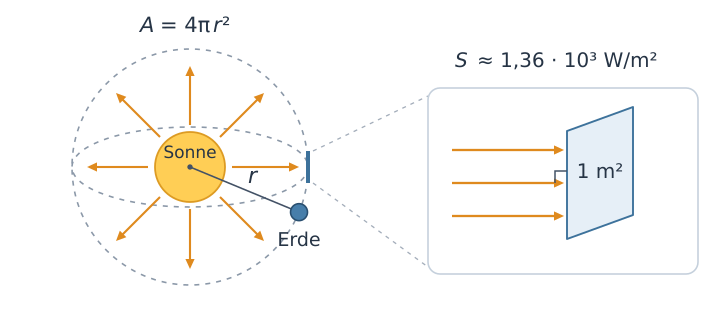
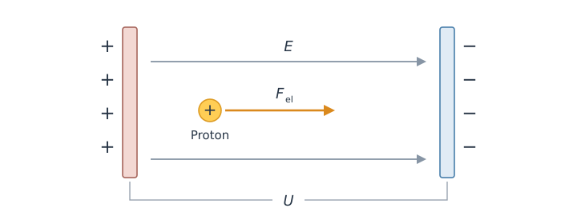

# Spezielle Relativitätstheorie II: Impuls und Energie (Umbau) {#sec-srt-impuls-energie-umbau}

::: {.content-visible when-format="html"}
```{=html}
<link rel="stylesheet" href="assets/animations/shared/workbook.css?v=20260916-bildrahmen">
<link rel="stylesheet" href="assets/styles/formelwiederholungen.css?v=20260915">
<link rel="stylesheet" href="assets/animations/srt2-impuls-und-energie/impuls/impuls-vergleich.css?v=20260915c">
<script src="assets/animations/shared/core.js"></script>
<script src="assets/animations/shared/formelsatz.js?v=20260908"></script>
<script src="assets/animations/srt2-impuls-und-energie/impuls/impuls-vergleich.js?v=20260915c"></script>
<link rel="stylesheet" href="assets/animations/srt2-impuls-und-energie/impuls/wagenstoss.css?v=20260915c">
<script src="assets/animations/srt2-impuls-und-energie/impuls/wagenstoss.js?v=20260915c"></script>
<link rel="stylesheet" href="assets/animations/srt2-impuls-und-energie/energie/energiezufuhr.css?v=20260917-abschluss">
<script src="assets/animations/srt2-impuls-und-energie/energie/energiezufuhr.js?v=20260917-abschluss"></script>
<link rel="stylesheet" href="assets/animations/srt2-impuls-und-energie/energie/solarwagen.css?v=20260916b">
<script src="assets/animations/srt2-impuls-und-energie/energie/solarwagen.js?v=20260916b"></script>
<script src="assets/animations/shared/workbook.js"></script>
```
:::

Wenn du an einem sonnigen Tag aus dem Schatten trittst, spürst du die wärmende Wirkung der Sonnenstrahlung. Mit dieser Strahlung gibt die Sonne Energie an ihre Umgebung ab. Dabei verliert sie in jeder Sekunde rund vier Millionen Tonnen Masse.

Den Zusammenhang zwischen Masse und Energie beschreibt eine der bekanntesten Formeln der Physik, $E_0 = m_0\,c^2$. Sie besagt, dass ein Körper bereits aufgrund seiner Masse $m_0$ eine Ruheenergie $E_0$ besitzt. Wegen des Faktors $c^2$ entspricht schon eine kleine Menge Masse einer großen Ruheenergie.

Impuls und Energie kennst du aus der klassischen Mechanik als Erhaltungsgrößen eines isolierten Systems. Zunächst untersuchst du, welche Anpassungen der klassische Impuls benötigt. Anschließend lernst du die relativistische Energiebeschreibung kennen, die die Ruheenergie berücksichtigt und den Zusammenhang zwischen Geschwindigkeit und kinetischer Energie neu beschreibt.

## Relativistischer Impuls

::: {.mp-goal-strip}
Du <u>erläuterst</u>, welche Bedingungen die relativistische Impulsdefinition erfüllen soll.

Du <u>berechnest</u> den relativistischen Impuls in einem angegebenen Bezugssystem und <u>beurteilst</u>, wie gut die klassische Formel ihn annähert.
:::

Aus der klassischen Mechanik kennst du den Gesamtimpuls als Erhaltungsgröße. Zur Wiederholung betrachten wir zwei Wagen auf einer geraden Schiene, die zusammenstoßen und aneinander haften bleiben. Bei diesem vollständig unelastischen Stoß kannst du aus ihren Massen und Geschwindigkeiten vor dem Stoß die gemeinsame Geschwindigkeit danach berechnen.

Dafür betrachtest du beide Wagen vor, während und nach dem Stoß zusammen als abgeschlossenes System.[abgeschlossenes System]{.column-margin .mp-randbegriff} Das bedeutet hier, dass kein Impuls mit der Umgebung ausgetauscht wird. Dazu vernachlässigen wir äußere Einflüsse wie Reibung. Die resultierende äußere Kraft auf das System ist damit null.

Aus der klassischen Mechanik kennst du die Formel für den Impuls eines Körpers:

$$\vec p = m\,\vec v.$$

Der Impuls hat dieselbe Richtung wie die Geschwindigkeit. Der Gesamtimpuls ergibt sich als Summe der Impulsvektoren aller Körper des Systems. Für unser Beispiel gilt $\vec p_\mathrm{ges}=\vec p_1+\vec p_2$.

Auf der geraden Schiene ist die Bewegung eindimensional. Dabei kennzeichnet ein positives Vorzeichen die Bewegung nach rechts und ein negatives die Bewegung nach links. Der Impulserhaltungssatz besagt, dass der Gesamtimpuls dieses abgeschlossenen Systems vor und nach dem Stoß gleich ist.

@fig-ie-wagenstoss zeigt einen vollständig unelastischen Stoß. Du kannst zwischen gleicher und entgegengesetzter Fahrtrichtung vor dem Stoß wechseln. Die Pfeile unter den Wagen zeigen ihre einzelnen Impulse und deren Summe.

:::: {#fig-ie-wagenstoss}
::: {.content-visible when-format="html"}
```{=html}
<div class="srt-workbook-stage" data-srt-animation="inelastic-carts" data-srt-viewbox-w="640" data-srt-viewbox-h="320" data-srt-label="Animation eines vollständig unelastischen Stoßes zweier Wagen mit jeweils einem Kilogramm Masse. Impulspfeile zeigen Richtung und Betrag sowie den erhaltenen Gesamtimpuls. Umschaltbar zwischen gleicher und entgegengesetzter Fahrtrichtung."></div>
```
:::

::: {.content-visible unless-format="html"}
Zwei Wagen mit jeweils $1\,\mathrm{kg}$ Masse bewegen sich vor dem Stoß mit $2\,\mathrm{m/s}$ und $1\,\mathrm{m/s}$ in dieselbe Richtung. Nach dem Stoß fahren sie gemeinsam mit $1{,}5\,\mathrm{m/s}$ weiter. Fährt der zweite Wagen vorher mit $1\,\mathrm{m/s}$ entgegen, beträgt die gemeinsame Geschwindigkeit danach $0{,}5\,\mathrm{m/s}$ in Richtung des ersten Wagens.
:::

Animation zum vollständig unelastischen Stoß zweier Wagen mit jeweils $1\,\mathrm{kg}$ Masse. Die Pfeile stellen die Impulse im selben Maßstab dar. Äußere Einflüsse wie Reibung werden in dieser idealisierten Darstellung vernachlässigt.
::::

Auch bei Stößen zwischen sehr schnellen Teilchen gilt die Impulserhaltung. Mit der klassischen Formel $\vec p=m\vec v$ bleibt der Gesamtimpuls unter Berücksichtigung der Einsteinschen Postulate jedoch nicht in jedem Inertialsystem erhalten. Bei Geschwindigkeiten nahe der Lichtgeschwindigkeit ist deshalb eine andere Impulsformel erforderlich. Sie soll zwei Bedingungen erfüllen:

1. [Für kleine Geschwindigkeiten soll die neue Formel näherungsweise den klassischen Impuls ergeben.]{#ie-korrespondenz}[Korrespondenzprinzip]{.column-margin .mp-randbegriff}
2. Der Gesamtimpuls eines abgeschlossenen Systems soll in jedem Inertialsystem erhalten bleiben.

::: {.mp-box .mp-task}
<span class="mp-task-kind mp-task-kind-think" aria-label="Denkcheck">
  
  Denkcheck
</span>

<u>Nenne</u> das Einsteinsche Postulat, auf dem die zweite Bedingung beruht. <u>Begründe</u> deine Zuordnung.
:::

<details class="mp-details">
<summary>Mögliche Lösung anzeigen</summary>

Die zweite Bedingung beruht auf dem [Relativitätsprinzip](01_srt_raum_und_zeit_umbau.qmd#kasten-einsteinsche-postulate). Danach haben die Naturgesetze in allen Inertialsystemen dieselbe Form. Die Impulserhaltung ist ein solches Naturgesetz. Sie muss deshalb in jedem Inertialsystem gelten. Würde der Gesamtimpuls nur in einem der Systeme erhalten bleiben, wäre diese Forderung verletzt.

</details>

Die relativistische Impulsformel ergänzt den klassischen Zusammenhang zwischen Masse und Geschwindigkeit um den Lorentzfaktor. Dieser zusätzliche Faktor lässt sich durch die Untersuchung eines elastischen Stoßes zweier gleicher Kugeln in zwei Inertialsystemen begründen. Wenn du diese Begründung nachvollziehen möchtest, findest du sie bei @giancoli2010physik [S. 1245--1247]. Die Formel für den relativistischen Impuls, die beide Bedingungen erfüllt, lautet:

$$
\vec p=\gamma\,m_0\,\vec v.
$$ {#eq-ie-impuls}

Mit $m_0$ wird die Ruhemasse bezeichnet.[Ruhemasse]{.column-margin .mp-randbegriff} Die kleine Null verweist wie im Kapitel zu Raum und Zeit auf das Ruhesystem.

Dabei ist $\vec v$ die Geschwindigkeit des Körpers in dem Bezugssystem, aus dem du ihn beschreibst. Ihr Betrag $v$ steht auch im Lorentzfaktor.

Beobachtest du ein vorbeifliegendes Raumschiff von der Erde aus, hat es einen Impuls ungleich null. Im Ruhesystem des Raumschiffs ist sein Impuls dagegen null. Dieser Unterschied widerspricht dem Relativitätsprinzip nicht. Es verlangt, dass der Gesamtimpuls eines abgeschlossenen Systems in jedem Inertialsystem erhalten bleibt. Es verlangt nicht, dass alle Inertialsysteme einem Körper denselben Impuls zuordnen.

Für kleine Geschwindigkeiten ist $\gamma\approx1$, also $\vec p\approx m_0\vec v$. Die relativistische Formel ergibt dann wieder näherungsweise den klassischen Impuls und erfüllt die [erste Bedingung](#ie-korrespondenz). Nähert sich die Geschwindigkeit der Lichtgeschwindigkeit, wächst der Lorentzfaktor unbegrenzt. Der relativistische Impuls nimmt dann stärker zu als der klassische Impuls.

@fig-ie-impuls-vergleich zeigt den klassischen und den relativistischen Impulsbetrag eines Protons. Mit dem Regler veränderst du seine Geschwindigkeit. Über die Prozenttasten stellst du die Geschwindigkeit ein, bei der der klassische Impuls um den gewählten Prozentsatz kleiner ist als der relativistische. Die Nahansicht vergrößert den Bereich kleiner Geschwindigkeiten.

:::: {#fig-ie-impuls-vergleich}
::: {.content-visible when-format="html"}
```{=html}
<div class="srt-workbook-stage" data-srt-animation="momentum-comparison" data-srt-viewbox-w="640" data-srt-viewbox-h="350" data-srt-label="Interaktives Diagramm des klassischen und relativistischen Impulsbetrags eines Protons. Geschwindigkeit einstellbar über einen Regler oder über Tasten für eine relative Abweichung von 1, 5, 10 oder 20 Prozent."></div>
```
:::

::: {.content-visible unless-format="html"}
Für Alltagsgeschwindigkeiten stimmen klassischer und relativistischer Impuls näherungsweise überein. Bei Geschwindigkeiten nahe der Lichtgeschwindigkeit wächst der relativistische Impuls stärker als der klassische.
:::

Interaktives Diagramm zum klassischen und relativistischen Impulsbetrag eines Protons in Abhängigkeit von seiner Geschwindigkeit. Die Punkte markieren die beiden Werte bei derselben Geschwindigkeit. Beide Achsen sind linear.
::::

In älteren Lehrbüchern zur Relativitätstheorie wird häufig davon gesprochen, dass die Masse eines Körpers mit seiner Geschwindigkeit zunimmt. Gemeint ist dabei die „relativistische Masse“ $m_\mathrm{rel}=\gamma m_0$. Mit ihr lässt sich der Impuls als $\vec p=m_\mathrm{rel}\vec v$ schreiben. Beide Schreibweisen liefern denselben Impuls.

Viele moderne Lehrbücher verwenden „Masse“ dagegen für die invariante Ruhemasse $m_0$. Ihr Wert ist für denselben Körper in allen Inertialsystemen gleich. Ein Wechsel des Bezugssystems verändert die gemessene Geschwindigkeit und den Impuls, aber nicht den Körper selbst.

Problematisch wird die Verwendung der relativistischen Masse, wenn man sie als allgemeine Anpassung der klassischen Formeln versteht. Setzt man $m_\mathrm{rel}$ in die klassische Formel $E_\mathrm{kin}=\tfrac12mv^2$ ein, erhält man nicht die relativistische kinetische Energie.

::: {.mp-box .mp-task}
<span class="mp-task-kind mp-task-kind-calculate" aria-label="Berechnung">
  
  Berechnung
</span>

Bei der Protonentherapie wird ein Strahl schneller Protonen zur Behandlung von Tumoren eingesetzt. Er soll das Tumorgewebe gezielt bestrahlen und umliegendes gesundes Gewebe möglichst schonen. Magnetfelder lenken den Strahl auf seiner Bahn. Damit er das vorgesehene Zielgebiet erreicht, muss seine Ablenkung korrekt berechnet werden. Sie hängt vom Impuls der Protonen ab: Bei gleichem Magnetfeld und senkrechter Bewegung zum Feld ist die Bahn umso weniger gekrümmt, je größer der Impuls ist.

Ein Proton mit $m_0=1{,}67\cdot10^{-27}\,\mathrm{kg}$ bewegt sich im Laborsystem mit $v=0{,}60\,c$. Verwende $c=3{,}0\cdot10^8\,\mathrm{m/s}$.

Für diese Aufgabe benötigst du folgende aus dem Kapitel bekannte Formeln. Bei den Impulsen genügt für diese Aufgabe der Betrag.

$$
p_\mathrm{klass}=m_0\,v
$$

::: {.mp-formula-repeat}
$$
p_\mathrm{rel}=\gamma\,m_0\,v
$$

([-@eq-ie-impuls])
:::

::: {.mp-formula-repeat}
$$
\gamma=\frac{1}{\sqrt{1-v^2/c^2}}
$$

([-@eq-umbau-lorentzfaktor])
:::

1. <u>Berechne</u> den klassischen und den relativistischen Impuls des Protons.
2. <u>Bestimme</u>, um wie viel Prozent der klassische Impuls kleiner ist als der relativistische. <u>Erläutere</u>, welche Folgen es für die Behandlung haben könnte, wenn die Magnetfelder zur Strahlführung auf Grundlage des klassischen Impulses eingestellt würden.
:::

<details class="mp-details">
<summary>Mögliche Lösung anzeigen</summary>

1. Mit $v=1{,}8\cdot10^8\,\mathrm{m/s}$ folgt

   $$p_\mathrm{klass}=m_0\,v=3{,}006\cdot10^{-19}\,\mathrm{kg\,m/s}.$$

   Der Lorentzfaktor ist $\gamma=1/\sqrt{1-0{,}60^2}=1{,}25$. Damit erhältst du

   $$p_\mathrm{rel}=\gamma\,m_0\,v=3{,}7575\cdot10^{-19}\,\mathrm{kg\,m/s}.$$

   Gerundet sind das $3{,}0\cdot10^{-19}\,\mathrm{kg\,m/s}$ und $3{,}8\cdot10^{-19}\,\mathrm{kg\,m/s}$.

2. Mit den ungerundeten Zwischenwerten beträgt die relative Abweichung

   $$\frac{p_\mathrm{rel}-p_\mathrm{klass}}{p_\mathrm{rel}}=1-\frac{1}{1{,}25}=0{,}20.$$

   Der klassische Impuls ist um $20\,\%$ kleiner als der relativistische Impuls.

   Würde man die Magnetfelder für die geplante Bahn mit diesem zu kleinen Wert einstellen, würde der Strahl weniger stark abgelenkt als vorgesehen. Dadurch könnte er das Tumorgewebe verfehlen und stattdessen gesundes Gewebe bestrahlen. Das könnte die Wirksamkeit der Behandlung verringern und gesundes Gewebe schädigen.

</details>

---

## Relativistische Energie

::: {.mp-goal-strip}
Du <u>erläuterst</u> den Zusammenhang zwischen kinetischer Energie, Ruheenergie und Gesamtenergie.

Du <u>berechnest</u> die kinetische Energie, Ruheenergie und Gesamtenergie eines Körpers.
:::

In der klassischen Mechanik berechnest du die kinetische Energie eines Körpers mit der Formel

$$
E_\mathrm{kin}=\frac12m_0v^2.
$$

Um einen Körper schneller zu machen, muss Arbeit an ihm verrichtet werden. Dabei überträgt eine Kraft entlang des Weges Energie auf den Körper. Die Arbeit $W$ gibt an, wie viel Energie auf diese Weise übertragen wird. Wir vernachlässigen Reibung und andere Energieverluste, sodass die zugeführte Arbeit vollständig seine kinetische Energie erhöht. Für die Arbeit gilt dann $W=E_\mathrm{kin,nachher}-E_\mathrm{kin,vorher}$. Startet der Körper aus der Ruhe, ist die verrichtete Arbeit gleich seiner erreichten kinetischen Energie. Seine Masse bleibt beim Beschleunigen unverändert.

Die relativistische Formel für die kinetische Energie lässt sich aus dem Arbeit-Energie-Zusammenhang und der relativistischen Impulsformel herleiten. Wenn dich diese Herleitung interessiert, kannst du sie bei @giancoli2010physik [S. 1248--1249] nachvollziehen. Das Ergebnis lautet:[kinetische Energie]{.column-margin .mp-randbegriff}

$$
E_\mathrm{kin}=(\gamma-1)m_0c^2.
$$ {#eq-ie-kinetische-energie}

Der Lorentzfaktor $\gamma$ enthält die Geschwindigkeit $v$ des Körpers. Diese Geschwindigkeit und die kinetische Energie $E_\mathrm{kin}$ beziehen sich auf dasselbe Inertialsystem.

Durch Ausmultiplizieren der Klammer erhalten wir zwei Terme:

$$
E_\mathrm{kin}=\gamma m_0c^2-m_0c^2.
$$

Der erste Term hängt über $\gamma$ von der Geschwindigkeit ab. Der abgezogene Term $m_0c^2$ ist bei unveränderter Masse dagegen unabhängig von der Geschwindigkeit. Selbst wenn ein Körper ruht, besitzt er eine durch seine Masse bestimmte Energie. Diese Ruheenergie entspricht dem geschwindigkeitsunabhängigen Term.[Ruheenergie]{.column-margin .mp-randbegriff}

$$
E_0=m_0c^2.
$$ {#eq-ie-ruheenergie}

Zur Ruheenergie eines Körpers trägt auch seine innere Energie bei, etwa die Energie der ungeordneten Bewegung seiner Bestandteile. Auch die chemische Energie einer Batterie ist in ihrer Ruheenergie enthalten.

Erwärmst du einen Körper und bleibt die zugeführte Energie vollständig in ihm, nimmt auch seine Masse zu. Gibt der Körper beim Abkühlen Energie an seine Umgebung ab, nimmt seine Masse wieder ab. Die Masse ändert sich dabei, obwohl die Anzahl der Atome im Körper gleich bleibt.

Die Gesamtenergie des betrachteten Körpers setzt sich aus seiner kinetischen Energie und seiner Ruheenergie zusammen.[Gesamtenergie]{.column-margin .mp-randbegriff}

$$
\begin{aligned}
E&=E_\mathrm{kin}+E_0\\
 &= (\gamma-1)m_0c^2+m_0c^2
 =\gamma m_0c^2.
\end{aligned}
$$ {#eq-ie-gesamtenergie}

Die beiden Terme in der Formel für die kinetische Energie können wir nun zuordnen:

$$
E_\mathrm{kin}=\underbrace{\gamma m_0c^2}_{\text{Gesamtenergie }E}
 -\underbrace{m_0c^2}_{\text{Ruheenergie }E_0}.
$$

Ein Solarwagen kann Energie zunächst im Akku speichern und anschließend zum Anfahren nutzen. Beim Laden im Stillstand nehmen seine Ruheenergie und seine Masse zu. Beim Anfahren nutzt er Energie aus seinem eigenen Akku: Seine Ruheenergie nimmt ab, seine kinetische Energie nimmt zu. Im idealisierten Beispiel bleibt die Gesamtenergie des Wagens während des Anfahrens im Bodensystem gleich.

In @fig-ie-solarwagen kannst du beide Vorgänge abspielen und anhalten. Die Anzeigen vergleichen den aktuellen Zustand mit dem ruhenden Wagen vor dem Laden. Die Massenänderung ist so klein, dass sie mit einer Alltagswaage nicht erkennbar wäre.

:::: {#fig-ie-solarwagen}
::: {.content-visible when-format="html"}
```{=html}
<div class="srt-workbook-stage" data-srt-animation="solar-cart" data-srt-viewbox-w="640" data-srt-viewbox-h="270" data-srt-label="Animation eines Solarwagens beim Laden und Anfahren. Im Stillstand speichert der Akku 100 Joule Energie. Beim anschließenden Anfahren nimmt die Ruheenergie ab und die kinetische Energie zu. Anzeigen zeigen die Energieänderungen, die winzige Massenänderung und die Geschwindigkeit im Bodensystem."></div>
```
:::

::: {.content-visible unless-format="html"}
Der anfangs ruhende Wagen speichert beim Laden $100\,\mathrm J$ zusätzlich im Akku. Seine Masse nimmt dabei um etwa $1{,}1\cdot10^{-15}\,\mathrm{kg}$ zu. Werden diese $100\,\mathrm J$ anschließend vollständig in kinetische Energie umgewandelt, sinkt die Ruheenergie wieder auf ihren Anfangswert. Die Gesamtenergie des Wagens bleibt während des Anfahrens gleich. Am Ende fährt er mit etwa $14{,}1\,\mathrm{m/s}$.
:::

Animation zum Laden und Anfahren eines Solarwagens im Bezugssystem des Bodens. Der Wagen hat vor dem Laden eine Masse von $1\,\mathrm{kg}$ und speichert anschließend $100\,\mathrm J$ im Akku. Beim Anfahren rollt er ohne Gleiten auf ruhendem Untergrund, der Impuls, aber keine Energie überträgt. Wärmeverluste und die Rotationsenergie der Räder werden vernachlässigt.
::::

::: {.mp-box .mp-task}
<span class="mp-task-kind mp-task-kind-think" aria-label="Denkcheck: Bezugssystem">
  
  Denkcheck: Bezugssystem
</span>

Ein Raumschiff fliegt geradlinig und gleichförmig an der Erde vorbei. Du beschreibst dasselbe Raumschiff einmal in seinem Ruhesystem und einmal im Erdsystem.

<u>Vergleiche</u> seine Ruheenergie $E_0$, seine kinetische Energie $E_\mathrm{kin}$ und seine Gesamtenergie $E$ in den beiden Bezugssystemen.
:::

<details class="mp-details">
<summary>Mögliche Lösung anzeigen</summary>

Im Ruhesystem des Raumschiffs gilt $E_\mathrm{kin}=0$ und $E=E_0=m_0c^2$.

Im Erdsystem bewegt sich das Raumschiff. Dort gilt $E_\mathrm{kin}>0$ und $E=E_\mathrm{kin}+E_0>E_0$. Die Ruheenergie ist in beiden Bezugssystemen gleich, weil die Masse desselben Raumschiffs beim Wechsel des Bezugssystems unverändert bleibt.

</details>

Für kleine Geschwindigkeiten soll die relativistische Formel wieder näherungsweise die bekannte kinetische Energie $E_\mathrm{kin}=\tfrac12m_0v^2$ ergeben. Würden wir in @eq-ie-kinetische-energie sofort $\gamma\approx1$ einsetzen, verschwände mit $\gamma-1$ gerade der kleine Anteil, den wir untersuchen wollen. Deshalb bringen wir die Formel zunächst in eine Form, in der $v^2$ als Faktor vorkommt.

$$
E_\mathrm{kin}=(\gamma-1)m_0c^2. \tag{I}
$$

Wir beginnen mit dem Lorentzfaktor und formen nach $\gamma^2-1$ um:

$$
\begin{aligned}
\gamma &= \frac{1}{\sqrt{1-v^2/c^2}}
  && \Big|\ \text{quadrieren} \\[10pt]
\gamma^2 &= \frac{1}{1-v^2/c^2}
  && \Big|\ \cdot\left(1-\frac{v^2}{c^2}\right) \\[10pt]
\gamma^2\left(1-\frac{v^2}{c^2}\right)&=1
  && \Big|\ \text{ausmultiplizieren} \\[10pt]
\gamma^2-\gamma^2\frac{v^2}{c^2}&=1
  && \Big|\ +\,\gamma^2\frac{v^2}{c^2}-1 \\[10pt]
\gamma^2-1&=\gamma^2\frac{v^2}{c^2}.
\end{aligned}
$$

Mit der dritten binomischen Formel $a^2-b^2=(a-b)(a+b)$ zerlegen wir die linke Seite. Anschließend teilen wir durch $\gamma+1$:

$$
\begin{align}
(\gamma-1)(\gamma+1)&=\gamma^2\frac{v^2}{c^2}
  && \Big|\ : (\gamma+1) \notag \\[10pt]
\gamma-1&=\frac{\gamma^2v^2}{(\gamma+1)c^2}. && \tag{II}
\end{align}
$$

Einsetzen von (II) in (I) ergibt:

$$
E_\mathrm{kin}=\frac{\gamma^2v^2}{(\gamma+1)c^2}\,m_0c^2
 =\frac{\gamma^2}{\gamma+1}\,m_0v^2.
$$

Für $v\ll c$ ist $\gamma\approx1$. Der Vorfaktor wird dann näherungsweise $1^2/(1+1)=1/2$ und es folgt:

$$
E_\mathrm{kin}\approx\frac12m_0v^2.
$$

Die klassische kinetische Energie ist also die Näherung der relativistischen Formel für kleine Geschwindigkeiten. Damit erfüllt auch die Energieformel das bereits bekannte Korrespondenzprinzip.

Die Energieerhaltung kennst du ebenfalls aus der klassischen Mechanik. Auch die relativistische Energiebeschreibung muss sie erfüllen. In einem abgeschlossenen System ohne Energie- und Impulsaustausch mit der Umgebung hat die Gesamtenergie zu jedem Zeitpunkt denselben Wert, auch wenn sich Energieformen ineinander umwandeln. Wie beim Impuls muss die Erhaltung in jedem Inertialsystem gelten.[Energieerhaltung]{.column-margin .mp-randbegriff}

Zur Energiebilanz gehört auch die Ruheenergie. Ihre Umwandlung in andere Energieformen tritt beispielsweise bei Kernreaktionen auf. Bei solchen Reaktionen können die Massen der entstehenden Teilchen zusammen kleiner sein als die der Ausgangsteilchen. Eine solche Massendifferenz wird als Massendefekt bezeichnet.[Massendefekt]{.column-margin .mp-randbegriff} Die zugehörige Differenz der Ruheenergien kann etwa als kinetische Energie der Teilchen oder als Strahlungsenergie frei werden.

Auch in der Sonne laufen Kernreaktionen ab. Dort verschmelzen Wasserstoffkerne über mehrere Schritte zu Heliumkernen. Dieser Vorgang heißt Kernfusion.[Kernfusion]{.column-margin .mp-randbegriff} Die Reaktionsprodukte haben zusammen weniger Masse als die Ausgangsteilchen. Der Unterschied ihrer Ruheenergien wird bei der Fusion frei. Die frei gewordene Energie wird zum großen Teil im Inneren der Sonne weitergegeben, bis sie die Oberfläche erreicht und abgestrahlt wird. Durch diese Energieabgabe sinkt die Ruheenergie der Sonne und damit auch ihre Masse.

Ändert sich die Ruheenergie eines Körpers, ändert sich nach $E_0=m_0c^2$ auch seine Masse:

$$
\Delta E_0=\Delta m_0c^2.
$$ {#eq-ie-masse-energieaenderung}

Die Änderungen berechnen wir jeweils als Differenz aus Endwert und Anfangswert:

$$
\begin{aligned}
\Delta E_0&=E_{0,\mathrm{nachher}}-E_{0,\mathrm{vorher}},\\[6pt]
\Delta m_0&=m_{0,\mathrm{nachher}}-m_{0,\mathrm{vorher}}.
\end{aligned}
$$

Nimmt ein Körper Energie auf und bleibt dabei als Ganzes in Ruhe, steigt seine Ruheenergie und damit auch seine Masse. Gibt er unter diesen Bedingungen Energie ab, sinkt seine Ruheenergie und damit auch seine Masse.

::::: {#aufgabe-ie-sonne .mp-box .mp-task}
<span class="mp-task-kind mp-task-kind-calculate" aria-label="Berechnung: Masseverlust der Sonne">
  
  Berechnung: Masseverlust der Sonne
</span>

Die Bestrahlungsstärke $S$ gibt die eintreffende Strahlungsleistung pro Fläche an. Im mittleren Erdabstand beträgt sie außerhalb der Atmosphäre etwa $S=1{,}36\cdot10^3\,\mathrm{W/m^2}$. Eine Fläche von einem Quadratmeter empfängt also pro Sekunde etwa $1360\,\mathrm J$, wenn die Strahlung senkrecht auf sie trifft. Der Wert ist für diese Aufgabe gerundet [@iau2015b3, S. 2].

Nimm an, dass die Sonne gleichmäßig in alle Richtungen abstrahlt. Ihre Strahlung verteilt sich dann im Abstand der Erde auf die gedachte Kugelfläche in @fig-ie-sonnenstrahlung. Der Radius dieser Kugel ist der mittlere Abstand zwischen Erde und Sonne, $r=1{,}5\cdot10^{11}\,\mathrm m$. Verwende $c=3{,}0\cdot10^8\,\mathrm{m/s}$.

:::: {#fig-ie-sonnenstrahlung .srt-workbook-image-figure}
{.srt-workbook-image fig-alt="Die Sonne im Mittelpunkt einer gedachten Kugel im Erdabstand. Ein vergrößerter Flächenausschnitt zeigt die senkrecht einfallende Strahlung auf einen Quadratmeter."}

Skizze der Abstrahlung der Sonne auf eine gedachte Kugelfläche im Erdabstand $r$. Der vergrößerte Ausschnitt zeigt eine zur Strahlungsrichtung senkrechte Fläche von $1\,\mathrm{m^2}$.
::::

Für die Rechnung benötigst du folgende Zusammenhänge:

$$
\begin{aligned}
A&=4\pi r^2 &&\text{Kugeloberfläche},\\[6pt]
P&=S\,A &&\text{gesamte Strahlungsleistung},\\[6pt]
E_\mathrm{ab}&=P\,\Delta t &&\text{abgegebene Strahlungsenergie}.
\end{aligned}
$$

::: {.mp-formula-repeat}
$$
\Delta E_0=\Delta m_0c^2
$$

([-@eq-ie-masse-energieaenderung])
:::

Die Sonne bleibt bei der angenommenen gleichmäßigen Abstrahlung in ihrem Ruhesystem in Ruhe. Da sie Energie abgibt, ist ihre Änderung der Ruheenergie negativ: $\Delta E_0=-E_\mathrm{ab}$. Der Masseverlust ist der Betrag der ebenfalls negativen Massenänderung $\Delta m_0$.

1. <u>Berechne</u> die gesamte Strahlungsleistung der Sonne und die in einer Sekunde abgegebene Strahlungsenergie.
2. <u>Berechne</u> den zugehörigen Masseverlust pro Sekunde in Kilogramm und Tonnen.
:::::

<details class="mp-details">
<summary>Mögliche Lösung anzeigen</summary>

1. Die Kugeloberfläche im Erdabstand ist

   $$A=4\pi(1{,}5\cdot10^{11}\,\mathrm m)^2
   \approx2{,}827\cdot10^{23}\,\mathrm{m^2}.$$

   Mit den ungerundeten Zwischenwerten folgt

   $$P=SA
   \approx3{,}85\cdot10^{26}\,\mathrm W.$$

   In einer Sekunde gibt die Sonne damit folgende Strahlungsenergie ab:

   $$E_\mathrm{ab}=P\cdot1\,\mathrm s
   \approx3{,}85\cdot10^{26}\,\mathrm J.$$

2. Die Ruheenergie der Sonne nimmt ab. Ihre Massenänderung in einer Sekunde beträgt deshalb

   $$\Delta m_0=\frac{\Delta E_0}{c^2}
   =-\frac{E_\mathrm{ab}}{c^2}
   \approx-4{,}3\cdot10^9\,\mathrm{kg}.$$

   Der Masseverlust ist der Betrag dieser Änderung:

   $$|\Delta m_0|\approx4{,}3\cdot10^9\,\mathrm{kg}=4{,}3\cdot10^6\,\mathrm t.$$

   Durch ihre elektromagnetische Strahlung verliert die Sonne also pro Sekunde rund vier Millionen Tonnen Masse. Dieser Wert erklärt die Angabe im Kapiteleinstieg.

</details>

---

## Sichern und anwenden

Zum Abschluss sicherst du die Grundideen des Kapitels mithilfe des Selbstchecks. Anschließend kannst du dein Wissen in den Übungsaufgaben anwenden.

::: {.mp-box .mp-task}
<span class="mp-task-kind mp-task-kind-selfcheck" aria-label="Selbstcheck">
  
  Selbstcheck
</span>

<u>Erkläre</u> das Kapitel zusammenhängend in deiner eigenen Sprache, so wie du es jemandem aus deinem Kurs beibringen würdest. Nutze dafür die Lernziele unten: Wer deine Erklärung liest oder hört, soll daran erkennen, dass du jedes dieser Ziele erreicht hast. Schreibe deine Erklärung auf und sammle sie an einem Ort. So entsteht Kapitel für Kapitel deine eigene Zusammenfassung, auf die du zurückgreifen kannst. Wo ein Lernziel eine Herleitung oder eine Rechnung nennt, führe sie aus.

Ist jemand aus deinem Kurs da, nutze die Gelegenheit und erkläre im Gespräch. Skizziere dabei, was sich zeichnen lässt. Achte auf Rückfragen. Sie zeigen dir, wo deine Erklärung noch hakt.

- **Relativistischer Impuls:** Du <u>erläuterst</u>, welche Bedingungen die relativistische Impulsdefinition erfüllen soll. Du <u>berechnest</u> den relativistischen Impuls in einem angegebenen Bezugssystem und <u>beurteilst</u>, wie gut die klassische Formel ihn annähert.
- **Relativistische Energie:** Du <u>erläuterst</u> den Zusammenhang zwischen kinetischer Energie, Ruheenergie und Gesamtenergie. Du <u>berechnest</u> die kinetische Energie, Ruheenergie und Gesamtenergie eines Körpers.

:::

### Übungsaufgaben

Für die folgende Aufgabe frischen wir dein Wissen zur Elektrostatik auf. Stell dir ein Proton zwischen den Platten eines geladenen Plattenkondensators vor, wie in @fig-ie-kondensator. Zwischen den Platten liegt die Spannung $U$. Die Coulomb-Kraft beschleunigt das positiv geladene Proton zur negativ geladenen Platte. Dabei nimmt seine elektrische potenzielle Energie ab und seine kinetische Energie nimmt zu.

:::: {#fig-ie-kondensator .srt-workbook-image-figure}
{.srt-workbook-image fig-alt="Ein Proton zwischen einer positiv geladenen Platte links und einer negativ geladenen Platte rechts. Elektrisches Feld und elektrische Kraft zeigen nach rechts. Zwischen den Platten liegt die Spannung U."}

Skizze eines Protons im elektrischen Feld eines Plattenkondensators mit der Spannung $U$. Die Pfeile zeigen die Richtung des elektrischen Feldes und der Kraft auf das Proton. Das Feld zwischen den Platten wird als homogen angenommen, Kanteneffekte werden vernachlässigt.
::::

Durchläuft ein positiv geladenes Teilchen mit der Ladung $q$ die gesamte Beschleunigungsspannung $U$, verrichtet das elektrische Feld die Arbeit $W=qU$ an ihm. Wir nehmen an, dass diese Arbeit vollständig die kinetische Energie des Teilchens erhöht. Startet es aus der Ruhe, gilt deshalb:

$$
E_\mathrm{kin}=qU.
$$

Für das Proton gilt $q=e$, wobei $e\approx1{,}60\cdot10^{-19}\,\mathrm C$ die Elementarladung ist. Damit ist $E_\mathrm{kin}=eU$. Seine Ruheenergie bleibt beim Beschleunigen unverändert, seine kinetische Energie und seine Gesamtenergie nehmen um $eU$ zu.

Teilchenenergien werden häufig in Elektronenvolt angegeben.[Elektronenvolt]{.column-margin .mp-randbegriff} Ein Elektronenvolt ist die Energie, die ein Teilchen mit dem Ladungsbetrag $e$ beim Beschleunigen durch eine Spannung von $1\,\mathrm V$ gewinnt:

$$
1\,\mathrm{eV}=e\cdot1\,\mathrm V
\approx1{,}60\cdot10^{-19}\,\mathrm J.
$$

Ein Megaelektronenvolt entspricht einer Million Elektronenvolt, also $1\,\mathrm{MeV}=10^6\,\mathrm{eV}$. Auch die Ruheenergie und die kinetische Energie eines Protons kannst du in Elektronenvolt angeben.

::: {#aufgabe-ie-proton-energie .mp-box .mp-task}
<span class="mp-task-kind mp-task-kind-calculate" aria-label="Berechnung: Proton beschleunigen">
  
  Berechnung: Proton beschleunigen
</span>

Ein Proton startet im Laborsystem aus der Ruhe und wird durch ein elektrisches Feld beschleunigt. Danach beträgt seine kinetische Energie die Hälfte seiner Ruheenergie, $E_\mathrm{kin}=E_0/2$. Seine Ruhemasse bleibt unverändert. Verwende $m_0=1{,}67\cdot10^{-27}\,\mathrm{kg}$, $e=1{,}60\cdot10^{-19}\,\mathrm C$ und $c=3{,}0\cdot10^8\,\mathrm{m/s}$.

Für diese Aufgabe benötigst du folgende aus dem Kapitel bekannte Formeln:

::: {.mp-formula-repeat}
$$
E_0=m_0c^2
$$

([-@eq-ie-ruheenergie])
:::

::: {.mp-formula-repeat}
$$
E_\mathrm{kin}=(\gamma-1)m_0c^2=(\gamma-1)E_0
$$

([-@eq-ie-kinetische-energie])
:::

::: {.mp-formula-repeat}
$$
E=E_0+E_\mathrm{kin}=\gamma m_0c^2
$$

([-@eq-ie-gesamtenergie])
:::

::: {.mp-formula-repeat}
$$
\gamma=\frac{1}{\sqrt{1-v^2/c^2}}
$$

([-@eq-umbau-lorentzfaktor])
:::

$$
E_\mathrm{kin}=eU
$$

1. <u>Bestimme</u> zunächst den Lorentzfaktor und daraus die Geschwindigkeit des Protons.
2. <u>Berechne</u> seine Ruheenergie, seine kinetische Energie und seine Gesamtenergie in Joule sowie seine kinetische Energie in Megaelektronenvolt.
3. <u>Berechne</u> die erforderliche Beschleunigungsspannung.
4. <span class="mp-task-kind mp-task-kind-think" aria-label="Denkcheck">Denkcheck</span> <u>Beurteile</u>, ob das Proton durch weitere Zufuhr einer endlichen Energiemenge auf Lichtgeschwindigkeit beschleunigt werden kann. <u>Begründe</u> deine Beurteilung mithilfe der Formeln für den Lorentzfaktor und die kinetische Energie.
:::

<details class="mp-details">
<summary>Mögliche Lösung anzeigen</summary>

1. Mit der vorgegebenen kinetischen Energie gilt:

   $$
   \begin{align}
   E_\mathrm{kin}&=(\gamma-1)E_0 \tag{I}\\
   E_\mathrm{kin}&=\frac12E_0. \tag{II}
   \end{align}
   $$

   Einsetzen von (II) in (I):

   $$
   \begin{aligned}
   \frac12E_0&=(\gamma-1)E_0 &&\Big|\ :E_0\\[6pt]
   \frac12&=\gamma-1 &&\Big|\ +1\\[6pt]
   \gamma&=\frac32.
   \end{aligned}
   $$

   Für den Geschwindigkeitsbetrag folgt:

   $$
   \begin{aligned}
   \gamma&=\frac1{\sqrt{1-v^2/c^2}}
   &&\Big|\ \text{Kehrwert bilden}\\[8pt]
   \frac1\gamma&=\sqrt{1-\frac{v^2}{c^2}}
   &&\Big|\ \text{quadrieren}\\[8pt]
   \frac1{\gamma^2}&=1-\frac{v^2}{c^2}
   &&\Big|\ +\frac{v^2}{c^2}-\frac1{\gamma^2}\\[8pt]
   \frac{v^2}{c^2}&=1-\frac1{\gamma^2}
   &&\Big|\ \cdot c^2\\[8pt]
   v^2&=c^2\left(1-\frac1{\gamma^2}\right)
   &&\Big|\ \sqrt{\phantom{x}}\\[8pt]
   v&=c\sqrt{1-\frac1{\gamma^2}}.
   \end{aligned}
   $$

   Die positive Wurzel liefert den Geschwindigkeitsbetrag. Mit $\gamma=3/2$ ergibt sich:

   $$
   \begin{aligned}
   v&=c\sqrt{1-\frac49}
   =\frac{\sqrt5}{3}c\\[6pt]
   &\approx0{,}745c
   \approx2{,}24\cdot10^8\,\mathrm{m/s}.
   \end{aligned}
   $$

2. Für die Energiegrößen gilt:

   $$
   \begin{aligned}
   E_0&=m_0c^2\\
   &=1{,}67\cdot10^{-27}\,\mathrm{kg}\cdot(3{,}0\cdot10^8\,\mathrm{m/s})^2\\
   &=1{,}503\cdot10^{-10}\,\mathrm J,\\[8pt]
   E_\mathrm{kin}&=\frac12E_0
   \approx7{,}52\cdot10^{-11}\,\mathrm J,\\[8pt]
   E&=E_0+E_\mathrm{kin}=\frac32E_0
   \approx2{,}25\cdot10^{-10}\,\mathrm J.
   \end{aligned}
   $$

   Mit $1\,\mathrm{MeV}\approx1{,}60\cdot10^{-13}\,\mathrm J$ folgt:

   $$
   \begin{aligned}
   E_\mathrm{kin}&\approx
   \frac{7{,}515\cdot10^{-11}}{1{,}60\cdot10^{-13}}\,\mathrm{MeV}\\
   &\approx470\,\mathrm{MeV}.
   \end{aligned}
   $$

3. Aus dem Zusammenhang zwischen Arbeit und kinetischer Energie folgt:

   $$
   \begin{aligned}
   E_\mathrm{kin}&=eU &&\Big|\ :e\\[8pt]
   U&=\frac{E_\mathrm{kin}}e\\[8pt]
   &=\frac{7{,}515\cdot10^{-11}\,\mathrm J}{1{,}60\cdot10^{-19}\,\mathrm C}\\[8pt]
   &\approx4{,}70\cdot10^8\,\mathrm V
   =470\,\mathrm{MV}.
   \end{aligned}
   $$

   Für die Spannung wird die kinetische Energie verwendet. Die Ruheenergie besaß das Proton bereits vor dem Beschleunigen.

4. Nähert sich die Geschwindigkeit von unten an $c$, wird $1-v^2/c^2$ immer kleiner und nähert sich null. Der Lorentzfaktor wächst dadurch unbegrenzt. Weil $m_0c^2$ ein unveränderter positiver Faktor ist, wächst auch

   $$E_\mathrm{kin}=(\gamma-1)m_0c^2$$

   unbegrenzt.

   Eine endliche Energiemenge reicht deshalb nicht aus, um das Proton auf Lichtgeschwindigkeit zu beschleunigen. Für jede vorgegebene Geschwindigkeit unterhalb von $c$ bleibt die benötigte Energie endlich. Je näher diese Geschwindigkeit an $c$ liegt, desto größer wird die benötigte Energie.

</details>

Die Simulation in @fig-ie-energiezufuhr zeigt, welche Geschwindigkeiten ein Proton nach aufeinanderfolgenden Energiezufuhren erreicht. Es beginnt in Ruhe. Mit jedem Druck auf „100 MeV zuführen“ erhöhst du seine kinetische Energie um denselben Betrag. Die Markierungen zeigen die erreichten Geschwindigkeiten auf einer festen Skala von $0$ bis $c$.

:::: {#fig-ie-energiezufuhr}
::: {.content-visible when-format="html"}
```{=html}
<div class="srt-workbook-stage" data-srt-animation="energy-increments" data-srt-viewbox-w="640" data-srt-viewbox-h="330" data-srt-label="Energiezufuhr zu einem anfangs ruhenden Proton in Schritten von jeweils 100 Megaelektronenvolt. Die erreichten Geschwindigkeiten liegen auf einer festen linearen Skala zwischen null und der Lichtgeschwindigkeit."></div>
```
:::

::: {.content-visible unless-format="html"}
Nach der ersten Zufuhr von $100\,\mathrm{MeV}$ bewegt sich das Proton mit etwa $0{,}428c$. Nach insgesamt $200\,\mathrm{MeV}$ sind es etwa $0{,}566c$ und nach $300\,\mathrm{MeV}$ etwa $0{,}653c$.
:::

Simulation der Energiezufuhr zu einem Proton mit $m_0=1{,}67\cdot10^{-27}\,\mathrm{kg}$, das anfangs ruht. Jeder Schritt erhöht seine kinetische Energie um $100\,\mathrm{MeV}$. Die Geschwindigkeitsskala ist linear. Verwendet werden $c=3{,}0\cdot10^8\,\mathrm{m/s}$ und $e=1{,}60\cdot10^{-19}\,\mathrm C$.
::::

Bei gleicher zugeführter Energie werden die Geschwindigkeitszuwächse mit jedem Schritt kleiner. Die kinetische Energie wächst dabei weiter. Für die Geschwindigkeit bleibt $c$ die Grenze.

Bei der weiteren Beschleunigung vergleichst du nun die Zunahme des Impulsbetrags mit der Zunahme der kinetischen Energie.

::: {#aufgabe-ie-weiterbeschleunigen .mp-box .mp-task}
<span class="mp-task-kind mp-task-kind-calculate" aria-label="Berechnung: Weiter beschleunigen">
  
  Berechnung: Weiter beschleunigen
</span>

Ein Proton wird im Laborsystem von $v_1=0{,}990c$ auf $v_2=0{,}999c$ beschleunigt. Seine Ruhemasse bleibt dabei gleich.

Es genügt, die Verhältnisse der Werte zu berechnen. Für diese Aufgabe benötigst du folgende aus dem Kapitel bekannte Formeln:

::: {.mp-formula-repeat}
$$
\gamma=\frac{1}{\sqrt{1-v^2/c^2}}
$$

([-@eq-umbau-lorentzfaktor])
:::

::: {.mp-formula-repeat}
$$
p=\gamma m_0v
$$

([-@eq-ie-impuls])
:::

::: {.mp-formula-repeat}
$$
E_\mathrm{kin}=(\gamma-1)m_0c^2
$$

([-@eq-ie-kinetische-energie])
:::

1. <u>Bestimme</u>, um welchen Faktor der Impulsbetrag und die kinetische Energie zunehmen.
2. <u>Beurteile</u> die Aussage: „Wenn sich die Geschwindigkeit kaum noch erhöht, können auch Impuls und kinetische Energie kaum noch zunehmen.“
:::

<details class="mp-details">
<summary>Mögliche Lösung anzeigen</summary>

1. Die Lorentzfaktoren betragen:

   $$
   \begin{aligned}
   \gamma_1&=\frac1{\sqrt{1-0{,}990^2}}\approx7{,}09,\\[8pt]
   \gamma_2&=\frac1{\sqrt{1-0{,}999^2}}\approx22{,}37.
   \end{aligned}
   $$

   Im Verhältnis der Impulsbeträge kürzt sich die unveränderte Ruhemasse heraus:

   $$
   \begin{aligned}
   \frac{p_2}{p_1}&=\frac{\gamma_2m_0v_2}{\gamma_1m_0v_1}
   &&\Big|\ m_0\ \text{kürzen}\\[8pt]
   &=\frac{\gamma_2v_2}{\gamma_1v_1}\\[8pt]
   &\approx3{,}18.
   \end{aligned}
   $$

   Für die kinetische Energie ergibt sich entsprechend:

   $$
   \begin{aligned}
   \frac{E_{\mathrm{kin},2}}{E_{\mathrm{kin},1}}
   &=\frac{(\gamma_2-1)m_0c^2}{(\gamma_1-1)m_0c^2}
   &&\Big|\ m_0c^2\ \text{kürzen}\\[8pt]
   &=\frac{\gamma_2-1}{\gamma_1-1}\\[8pt]
   &\approx3{,}51.
   \end{aligned}
   $$

2. Die Geschwindigkeit nimmt relativ zum Ausgangswert um

   $$
   \begin{aligned}
   \frac{v_2-v_1}{v_1}
   &=\frac{0{,}999c-0{,}990c}{0{,}990c}\\[8pt]
   &\approx0{,}00909
   \end{aligned}
   $$

   zu, also um etwa $0{,}91\,\%$. Gleichzeitig steigen Impulsbetrag und kinetische Energie jeweils auf mehr als das Dreifache. Die Aussage ist daher falsch.

   Nahe der Lichtgeschwindigkeit verändert bereits eine kleine relative Geschwindigkeitszunahme den Lorentzfaktor stark. Dieser Faktor geht sowohl in den Impuls als auch in die kinetische Energie ein.

</details>

Die ursprünglichen Vorlesungsaufgaben findest du unter [Legacy-Arbeitsblatt 1](legacy-arbeitsblaetter.qmd#arbeitsblatt-1) und [Legacy-Arbeitsblatt 2](legacy-arbeitsblaetter.qmd#arbeitsblatt-2).
