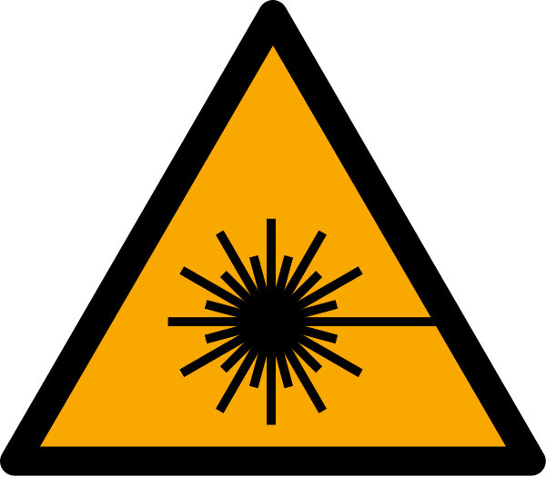

# Der Laser: Stimulierte Emission, Besetzungsinversion, Resonator (Umbau) {#sec-umbau-laser}

::: {.content-visible when-format="html"}
```{=html}
<link rel="stylesheet" href="assets/animations/shared/workbook.css?v=20260919-laserlayout">
<link rel="stylesheet" href="assets/styles/formelwiederholungen.css?v=20260918">
<script src="assets/animations/shared/core.js"></script>
<script src="assets/animations/laser/atom-licht-wechselwirkungen.js"></script>
<script src="assets/animations/laser/besetzungsinversion.js?v=20260918-layout2"></script>
<script src="assets/animations/laser/metastabil.js?v=20260919"></script>
<link rel="stylesheet" href="assets/animations/laser/resonator.css?v=20260921d">
<script src="assets/animations/laser/resonator.js?v=20260921d"></script>
<link rel="stylesheet" href="assets/animations/laser/resonator-moden.css?v=20260921e">
<script src="assets/animations/laser/resonator-moden.js?v=20260921e"></script>
<script src="assets/animations/laser/rubinlaser.js"></script>
<script src="assets/animations/laser/he-ne.js"></script>
<script src="assets/animations/laser/hene-spektroskop.js"></script>
<script src="assets/animations/shared/workbook.js?v=20260921"></script>
```
:::

Laser begegnen dir ständig im Alltag. Im Glasfasernetz transportiert Laserlicht beispielsweise deine Daten durch das Internet. Bei Veranstaltungen erzeugen Laser Lichtshows, in Präsentationen dienen sie als Pointer und in Hautarztpraxen entfernen sie Tattoos und Pigmentflecken. Mit Laserpulsen lassen sich außerdem Entfernungen extrem genau messen, sogar die Distanz von der Erde zum Mond.

Was diese unterschiedlichen Anwendungen verbindet, steckt bereits im Namen „Laser“. Das Akronym steht für „Light Amplification by Stimulated Emission of Radiation“, also Lichtverstärkung durch stimulierte Emission von Strahlung. Der Name weist zugleich den Weg durch dieses Kapitel. Zunächst untersuchst du mit der Absorption, der spontanen Emission und der stimulierten Emission drei grundlegende Prozesse bei der Wechselwirkung von Licht und Atomen. Damit im Lasermedium mehr Photonen durch stimulierte Emission entstehen als absorbiert werden, braucht es eine Besetzungsinversion. Der Resonator führt das Licht wiederholt durch das Medium. Am Rubinlaser untersuchst du anschließend, wie die einzelnen Bausteine zu einem vollständigen Laser zusammenwirken. Der Helium-Neon-Laser zeigt dir danach, wie dasselbe Grundprinzip in einem anderen Lasertyp umgesetzt wird. Da Laser auch im Physikunterricht zum Einsatz kommen können, schließt das Kapitel mit den Laserklassen und den Schutzmaßnahmen für einen sicheren Umgang.

## Stimulierte Emission

::: {.mp-goal-strip}
Du <u>beschreibst</u> Absorption, spontane Emission und stimulierte Emission mithilfe eines Energieniveauschemas.

Du <u>beurteilst</u> mit der Bedingung $E_\text{Photon} = \Delta E = h f$, ob ein Atom ein Photon absorbieren kann.

Du <u>vergleichst</u> spontane und stimulierte Emission.
:::

An einem heißen Sommertag würdest du zwischen einem schwarzen und einem weißen T-Shirt wahrscheinlich zum weißen greifen. Ein schwarzes T-Shirt erwärmt sich in der Sonne meist stärker als ein vergleichbares weißes. Seine dunklen Farbstoffe absorbieren einen größeren Teil des einfallenden Sonnenlichts.

Materie kann Licht aufnehmen und Licht aussenden. Beim schwarzen T-Shirt führt die Aufnahme von Licht zur Erwärmung. Die Glühwendel einer Glühlampe sendet dagegen sichtbares Licht aus. Für eine erste Beschreibung der Wechselwirkung zwischen Licht und Materie betrachten wir drei grundlegende Prozesse im vereinfachten Zwei-Niveau-Modell eines einzelnen Atoms. Bei der Absorption nimmt ein Atom ein Photon vollständig auf. Das Photon verschwindet, und seine Energie geht auf das Atom über. Bei der spontanen und der stimulierten Emission sendet ein angeregtes Atom ein neu entstehendes Photon aus.

Ein Atom kann nur bestimmte Energiewerte besitzen. Andere Energiewerte sind für das Atom nicht möglich. Man sagt, seine Energie ist gequantelt. Anschaulich lassen sich die erlaubten Energien mit den Stufen einer Treppe vergleichen. Das Atom kann einen Zustand auf einer Stufe einnehmen, aber keinen Zustand zwischen zwei Stufen. Anders als bei einer gewöhnlichen Treppe müssen die Abstände zwischen den Energieniveaus nicht gleich groß sein.

Ein reales Atom besitzt viele Energieniveaus. Der Einfachheit halber betrachten wir hier nur zwei. Im vereinfachten Modell steht $E_1$ für den Grundzustand. Befindet sich das Atom im höheren Niveau $E_2$, ist es angeregt. Zwischen beiden Niveaus liegt der Energieabstand

$$
\Delta E = E_2 - E_1.
$$

Ein Photon der Frequenz $f$ trägt die Energie $E_\text{Photon} = h f$. Dabei ist $h$ das Plancksche Wirkungsquantum. Ein Atom im Grundzustand kann das Photon absorbieren, wenn dessen Energie zum Abstand der beiden Energieniveaus passt.

$$
E_\text{Photon} = h f = \Delta E = E_2 - E_1
$$ {#eq-laser-photonenenergie}

Für die Energie des absorbierten Photons zählt damit nicht eines der beiden Energieniveaus allein, sondern die Differenz zwischen ihnen.

Erfüllt ein Photon diese Bedingung, wird es vollständig absorbiert. Es überträgt seine gesamte Energie auf das Atom und existiert danach nicht mehr als Photon. Das Atom wechselt dadurch vom Grundzustand $E_1$ in den angeregten Zustand $E_2$. Diesen Vorgang nennt man Absorption.[Absorption]{.column-margin .mp-randbegriff}

Beim schwarzen T-Shirt absorbieren Farbstoffmoleküle viele der einfallenden Photonen. Die Moleküle besitzen zahlreiche Energieniveaus. Das Zwei-Niveau-Modell bildet daher nur den grundlegenden Absorptionsvorgang ab. Nach der Absorption wird ein großer Teil der aufgenommenen Energie durch strahlungslose Übergänge auf Schwingungen im Material übertragen. Dadurch steigt die Temperatur des T-Shirts.

@fig-umbau-laser-absorption zeigt einen einzelnen Absorptionsvorgang im vereinfachten Zwei-Niveau-Modell. Der große Kreis kennzeichnet das betrachtete Atom. Die beiden waagerechten Linien stehen für seine Energieniveaus. Der blaue Punkt ist kein Elektron. Er markiert den Energiezustand des gesamten Atoms und wechselt bei der Absorption von $E_1$ nach $E_2$.

::: {.content-visible when-format="html"}
::: {#fig-umbau-laser-absorption}
```{=html}
<figure class="srt-workbook-figure">
  <div class="srt-workbook-stage" data-srt-animation="laser-absorption" data-srt-motion-control data-srt-label="Absorption: Ein Photon mit passender Energie trifft auf ein Atom im Grundzustand. Das Photon wird absorbiert, und das Atom wechselt in den angeregten Zustand."></div>
</figure>
```

Animation zur Absorption: Ein Photon mit passender Energie trifft auf ein Atom im Grundzustand, wird absorbiert, und das Atom wechselt in den angeregten Zustand. <span class="mp-caption-warn">Ein Wellenzug stellt jeweils ein einzelnes Photon mit seiner Frequenz dar. Seine Wellenlinie ist keine Flugbahn des Photons.</span>
:::
:::

::: {.content-visible unless-format="html"}
::: {.srt-workbook-fallback}
In der HTML-Version erscheint hier eine Animation: Ein Photon trifft auf ein Atom im Grundzustand. Das Photon wird absorbiert, und das Atom wechselt in den angeregten Zustand.
:::
:::

Ein angeregtes Atom kann in ein niedrigeres Energieniveau übergehen. Entsteht dabei ohne einfallendes Photon ein neues Photon, heißt der Vorgang spontane Emission.[spontane Emission]{.column-margin .mp-randbegriff} Die Energie des Photons entspricht dem Energieabstand $\Delta E$ zwischen den beiden Energieniveaus.

„Spontan“ bedeutet hier, dass kein einfallendes Photon den Übergang auslöst. Der genaue Zeitpunkt des Übergangs und die konkrete Ausbreitungsrichtung des Photons sind nicht festgelegt. Bei vielen Atomen entstehen die Photonen daher zu unterschiedlichen Zeitpunkten und breiten sich in unterschiedliche Richtungen aus. Bei vielen Lichtquellen breitet sich das ausgesandte Licht deshalb in unterschiedliche Richtungen aus.

@fig-umbau-laser-spontane-emission zeigt die spontane Emission im vereinfachten Zwei-Niveau-Modell. Zu Beginn befindet sich das Atom im angeregten Zustand $E_2$. Beim Übergang nach $E_1$ entsteht ein Photon. Bei jedem Durchlauf ändern sich der Zeitpunkt des Übergangs und die Ausbreitungsrichtung des Photons.

:::: {#fig-umbau-laser-spontane-emission}
::: {.content-visible when-format="html"}
```{=html}
<div class="srt-workbook-figure">
  <div class="srt-workbook-stage" data-srt-animation="laser-spontane-emission" data-srt-motion-control data-srt-label="Spontane Emission: Ein angeregtes Atom geht ohne einfallendes Photon in das niedrigere Energieniveau über. Dabei entsteht ein Photon. Zeitpunkt und Ausbreitungsrichtung variieren von Durchlauf zu Durchlauf."></div>
</div>
```
:::

::: {.content-visible unless-format="html"}
::: {.srt-workbook-fallback}
In der HTML-Version erscheint hier eine Animation zur spontanen Emission. Ein angeregtes Atom geht ohne einfallendes Photon in das niedrigere Energieniveau über. Dabei entsteht ein Photon.
:::
:::

Animation zur spontanen Emission. Ein angeregtes Atom geht ohne einfallendes Photon in das niedrigere Energieniveau über. Dabei entsteht ein Photon. Zeitpunkt und Ausbreitungsrichtung variieren von Durchlauf zu Durchlauf. <span class="mp-caption-warn">Ein Wellenzug stellt jeweils ein einzelnes Photon mit seiner Frequenz dar. Seine Wellenlinie ist keine Flugbahn des Photons.</span>
::::

::: {.mp-box .mp-misconception}
<div class="mp-title">Folgt auf die Absorption immer die Aussendung eines Photons?</div>
Das vereinfachte Zwei-Niveau-Modell kann diesen Eindruck erwecken. Nach der Anregung betrachten wir zunächst nur Übergänge, bei denen ein Photon entsteht. In einem Material stehen jedoch weitere Wege offen. Ein angeregtes Atom oder Molekül kann seine Energie an benachbarte Teilchen übertragen. Im Material verteilt sie sich dadurch auf die Bewegung vieler Teilchen. Der Übergang erfolgt dann strahlungslos, ohne dass ein Photon entsteht. Beim schwarzen T-Shirt wird ein großer Teil der aufgenommenen Energie auf diese Weise verteilt und führt zur Erwärmung.
:::

::: {.mp-box .mp-task}
<span class="mp-task-kind mp-task-kind-think" aria-label="Denkcheck">
  
  Denkcheck
</span>

Im vereinfachten Modell betrachten wir die Absorption einzelner Photonen. Ein Atom absorbiert Photonen der Frequenz $5{,}5 \cdot 10^{14}\,\mathrm{Hz}$. Nun trifft ein intensiver Lichtpuls auf das Atom. Seine Photonen besitzen die Frequenz $5{,}3 \cdot 10^{14}\,\mathrm{Hz}$. Die hohe Intensität bedeutet hier, dass pro Fläche und Zeit sehr viele dieser Photonen eintreffen.

<u>Beurteile</u>, ob das Atom Photonen aus diesem Lichtpuls absorbiert.
:::

<details class="mp-details">
<summary>Mögliche Lösung anzeigen</summary>

Nein. Bei der Absorption eines einzelnen Photons muss dessen Energie zum Abstand der beiden Energieniveaus passen. Ein Photon mit der Frequenz $5{,}3 \cdot 10^{14}\,\mathrm{Hz}$ besitzt weniger Energie als ein Photon mit $5{,}5 \cdot 10^{14}\,\mathrm{Hz}$. Die höhere Intensität vergrößert die Zahl der eintreffenden Photonen, aber nicht die Energie eines einzelnen Photons. Im hier verwendeten Ein-Photon-Modell werden die Photonen des Lichtpulses daher nicht absorbiert. Mehrphotonenprozesse, die bei sehr hohen Intensitäten auftreten können, berücksichtigen wir in diesem Modell nicht.

</details>

Der dritte Grundprozess ist die stimulierte Emission, auf der die Lichtverstärkung im Laser beruht. Ein Photon mit passender Energie trifft auf ein Atom im angeregten Zustand $E_2$. Das Photon wird nicht absorbiert, sondern breitet sich weiter aus. Zugleich löst es den Übergang des Atoms in das niedrigere Energieniveau $E_1$ aus. Dabei entsteht ein zweites Photon.

Im Photonenmodell besitzen das einfallende und das neu entstehende Photon dieselbe Energie und dieselbe Ausbreitungsrichtung. Aus $E_\text{Photon}=hf$ folgt, dass beide auch dieselbe Frequenz besitzen. Die Frequenz allein ist allerdings noch keine Besonderheit der stimulierten Emission. Auch ein spontan emittiertes Photon dieses Übergangs trägt die Energie $\Delta E$. Entscheidend ist, dass das einfallende Licht die Ausbreitungsrichtung des neu entstehenden Photons bestimmt. Dieser Vorgang heißt stimulierte Emission.

@fig-umbau-laser-stimulierte-emission zeigt die stimulierte Emission im vereinfachten Zwei-Niveau-Modell. Ein Photon trifft auf das angeregte Atom und löst den Übergang von $E_2$ nach $E_1$ aus. Danach breiten sich zwei Photonen gleicher Energie in dieselbe Richtung aus.

:::: {#fig-umbau-laser-stimulierte-emission}
::: {.content-visible when-format="html"}
```{=html}
<div class="srt-workbook-figure">
  <div class="srt-workbook-stage" data-srt-animation="laser-stimulierte-emission" data-srt-motion-control data-srt-label="Stimulierte Emission: Ein Photon mit passender Energie trifft auf ein angeregtes Atom und löst den Übergang in das niedrigere Energieniveau aus. Danach breiten sich zwei Photonen gleicher Energie in dieselbe Richtung aus."></div>
</div>
```
:::

::: {.content-visible unless-format="html"}
::: {.srt-workbook-fallback}
In der HTML-Version erscheint hier eine Animation zur stimulierten Emission. Ein Photon mit passender Energie trifft auf ein angeregtes Atom und löst den Übergang in das niedrigere Energieniveau aus. Danach breiten sich zwei Photonen gleicher Energie in dieselbe Richtung aus.
:::
:::

Animation zur stimulierten Emission. Ein Photon mit passender Energie trifft auf ein angeregtes Atom und löst den Übergang in das niedrigere Energieniveau aus. Danach breiten sich zwei Photonen gleicher Energie in dieselbe Richtung aus. <span class="mp-caption-warn">Ein Wellenzug stellt jeweils ein einzelnes Photon mit seiner Frequenz dar. Seine Wellenlinie ist keine Flugbahn des Photons.</span>
::::

Bis hierher haben wir die stimulierte Emission im Photonenmodell beschrieben. Dieses Modell eignet sich, um den Austausch einzelner Energiequanten bei atomaren Übergängen zu beschreiben. Für die Phasenlage des Lichts verwenden wir nun das Wellenmodell. Beide Modelle erfassen unterschiedliche Aspekte desselben Lichts.

Im Wellenmodell beschreiben wir das einfallende und das neu entstehende Licht jeweils als Lichtwelle. Im hier betrachteten idealisierten Fall entsteht bei der stimulierten Emission eine Lichtwelle, die gleichphasig zur einfallenden Lichtwelle ist. Wellenberg liegt auf Wellenberg und Wellental auf Wellental.

Damit lässt sich eine weitere Eigenschaft des entstehenden Lichts beschreiben. Zwei Lichtwellen heißen kohärent, wenn zwischen ihnen eine feste Phasenbeziehung besteht.[Kohärenz]{.column-margin .mp-randbegriff} Das bedeutet, dass Wellenberge und Wellentäler ihren gegenseitigen Versatz beibehalten. Dieser Versatz muss nicht null sein. Die Gleichphasigkeit bei der stimulierten Emission ist ein besonderer Fall einer solchen festen Phasenbeziehung.

::: {.column-margin}
Die Erklärung über eine feste Phasenbeziehung beschreibt Kohärenz nur vereinfacht. Eine genauere Beschreibung unterscheidet räumliche und zeitliche Kohärenz. Beide können unterschiedlich stark ausgeprägt sein, Licht kann also auch teilweise kohärent sein. Einen experimentellen Zugang findest du in [Kai Piepers Dissertation](https://phka.bsz-bw.de/frontdoor/index/index/docId/230).
:::

Werden kohärente Lichtwellen überlagert, kann ein stabiles Interferenzmuster entstehen. Ein solches Muster hast du beim Michelson-Morley-Experiment im [Kapitel zu Raum und Zeit](01_srt_raum_und_zeit_umbau.qmd#michelson-morley-experiment) kennengelernt. Dort werden zwei Teilstrahlen derselben Lichtquelle überlagert. Ein Laser ist dafür nicht zwingend erforderlich. Sein gut sichtbarer, gerichteter Strahl erleichtert jedoch die räumliche Überlagerung der beiden Teilstrahlen. Außerdem bleibt ihre Phasenbeziehung auch bei größeren Unterschieden der optischen Wege erhalten, sodass weiterhin ein kontrastreiches Interferenzmuster entstehen kann.

Eine hohe Kohärenz ist eine charakteristische Eigenschaft vieler Laserstrahlen. Sie entsteht im Zusammenspiel von stimulierter Emission und Resonator.

::: {.mp-box .mp-task}
<span class="mp-task-kind mp-task-kind-think" aria-label="Denkcheck">
  
  Denkcheck
</span>

Bei der spontanen und bei der stimulierten Emission sendet ein angeregtes Atom ein Photon aus.

<u>Vergleiche</u> die beiden Vorgänge nach Auslöser, Zeitpunkt und Richtung des ausgesandten Photons.
:::

<details class="mp-details">
<summary>Mögliche Lösung anzeigen</summary>
<p>Die spontane Emission startet im Atom selbst. Zeitpunkt und Richtung des Photons sind zufällig. Die stimulierte Emission wird von einem passenden Photon ausgelöst. Sie geschieht beim Eintreffen dieses Photons, und das neue Photon läuft in dieselbe Richtung wie das auslösende. Es schwingt zudem im gleichen Takt.</p>
</details>

## Besetzungsinversion und Lasermedium

::: {.mp-goal-strip}
Du <u>erklärst</u>, wann zwischen zwei Energieniveaus eine Besetzungsinversion vorliegt und weshalb sie für die Lichtverstärkung erforderlich ist.

Du <u>berechnest</u> Besetzungsverhältnisse im thermischen Gleichgewicht und <u>begründest</u> damit, dass ein Lasermedium gepumpt werden muss.

Du <u>erklärst</u>, welche Funktion ein metastabiles Niveau beim Aufbau einer Besetzungsinversion erfüllt.
:::

Im Namen „Laser“ steckt die Lichtverstärkung. Im vorherigen Unterkapitel hast du den einzelnen Vorgang kennengelernt, auf dem sie beruht. Bei der stimulierten Emission entsteht neben dem einfallenden Photon ein weiteres. Aus einem einzelnen solchen Übergang folgt jedoch noch nicht, dass die Zahl der Photonen in einem Material insgesamt zunimmt. Ein passendes Photon kann dort auch absorbiert werden. Entscheidend ist deshalb, wie viele Atome sich im oberen und wie viele sich im unteren Energieniveau befinden.

Das Lasermedium ist das Material, in dem Licht verstärkt werden kann.

Das vereinfachte Zwei-Niveau-Modell aus dem vorherigen Unterkapitel genügt, um beide Prozesse zu vergleichen. Ein Photon, dessen Energie gemäß @eq-laser-photonenenergie zum Abstand $E_2-E_1$ passt, kann von einem Atom im unteren Niveau $E_1$ absorbiert werden. An einem Atom im oberen Niveau $E_2$ kann es stimulierte Emission auslösen. Dabei entsteht ein zusätzliches Photon mit derselben Energie und derselben Ausbreitungsrichtung.

Im vereinfachten Zwei-Niveau-Modell sind Absorption und stimulierte Emission pro passendem Atom gleich wahrscheinlich. $N_1$ bezeichnet die Zahl der Atome in $E_1$, $N_2$ die Zahl der Atome in $E_2$. Bei $N_2>N_1$ kommen durch stimulierte Emission im Mittel mehr Photonen hinzu, als durch Absorption verschwinden. Diese Zunahme der Photonenzahl beim Durchgang durch das Medium heißt Lichtverstärkung.[Lichtverstärkung]{.column-margin .mp-randbegriff}

Der Zustand $N_2>N_1$ heißt Besetzungsinversion. Im oberen Niveau befinden sich dann mehr Atome als im unteren. Für diesen Vergleich zählen nur die beiden Niveaus des betrachteten Übergangs. Weitere Niveaus werden nicht mitgezählt. Für die Erzeugung und Aufrechterhaltung der Besetzungsinversion können sie trotzdem entscheidend sein.

@fig-umbau-laser-besetzungsinversion vergleicht beide Besetzungen an sechs schematisch dargestellten Atomen. Jeder Punkt markiert den Energiezustand des gesamten Atoms. Er stellt kein Elektron dar. Bei normaler Besetzung gilt $N_1>N_2$. Im dargestellten Durchgang wird das einlaufende Photon absorbiert. Ein zunächst angeregtes Atom gibt unabhängig davon durch spontane Emission ein Photon in eine andere Richtung ab. Bei Besetzungsinversion gilt $N_2>N_1$. Das einlaufende Photon löst an mehreren Atomen im oberen Niveau nacheinander stimulierte Emission aus. Bei jedem Übergang kommt ein weiteres Photon mit derselben Energie und derselben Ausbreitungsrichtung hinzu.

:::: {#fig-umbau-laser-besetzungsinversion}
::: {.content-visible when-format="html"}
```{=html}
<div class="srt-workbook-figure">
  <div class="srt-workbook-stage" data-srt-animation="laser-besetzungsinversion" data-srt-viewbox-h="280" data-srt-label="Simulation zum Vergleich von normaler Besetzung und Besetzungsinversion im vereinfachten Zwei-Niveau-Modell. Sechs Atome sind mit je zwei Energieniveaus dargestellt. Ein Punkt markiert jeweils den Energiezustand des Atoms. Bei normaler Besetzung wird das einlaufende Photon absorbiert; ein angeregtes Atom emittiert unabhängig davon spontan in eine andere Richtung. Bei Besetzungsinversion löst das einlaufende Photon nacheinander stimulierte Emission aus, sodass weitere Photonen derselben Energie und Ausbreitungsrichtung entstehen."></div>
</div>
```
:::

::: {.content-visible unless-format="html"}
::: {.srt-workbook-fallback}
In der HTML-Version erscheint hier eine Simulation zum Vergleich von normaler Besetzung und Besetzungsinversion im vereinfachten Zwei-Niveau-Modell.
:::
:::

Simulation zum Vergleich von normaler Besetzung und Besetzungsinversion im vereinfachten Zwei-Niveau-Modell. Die sechs dargestellten Atome veranschaulichen nur das Besetzungsverhältnis. Sie bilden die Wahrscheinlichkeitsbilanz eines realen Lasermediums nicht quantitativ ab. <span class="mp-caption-warn">Ein Wellenzug stellt jeweils ein einzelnes Photon mit seiner Frequenz dar. Seine Wellenlinie ist keine Flugbahn des Photons.</span>
::::

Im Normalfall befindet sich ein Medium im thermischen Gleichgewicht.[thermisches Gleichgewicht]{.column-margin .mp-randbegriff} Für unsere Betrachtung bedeutet das, dass sich ein zeitlich stabiles Besetzungsverhältnis $N_2/N_1$ einstellt, dessen Wert vom Energieabstand und von der Temperatur abhängt.

Wie sich die Atome im thermischen Gleichgewicht auf die Energieniveaus verteilen, beschreibt die Boltzmann-Verteilung. Für die beiden Niveaus $E_1$ und $E_2$ des vereinfachten Zwei-Niveau-Modells gilt

$$
\frac{N_2}{N_1} = e^{-\frac{E_2-E_1}{k_\mathrm{B}T}}
$$ {#eq-laser-boltzmann}

$k_\mathrm{B}$ ist die Boltzmann-Konstante und $T$ die absolute Temperatur.

Da $E_2$ das höhere Niveau ist, ist $E_2-E_1$ positiv. Bei einer positiven Temperatur ist der Exponent wegen des Minuszeichens negativ. Die rechte Seite der Gleichung liegt damit zwischen $0$ und $1$. Folglich gilt $N_2/N_1<1$ und damit $N_2<N_1$. Das untere Niveau ist stärker besetzt als das obere. Ein passendes Photon trifft deshalb häufiger auf ein Atom in $E_1$. Die Absorption überwiegt die stimulierte Emission.

Mit steigender Temperatur wird der Betrag des Exponenten kleiner. Das Verhältnis $N_2/N_1$ nähert sich dem Wert $1$, überschreitet ihn bei positiver Temperatur aber nicht. Im thermischen Gleichgewicht entsteht daher bei positiver Temperatur keine Besetzungsinversion.

:::: {#aufgabe-laser-boltzmann .mp-box .mp-task}
<span class="mp-task-kind mp-task-kind-calculate" aria-label="Berechnung">
  
  Berechnung
</span>

Im vereinfachten Zwei-Niveau-Modell verteilen sich $10^{20}$ Atome auf $E_1$ und $E_2$. Der Energieabstand $E_2-E_1=2{,}0\,\mathrm{eV}=3{,}2\cdot10^{-19}\,\mathrm{J}$ entspricht rotem Licht. Das Medium befindet sich bei Raumtemperatur mit $T=300\,\mathrm{K}$. Verwende $k_\mathrm{B}=1{,}38\cdot10^{-23}\,\tfrac{\mathrm{J}}{\mathrm{K}}$.

Für diese Aufgabe benötigst du folgende aus dem Unterkapitel bekannte Formel.

::: {.mp-formula-repeat}
$$
\frac{N_2}{N_1}=e^{-\frac{E_2-E_1}{k_\mathrm{B}T}}
$$

([-@eq-laser-boltzmann])
:::

<u>Berechne</u> das Besetzungsverhältnis $N_2/N_1$ und daraus die mittlere Zahl der Atome in $E_2$.
::::

<details class="mp-details">
<summary>Mögliche Lösung anzeigen</summary>

Der Quotient im Betrag des Exponenten beträgt

$$
\frac{E_2 - E_1}{k_\mathrm{B}\,T}
= \frac{3{,}2 \cdot 10^{-19}\,\mathrm{J}}{1{,}38 \cdot 10^{-23}\,\tfrac{\mathrm{J}}{\mathrm{K}} \cdot 300\,\mathrm{K}}
\approx 77{,}3.
$$

Mit dem Minuszeichen in der Boltzmann-Beziehung ist der Exponent damit ungefähr $-77{,}3$. Für das Besetzungsverhältnis folgt

$$
r=\frac{N_2}{N_1}=e^{-77{,}3}\approx2{,}7\cdot10^{-34}.
$$

Die Gesamtzahl der Atome ist $N=N_1+N_2=10^{20}$. Mit $N_2=rN_1$ ergibt sich

$$
\begin{aligned}
N&=N_1+rN_1=N_1(1+r),\\
N_2&=\frac{r}{1+r}\,N\\
&\approx2{,}7\cdot10^{-34}\cdot10^{20}\\
&=2{,}7\cdot10^{-14}.
\end{aligned}
$$

Der Wert $2{,}7\cdot10^{-14}$ ist eine mittlere Besetzungszahl und kein Bruchteil eines Atoms. Er liegt so weit unter $1$, dass das obere Niveau $E_2$ in einem Medium dieser Größe praktisch immer unbesetzt ist. Ein passendes Photon trifft daher fast ausschließlich auf ein Atom in $E_1$, sodass die Absorption überwiegt. Die Gleichgewichtsbesetzung liefert keine Besetzungsinversion.

</details>

::: {#laser-pumpen}
Um eine Besetzungsinversion zu erzeugen, muss dem Lasermedium Energie von außen zugeführt werden. Diese gezielte Energiezufuhr nennt man beim Laser Pumpen.[Pumpen]{.column-margin .mp-randbegriff} Sie kann fortlaufend oder in einzelnen Pumpimpulsen erfolgen. Durch das Pumpen werden höhere Energiezustände stärker besetzt, als es im thermischen Gleichgewicht bei derselben Temperatur der Fall wäre.
:::

Je nach Lasertyp wird optisch oder elektrisch gepumpt. Beim optischen Pumpen liefert etwa eine Blitzlampe die Energie. Elektrisch geschieht dies beispielsweise durch eine Gasentladung oder durch Strominjektion in einen Halbleiter.

Im hier verwendeten Zwei-Niveau-Modell lässt sich mit Pumplicht, dessen Photonenenergie genau zum Übergang zwischen $E_1$ und $E_2$ passt, keine Besetzungsinversion erzeugen. Das Pumplicht, das ein Atom von $E_1$ nach $E_2$ hebt (Absorption), kann an einem Atom in $E_2$ den Übergang nach $E_1$ auslösen (stimulierte Emission). Da beide Vorgänge pro passendem Atom gleich wahrscheinlich sind, bestimmt die jeweilige Besetzungszahl ihre Rate. Die Absorptionsrate wächst mit der Zahl $N_1$ der Atome im Grundzustand $E_1$. Die Rate der stimulierten Emission wächst mit der Zahl $N_2$ der Atome im oberen Niveau $E_2$. Bei $N_1=N_2$ gleichen sich beide Raten aus. Das Pumplicht kann die Besetzungen daher höchstens an die Gleichbesetzung annähern. Eine Besetzungsinversion lässt sich auf diesem Weg nicht erzeugen.

Konventionelle atomare Laser umgehen diese Grenze, indem am Pumpvorgang weitere Energieniveaus beteiligt sind. Das Grundprinzip lässt sich mit einem vereinfachten Drei-Niveau-Modell erklären. Das Pumplicht hebt Atome aus dem Grundzustand $E_1$ zunächst in das kurzlebige Pumpniveau $E_3$. Von $E_3$ wechseln die Atome schnell, meist durch einen strahlungslosen Übergang, in das obere Laserniveau $E_2$.

Das Niveau $E_2$ ist metastabil.[metastabiler Zustand]{.column-margin .mp-randbegriff} Metastabil bedeutet hier, dass die spontane Emission aus diesem Zustand im Mittel deutlich später einsetzt als aus einem gewöhnlichen angeregten Zustand. Während dieser Zeit bleibt Anregungsenergie im Atom gespeichert. Dadurch können sich Atome in $E_2$ ansammeln.

Der Pumpübergang von $E_1$ nach $E_3$ und der Laserübergang von $E_2$ nach $E_1$ besitzen unterschiedliche Energieabstände. Das Pumplicht passt deshalb nicht zum Laserübergang und löst an den Atomen in $E_2$ keine stimulierte Emission nach $E_1$ aus. Gelangen durch das Pumpen ausreichend viele Atome nach $E_2$, kann schließlich $N_2>N_1$ gelten. Zwischen $E_2$ und $E_1$ liegt dann eine Besetzungsinversion vor.

Die Besetzungsinversion bleibt nicht von selbst erhalten, denn Übergänge aus $E_2$ verringern dessen Besetzung wieder. Um die Inversion aufrechtzuerhalten, müssen durch weiteres Pumpen genügend Atome nach $E_2$ gelangen.

Das metastabile Niveau lässt sich durch eine Kugelmulde an einem Hang veranschaulichen. Die Höhe der Kugel steht für die Energie des Atoms. Die obere Position entspricht dem Pumpniveau $E_3$, die tiefer gelegene Mulde dem metastabilen Niveau $E_2$ und der Fuß des Hangs dem Grundzustand $E_1$. Auf einem gleichmäßig abfallenden Hang rollt die Kugel rasch nach unten. Erreicht sie die Mulde, bleibt sie dort liegen. Entsprechend wechselt ein Atom schnell von $E_3$ nach $E_2$ und verweilt anschließend deutlich länger in $E_2$.

Beim Verlassen der Mulde endet die Analogie. Die Kugel könnte die Mulde nur verlassen, wenn ihr von außen Energie zugeführt würde. Das Atom benötigt dagegen keine zusätzliche Energie, um vom metastabilen Niveau $E_2$ in den Grundzustand $E_1$ zu wechseln. Es kann nach einer zufälligen Wartezeit spontan nach $E_1$ übergehen. Ein passendes Photon kann diesen Übergang stattdessen durch stimulierte Emission auslösen. Das einfallende Photon wird dabei nicht absorbiert und liefert dem Atom keine Aktivierungsenergie oder einen energetischen „Schubs“. Das einfallende Photon bleibt erhalten. Die Energie des zusätzlich entstehenden Photons stammt vollständig aus der Energiedifferenz $E_2-E_1$ des Atoms.

In @fig-umbau-laser-metastabil kannst du die Kugelmulden-Analogie mit einem Energieniveauschema mit drei Niveaus vergleichen. Links bleibt die Kugel in der Mulde liegen. Rechts markiert der blaue Punkt den Energiezustand des Atoms. Er wechselt vom Pumpniveau $E_3$ schnell in das metastabile Niveau $E_2$ und nach einer längeren Wartezeit in den Grundzustand $E_1$.

:::: {#fig-umbau-laser-metastabil}
::: {.content-visible when-format="html"}
```{=html}
<div class="srt-workbook-figure">
  <div class="srt-workbook-stage" data-srt-animation="laser-metastabil" data-srt-motion-control data-srt-label="Links rollt eine Kugel einen Hang hinab und bleibt in einer Mulde liegen. Rechts markiert ein blauer Punkt den Energiezustand eines Atoms im Drei-Niveau-Schema. Er wechselt vom Pumpniveau E3 schnell in das metastabile Niveau E2 und nach längerer Wartezeit in den Grundzustand E1. Die Kugel bleibt währenddessen in der Mulde."></div>
</div>
```
:::

::: {.content-visible unless-format="html"}
::: {.srt-workbook-fallback}
In der HTML-Version erscheint hier eine Animation zur Kugelmulden-Analogie und zum Drei-Niveau-Schema. Links bleibt die Kugel in der Mulde liegen. Rechts wechselt der Zustandspunkt vom Pumpniveau $E_3$ schnell in das metastabile Niveau $E_2$ und nach längerer Wartezeit in den Grundzustand $E_1$.
:::
:::

Animation zur Kugelmulden-Analogie und zum Drei-Niveau-Schema. Links gelangt eine Kugel von oben in eine Mulde und bleibt dort liegen. Rechts wechselt der Zustandspunkt vom Pumpniveau $E_3$ schnell in das metastabile Niveau $E_2$ und nach längerer Wartezeit weiter in den Grundzustand $E_1$.
::::

::: {#aufgabe-laser-nachleuchten .mp-box .mp-task}
<span class="mp-task-kind mp-task-kind-transfer" aria-label="Transfer">
  
  Transfer
</span>

Vielleicht hast du schon einmal nachleuchtende Sterne an einer Zimmerdecke oder Leuchtstreifen auf einer Uhr gesehen. Nachdem sie eine Zeit lang beleuchtet wurden, leuchten sie im Dunkeln noch minutenlang weiter.

<u>Stelle</u> eine Hypothese dazu <u>auf</u>, wie dieses Nachleuchten entstehen könnte. <u>Begründe</u> deine Vermutung mithilfe des Energieniveauschemas und deines Wissens über metastabile Zustände.
:::

<details class="mp-details">
<summary>Mögliche Lösung anzeigen</summary>

Beim Beleuchten nimmt der Leuchtstoff Energie auf. Mit dem vereinfachten Energieniveauschema lässt sich als Hypothese annehmen, dass ein Teil der angeregten Teilchen in einen metastabilen Zustand gelangt. Dort bleibt Anregungsenergie länger gespeichert. Die Teilchen gehen zu unterschiedlichen Zeitpunkten spontan in ein niedrigeres Niveau über und geben dabei Energie als Licht ab. Auf diese Weise könnte der Stoff nach dem Ausschalten der Lichtquelle weiterleuchten.

Diese Erklärung ist eine Hypothese auf Grundlage des bisher verwendeten Energieniveauschemas. Welcher Speichermechanismus in einem konkreten Leuchtstoff wirkt, lässt sich damit noch nicht entscheiden.

</details>

<!-- Redaktionsnotiz: Ein mögliches Folgekapitel zu Fluoreszenz und Phosphoreszenz kann von hier auf die Hypothese zum Nachleuchten zurückverweisen. -->

## Resonator

::: {.mp-goal-strip}
Du <u>beschreibst</u> den Aufbau eines optischen Resonators.

Du <u>erklärst</u>, wie der Resonator die Richtung des Laserstrahls festlegt und wie der Strahl ausgekoppelt wird.

Du <u>erläuterst</u> die Resonanzbedingung und <u>wendest</u> sie <u>an</u>.
:::

Im vorherigen Unterkapitel hast du kennengelernt, wie durch Pumpen eine Besetzungsinversion aufgebaut werden kann. Ein solches Lasermedium kann Licht verstärken. Es gibt aber weiterhin Licht in unterschiedliche Richtungen ab. Bei einem Laserpointer tritt dagegen ein schmaler, gerichteter Strahl aus. Um diesen Unterschied zu verstehen, betrachten wir zunächst die Ausbreitungsrichtungen der Photonen.

Durch spontane Emission entstehen im Lasermedium Photonen in unterschiedlichen Richtungen. Löst eines davon stimulierte Emission aus, breitet sich das zusätzliche Photon in derselben Richtung aus wie das auslösende. Licht kann deshalb zunächst in verschiedenen Richtungen verstärkt werden und das Medium anschließend verlassen.

Ein optischer Resonator ermöglicht, dass ein Teil des Lichts das Lasermedium wiederholt durchquert. Ein einfacher optischer Resonator besteht aus zwei gegenüberliegenden Spiegeln. Zwischen ihnen liegt das Lasermedium. Einer der Spiegel reflektiert das Licht nahezu vollständig. Der andere ist teildurchlässig und lässt einen Teil des Lichts als Laserstrahl austreten. Den übrigen Teil reflektiert er zurück.

Licht, das sich annähernd entlang der Spiegelachse ausbreitet, wird abwechselnd an beiden Spiegeln reflektiert. Dabei durchquert es wiederholt das gepumpte Lasermedium und kann weitere stimulierte Emission auslösen. Die zusätzlichen Photonen besitzen dieselbe Frequenz und Ausbreitungsrichtung wie die jeweils auslösenden Photonen. Bei Licht, das sich unter einem größeren Winkel zur Spiegelachse ausbreitet, treffen die Photonen nach kurzer Zeit nicht mehr auf die Spiegel und verlassen den Bereich zwischen ihnen seitlich. Entlang der Spiegelachse sind dagegen viele Durchgänge möglich, bei denen weitere Photonen durch stimulierte Emission hinzukommen können.

Solange die Verstärkung bei einem vollständigen Umlauf größer ist als die Verluste durch Auskopplung und andere Verlustprozesse, wächst die Lichtintensität im Resonator. Bei gleichbleibender Durchlässigkeit des Auskoppelspiegels nimmt damit auch die Intensität des austretenden Laserstrahls zu.

@fig-umbau-laser-resonator zeigt ein optisch gepumptes Lasermedium mit und ohne Resonator. Die Atomfarben kennzeichnen die drei bereits bekannten Energieniveaus: den grauen Grundzustand $E_1$, das gelbe obere Laserniveau $E_2$ und das violette Pumpniveau $E_3$. Violette Punkte zeigen Photonen des Pumplichts, rote Punkte die Photonen des Laserübergangs. Du kannst den Aufbau, die Pumpstärke und die Reflexion des Auskoppelspiegels verändern.

:::: {#fig-umbau-laser-resonator}
::: {.content-visible when-format="html"}
```{=html}
<div class="srt-workbook-figure">
  <div class="srt-workbook-stage" data-srt-animation="laser-resonator" data-srt-viewbox-h="368" data-srt-label="Simulation eines optisch gepumpten Drei-Niveau-Lasermediums mit und ohne Resonator. Grau bezeichnet den Grundzustand E1, Gelb mit einem Ring das obere Laserniveau E2 und Violett mit weißem Punkt das Pumpniveau E3. Violette Punkte zeigen Pump-Photonen und rote Punkte Photonen des Laserübergangs. Ein rotes Band fasst das entlang der Achse ausgekoppelte Licht zusammen. Reflexion des Auskoppelspiegels, Pumpstufe und Aufbau sind veränderbar."></div>
</div>
```
:::

::: {.content-visible unless-format="html"}
::: {.srt-workbook-fallback}
In der HTML-Version kannst du zwischen einem gepumpten Lasermedium mit und ohne Resonator wechseln und die Pumpstärke verändern. Die Atome durchlaufen Grundzustand, Pumpniveau und oberes Laserniveau. Ohne Spiegel verlässt das Licht das Medium nach einem Durchgang. Mit Spiegeln sind wiederholte Durchgänge möglich, und ein Teil des Lichts tritt durch den rechten Spiegel aus.
:::
:::

Simulation zum optischen Pumpen und zur Lichtausbreitung in einem Lasermedium mit und ohne Resonator. Das rote Band fasst das entlang der Achse ausgekoppelte Licht zusammen; seine Stärke gibt den zeitlich gemittelten Photonenaustritt qualitativ wieder. Teilchenzahl, Zeiten und Lichtwege sind schematisch. Absorption und Streuung an den Spiegeln werden vernachlässigt.
::::

::: {.mp-box .mp-task}
<span class="mp-task-kind mp-task-kind-think" aria-label="Denkcheck">
  
  Denkcheck
</span>

Ein Photon entsteht im Lasermedium durch spontane Emission und läuft schräg zur Resonatorachse.

<u>Begründe</u>, dass es den Laserstrahl nicht aufbaut.
:::

<details class="mp-details">
<summary>Mögliche Lösung anzeigen</summary>

Das Photon trifft die Spiegel nicht immer wieder. Es verlässt das Lasermedium nach kurzer Zeit. Damit durchquert es das Medium nur selten und löst kaum stimulierte Emission in Strahlrichtung aus. Für den Laserstrahl werden vor allem Photonen verstärkt, die entlang der Resonatorachse laufen.

</details>

Für die stehenden Wellen im Resonator verwenden wir das Wellenmodell. Treffen Wellen aufeinander, überlagern sich ihre Schwingungen. Je nach Phasenlage fallen die Schwingungen dabei stärker oder schwächer aus, sie können sich auch vollständig aufheben. Dieses Phänomen heißt Interferenz.[Interferenz]{.column-margin .mp-randbegriff}

Im Resonator überlagern sich die zum Spiegel gerichtete Lichtwelle und die von ihm reflektierte Lichtwelle. Die reflektierte Welle breitet sich zurück aus, der einfallenden Welle entgegen. Haben beide Wellen dieselbe Frequenz, Wellenlänge und Amplitude, entsteht bei gleicher Schwingungsrichtung eine stehende Welle.[stehende Welle]{.column-margin .mp-randbegriff} Ihr räumliches Schwingungsmuster bleibt an derselben Stelle. An den Knoten findet keine Schwingung statt. Zwischen ihnen liegen die Bäuche mit der größten Amplitude, also dem größten Schwingungsausschlag.

Vielleicht kennst du aus der Experimentalphysik einen Versuch mit dem Kundtschen Rohr. In diesem Rohr überlagern sich einfallende und reflektierte Schallwellen zu einer stehenden Welle. Die Bewegung der Luftteilchen verteilt das Korkmehl im Rohr um, sodass es sich an den Bewegungsknoten in Häufchen sammelt. Diese Häufchen machen die Lage der Knoten sichtbar.

Das Muster aus Knoten und Bäuchen lässt sich auf Licht übertragen. Anders als beim Schall sind es hier keine Luftteilchen, die schwingen. Eine Lichtwelle besteht aus einem schwingenden elektrischen und magnetischen Feld. Bei der folgenden Betrachtung beschreibt die stehende Welle die Schwingung des elektrischen Feldes zwischen den Spiegeln.

Für die Resonanzbedingung betrachten wir zunächst zwei vollständig reflektierende Spiegel. Die Wellenlänge soll zwischen ihnen überall gleich sein. An beiden Spiegeln liegen Knoten des elektrischen Feldes. Zwischen benachbarten Knoten liegt jeweils eine halbe Wellenlänge. Zwischen die Spiegel muss daher eine ganze Zahl halber Wellenlängen passen. Die Resonanzbedingung lautet:

$$
L=m\cdot\frac{\lambda}{2},
\qquad m=1,2,3,\ldots
$$ {#eq-laser-resonanzbedingung}

$L$ ist der Spiegelabstand und $\lambda$ die Wellenlänge im Resonator. Die Zahl $m$ zählt die halben Wellenlängen zwischen den Spiegeln. Jedes mögliche Schwingungsmuster heißt Resonatormode.[Resonatormode]{.column-margin .mp-randbegriff} Beispielsweise bilden drei halbe Wellenlängen zusammen eine Mode mit $m=3$.

@fig-umbau-laser-stehende-welle zeigt die Schwingung des elektrischen Feldes zwischen den Spiegeln. Du kannst zwischen Mustern mit drei, vier und fünf Bäuchen wechseln.

:::: {#fig-umbau-laser-stehende-welle}
::: {.content-visible when-format="html"}
```{=html}
<div class="srt-workbook-figure">
  <div class="srt-workbook-stage" data-srt-animation="laser-stehende-welle" data-srt-viewbox-h="310" data-srt-label="Elektrisches Feld einer stehenden Lichtwelle zwischen zwei Spiegeln. Drei, vier oder fünf Bäuche sind auswählbar. Jeder gewählte Verlauf ist eine einzige Resonatormode. Knoten bleiben beim Abspielen an festen Orten mit Feldstärke null."></div>
</div>
```
:::

::: {.content-visible unless-format="html"}
::: {.srt-workbook-fallback}
In der HTML-Version kannst du zwischen Schwingungsmustern mit drei, vier und fünf Bäuchen wechseln. Die Spiegel bleiben an denselben Orten. An den Knoten bleibt das elektrische Feld null, an den Bäuchen ist seine Schwingungsamplitude am größten. Mit zunehmender Zahl der Bäuche wird die Wellenlänge kürzer.
:::
:::

Simulation stehender Lichtwellen. Die Kurve zeigt eine Komponente des elektrischen Feldes entlang der Spiegelachse. Die Lichtauskopplung ist für das Schwingungsmuster vernachlässigt. Zur Übersicht sind nur wenige Bäuche dargestellt und die Schwingung ist stark verlangsamt.
::::

:::: {.mp-box .mp-task}
<span class="mp-task-kind mp-task-kind-calculate" aria-label="Berechnung">
  
  Berechnung
</span>

Ein Resonator ist $L=35\,\mathrm{cm}$ lang. Eine seiner Moden besitzt die Wellenlänge $\lambda=700\,\mathrm{nm}$.

Für diese Aufgabe benötigst du folgende aus dem Unterkapitel bekannte Formel.

::: {.mp-formula-repeat}
$$
L=m\cdot\frac{\lambda}{2}
$$

([-@eq-laser-resonanzbedingung])
:::

<u>Berechne</u>, wie viele halbe Wellenlängen zwischen die Spiegel passen.
::::

<details class="mp-details">
<summary>Mögliche Lösung anzeigen</summary>

Aus der Resonanzbedingung folgt:

$$
m=\frac{2L}{\lambda}
=\frac{2\cdot0{,}35\,\mathrm{m}}{700\cdot10^{-9}\,\mathrm{m}}
=1\,000\,000.
$$

Das Schwingungsmuster enthält eine Million halber Wellenlängen.

</details>

Im Zahlenbeispiel enthält eine einzige Mode eine Million halber Wellenlängen. Bei der benachbarten Mode passen $1\,000\,001$ halbe Wellenlängen zwischen dieselben Spiegel. Ihre Wellenlänge beträgt etwa $699{,}999300\,\mathrm{nm}$ statt $700\,\mathrm{nm}$. Der Unterschied beträgt also nur etwa $0{,}000700\,\mathrm{nm}$.

Bisher haben wir dem Laserübergang eine einzelne Wellenlänge zugeordnet. Bei einem realen Lasermedium ist die Lichtverstärkung durch stimulierte Emission jedoch auf einen kleinen Wellenlängenbereich verteilt. Dessen Breite bezeichnen wir mit $\Delta\lambda$. Innerhalb dieses Bereichs können mehrere zum Resonator passende Wellenlängen liegen.

Um den Einfluss des Spiegelabstands zu verstehen, stell dir zunächst ein Muster mit drei Bäuchen vor. Werden die Spiegel weiter auseinandergerückt, sollen weiterhin genau drei Bäuche zwischen ihnen liegen. Jeder Bauch muss dann breiter werden. Da ein Bauch eine halbe Wellenlänge umfasst, wird auch die Wellenlänge größer. Das gilt ebenso für das Muster mit einer Million Bäuchen aus der Rechnung.

@fig-umbau-laser-modenbereich verbindet die beiden Bedingungen. Der gelbe Bereich zeigt die Wellenlängen, die das Lasermedium verstärken kann. Die Striche markieren Wellenlängen, die zum Spiegelabstand passen. Ein blauer Punkt markiert die Mode aus der Rechnung, damit du ihre Wellenlänge beim Verändern des Spiegelabstands verfolgen kannst. Du veränderst ausschließlich den Spiegelabstand. Die Eigenschaften des Lasermediums und damit der gelbe Bereich bleiben unverändert.

:::: {#fig-umbau-laser-modenbereich}
::: {.content-visible when-format="html"}
```{=html}
<div class="srt-workbook-figure">
  <div class="srt-workbook-stage" data-srt-animation="laser-modenbereich" data-srt-viewbox-h="380" data-srt-label="Der feste gelbe Bereich zeigt Wellenlängen, die das Lasermedium verstärken kann. Senkrechte Striche markieren zum Spiegelabstand passende Wellenlängen. Ein blauer Punkt markiert durchgehend die Mode mit einer Million halber Wellenlängen. Ihr Wellenlängenwert wird angezeigt. Ein Pfeil zeigt die Änderung gegenüber dem Ausgangswert 700 Nanometer."></div>
</div>
```
:::

::: {.content-visible unless-format="html"}
::: {.srt-workbook-fallback}
In der HTML-Version kannst du den Spiegelabstand um bis zu 200 nm verändern. Die markierte Mode behält eine Million halber Wellenlängen. Bei einer Verlängerung von 35 cm um 200 nm nimmt ihre Wellenlänge von 700 nm auf 700,000400 nm zu. Das beispielhafte gelbe Intervall von 699,999 bis 700,001 nm bleibt unverändert.
:::
:::

Interaktives Diagramm der Resonanzwellenlängen für einen Spiegelabstand von $35\,\mathrm{cm}\pm200\,\mathrm{nm}$. Der gelbe Beispielbereich reicht von $699{,}999$ bis $700{,}001\,\mathrm{nm}$. Der blaue Punkt kennzeichnet die Mode mit $m=1\,000\,000$. Der Pfeil zeigt die Änderung ihrer Wellenlänge gegenüber dem Ausgangswert.
::::

Bei $35\,\mathrm{cm}$ beträgt die Wellenlänge der markierten Mode $700\,\mathrm{nm}$. Vergrößerst du den Spiegelabstand um $200\,\mathrm{nm}$, steigt sie auf $700{,}000400\,\mathrm{nm}$. Beide Werte liegen im gelben Bereich. Auch nach der Längenänderung passt diese Mode zwischen die Spiegel und das Medium kann Licht ihrer Wellenlänge verstärken.

::: {.mp-box .mp-misconception}
<div class="mp-title">Verhindert schon eine kleine Änderung des Spiegelabstands die Laseremission?</div>

Die Resonanzbedingung kann diesen Eindruck erwecken, wenn man von einer einzigen vorgegebenen Wellenlänge ausgeht. Das Lasermedium verstärkt jedoch Licht in einem Bereich der Breite $\Delta\lambda$. Ist dieser Bereich breit genug, liegen auch nach einer kleinen Änderung des Spiegelabstands passende Wellenlängen darin. Der Laser kann dann weiterhin einen Strahl aussenden. Dazu passt eine Beobachtung aus dem Alltag. Ein Laserpointer lässt sich in einem kühleren und einem wärmeren Raum verwenden, obwohl sich die Abmessungen seiner Bauteile durch Wärmeausdehnung geringfügig ändern. Eine solche Änderung beendet die Laseremission also nicht zwangsläufig. Die Wellenlänge des Laserstrahls kann sich dabei ändern.
:::

Tragen nur eine oder wenige eng benachbarte Moden zum Laserlicht bei, kann es auf einen sehr schmalen Wellenlängenbereich konzentriert sein. Monochromatisches Licht besitzt idealisiert eine einzige Frequenz. Je schmaler der ausgesandte Frequenzbereich im Verhältnis zu seiner mittleren Frequenz ist, desto näher kommt das Licht diesem Ideal.

Auch das gelbe Licht einer Natriumdampflampe besitzt nicht genau eine Wellenlänge. Es enthält zwei nahe beieinanderliegende starke Spektrallinien bei etwa $589{,}0$ und $589{,}6\,\mathrm{nm}$. Jede dieser Linien hat selbst eine endliche Breite. Eine einheitlich wahrgenommene Farbe bedeutet daher noch nicht, dass Licht monochromatisch ist. Mit Lasern lassen sich Spektrallinien erzeugen, die wesentlich schmaler sind als die einer solchen Lampe.

## Aufbau eines Lasers: der erste Laser

::: {.mp-goal-strip}
Du <u>beschreibst</u> den Aufbau eines Lasers aus Lasermedium, Pumpquelle und Resonator.

Du <u>erklärst</u> am Beispiel des Rubinlasers das Zusammenwirken dieser Bauteile.
:::

1960 baute der Physiker Theodore Maiman den ersten funktionierenden Laser. Sein Lasermedium war ein Rubinkristall. Schon neun Jahre später vermaßen die Pulse eines Rubinlasers die Entfernung zum Mond, und bis heute ist dieser Lasertyp im Einsatz: In Hautarztpraxen entfernen Rubinlaser zum Beispiel Tattoos.

Bisher kennst du die Bausteine einzeln: ein Lasermedium mit Besetzungsinversion, das Pumpen und den Resonator. Jetzt setzt du sie am Beispiel des Rubinlasers zu einem echten Gerät zusammen.

Rubin ist ein Kristall: Korund (Aluminiumoxid) mit einer kleinen Beimischung von Chrom. Einige Aluminium-Ionen im Kristallgitter sind durch Chrom-Ionen ersetzt. In der Gitterumgebung des Korunds besitzen diese Chrom-Ionen die passenden Energieniveaus für den Laser. Sie geben dem Rubin auch seine rote Farbe. Das Lasermedium ist der Rubinkristall als Ganzes. Die aktiven Zentren darin sind die Chrom-Ionen.

Die Chrom-Ionen bilden das Drei-Niveau-System aus dem letzten Abschnitt: den Grundzustand, ein hohes Pumpniveau und dazwischen ein metastabiles Niveau. Um den Rubinstab liegt eine Blitzlampe. Ihr grünes und blaues Licht hebt die Chrom-Ionen vom Grundzustand in das Pumpniveau. Von dort wechseln sie schnell in das metastabile Niveau und sammeln sich.

::: {.mp-box .mp-task}
<span class="mp-task-kind mp-task-kind-think" aria-label="Denkcheck">
  
  Denkcheck
</span>

Die Blitzlampe pumpt mit grünem und blauem Licht.

<u>Begründe</u>, dass rotes Licht die Chrom-Ionen nicht in das Pumpniveau heben kann.
:::

<details class="mp-details">
<summary>Mögliche Lösung anzeigen</summary>

Der Abstand vom Grundzustand zum Pumpniveau ist größer als der Abstand des Laserübergangs. Ein Photon zum Pumpen braucht darum mehr Energie als ein rotes Photon. Wegen $E_\text{Photon} = h f$ gehört zu mehr Energie eine höhere Frequenz, und wegen $c = \lambda \cdot f$ eine kürzere Wellenlänge. Grünes und blaues Licht hat kürzere Wellenlängen als rotes und passt zum großen Abstand. Ein rotes Photon trägt zu wenig Energie: Es kann die Chrom-Ionen nicht in das Pumpniveau heben.

</details>

Die Animation zeigt den Weg eines einzelnen Chrom-Ions durch das Niveauschema: Pumpen in das Pumpniveau, schneller Übergang in das metastabile Niveau, dann der Laserübergang zurück in den Grundzustand.

::: {.content-visible when-format="html"}
```{=html}
<figure class="srt-workbook-figure srt-workbook-figure--caption-inside">
  <div class="srt-workbook-stage" data-srt-animation="laser-rubinlaser-niveaus" data-srt-viewbox-h="270" data-srt-motion-control data-srt-label="Drei-Niveau-System der Chrom-Ionen mit Grundzustand, metastabilem Niveau und Pumpniveau. Ein Punkt zeigt den Energiezustand eines Chrom-Ions: Es wird in das Pumpniveau gepumpt, wechselt schnell in das metastabile Niveau und fällt beim Laserübergang mit 694 Nanometern in den Grundzustand zurück."></div>
  <figcaption>Animation zum Drei-Niveau-System der Chrom-Ionen: Pumpen in das Pumpniveau, schneller Übergang in das metastabile Niveau, Laserübergang in den Grundzustand.</figcaption>
</figure>
```
:::

::: {.content-visible unless-format="html"}
::: {.srt-workbook-fallback}
In der HTML-Version erscheint hier eine Animation: das Drei-Niveau-System der Chrom-Ionen. Ein Punkt zeigt den Energiezustand eines Ions, das gepumpt wird, schnell in das metastabile Niveau wechselt und beim Laserübergang in den Grundzustand zurückfällt.
:::
:::

Das untere Niveau des Laserübergangs ist beim Rubin der Grundzustand. Für eine Besetzungsinversion muss die Blitzlampe also mehr als die Hälfte aller Chrom-Ionen anheben. Ein kurzer, sehr heller Blitz schafft das. Der Rubinlaser arbeitet in Pulsen: Auf jeden Blitz folgt ein Laserpuls.

An den Enden des Stabs sitzen die beiden Spiegel des Resonators. Nach dem Blitz startet ein spontan ausgesandtes Photon auf dem Laserübergang die Lawine: Es löst an angeregten Chrom-Ionen stimulierte Emission aus. Der Resonator wählt die Richtung entlang der Stabachse aus und schickt das Licht immer wieder durch den Stab. Durch den teildurchlässigen Spiegel verlässt ein roter Laserpuls den Kristall. Seine Wellenlänge: 694 nm.

Die Animation zeigt einen Puls des Rubinlasers im Aufbau-Schema: Die Blitzlampe blitzt, rotes Licht baut sich im Stab auf, und der Laserpuls verlässt den Stab durch den teildurchlässigen Spiegel.

::: {.content-visible when-format="html"}
```{=html}
<figure class="srt-workbook-figure srt-workbook-figure--caption-inside">
  <div class="srt-workbook-stage" data-srt-animation="laser-rubinlaser" data-srt-viewbox-h="280" data-srt-motion-control data-srt-label="Aufbau eines Rubinlasers: ein Rubinstab zwischen einem voll reflektierenden und einem teildurchlässigen Spiegel, umgeben von einer wendelförmigen Blitzlampe. Die Lampe blitzt, danach baut sich rotes Licht im Stab auf und ein roter Laserstrahl mit 694 Nanometern tritt rechts aus."></div>
  <figcaption>Animation zum Aufbau des Rubinlasers: Rubinstab zwischen zwei Spiegeln, umgeben von der Blitzlampe; nach dem Blitz tritt rechts ein roter Laserpuls mit 694 nm aus.</figcaption>
</figure>
```
:::

::: {.content-visible unless-format="html"}
::: {.srt-workbook-fallback}
In der HTML-Version erscheint hier eine Animation: der Aufbau des Rubinlasers mit Rubinstab, Blitzlampe und den beiden Spiegeln. Die Lampe blitzt, und ein roter Laserpuls mit 694 nm verlässt den Stab durch den teildurchlässigen Spiegel.
:::
:::

Damit sind alle drei Bausteine beisammen: das Lasermedium (der Rubinstab mit seinen Chrom-Ionen), die Pumpquelle (die Blitzlampe) und der Resonator (die beiden Spiegel an den Stabenden).

::: {.mp-box .mp-task}
<span class="mp-task-kind mp-task-kind-transfer" aria-label="Transfer">
  
  Transfer
</span>

Rubinlaser werden in der Medizin zum Entfernen von Tattoos eingesetzt. Der kurze Laserpuls zerlegt die Farbpigmente in der Haut. Das gelingt nur, wenn das Pigment das Laserlicht absorbiert. Zur Erinnerung: Ein Körper zeigt die Farbe des Lichts, das er zurückstreut; die übrigen Anteile absorbiert er. Eine Person möchte ein rotes Tattoo entfernen lassen.

<u>Beurteile</u>, ob der Rubinlaser mit seiner Wellenlänge von 694 nm (rotes Licht) dafür geeignet ist.
:::

<details class="mp-details">
<summary>Mögliche Lösung anzeigen</summary>
<p>Das rote Pigment erscheint rot, weil es rotes Licht zurückstreut und die übrigen Anteile des sichtbaren Lichts absorbiert. Das Licht des Rubinlasers ist selbst rot. Das Pigment absorbiert es kaum, die Pulsenergie kommt im Pigment nicht an. Für ein rotes Tattoo ist der Rubinlaser ungeeignet.</p>
<p>Die Praxis braucht einen Laser, dessen Licht das rote Pigment absorbiert, zum Beispiel mit grünem Licht. Eine andere Wellenlänge gehört zu einem anderen Laserübergang: Es braucht einen Laser mit einem anderen Lasermedium.</p>
</details>

Die Pulse des Rubinlasers vermaßen auch die Entfernung zum Mond. Im Juli 1969 stellten die Astronauten von Apollo 11 einen Spiegelreflektor auf dem Mond auf. Am 1. August 1969 gelang am Lick-Observatorium in Kalifornien der erste Treffer: Die Blitze eines Rubinlasers liefen durch ein 3-Meter-Teleskop zum Reflektor und zurück, Laufzeit rund 2,5 Sekunden für etwa 770&#8239;000 km. Aus der Laufzeit folgt die Entfernung zum Mond, so genau wie mit keiner Methode zuvor. Unterwegs geht fast das gesamte Licht verloren: Trotz der starken Bündelung läuft der Strahl auf der langen Strecke auseinander, denn perfekt parallel ist kein Lichtstrahl, auch kein Laserstrahl. Am Mond war der Blitz mehrere Kilometer breit, der Reflektor misst nur etwa einen halben Meter. Von den etwa $3 \cdot 10^{17}$ Photonen eines Blitzes erreichten am Ende nur einzelne den Detektor. Gemessen wird so bis heute, inzwischen mit anderen Lasertypen.

## Ein zweiter Lasertyp: der Helium-Neon-Laser

::: {.mp-goal-strip}
Du <u>beschreibst</u> den Aufbau des Helium-Neon-Lasers.

Du <u>erklärst</u>, wie die Besetzungsinversion im Neon durch Stöße entsteht.

Du <u>begründest</u>, dass dem Helium-Neon-Laser schwaches, ständiges Pumpen genügt.
:::

Der Rubinlaser liefert pro Lampenblitz einen einzelnen Lichtpuls. Danach ist Pause, bis die Blitzlampe die Besetzungsinversion neu aufgebaut hat: Er arbeitet wie ein Fotoblitz. Viele Anwendungen brauchen stattdessen einen Strahl, der ununterbrochen leuchtet: der stehende rote Punkt eines Laserpointers, der Abtaststrahl einer Scannerkasse, die dauerhaft projizierte Linie eines Baustellenlasers.

Ende 1960 gelang in den Bell Laboratories der erste Gaslaser: der Helium-Neon-Laser. Er war der erste Laser mit dauerhaftem Strahl und über Jahrzehnte der Standardlaser in Laboren; auch die ersten Scannerkassen arbeiteten mit ihm. Sein bekanntester Übergang liefert rotes Licht mit der Wellenlänge 632,8 nm.

Das Lasermedium ist diesmal ein Gas: ein Gemisch aus etwa 85 Prozent Helium und 15 Prozent Neon bei geringem Druck in einem Glasrohr. Das Laserlicht stammt vom Neon; das Helium übernimmt eine Hilfsrolle beim Pumpen. An den Enden des Rohrs sitzen wieder die beiden Spiegel des Resonators.

Gepumpt wird elektrisch. Zwischen zwei Elektroden liegt eine Hochspannung, durch das Gas fließt eine Gasentladung:[Gasentladung]{.column-margin .mp-randbegriff} Freie Elektronen werden beschleunigt und stoßen mit den Atomen zusammen. Solche Stöße können Atome anregen, ganz ohne Licht.

Das Bild zeigt den Aufbau: das Glasrohr mit der Gasentladung zwischen Kathode und Anode und den dauerhaft leuchtenden Laserstrahl.

::: {.content-visible when-format="html"}
```{=html}
<figure class="srt-workbook-figure srt-workbook-figure--caption-inside">
  <div class="srt-workbook-stage" data-srt-animation="laser-hene" data-srt-viewbox-h="280" data-srt-label="Aufbau eines Helium-Neon-Lasers: ein Glasrohr mit Helium und Neon zwischen einem voll reflektierenden und einem teildurchlässigen Spiegel. Kathode und Anode sind an eine Hochspannung angeschlossen, im Rohr leuchtet eine Gasentladung. Rechts tritt dauerhaft ein roter Laserstrahl mit 632,8 Nanometern aus."></div>
  <figcaption>Abbildung des Helium-Neon-Lasers: Glasrohr mit Gasentladung zwischen Kathode und Anode, Spiegel an den Rohrenden; rechts tritt dauerhaft ein roter Laserstrahl mit 632,8 nm aus.</figcaption>
</figure>
```
:::

::: {.content-visible unless-format="html"}
::: {.srt-workbook-fallback}
In der HTML-Version erscheint hier ein Bild: das Glasrohr des Helium-Neon-Lasers mit Kathode, Anode und Hochspannung, der Gasentladung und den beiden Spiegeln. Rechts tritt dauerhaft ein roter Laserstrahl mit 632,8 nm aus.
:::
:::

Die Elektronenstöße heben vor allem Heliumatome in einen angeregten Zustand an, der 20,61 eV über dem Grundzustand liegt. Dieser Zustand ist metastabil: Das Heliumatom speichert die Stoßenergie. Ein glücklicher Zufall macht daraus einen Laser: Ein Energieniveau des Neons liegt mit 20,66 eV fast genau auf derselben Höhe, nur eine Winzigkeit darüber. Stößt ein angeregtes Heliumatom mit einem Neonatom im Grundzustand zusammen, übergibt es seine Energie. Das Helium kehrt in den Grundzustand zurück, das Neon sitzt nun im oberen Laserniveau. Den winzigen Rest von 0,05 eV liefert die Bewegung der stoßenden Atome.

::: {.mp-box .mp-misconception}
<div class="mp-title">Übergibt das Helium seine Energie nicht per Photon?</div>
Auf den ersten Blick liegt das nahe: Das angeregte Helium sendet ein Photon aus, und das Neon absorbiert es. Die Energien passen dafür aber nicht. Für die Absorption müsste die Photonenenergie genau zum Niveauabstand des Neons passen. Ein Photon aus dem Helium-Übergang trüge 20,61 eV, für das Neon-Niveau bei 20,66 eV wäre es zu energiearm.

Beim Stoß ist das kein Hindernis, die fehlenden 0,05 eV liefert die Bewegungsenergie der Atome. Im Gas stoßen die Atome ständig zusammen, die Übergabe klappt darum zuverlässig.
:::

Der Laserübergang des Neons endet nicht im Grundzustand, sondern in einem tieferen angeregten Niveau. Dieses untere Laserniveau leert sich von selbst sehr schnell weiter. Es ist darum praktisch immer leer, und schon wenige Neonatome im oberen Niveau sind mehr als im unteren: Zwischen diesen beiden Niveaus herrscht Besetzungsinversion, obwohl fast alle Neonatome im Grundzustand sitzen. Ein Zahlenbeispiel für 1000 Neonatome, angeordnet wie im Niveauschema:

| Niveau | Besetzung |
|---|---:|
| oberes Laserniveau | 10 Atome |
| unteres Laserniveau | 0 Atome |
| Grundzustand | 990 Atome |

Für die Inversion zählt nur der Vergleich der beiden Laserniveaus: 10 gegen 0. Die 990 Atome im Grundzustand stören den Laser nicht: Das rote Photon passt zu keinem Übergang aus dem Grundzustand und wird von ihnen nicht absorbiert. Man spricht von einem Vier-Niveau-System: Grundzustand, unteres und oberes Laserniveau und darüber der Pumpweg. Eine schwache, dauernd laufende Gasentladung hält die Inversion aufrecht, der Strahl leuchtet ununterbrochen: Man nennt das Dauerstrichbetrieb.[Dauerstrichbetrieb]{.column-margin .mp-randbegriff}

Das Bild zeigt das Niveauschema: Ein Elektronenstoß regt das Helium an, ein Stoß übergibt die Energie an das Neon, der Laserübergang liefert das rote Licht, und das untere Niveau leert sich schnell.

::: {.content-visible when-format="html"}
```{=html}
<figure class="srt-workbook-figure srt-workbook-figure--caption-inside">
  <div class="srt-workbook-stage" data-srt-animation="laser-hene-niveaus" data-srt-viewbox-h="320" data-srt-label="Niveauschema des Helium-Neon-Lasers mit zwei Spalten. Links Helium mit Grundzustand und metastabilem Niveau, rechts Neon mit Grundzustand, unterem und oberem Laserniveau. Pfeile zeigen den Elektronenstoß im Helium, die Energieübergabe durch Stoß an das Neon auf fast gleicher Höhe, den roten Laserübergang mit 632,8 Nanometern und die schnelle Entleerung des unteren Niveaus."></div>
  <figcaption>Abbildung des Niveauschemas des Helium-Neon-Lasers: Elektronenstoß im Helium, Energieübergabe durch Stoß an das Neon, Laserübergang mit 632,8 nm und schnelle Entleerung des unteren Niveaus.</figcaption>
</figure>
```
:::

::: {.content-visible unless-format="html"}
::: {.srt-workbook-fallback}
In der HTML-Version erscheint hier ein Bild: das Niveauschema des Helium-Neon-Lasers. Pfeile zeigen den Elektronenstoß im Helium, die Energieübergabe an das Neon, den Laserübergang und die schnelle Entleerung des unteren Niveaus.
:::
:::

::: {.mp-box .mp-task}
<span class="mp-task-kind mp-task-kind-think" aria-label="Denkcheck">
  
  Denkcheck
</span>

Das Laserlicht des Helium-Neon-Lasers stammt allein vom Neon.

<u>Erkläre</u>, welche Aufgabe das Helium übernimmt.
:::

<details class="mp-details">
<summary>Mögliche Lösung anzeigen</summary>

Das Helium wird von den Elektronen der Gasentladung angeregt und speichert die Energie in einem metastabilen Zustand. Ein Energieniveau des Neons liegt fast genau auf derselben Höhe. Beim Stoß übergibt das Helium seine Energie an ein Neonatom und hebt es direkt in das obere Laserniveau. Das Helium arbeitet als Zwischenspeicher und füllt das obere Laserniveau des Neons auf.

</details>

::: {.mp-box .mp-task}
<span class="mp-task-kind mp-task-kind-transfer" aria-label="Transfer">
  
  Transfer
</span>

Das Licht, das seitlich aus dem Rohr eines Helium-Neon-Lasers tritt, enthält mehrere Farben, also verschiedene Wellenlängen. Der Laserstrahl enthält nur eine einzige Wellenlänge: 632,8 nm.

<u>Begründe</u> diesen Unterschied.

:::: {.content-visible when-format="html"}
```{=html}
<figure class="srt-workbook-figure">
  <div class="srt-workbook-stage" data-srt-animation="laser-hene-spektroskop" data-srt-viewbox-h="450" data-srt-label="Schaltbare Grafik: der Aufbau des Helium-Neon-Lasers, davor ein Gitterspektroskop. Hält man es seitlich ans Rohr, zeigt das Spektrum darunter viele farbige Linien zwischen 450 und 700 Nanometern. Hält man es in den Laserstrahl, zeigt das Spektrum genau eine rote Linie."></div>
  <figcaption>Interaktive Abbildung: Gitterspektroskop am seitlichen Licht des Rohrs und im Laserstrahl (umschaltbar), darunter das jeweilige Spektrum.</figcaption>
</figure>
```
::::

:::: {.content-visible unless-format="html"}
::: {.srt-workbook-fallback}
In der HTML-Version erscheint hier eine schaltbare Grafik: Ein Gitterspektroskop vor dem seitlichen Licht des Rohrs zeigt viele Spektrallinien, im Laserstrahl nur eine einzige rote Linie.
:::
::::
:::

<details class="mp-details">
<summary>Mögliche Lösung anzeigen</summary>

Jede Wellenlänge gehört zu einem bestimmten Übergang zwischen zwei Energieniveaus: $E_\text{Photon} = \Delta E$. Die Gasentladung regt Helium- und Neonatome in viele verschiedene Niveaus an. Beim Zurückfallen senden die Atome spontan Photonen auf vielen verschiedenen Übergängen aus, und zu jedem Übergang gehört eine andere Wellenlänge. Das seitliche Licht enthält deshalb viele Farben.

Verstärkt wird dagegen nur ein einziger Übergang: der Laserübergang des Neons mit 632,8 nm. Nur auf ihm besteht die Besetzungsinversion, nur sein Licht läuft im Resonator immer wieder durch das Medium und wächst zur Lawine an. Der Laserstrahl enthält darum nur diese eine Wellenlänge.

</details>

## Gefahren des Laserlichts

::: {.mp-goal-strip}
Du <u>erklärst</u> mit der Bündelung des Laserlichts, dass schon ein schwacher Laser das Auge schädigen kann.

Du <u>beschreibst</u>, was die Laserklassen 1 bis 4 über die Gefährlichkeit eines Lasergeräts aussagen.
:::

Ein gelbes Dreieck mit einem Strahlensymbol: Dieses Warnzeichen findest du am Laserpointer, an Lasergeräten im Labor und manchmal sogar im eigenen Keller, am Kasten des Glasfaser-Anschlusses. Dort überträgt unsichtbares infrarotes Laserlicht die Internetdaten. Dieser Abschnitt klärt, was Laserlicht gefährlich macht und wie du dich schützt.

{width="180" fig-alt="Gelbes Warndreieck mit schwarzem Rand, darin ein schwarzes Symbol aus einem Punkt, von dem ein Strahlenbündel ausgeht."}

Ein gewöhnlicher Laserpointer hat eine Leistung von etwa einem Milliwatt: weniger als ein Zehntausendstel einer 60-Watt-Glühlampe. Die Glühlampe kannst du anschauen, sie blendet höchstens. Der Blick in den Laserstrahl kann das Auge dagegen dauerhaft schädigen. Der Unterschied liegt in der Bündelung.

Die Glühlampe verteilt ihre Leistung in alle Richtungen. Durch die Pupille fällt nur ein winziger Bruchteil, und weil die Lampe ausgedehnt ist, verteilt sich dieser Bruchteil auf der Netzhaut über einen größeren Fleck. Der Laserstrahl passt dagegen vollständig durch die Pupille: Seine gesamte Leistung kommt im Auge an. Die Augenlinse bündelt das parallele Laserlicht weiter auf einen winzigen Fleck der Netzhaut, wenige hundertstel Millimeter klein. Dort übertrifft die Bestrahlungsstärke die der Glühlampe um viele Größenordnungen. Die Netzhaut kann verbrennen; solche Schäden sind teils irreparabel und werden oft erst spät bemerkt. Das gilt auch für unsichtbares Laserlicht im nahen Infrarot: Das Auge ist bis etwa 1200 nm durchlässig und fokussiert einen solchen Strahl genauso, nur siehst du ihn dabei nicht.

Daraus folgen die zwei wichtigsten Verhaltensregeln: Blicke nie in einen Laserstrahl, auch nicht in einen reflektierten, und richte einen Laser nie auf Menschen, Tiere oder Fahrzeuge.

Lasergeräte tragen darum eine Kennzeichnung mit einer Laserklasse.[Laserklasse]{.column-margin .mp-randbegriff} Sie reicht von Klasse 1 (ungefährlich oder Strahlung vollständig eingeschlossen) über Klasse 2 (nur sichtbares Licht; bei kurzem Blick unter 0,25 Sekunden fürs Auge ungefährlich; hierzu gehören zugelassene Laserpointer) und Klasse 3 (gefährlich für das Auge) bis Klasse 4 (gefährlich für Auge und Haut, selbst gestreutes Licht; dazu Brandgefahr). Ab Klasse 3 gehören Schutzbrille und geschultes Personal dazu. Laser zur Materialbearbeitung und viele Forschungslaser sind Klasse 4.

## Sichern und anwenden

Lernen ist ein aktiver Prozess. Erst wenn du ein Thema selbst erklären und auf eine neue Situation übertragen kannst, merkst du, ob du es verinnerlicht hast. In diesem Abschnitt prüfst du zuerst an den Lernzielen, was du erreicht hast. Danach sicherst du die Grundideen des Kapitels in deiner eigenen Sprache, prüfst dein Verständnis an typischen Stolperfallen und vergleichst zum Schluss die beiden Lasertypen dieses Kapitels.

### Lernziele prüfen

Hier stehen die Lernziele aller Unterkapitel gebündelt. Prüfe für jedes einzelne, ob du es erfüllst. Für alles, was dir fehlt, führt dich das Inhaltsverzeichnis zur passenden Stelle.

- **Stimulierte Emission:** Du <u>beschreibst</u> Absorption, spontane Emission und stimulierte Emission mithilfe eines Energieniveauschemas. Du <u>beurteilst</u> mit der Bedingung $E_\text{Photon} = \Delta E = h f$, ob ein Atom ein Photon absorbieren kann. Du <u>vergleichst</u> spontane und stimulierte Emission.
- **Besetzungsinversion:** Du <u>erklärst</u>, wann zwischen zwei Energieniveaus eine Besetzungsinversion vorliegt und weshalb sie für die Lichtverstärkung erforderlich ist. Du <u>berechnest</u> Besetzungsverhältnisse im thermischen Gleichgewicht und <u>begründest</u> damit, dass ein Lasermedium gepumpt werden muss. Du <u>erklärst</u>, welche Funktion ein metastabiles Niveau beim Aufbau einer Besetzungsinversion erfüllt.
- **Resonator:** Du <u>beschreibst</u> den Aufbau eines optischen Resonators. Du <u>erklärst</u>, wie der Resonator die Richtung des Laserstrahls festlegt und wie der Strahl ausgekoppelt wird. Du <u>erläuterst</u> die Resonanzbedingung und <u>wendest</u> sie <u>an</u>.
- **Rubinlaser:** Du <u>beschreibst</u> den Aufbau eines Lasers aus Lasermedium, Pumpquelle und Resonator. Du <u>erklärst</u> am Beispiel des Rubinlasers das Zusammenwirken dieser Bauteile.
- **Helium-Neon-Laser:** Du <u>beschreibst</u> den Aufbau des Helium-Neon-Lasers. Du <u>erklärst</u>, wie die Besetzungsinversion im Neon durch Stöße entsteht. Du <u>begründest</u>, dass dem Helium-Neon-Laser schwaches, ständiges Pumpen genügt.
- **Gefahren des Laserlichts:** Du <u>erklärst</u> mit der Bündelung des Laserlichts, dass schon ein schwacher Laser das Auge schädigen kann. Du <u>beschreibst</u>, was die Laserklassen 1 bis 4 über die Gefährlichkeit eines Lasergeräts aussagen.

### In eigener Sprache erklären

::: {.mp-box .mp-task}
<span class="mp-task-kind mp-task-kind-write" aria-label="Schreibaufgabe">
  <svg viewBox="0 0 24 24" aria-hidden="true">
    <path d="M4 20h4l11-11-4-4L4 16v4Z"></path>
    <path d="m13.5 6.5 4 4"></path>
  </svg>
  Schreibaufgabe
</span>

<u>Erkläre</u> die Grundideen dieses Kapitels zusammenhängend in deiner eigenen Sprache. Stell dir vor, dein Publikum ist jemand aus deinem Kurs. Benutze dafür gerne auch Skizzen, um deine Erklärungen zu veranschaulichen.

Nutze die Lernziele aus der Prüfliste oben als Leitfaden. Hangle dich an ihnen entlang, formuliere aber selbst: Erkläre es so, wie du es verstanden hast.
:::

Danach prüfst du dein Verständnis an sechs Aussagen. In ihnen stecken die typischen Stolperfallen dieses Kapitels.

::: {.mp-box .mp-task}
<span class="mp-task-kind mp-task-kind-think" aria-label="Denkcheck">
  
  Denkcheck
</span>

<u>Beurteile</u>, welche der folgenden Aussagen zutreffen. Korrigiere die falschen.

1. Sehr intensives Licht wird von einem Atom immer absorbiert.
2. Wenn man ein Lasermedium stark genug erhitzt, entsteht eine Besetzungsinversion.
3. Beim Rubinlaser muss die Blitzlampe mehr als die Hälfte aller Chrom-Ionen anheben, damit eine Besetzungsinversion entsteht.
4. Bei jeder Besetzungsinversion ist mehr als die Hälfte aller Atome angeregt.
5. In einem metastabilen Niveau gibt es keine spontane Emission.
6. Erst der Resonator macht die Photonen untereinander gleich.
:::

<details class="mp-details">
<summary>Mögliche Lösung anzeigen</summary>

<p><strong>1. Falsch.</strong> Für die Absorption zählt die Energie des einzelnen Photons: Sie muss zum Niveauabstand passen. Hohe Intensität bedeutet viele Photonen, sie ändert die Energie pro Photon aber nicht.</p>

<p><strong>2. Falsch.</strong> Im thermischen Gleichgewicht ist das höhere Niveau immer schwächer besetzt. Selbst bei beliebig hoher Temperatur nähert sich die Besetzung höchstens der Gleichbesetzung.</p>

<p><strong>3. Richtig.</strong> Das untere Laserniveau des Rubins ist der Grundzustand. Für eine Inversion müssen im oberen Laserniveau mehr Ionen sitzen als im Grundzustand, also mehr als die Hälfte aller Ionen. Erst dann trifft ein passendes Photon öfter auf ein angeregtes Ion als auf eines im Grundzustand, und aus einem Photon werden viele.</p>

<p><strong>4. Falsch.</strong> Verglichen werden nur die beiden Niveaus des Laserübergangs. Beim Vier-Niveau-System des Neons ist das untere Laserniveau praktisch leer: Schon wenige angeregte Atome ergeben eine Inversion, während fast alle Atome im Grundzustand sitzen.</p>

<p><strong>5. Falsch.</strong> Auch aus einem metastabilen Niveau tritt spontane Emission auf, nur deutlich verzögert. Diese Verzögerung erlaubt es, dort viele Atome anzusammeln.</p>

<p><strong>6. Falsch.</strong> Die gleichartigen Photonen erzeugt die stimulierte Emission: Jedes neue Photon ist eine Kopie des auslösenden. Der Resonator wählt Richtung und Wellenlänge aus und schickt das Licht immer wieder durch das Medium.</p>

</details>

### Zwei Lasertypen im Vergleich

Rubinlaser und Helium-Neon-Laser folgen demselben Bauplan: ein Lasermedium mit Besetzungsinversion, eine Pumpquelle und ein Resonator. An jeder dieser drei Stellen sind sie verschieden gebaut, und ein Unterschied prägt den Charakter der beiden Geräte: Der eine blitzt, der andere leuchtet.

::: {.mp-box .mp-task}
<span class="mp-task-kind mp-task-kind-transfer" aria-label="Transfer">
  
  Transfer
</span>

<u>Vergleiche</u> Rubinlaser und Helium-Neon-Laser nach Lasermedium, Pumpquelle, Niveausystem und Betriebsart.

<u>Begründe</u> mit dem unteren Laserniveau, dass der Rubinlaser einzelne Pulse liefert, während der Helium-Neon-Laser dauerhaft leuchtet.
:::

<details class="mp-details">
<summary>Mögliche Lösung anzeigen</summary>

| | Rubinlaser | Helium-Neon-Laser |
|---|---|---|
| Lasermedium | Rubinstab mit Chrom-Ionen | Neonatome im Helium-Neon-Gasgemisch |
| Pumpquelle | Blitzlampe um den Stab | Gasentladung, Energieübergabe über Helium-Stöße |
| Niveausystem | Drei-Niveau-System | Vier-Niveau-System |
| Betriebsart | Pulsbetrieb | Dauerstrichbetrieb |
| Wellenlänge | 694 nm | 632,8 nm |

Beim Rubinlaser ist das untere Laserniveau der Grundzustand. Dort sitzen zu Beginn alle Chrom-Ionen. Für eine Besetzungsinversion muss die Blitzlampe mehr als die Hälfte aller Ionen anheben. Das schafft nur ein kurzer, sehr heller Blitz, und nach dem Laserpuls ist die Inversion verbraucht: Der Rubinlaser blitzt.

Beim Helium-Neon-Laser liegt das untere Laserniveau über dem Grundzustand und leert sich von selbst sehr schnell. Es ist praktisch immer leer, und schon wenige Neonatome im oberen Laserniveau ergeben eine Besetzungsinversion. Eine schwache, ständig laufende Gasentladung hält diesen Zustand aufrecht: Der Helium-Neon-Laser leuchtet ununterbrochen.

</details>

**Ausblick: Weitere Lasertypen.** Nach demselben Bauplan arbeiten auch alle anderen Lasertypen. Wenn dir ein neuer Laser begegnet, kannst du ihn mit drei Fragen einordnen: Was ist das Lasermedium? Wie wird gepumpt? Wie ist der Resonator gebaut?
