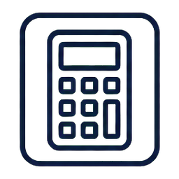

# Spezielle Relativitätstheorie II: Impuls und Energie (Umbau) {#sec-srt-impuls-energie-umbau}

::: {.content-visible when-format="html"}
```{=html}
<link rel="stylesheet" href="assets/animations/shared/srt-workbook.css">
<script src="assets/animations/shared/core.js"></script>
<script src="assets/animations/srt/used/energie/kinetische-energie.js"></script>
<script src="assets/animations/shared/srt-workbook.js"></script>
```
:::

Die Sonne wandelt in jeder Sekunde rund vier Millionen Tonnen Masse in masselose Strahlung um, und diese Zahl rechnest du am Ende dieses Kapitels selbst nach. Möglich macht das eine der bekanntesten Formeln der Naturwissenschaft: $E_0 = m_0\,c^2$. Sie sagt, dass Masse selbst eine Form von Energie ist, und weil die Masse darin mit $c^2$ multipliziert wird, liefert schon wenig Masse gewaltige Energiemengen.

Damit Impuls und Energie auch bei fast lichtschnellen Teilchen in jedem Inertialsystem Erhaltungsgrößen bleiben, passt die spezielle Relativitätstheorie ihre Formeln an. Das Kapitel behandelt die beiden Konzepte nacheinander: zuerst den relativistischen Impuls, dann die relativistische Energie mit Ruheenergie, Gesamtenergie und kinetischer Energie.

## Relativistischer Impuls

::: {.mp-goal-strip}
Du <u>nennst</u> die Formel für den relativistischen Impuls.

Du <u>erläuterst</u>, welche Bedingungen der relativistische Impuls erfüllen soll.

Du <u>berechnest</u> den klassischen und den relativistischen Impuls.
:::

Teilchenbeschleuniger steuern geladene Teilchen mit starken Magneten auf ihrer Bahn. Um die nötige Magnetfeldstärke zu berechnen, muss der Impuls der Teilchen genau bekannt sein. In solchen Anlagen erreichen Teilchen Geschwindigkeiten von weit über $50\,\%$ der Lichtgeschwindigkeit, und dann reicht der klassische Impuls nicht mehr aus. Wie der relativistische Impuls definiert ist und welche Bedingungen er erfüllen soll, zeigt dieser Abschnitt.

Den Impuls hast du in der klassischen Physik so kennengelernt:

$$p = m_0\,v = m_0\,\frac{\Delta s}{\Delta t}.$$

Dabei ist $\Delta s$ die zurückgelegte Strecke und $\Delta t$ die dafür im gewählten Bezugssystem gemessene Zeit. Die Masse schreiben wir von Anfang an als Ruhemasse $m_0$: die Masse, die im Ruhesystem des Körpers gemessen wird.[Ruhemasse]{.column-margin .mp-randbegriff}

Der Impuls ist eine Erhaltungsgröße. Bei einem isolierten Stoß ist der Gesamtimpuls vor dem Stoß und nach dem Stoß gleich groß: $p_\text{ges} = \text{const}$.

In der speziellen Relativitätstheorie funktioniert das mit der klassischen Definition $p = m_0\,v$ nicht mehr: Bei sehr schnellen Teilchen ist der so berechnete Gesamtimpuls nicht in jedem Inertialsystem erhalten. Ein Stoß, der in einem Inertialsystem die Impulserhaltung erfüllt, verletzt sie in einem anderen.

Wir haben nun zwei Möglichkeiten: Entweder geben wir die Impulserhaltung auf, oder wir definieren den Impuls neu. Der zweite Weg führt zum relativistischen Impuls. Die neue Definition soll zwei Bedingungen erfüllen:

1. Für kleine Geschwindigkeiten ($v \ll c$) soll wieder der klassische Impuls $p = m_0\,v$ herauskommen; diese Forderung heißt Korrespondenzprinzip.[Korrespondenzprinzip]{.column-margin .mp-randbegriff}
2. Der Gesamtimpuls soll in jedem Inertialsystem konstant bleiben.

::: {.mp-box .mp-task}
<span class="mp-task-kind mp-task-kind-think" aria-label="Denkcheck">
  
  Denkcheck
</span>

<u>Nenne</u> und <u>begründe</u>, welches der beiden Einsteinschen Postulate hinter der zweiten Bedingung steckt.
:::

<details class="mp-details">
<summary>Mögliche Lösung anzeigen</summary>
<p>Das erste Postulat, das Relativitätsprinzip: Die Naturgesetze haben in allen Inertialsystemen dieselbe Form. Ein Erhaltungssatz ist ein solches Naturgesetz. Würde die Impulserhaltung nur in einem Bezugssystem gelten, wäre dieses System ausgezeichnet. Das widerspricht dem Relativitätsprinzip.</p>
</details>

Die Definition, die beide Bedingungen erfüllt, geben wir hier ohne Beweis an:

$$
p = \gamma\,m_0\,v
$$ {#eq-ie-impuls}

Dabei ist $\gamma$ der Lorentzfaktor aus Kapitel 1 (@eq-umbau-lorentzfaktor), $m_0$ die Ruhemasse und $v$ die Geschwindigkeit des Körpers. Diese Definition ist so gewählt, dass der Gesamtimpuls in jedem Inertialsystem erhalten bleibt, und sie ist experimentell vielfach bestätigt.

Eine Überlegung mit der Eigenzeit macht den Faktor $\gamma$ zumindest plausibel. In der klassischen Formel steckt die Zeit $\Delta t$, die im gewählten Bezugssystem gemessen wird. Ersetzt man sie durch die Eigenzeit $\Delta t_0$, also die Zeit, die eine mit dem Körper mitbewegte Uhr misst, entsteht $p = m_0\,\frac{\Delta s}{\Delta t_0}$. Aus Kapitel 1 kennst du die Zeitdilatation $\Delta t = \gamma\,\Delta t_0$ (@eq-umbau-zeitdilatation), umgestellt $\Delta t_0 = \frac{\Delta t}{\gamma}$. Einsetzen liefert

$$p = m_0\,\frac{\Delta s}{\Delta t_0}
= m_0\,\frac{\Delta s}{\Delta t / \gamma}
= \gamma\,m_0\,\frac{\Delta s}{\Delta t}
= \gamma\,m_0\,v.$$

Diese Überlegung ist eine Stütze, kein Beweis: Sie zeigt, wie die Eigenzeit auf den Faktor $\gamma$ führt. Dass gerade diese Ersetzung die passende ist, begründet sie nicht. Eine Herleitung, die den Faktor $\gamma$ aus der Forderung der Impulserhaltung gewinnt (ein Gedankenexperiment mit einem elastischen Stoß), findest du im Giancoli [@giancoli2010physik, S. 1245--1247].

::: {.column-margin .mp-discuss}
<div class="mp-title">Zur Diskussion</div>
Soll die Eigenzeitrechnung als Herleitung des relativistischen Impulses bezeichnet werden?

Dafür: Sie führt mit der bereits bekannten Zeitdilatation unmittelbar zum Faktor $\gamma$. So verbindet sie die neue Impulsformel mit dem vorigen Kapitel.

Dagegen: Der Ansatz $p = m_0\,\Delta s/\Delta t_0$ enthält den entscheidenden Schritt bereits. Die Rechnung begründet weder diesen Ansatz noch die Impulserhaltung in allen Inertialsystemen.

Im Workbook steht die Rechnung deshalb als Stütze, nicht als Herleitung. Die Formel wird ohne Beweis angegeben; auf die vollständige Herleitung wird verwiesen.
:::

::: {.mp-box .mp-misconception}
<div class="mp-title">Mehr Geschwindigkeit, mehr Masse?</div>
In vielen älteren Büchern liest du, dass mehr Geschwindigkeit zu mehr Masse führt. Dahinter steckt die Schreibweise $p = m_\text{rel}\,v$ mit der „relativistischen Masse“ $m_\text{rel} = \gamma\,m_0$. So sieht es aus, als würde die Masse mit der Geschwindigkeit wachsen.

Diese Schreibweise hat einen Haken: In die Impulsformel $p = m_\text{rel}\,v$ passt $m_\text{rel}$. In andere Formeln wie $F = m\,a$ oder $E_\text{kin} = \frac{1}{2}\,m\,v^2$ darfst du sie aber nicht einsetzen, dort liefert sie falsche Ergebnisse [@giancoli2010physik, S. 1247].

Die moderne Physik arbeitet mit einer festen Masse: der invarianten Ruhemasse $m_0$. Den Faktor $\gamma$ schreiben wir getrennt: $p = \gamma\,m_0\,v$. Mit „Masse“ ist in diesem Workbook immer die Ruhemasse gemeint.
:::

Für kleine Geschwindigkeiten gilt $\gamma \approx 1$: Aus dem relativistischen Impuls wird wieder näherungsweise der klassische Impuls $p = \gamma\,m_0\,v \approx m_0\,v$, die erste Bedingung ist erfüllt. Nahe der Lichtgeschwindigkeit wächst $\gamma$ stark. Der Impuls wächst dann viel stärker, als die klassische Formel erwarten lässt.

::: {.mp-box .mp-task}
<span class="mp-task-kind mp-task-kind-calculate" aria-label="Berechnung">
  
  Berechnung
</span>

In der Protonentherapie werden Tumoren mit schnellen Protonen bestrahlt. Magnetfelder lenken den Protonenstrahl und richten ihn auf das Zielgebiet. Wie stark ein Magnet ein Proton ablenkt, hängt von seinem Impuls ab. Wird der Impuls falsch berechnet, kann der Strahl von der geplanten Bahn abweichen und gesundes Gewebe stärker treffen. Ein Proton ($m_0 = 1{,}67 \cdot 10^{-27}\,\mathrm{kg}$) bewegt sich mit $v = 0{,}60\,c$. <u>Berechne</u> den klassischen Impuls und den relativistischen Impuls. <u>Vergleiche</u> beide Werte.
:::

<details class="mp-details">
<summary>Mögliche Lösung anzeigen</summary>
<p>$v = 0{,}60 \cdot 3{,}0 \cdot 10^8\,\mathrm{m/s} = 1{,}8 \cdot 10^8\,\mathrm{m/s}$.</p>
<p>Klassisch: $p = m_0\,v \approx 1{,}67 \cdot 10^{-27}\,\mathrm{kg} \cdot 1{,}8 \cdot 10^8\,\mathrm{m/s} \approx 3{,}0 \cdot 10^{-19}\,\mathrm{kg\,m/s}$.</p>
<p>Relativistisch: $\gamma = 1/\sqrt{1 - 0{,}60^2} = 1{,}25$.</p>
<p>$p = \gamma\,m_0\,v \approx 1{,}25 \cdot 3{,}0 \cdot 10^{-19}\,\mathrm{kg\,m/s} \approx 3{,}8 \cdot 10^{-19}\,\mathrm{kg\,m/s}$.</p>
<p>Der relativistische Impuls ist etwa $25\,\%$ größer als der klassische Wert.</p>
</details>

---

## Relativistische Energie

::: {.mp-goal-strip}
Du <u>nennst</u> die Formeln für Ruheenergie, Gesamtenergie und kinetische Energie.

Du <u>erläuterst</u> die Bedeutung der Ruheenergie $E_0 = m_0\,c^2$.

Du <u>berechnest</u> Ruheenergie, Gesamtenergie und kinetische Energie.
:::

Beim Impuls hat die Forderung, dass die Erhaltung in jedem Inertialsystem gilt, auf den Faktor $\gamma$ geführt. Für die Energie stellt die spezielle Relativitätstheorie dieselbe Forderung, und wieder tritt $\gamma$ auf. Dabei zeigt sich eine Energieform, die die klassische Physik nicht kennt: eine Energie, die ein Körper allein wegen seiner Masse besitzt.

Eine weitere Folgerung der speziellen Relativitätstheorie lautet: Masse und Energie sind äquivalent. Diese Aussage steckt in der Formel

$$
E_0 = m_0\,c^2.
$$ {#eq-ie-ruheenergie}

Die Energie $E_0$ heißt Ruheenergie.[Ruheenergie]{.column-margin .mp-randbegriff} Die Formel sagt nicht: Nur ruhende Körper besitzen Energie. Sie benennt den Energieanteil, der zur Masse gehört. Dieser Anteil ist enorm, weil die Masse mit $c^2$ multipliziert wird.

Kommt Bewegung hinzu, besitzt der Körper zusätzlich kinetische Energie. Ohne potenzielle Energie ist die Gesamtenergie $E = E_0 + K = m_0\,c^2 + K$. Diese Gesamtenergie definieren wir relativistisch durch

$$
E = \gamma\,m_0\,c^2.
$$ {#eq-ie-gesamtenergie}

Diese Definition erfüllt die Forderung, dass die Gesamtenergie in einem isolierten System erhalten bleibt. Wir leiten sie hier nicht her. Eine mathematische Herleitung aus dem relativistischen Impuls ist möglich. Du findest sie zum Beispiel im Giancoli [@giancoli2010physik, S. 1248--1249].

Für $v = 0$ ist $\gamma = 1$. Dann wird aus der Gesamtenergie die Ruheenergie: $E = m_0\,c^2 = E_0$.

Stellst du die Gleichung nach der kinetischen Energie um, erhältst du die relativistische kinetische Energie:[relativistische kinetische Energie]{.column-margin .mp-randbegriff}

$$
K = E - E_0 = \gamma\,m_0\,c^2 - m_0\,c^2 = (\gamma - 1)\,m_0\,c^2.
$$ {#eq-ie-kinetische-energie}

Diese Energie hat zwei Grenzfälle. Für kleine Geschwindigkeiten geht sie in die klassische kinetische Energie $K = \frac{1}{2}\,m_0\,v^2$ über: wieder das Korrespondenzprinzip, für $v \ll c$ bleibt die klassische Formel eine gute Näherung. Nahe der Lichtgeschwindigkeit wächst $\gamma$ stark, und beide Formeln laufen weit auseinander. Ein Körper mit Masse kann die Lichtgeschwindigkeit nicht erreichen, weil dafür unbegrenzt viel kinetische Energie nötig wäre.

Daran siehst du den Gültigkeitsbereich: Die relativistische Formel gilt immer, die klassische nur für langsame Körper. In der folgenden Simulation siehst du beide Kurven im Vergleich; mit dem Regler stellst du die Geschwindigkeit ein.

::: {.content-visible when-format="html"}
```{=html}
<figure class="srt-workbook-figure srt-workbook-figure--caption-inside">
  <div class="srt-workbook-stage" data-srt-animation="kinetic-energy-plot" data-srt-label="Relativistische und klassische kinetische Energie in Abhängigkeit von der Geschwindigkeit, mit Schieberegler für die Geschwindigkeit"></div>
  <figcaption>Simulation zur kinetischen Energie: relativistische und klassische Kurve in Abhängigkeit von der Geschwindigkeit (Geschwindigkeit einstellbar).</figcaption>
</figure>
```
:::

::: {.content-visible unless-format="html"}
::: {.srt-workbook-fallback}
In der HTML-Version erscheint hier ein interaktiver Graph zur relativistischen kinetischen Energie $K = (\gamma - 1)\,m_0\,c^2$.
:::
:::

Die Gesamtenergie eines isolierten Systems bleibt erhalten. Wenn bei einer Reaktion Ruheenergie abnimmt, muss eine andere Energieform zunehmen. Ein Beispiel ist die Sonne.

In der Sonne verschmelzen Wasserstoffkerne über mehrere Schritte zu Helium. Die entstehenden Teilchen haben zusammen etwas weniger Ruhemasse als die Ausgangsteilchen. Diese Massendifferenz erscheint als Energie: Für die frei werdende Energie gilt $E_\text{frei} = \Delta m_0\,c^2$, wobei $\Delta m_0$ die fehlende Ruhemasse nach der Reaktion ist.

::: {.mp-box .mp-task}
<span class="mp-task-kind mp-task-kind-calculate" aria-label="Berechnung">
  
  Berechnung
</span>

Auf der Erde trifft senkrecht zur Sonne eine Strahlungsleistung von etwa $S \approx 1{,}36 \cdot 10^3\,\mathrm{\frac{W}{m^2}}$ auf. Diese Leistung verteilt sich gleichmäßig auf eine Kugel um die Sonne, auf deren Oberfläche die Erde liegt. <u>Berechne</u>, wie viel Masse die Sonne pro Sekunde in Strahlung umwandelt.

::: {.content-visible when-format="html"}
```{=html}
<figure class="srt-workbook-figure">
  <svg class="srt-workbook-image" viewBox="0 0 800 380" role="img" xmlns="http://www.w3.org/2000/svg" aria-label="Die Sonne strahlt in alle Richtungen. Im Abstand der Erde verteilt sich ihre Leistung auf eine Kugel mit der Fläche A gleich 4 Pi r Quadrat. Auf einen Quadratmeter dieser Kugel auf der Erde trifft die Bestrahlungsstärke S.">
    <defs>
      <marker id="ray" viewBox="0 0 10 10" refX="8" refY="5" markerWidth="7" markerHeight="7" orient="auto-start-reverse">
        <path d="M0 0 L10 5 L0 10 z" fill="#ef8a17"/>
      </marker>
    </defs>

    <circle cx="300" cy="190" r="150" fill="none" stroke="#5c6678" stroke-width="1.6" stroke-dasharray="6 7"/>

    <g stroke="#ef8a17" stroke-width="2.4" marker-end="url(#ray)">
      <line x1="328" y1="218" x2="388" y2="278"/>
      <line x1="300" y1="232" x2="300" y2="312"/>
      <line x1="272" y1="218" x2="212" y2="278"/>
      <line x1="268" y1="190" x2="178" y2="190"/>
      <line x1="272" y1="162" x2="212" y2="102"/>
      <line x1="300" y1="148" x2="300" y2="68"/>
      <line x1="328" y1="162" x2="388" y2="102"/>
    </g>

    <line x1="338" y1="190" x2="442" y2="190" stroke="#172033" stroke-width="1.6"/>
    <line x1="338" y1="184" x2="338" y2="196" stroke="#172033" stroke-width="1.6"/>
    <line x1="442" y1="184" x2="442" y2="196" stroke="#172033" stroke-width="1.6"/>
    <text x="390" y="181" text-anchor="middle" font-size="14" font-weight="800" fill="#172033">r</text>

    <circle cx="300" cy="190" r="32" fill="#ffc83d" stroke="#e0991a" stroke-width="2"/>
    <text x="300" y="195" text-anchor="middle" font-size="13" font-weight="800" fill="#7a5300">Sonne</text>

    <circle cx="450" cy="190" r="9" fill="#2f6fb0" stroke="#1b3f63" stroke-width="2"/>
    <text x="450" y="216" text-anchor="middle" font-size="13" font-weight="700" fill="#1b3f63">Erde</text>

    <line x1="458" y1="186" x2="560" y2="120" stroke="#9aa6b8" stroke-width="1.2" stroke-dasharray="4 4"/>
    <line x1="458" y1="196" x2="560" y2="260" stroke="#9aa6b8" stroke-width="1.2" stroke-dasharray="4 4"/>

    <rect x="560" y="120" width="224" height="140" rx="10" fill="#ffffff" stroke="#5c6678" stroke-width="1.6"/>
    <text x="672" y="146" text-anchor="middle" font-size="14" font-weight="800" fill="#172033">S &#8776; 1,36&#183;10&#179; W/m&#178;</text>
    <rect x="596" y="176" width="52" height="52" rx="4" fill="#dce8f5" stroke="#2f6fb0" stroke-width="2"/>
    <text x="622" y="206" text-anchor="middle" font-size="12" font-weight="800" fill="#1b3f63">1 m&#178;</text>
    <g stroke="#ef8a17" stroke-width="2.2" marker-end="url(#ray)">
      <line x1="566" y1="188" x2="592" y2="188"/>
      <line x1="566" y1="202" x2="592" y2="202"/>
      <line x1="566" y1="216" x2="592" y2="216"/>
    </g>
    <text x="700" y="206" text-anchor="middle" font-size="12" font-weight="600" fill="#5c6678">trifft senkrecht</text>
  </svg>
  <figcaption class="srt-workbook-caption">Skizze zur Aufgabe: Die Sonne strahlt in alle Richtungen. Im Abstand r der Erde verteilt sich ihre Leistung auf eine Kugelfl&#228;che A = 4&#960;r&#178;; auf einen Quadratmeter dieser Kugel trifft die Bestrahlungsst&#228;rke S.</figcaption>
</figure>
```
:::

::: {.content-visible unless-format="html"}
::: {.srt-workbook-fallback}
In der HTML-Version erscheint hier eine Skizze: die Sonne im Mittelpunkt, eine Kugel im Abstand der Erde mit der Fläche $A = 4\pi r^2$ und ein Quadratmeter auf der Erde, auf den die Bestrahlungsstärke $S$ trifft.
:::
:::

**Hinweis:** Bestimme zuerst die gesamte Strahlungsleistung der Sonne aus der Leistung pro Fläche und der Kugeloberfläche im Abstand Erde-Sonne. Wandle dann die pro Sekunde abgestrahlte Energie in eine Masse um.

**Gegeben:** Abstand Erde-Sonne $r \approx 1{,}5 \cdot 10^{11}\,\mathrm{m}$, Lichtgeschwindigkeit $c \approx 3{,}0 \cdot 10^8\,\mathrm{\frac{m}{s}}$.
:::

<details class="mp-details">
<summary>Mögliche Lösung anzeigen</summary>
<p>Kugeloberfläche im Erdabstand:</p>

$$A = 4\pi r^2 = 4\pi \cdot (1{,}5 \cdot 10^{11}\,\mathrm{m})^2 \approx 2{,}8 \cdot 10^{23}\,\mathrm{m^2}.$$

<p>Gesamte Strahlungsleistung der Sonne:</p>

$$P = S \cdot A \approx 1{,}36 \cdot 10^3\,\mathrm{\tfrac{W}{m^2}} \cdot 2{,}8 \cdot 10^{23}\,\mathrm{m^2} \approx 3{,}8 \cdot 10^{26}\,\mathrm{W}.$$

<p>In einer Sekunde strahlt die Sonne die Energie $E = P \cdot t \approx 3{,}8 \cdot 10^{26}\,\mathrm{J}$ ab. Aus $E = \Delta m_0\,c^2$ folgt:</p>

$$\Delta m_0 = \frac{E}{c^2} \approx \frac{3{,}8 \cdot 10^{26}\,\mathrm{J}}{(3{,}0 \cdot 10^8\,\mathrm{m/s})^2} \approx 4{,}2 \cdot 10^9\,\mathrm{kg}.$$

<p>Die Sonne verliert pro Sekunde also rund 4 Millionen Tonnen Masse.</p>
</details>

::: {.mp-box .mp-task}
<span class="mp-task-kind mp-task-kind-calculate" aria-label="Berechnung">
  
  Berechnung
</span>

In Kapitel 1 hast du das Myon aus der kosmischen Strahlung kennengelernt. Es fliegt mit $v = 0{,}998\,c$, dazu gehört der Lorentzfaktor $\gamma \approx 15{,}8$. Seine Masse ist $m_0 \approx 1{,}88 \cdot 10^{-28}\,\mathrm{kg}$.

<u>Berechne</u> die Ruheenergie $E_0$, die Gesamtenergie $E$ und die kinetische Energie $K$ des Myons.
:::

<details class="mp-details">
<summary>Mögliche Lösung anzeigen</summary>
<p>$E_0 = m_0\,c^2 \approx 1{,}88 \cdot 10^{-28}\,\mathrm{kg} \cdot (3{,}0 \cdot 10^8\,\mathrm{m/s})^2 \approx 1{,}7 \cdot 10^{-11}\,\mathrm{J}$.</p>
<p>$E = \gamma\,E_0 \approx 15{,}8 \cdot 1{,}7 \cdot 10^{-11}\,\mathrm{J} \approx 2{,}7 \cdot 10^{-10}\,\mathrm{J}$.</p>
<p>$K = E - E_0 = (\gamma - 1)\,E_0 \approx 14{,}8 \cdot 1{,}7 \cdot 10^{-11}\,\mathrm{J} \approx 2{,}5 \cdot 10^{-10}\,\mathrm{J}$.</p>
<p>Die kinetische Energie ist also fast 15-mal so groß wie die Ruheenergie. Das passt dazu, dass sich das Myon mit $0{,}998\,c$ sehr nah an der Lichtgeschwindigkeit bewegt.</p>
</details>

---

## Sichern und anwenden

Lernen ist ein aktiver Prozess. Erst wenn du ein Thema selbst erklären und anwenden kannst, merkst du, ob du es verinnerlicht hast. In diesem Abschnitt prüfst du zuerst an den Lernzielen, was du erreicht hast. Danach sicherst du die Grundideen des Kapitels in deiner eigenen Sprache.

### Lernziele prüfen

Hier stehen die Lernziele der beiden Unterkapitel gebündelt. Prüfe für jedes einzelne, ob du es erfüllst. Für alles, was dir fehlt, führt dich das Inhaltsverzeichnis zur passenden Stelle.

- **Relativistischer Impuls:** Du <u>nennst</u> die Formel für den relativistischen Impuls. Du <u>erläuterst</u>, welche Bedingungen der relativistische Impuls erfüllen soll. Du <u>berechnest</u> den klassischen und den relativistischen Impuls.
- **Relativistische Energie:** Du <u>nennst</u> die Formeln für Ruheenergie, Gesamtenergie und kinetische Energie. Du <u>erläuterst</u> die Bedeutung der Ruheenergie $E_0 = m_0\,c^2$. Du <u>berechnest</u> Ruheenergie, Gesamtenergie und kinetische Energie.

### In eigener Sprache erklären

::: {.mp-box .mp-task}
<span class="mp-task-kind mp-task-kind-write" aria-label="Schreibaufgabe">
  <svg viewBox="0 0 24 24" aria-hidden="true">
    <path d="M4 20h4l11-11-4-4L4 16v4Z"></path>
    <path d="m13.5 6.5 4 4"></path>
  </svg>
  Schreibaufgabe
</span>

<u>Erkläre</u> die Grundideen dieses Kapitels zusammenhängend in deiner eigenen Sprache. Stell dir vor, dein Publikum ist jemand aus deinem Kurs. Benutze dafür gerne auch Skizzen, um deine Erklärungen zu veranschaulichen.

Nutze die Lernziele aus der Prüfliste oben als Leitfaden. Hangle dich an ihnen entlang, formuliere aber selbst: Erkläre es so, wie du es verstanden hast.
:::
