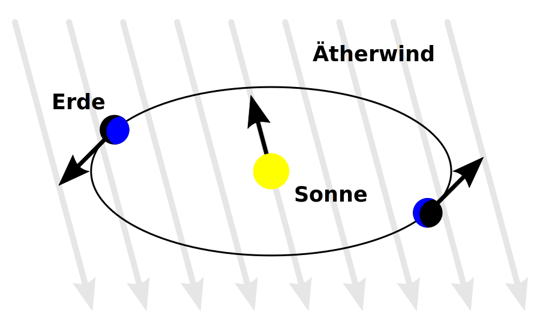

# Glossar

Dieses Glossar ist kapitelweise aufgebaut. So bleibt es auch bei vielen Seiten übersichtlich. In der HTML-Version wird der passende Kapitelblock automatisch geöffnet, wenn du aus dem Skript direkt auf einen Begriff springst.

Die normale Quarto-Buchsuche durchsucht bereits das ganze Skript. Die zusätzliche Glossar-Suche hier ist speziell für Fachbegriffe gedacht und bietet dir direkt zwei Ziele: den Glossareintrag selbst und das erste Auftreten des Begriffs im Skript.

::: {.content-visible when-format="html"}
```{=html}
<div id="glossary-search-ui" style="margin: 1rem 0 1.5rem 0; padding: 1rem; border: 1px solid #d8e0e8; border-radius: 0.75rem; background: #f8fbff;">
  <label for="glossary-search-input" style="display: block; font-weight: 600; margin-bottom: 0.5rem;">Glossar durchsuchen</label>
  <input id="glossary-search-input" type="search" placeholder="z. B. Inertialsystem, Äther, Lichtgeschwindigkeit" style="width: 100%; padding: 0.7rem 0.85rem; border: 1px solid #bcccdc; border-radius: 0.5rem;">
  <p id="glossary-search-status" style="margin: 0.75rem 0 0 0; color: #4c6272; font-size: 0.95rem;">Suche nach einem Fachbegriff und springe direkt zum Glossareintrag oder zur ersten Stelle im Skript.</p>
  <div id="glossary-search-results" style="display: grid; gap: 0.75rem; margin-top: 1rem;"></div>
</div>

<script>
document.addEventListener("DOMContentLoaded", () => {
  function openGlossaryTarget() {
    if (!window.location.hash) return;
    const targetId = decodeURIComponent(window.location.hash.slice(1));
    const target = document.getElementById(targetId);
    if (!target) return;

    const collapseEl = target.closest(".callout-collapse.collapse");
    if (collapseEl && window.bootstrap?.Collapse) {
      window.bootstrap.Collapse.getOrCreateInstance(collapseEl, { toggle: false }).show();
      const header = collapseEl.previousElementSibling;
      if (header?.classList.contains("callout-header")) {
        header.classList.remove("collapsed");
        header.setAttribute("aria-expanded", "true");
      }
      setTimeout(() => target.scrollIntoView({ block: "start" }), 150);
    }
  }

  function renderGlossarySearch() {
    const input = document.getElementById("glossary-search-input");
    const status = document.getElementById("glossary-search-status");
    const results = document.getElementById("glossary-search-results");
    if (!input || !status || !results) return;

    const entries = Array.from(document.querySelectorAll(".glossary-entry")).map((entry) => {
      const heading = entry.querySelector("h3");
      const chapterTitle = entry.closest(".callout")?.getAttribute("title") || "Glossar";
      const entryId = entry.id || heading?.dataset.anchorId || "";
      const firstUrl = entry.dataset.firstUrl || `#${entryId}`;
      const firstLabel = entry.dataset.firstLabel || "Zum ersten Auftreten";
      const keywords = (entry.dataset.keywords || "").toLowerCase();
      const searchableText = `${heading?.textContent || ""} ${entry.textContent || ""} ${keywords}`.toLowerCase();

      return {
        term: heading?.textContent?.replace(/^\d+(\.\d+)*\s*/, "").trim() || "",
        id: entryId,
        chapterTitle,
        firstUrl,
        firstLabel,
        searchableText
      };
    }).filter((entry) => entry.term && entry.id);

    function escapeHtml(text) {
      return text
        .replaceAll("&", "&amp;")
        .replaceAll("<", "&lt;")
        .replaceAll(">", "&gt;")
        .replaceAll('"', "&quot;")
        .replaceAll("'", "&#39;");
    }

    function updateResults() {
      const query = input.value.trim().toLowerCase();
      if (!query) {
        status.textContent = "Suche nach einem Fachbegriff und springe direkt zum Glossareintrag oder zur ersten Stelle im Skript.";
        results.innerHTML = "";
        return;
      }

      const matches = entries.filter((entry) => entry.searchableText.includes(query));
      status.textContent = matches.length === 0
        ? `Keine Treffer für "${input.value.trim()}".`
        : `${matches.length} Treffer für "${input.value.trim()}".`;

      results.innerHTML = matches.map((entry) => `
        <div style="border: 1px solid #d8e0e8; border-radius: 0.75rem; padding: 0.85rem 1rem; background: white;">
          <div style="font-weight: 700; margin-bottom: 0.15rem;">${escapeHtml(entry.term)}</div>
          <div style="color: #5f7484; font-size: 0.92rem; margin-bottom: 0.7rem;">${escapeHtml(entry.chapterTitle)}</div>
          <div style="display: flex; flex-wrap: wrap; gap: 0.6rem;">
            <a href="#${encodeURIComponent(entry.id)}" style="text-decoration: none;">Zum Glossareintrag</a>
            <a href="${entry.firstUrl}" style="text-decoration: none;">${escapeHtml(entry.firstLabel)}</a>
          </div>
        </div>
      `).join("");
    }

    input.addEventListener("input", updateResults);
  }

  openGlossaryTarget();
  renderGlossarySearch();
  window.addEventListener("hashchange", openGlossaryTarget);
});
</script>
```
:::

## Spezielle Relativitätstheorie

::: {.callout-note collapse="true" title="Spezielle Relativitätstheorie I: Raum und Zeit"}
::: {.glossary-entry data-keywords="lichtäther medium vakuum michelson morley historische hypothese" data-first-url="01_srt_raum_und_zeit.html#sec-mm-problem" data-first-label="Zum ersten Auftreten in SRT I"}
### Äther {#gls-aether}

Historisch angenommenes Medium, in dem sich Licht nach der klassischen Vorstellung wie eine Welle ausbreiten sollte. Das Michelson-Morley-Experiment machte diese Vorstellung problematisch; in der speziellen Relativitätstheorie braucht Licht keinen mechanischen Äther.
:::

::: {.glossary-entry data-keywords="ätherwind richtungsabhängigkeit erdbewegung lichtlaufzeit" data-first-url="01_srt_raum_und_zeit.html#sec-mm-problem" data-first-label="Zum ersten Auftreten in SRT I"}
### Ätherwind {#gls-aetherwind}

Hypothetischer Effekt, der entstehen sollte, wenn die Erde sich durch einen ruhenden Äther bewegt. Dann hätten Lichtlaufzeiten je nach Richtung messbar unterschiedlich sein müssen.

<figure>
  
  <figcaption>
    Schematische Darstellung des angenommenen Ätherwinds.
    Quelle: <a href="https://commons.wikimedia.org/wiki/File:%C3%84therwind.svg">wdwd, Wikimedia Commons</a>,
    basierend auf einer Zeichnung von Wolfgang Beyer,
    Lizenz: <a href="https://creativecommons.org/licenses/by/3.0/">CC BY 3.0</a>.
  </figcaption>
</figure>
:::

::: {.glossary-entry data-keywords="koordinatensystem uhren ort zeit relativität" data-first-url="01_srt_raum_und_zeit.html#bezugssystem-und-inertialsystem" data-first-label="Zum ersten Auftreten in SRT I"}
### Bezugssystem {#gls-bezugssystem}

Ein gewählter Rahmen aus Ortsangaben und Uhren, von dem aus ein Vorgang beschrieben wird. Aussagen über Ruhe, Bewegung, Ort und Zeit gelten immer relativ zu einem Bezugssystem.
:::

::: {.glossary-entry data-keywords="ruhesystem mitbewegt eigenmessung uhr lichtuhr delta t0" data-first-url="01_srt_raum_und_zeit.html#sec-zeitdilatation-beispiel" data-first-label="Zum ersten Auftreten in SRT I"}
### Eigenzeit {#gls-eigenzeit}

Die Zeitdauer $\Delta t_0$, die im Ruhesystem eines Vorgangs gemessen wird. Bei der Lichtuhr ist das die Zeit, die die mitbewegte Uhr selbst für ihren Tick misst.
:::

::: {.glossary-entry data-keywords="raumzeitpunkt punktförmig ort zeit markierung vorgang" data-first-url="01_srt_raum_und_zeit.html#sec-ereignis-begriff" data-first-label="Zum ersten Auftreten in SRT I"}
### Ereignis {#gls-ereignis}

Eine einzelne Raumzeit-Markierung: etwas passiert an einem bestimmten Ort zu einem bestimmten Zeitpunkt. Ein Ereignis ist kein ausgedehnter Vorgang.
:::

::: {.glossary-entry data-keywords="zeitkoordinaten zwei ereignisse jetzt absolut relativ" data-first-url="01_srt_raum_und_zeit.html#gleichzeitigkeit" data-first-label="Zum ersten Auftreten in SRT I"}
### Gleichzeitigkeit (Relativität der) {#gls-gleichzeitigkeit}

Aussage darüber, ob zwei Ereignisse in einem bestimmten Inertialsystem dieselbe Zeitkoordinate haben. In der speziellen Relativitätstheorie können zwei Ereignisse in einem Inertialsystem gleichzeitig sein und in einem anderen nicht.
:::

::: {.glossary-entry data-keywords="unbeschleunigt trägheitsgesetz newton inertialbeobachter" data-first-url="01_srt_raum_und_zeit.html#bezugssystem-und-inertialsystem" data-first-label="Zum ersten Auftreten in SRT I"}
### Inertialsystem {#gls-inertialsystem}

Ein nicht beschleunigtes Bezugssystem. In ihm gilt das Trägheitsgesetz ohne zusätzliche Scheinkräfte: Ein kräftefreier Körper bleibt in Ruhe oder bewegt sich geradlinig gleichförmig.
:::

::: {.glossary-entry data-keywords="interferenz lichtstrahl laufzeit wegdifferenz michelson morley strahlteiler" data-first-url="01_srt_raum_und_zeit.html#sec-mm-messidee" data-first-label="Zum ersten Auftreten in SRT I"}
### Interferometer {#gls-interferometer}

Ein Messgerät, das Licht aufteilt und nach verschiedenen Wegen wieder überlagert. Eine Änderung des Interferenzsignals kann sehr kleine Laufzeit- oder Weglängenunterschiede sichtbar machen.
:::

::: {.glossary-entry data-keywords="c vakuum signal elektromagnetische welle invariant wert" data-first-url="01_srt_raum_und_zeit.html#michelson-morley-experiment" data-first-label="Zum ersten Auftreten in SRT I"}
### Lichtgeschwindigkeit {#gls-lichtgeschwindigkeit}

Die Ausbreitungsgeschwindigkeit von Licht im Vakuum. Im Kapitel wird sie mit $c$ bezeichnet und näherungsweise mit $3{,}0 \cdot 10^8\,\mathrm{m/s}$ angegeben.
:::

::: {.glossary-entry data-keywords="zweites postulat c invariant quelle beobachter lichtgeschwindigkeit" data-first-url="01_srt_raum_und_zeit.html#sec-postulate-idee" data-first-label="Zum ersten Auftreten in SRT I"}
### Konstanz der Lichtgeschwindigkeit {#gls-konstanz-lichtgeschwindigkeit}

Zweites Einsteinsches Postulat: Licht breitet sich im Vakuum in allen Inertialsystemen mit derselben Geschwindigkeit $c$ aus. Das gilt unabhängig davon, wie sich die Lichtquelle oder die beobachtende Person bewegt.
:::

::: {.glossary-entry data-keywords="gedankenexperiment spiegel lichtpuls zeitdilatation prototyp tick" data-first-url="01_srt_raum_und_zeit.html#sec-zeitdilatation-beispiel" data-first-label="Zum ersten Auftreten in SRT I"}
### Lichtuhr {#gls-lichtuhr}

Gedankenexperimentelle Uhr aus zwei parallelen Spiegeln und einem Lichtpuls. Sie zeigt, warum derselbe Tick aus einem bewegten Inertialsystem eine längere Zeitdauer bekommen kann.
:::

::: {.glossary-entry data-keywords="lorentzfaktor gamma v c wurzel relativistisch zeitdilatation" data-first-url="01_srt_raum_und_zeit.html#sec-zeitdilatation-idee" data-first-label="Zum ersten Auftreten in SRT I"}
### Lorentzfaktor {#gls-lorentzfaktor}

Der Faktor $\gamma = 1 / \sqrt{1 - v^2/c^2}$. In diesem Kapitel gibt er an, wie stark die Zeitdauer eines bewegten Lichtuhr-Ticks gegenüber der Eigenzeit vergrößert wird.
:::

::: {.glossary-entry data-keywords="experiment kein effekt interferenzmuster michelson morley befunde deutung" data-first-url="01_srt_raum_und_zeit.html#sec-mm-deutung" data-first-label="Zum ersten Auftreten in SRT I"}
### Nullresultat {#gls-nullresultat}

Ein erwarteter messbarer Effekt bleibt aus. Beim Michelson-Morley-Experiment bedeutete das: Beim Drehen der Apparatur zeigte sich keine passende systematische Verschiebung des Interferenzsignals.
:::

::: {.glossary-entry data-keywords="einstein postulat naturgesetze gleiche form absolut ruhendes system" data-first-url="01_srt_raum_und_zeit.html#sec-postulate-idee" data-first-label="Zum ersten Auftreten in SRT I"}
### Relativitätsprinzip {#gls-relativitaetsprinzip}

Erstes Einsteinsches Postulat: Die Naturgesetze haben in allen Inertialsystemen dieselbe Form. Kein Inertialsystem ist als absolut ruhendes System ausgezeichnet.
:::

::: {.glossary-entry data-keywords="nicht-inertialsystem fliehkraft zentrifugal beschleunigtes bezugssystem" data-first-url="01_srt_raum_und_zeit.html#sec-bezugssystem-beispiel" data-first-label="Zum ersten Auftreten in SRT I"}
### Scheinkraft {#gls-scheinkraft}

Eine Zusatzkraft, die in einem beschleunigten Bezugssystem eingeführt wird, um Bewegungen dort zu beschreiben. Sie entsteht durch die Wahl des Bezugssystems, nicht durch eine direkte Wechselwirkung mit einem anderen Körper.
:::

::: {.glossary-entry data-keywords="newton erstes gesetz kräftefrei geradlinig gleichförmig" data-first-url="01_srt_raum_und_zeit.html#bezugssystem-und-inertialsystem" data-first-label="Zum ersten Auftreten in SRT I"}
### Trägheitsgesetz {#gls-traegheitsgesetz}

Newtons erstes Gesetz: Ein kräftefreier Körper bleibt in Ruhe oder bewegt sich geradlinig gleichförmig. Ein Inertialsystem ist ein Bezugssystem, in dem dieses Gesetz ohne Zusatzannahmen gilt.
:::

::: {.glossary-entry data-keywords="bewegte uhr eigenzeit lorentzfaktor gamma lichtuhr" data-first-url="01_srt_raum_und_zeit.html#zeitdilatation" data-first-label="Zum ersten Auftreten in SRT I"}
### Zeitdilatation {#gls-zeitdilatation}

Effekt der speziellen Relativitätstheorie: Ein Vorgang hat in seinem Ruhesystem die Eigenzeit $\Delta t_0$. Aus einem relativ dazu bewegten Inertialsystem wird demselben Vorgang eine längere Zeitdauer $\Delta t = \gamma \Delta t_0$ zugeordnet.
:::
:::
