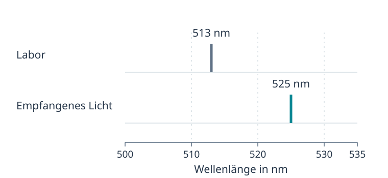

::: {.content-visible when-format="html"}
```{=html}
<link rel="stylesheet" href="assets/animations/shared/workbook.css?v=20260916-bildrahmen">
```
:::

Hier findest du die ersten beiden Arbeitsblätter zur speziellen Relativitätstheorie aus der Vorlesung „Moderne Physik I“. Die ursprüngliche Reihenfolge und Nummerierung der Aufgaben sind erhalten. Die Verweise auf Stud.IP beziehen sich auf die Materialien der damaligen Veranstaltung. Fachliche Anmerkungen zur Übertragung stehen bei den betreffenden Aufgaben.

[Arbeitsblatt 1](#arbeitsblatt-1) · [Arbeitsblatt 2](#arbeitsblatt-2)

## Arbeitsblatt 1: Spezielle Relativitätstheorie Teil 1 {#arbeitsblatt-1}

Das erste Blatt trägt die Veranstaltungsnummer 02 und den Zusatz „Aufgaben zur Vorbereitung“.

::: {#legacy-blatt1-aufgabe1 .mp-box .mp-task}
<span class="mp-task-kind">Aufgabe 1: Vorbereitung</span>

Bereiten Sie die Veranstaltung mit Unterstützung des Videos (Reiter Video in Stud.IP) vor. Zentrale Begriffe sind:

1. Bezugssystem/Inertialsystem
2. Einsteinsche Postulate
3. Michelson-Morley-Experiment
4. Ereignis
5. Gleichzeitigkeit
6. Zeitdilatation
:::

::: {#legacy-blatt1-aufgabe2 .mp-box .mp-task}
<span class="mp-task-kind">Aufgabe 2: Zeitdilatation bei kleinen Geschwindigkeiten</span>

a) Ein Auto fährt für eine Stunde mit einer Geschwindigkeit von $v=140\,\mathrm{km/h}$. Welche Zeit verstreicht aus Sicht der Fahrerin?

b) Ab welcher Geschwindigkeit $v$ wird die Zeitdilatation etwa relevant?
:::

::: {#legacy-blatt1-aufgabe3 .mp-box .mp-task}
<span class="mp-task-kind">Aufgabe 3: GPS</span>

a) Bestimmen Sie den Gangunterschied, um den Uhren auf den GPS-Satelliten pro Tag aufgrund der Zeitdilatation korrigiert werden müssen (vernachlässigen Sie andere Effekte auf die Zeit, die nicht auf der Speziellen Relativitätstheorie beruhen).
:::

## Arbeitsblatt 2: Spezielle Relativitätstheorie Teil 2 {#arbeitsblatt-2}

Das zweite Blatt trägt die Veranstaltungsnummer 03. Seine Themen verteilen sich im Workbook auf die Kapitel [SRT I](01_srt_raum_und_zeit_umbau.qmd) und [SRT II](02_srt_impuls_und_energie_umbau.qmd).

::: {#legacy-blatt2-aufgabe1 .mp-box .mp-task}
<span class="mp-task-kind">Aufgabe 1: Vorbereitung</span>

Bereiten Sie die Veranstaltung mit Unterstützung des Videos (Reiter Video in Stud.IP) vor. Zentrale Begriffe sind:

1. Zwillingsparadoxon
2. Längenkontraktion
3. Relativistischer Impuls
4. Relativistische Energie
5. Dopplerverschiebung des Lichts
:::

::: {#legacy-blatt2-aufgabe2 .mp-box .mp-task}
<span class="mp-task-kind">Aufgabe 2: Professor Albert</span>

Lesen Sie das Buch „Professor Albert und das Abenteuer der Relativitätstheorie“ (Stud.IP). Nennen Sie drei physikdidaktische Vor- und drei Nachteile einer solchen Darstellung.
:::

::: {#legacy-blatt2-aufgabe3 .mp-box .mp-task}
<span class="mp-task-kind">Aufgabe 3: Längenkontraktion: Raumschiffe im All</span>

Für einen irdischen Beobachter hat ein Raumschiff, das mit $v=0{,}6c$ an der Erde vorbeifliegt, eine Länge von $35\,\mathrm m$. Berechnen Sie die Länge des Raumschiffs für die Passagiere an Bord.
:::

:::: {#legacy-blatt2-aufgabe4 .mp-box .mp-task}
<span class="mp-task-kind">Aufgabe 4: Rotverschiebung</span>

Abbildung 2 zeigt einen schematischen Vergleich der Wellenlängen aus dem ursprünglichen Aufgabentext. Dieser betrachtet das Licht der rund $3\cdot10^8$ Lichtjahre entfernten Galaxie NGC 7319 und gibt für dieselbe Spektrallinie die Laborwellenlänge $\lambda=513\,\mathrm{nm}$ sowie die empfangene Wellenlänge $\lambda=525\,\mathrm{nm}$ an. Verwenden Sie diese Aufgabenwerte für die folgenden Teilaufgaben.

a) Begründen Sie, ob sich die Galaxie von der Erde wegbewegt oder sich auf die Erde zubewegt.

b) Bestimmen Sie die radiale Geschwindigkeit der Galaxie NGC 7319 relativ zur Erde.

::: {.srt-workbook-image-figure}
{.srt-workbook-image width=60% fig-alt="Galaxienaufnahme aus dem ursprünglichen Arbeitsblatt. Die Originalunterschrift bezeichnet sie als NGC 7319."}

Abbildung 1: Die Galaxie NGC 7319. Aufnahme: [NASA, ESA and the Hubble SM4 ERO Team](https://esahubble.org/images/heic0910i/), [CC BY 4.0](https://creativecommons.org/licenses/by/4.0/). [Ausschnitt von Rbrausse auf Wikimedia Commons](https://commons.wikimedia.org/wiki/File:NGC_7319.jpg).
:::

::: {.srt-workbook-image-figure}
{.srt-workbook-image fig-alt="Schematischer Vergleich der Aufgabenwerte auf einer gemeinsamen linearen Wellenlängenskala. Die Laborlinie liegt bei 513 Nanometern, das empfangene Licht bei 525 Nanometern. Es werden keine gemessenen Intensitäten dargestellt."}

Abbildung 2: Schematischer Linienvergleich nach den Wellenlängenangaben des ursprünglichen Aufgabentexts. Die Linienpositionen liegen auf derselben linearen Skala. Eigene Darstellung, kein Messspektrum.
:::

Anmerkung zur Übertragung: Die ursprüngliche Spektrumsabbildung wurde durch einen eigenen schematischen Linienvergleich ersetzt und der Einleitungstext daran angepasst. Für die aus einem Halliday-Lehrbuch übernommene Originalabbildung ist keine freie Nutzungslizenz nachgewiesen. Ihre Linienpositionen von ungefähr $501$ und $513\,\mathrm{nm}$ stimmen außerdem nicht mit den Zahlenangaben im Aufgabentext überein. Das Schema übernimmt ausdrücklich die Aufgabenwerte $513$ und $525\,\mathrm{nm}$ und bestätigt damit weder eine gemessene Intensitätsverteilung noch die ursprüngliche Zuordnung zu Sauerstoff. Die Bezeichnung „NGC 719“ im ersten Satz des Originals wurde zu „NGC 7319“ vereinheitlicht. Die Aufgabe behandelt die Rotverschiebung vereinfachend als Dopplerverschiebung durch eine direkte Relativbewegung. Zur kosmologischen Rotverschiebung siehe den [Einstieg zur Dopplerverschiebung](01_srt_raum_und_zeit_umbau.qmd#dopplerverschiebung-des-lichts).
::::

::: {#legacy-blatt2-aufgabe5 .mp-box .mp-task}
<span class="mp-task-kind">Aufgabe 5: Relativistische Energie</span>

Die kinetische Energie eines Protons beträgt die Hälfte seiner inneren Energie (gemeint ist hier die Ruheenergie $E_0$).

a) Berechnen Sie die Geschwindigkeit des Protons.

b) Berechnen Sie seine Gesamtenergie.

c) Berechnen Sie die Potentialdifferenz $\Delta U$, die notwendig wäre, um das Proton auf die Geschwindigkeit aus a) zu beschleunigen.

d) Recherchieren Sie die aktuell möglichen Energien und Geschwindigkeiten eines Protons im LHC im CERN.

Hinweis:

$$
1\,\mathrm{eV}=1\,\text{Elektronenvolt}\approx1{,}6\cdot10^{-19}\,\mathrm J.
$$

Anmerkung zur Übertragung: Die Klammer im ersten Satz präzisiert die Bezeichnung des Originals. Für Teilaufgabe c) wird ein Start aus Ruhe ohne Energieverluste vorausgesetzt.
:::

Zurück zum Workbook: [SRT I](01_srt_raum_und_zeit_umbau.qmd#sichern-und-anwenden) · [SRT II](02_srt_impuls_und_energie_umbau.qmd#sichern-und-anwenden)
